# 完全图解 GPT-2：看完这篇就够了（二）

> 原文：[`mp.weixin.qq.com/s?__biz=MzA3MzI4MjgzMw==&mid=2650768770&idx=4&sn=8db650a12fc6c177a6e41a03895c23e1&chksm=871a41fcb06dc8ea94489c9dfcc8cd8d7474a0c445ecbc35b51f8d693a5ba962938f122867b8&scene=21#wechat_redirect`](http://mp.weixin.qq.com/s?__biz=MzA3MzI4MjgzMw==&mid=2650768770&idx=4&sn=8db650a12fc6c177a6e41a03895c23e1&chksm=871a41fcb06dc8ea94489c9dfcc8cd8d7474a0c445ecbc35b51f8d693a5ba962938f122867b8&scene=21#wechat_redirect)

选自 github.io

**作者：Jay Alammar** 

**机器之心编译**

**参与：陈韵莹、Geek AI**

> 在本系列文章的[第一部分](http://mp.weixin.qq.com/s?__biz=MzA3MzI4MjgzMw==&mid=2650768689&idx=2&sn=ff46397819b544a19c3200297f180dea&chksm=871a414fb06dc859bf6f1552a1e1b89c5368e69db14e750982405db45308108b25017ffef224&scene=21#wechat_redirect)中，我们回顾了 Transformer 的基本工作原理，初步了解了 GPT-2 的内部结构。在本文中，我们将详细介绍 GPT-2 所使用的自注意力机制，并分享只包含解码器的 transformer 模型的精彩应用。

**第二部分：****图解自注意力机制**

在前面的文章中，我们用这张图来展示了自注意力机制在处理单词「it」的层中的应用：

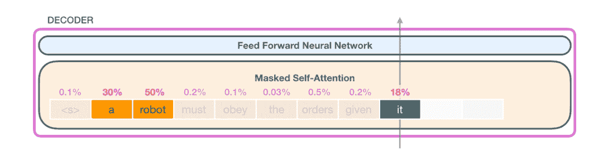

在本节中，我们会详细介绍该过程是如何实现的。请注意，我们将会以试图弄清单个单词被如何处理的角度来看待这个问题。这也是我们会展示许多单个向量的原因。这实际上是通过将巨型矩阵相乘来实现的。但是我想直观地看看，在单词层面上发生了什么。

**自注意力机制（不使用掩模）**

首先，我们将介绍原始的自注意力机制，它是在编码器模块里计算的。先看一个简易的 transformer 模块，它一次只能处理 4 个词（token）。

自注意力机制通过以下三个主要步骤来实现：

1\. 为每个路径创建查询、键和值向量。

2\. 对于每个输入的词，通过使用其查询向量与其它所有键向量相乘得到注意力得分。

3\. 将值向量与它们相应的注意力得分相乘后求和

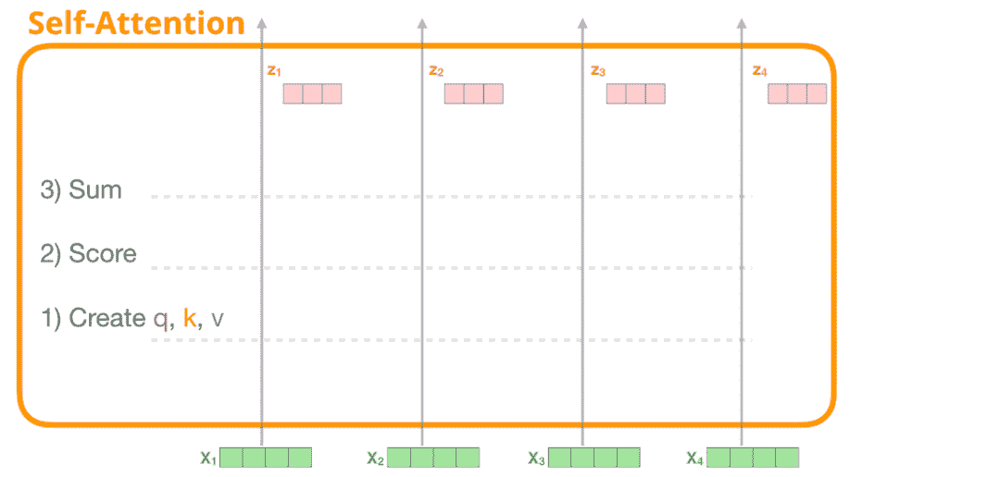

1\. 创建查询、键和值向量

我们重点关注第一条路径。我们用它的查询值与其它所有的键向量进行比较，这使得每个键向量都有一个对应的注意力得分。自注意力机制的第一步就是为每个词（token）路径（我们暂且忽略注意力头）计算三个向量：查询向量、键向量、值向量。

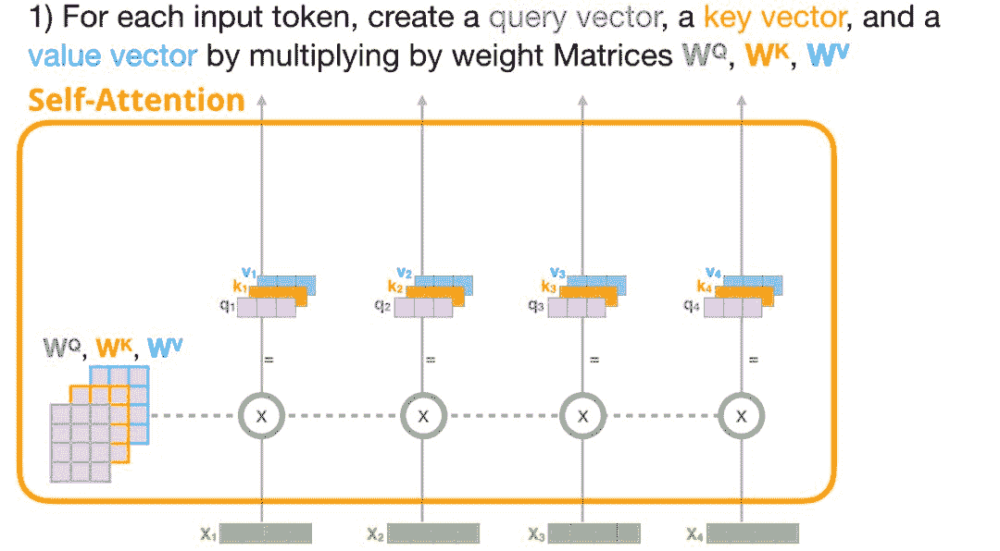

2\. 注意力得分

计算出上述三个向量后，我们在第二步中只用查询向量和键向量。我们重点关注第一个词，将它的查询向量与其它所有的键向量相乘，得到四个词中的每个词的注意力得分。

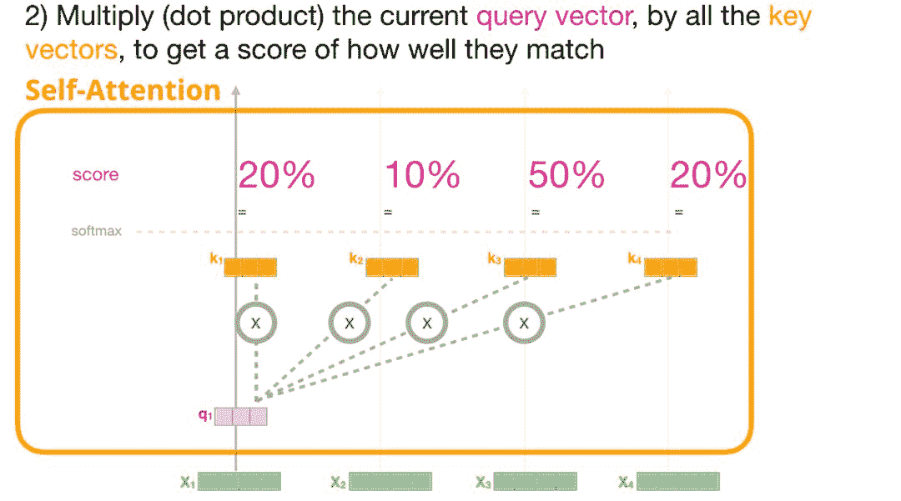

3\. 求和

现在，我们可以将注意力得分与值向量相乘。在我们对其求和后，注意力得分较高的值将在结果向量中占很大的比重。

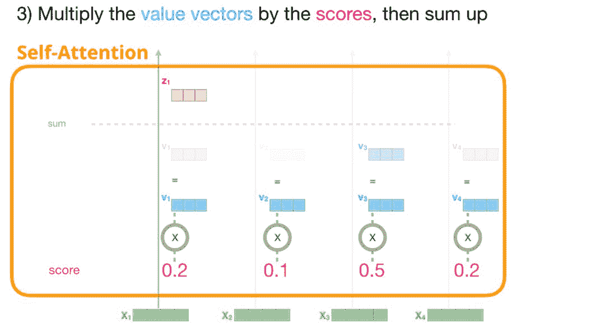

注意力得分越低，我们在图中显示的值向量就越透明。这是为了表明乘以一个小的数是如何削弱向量值的影响的。

如果我们在每一个路径都执行相同的操作，最终会得到一个表征每个词的向量，它包括了这个词的适当的上下文，然后将这些信息在 transformer 模块中传递给下一个子层（前馈神经网络）：

**图解掩模自注意力机制**

现在我们已经介绍了 transformer 模块中自注意力机制的步骤，接下来我们介绍掩模自注意力机制（masked self-attention）。在掩模自注意力机制中，除了第二步，其余部分与自注意力机制相同。假设模型输入只包含两个词，我们正在观察第二个词。在这种情况下，后两个词都被屏蔽了。因此模型会干扰计算注意力得分的步骤。基本上，它总是为序列中后续的词赋予 0 分的注意力得分，因此模型不会在后续单词上得到最高的注意力得分：

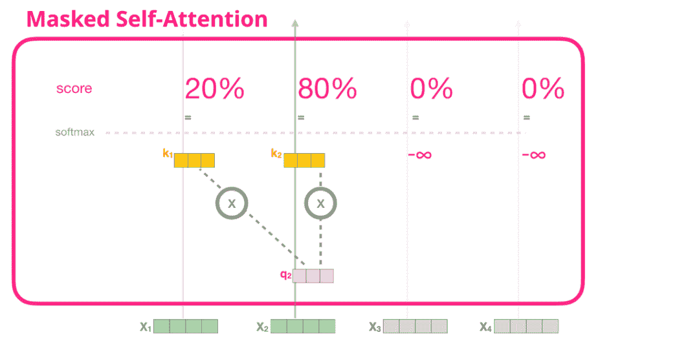

我们通常使用注意力掩模矩阵来实现这种屏蔽操作。不妨想象一个由四个单词组成的序列（例如「robot must obey orders」（机器人必须服从命令））在语言建模场景中，这个序列被分成四步进行处理——每个单词一步（假设现在每个单词（word）都是一个词（token））。由于这些模型都是批量执行的，我们假设这个小型模型的批处理大小为 4，它将整个序列（包含 4 步）作为一个批处理。

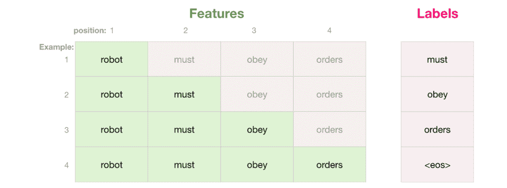

在矩阵形式中，我们通过将查询矩阵和键矩阵相乘来计算注意力得分。该过程的可视化结果如下所示，下图使用的是与单元格中该单词相关联的查询（或键）向量，而不是单词本身：

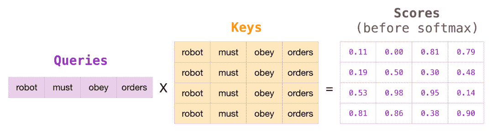

在相乘之后，我们加上注意力掩模三角矩阵。它将我们想要屏蔽的单元格设置为负无穷或非常大的负数（例如，在 GPT2 中为 -10 亿）：

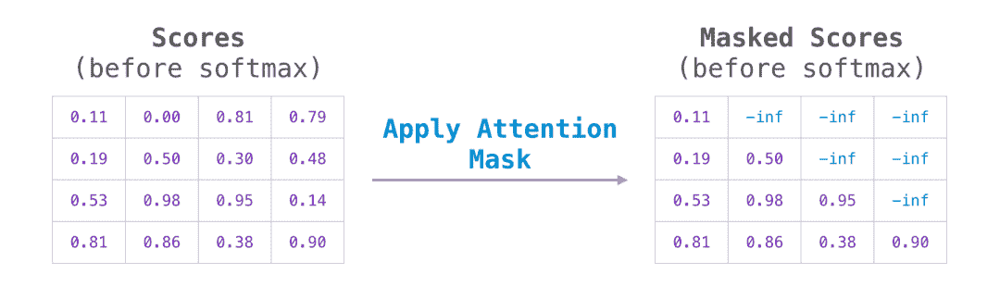

然后，对每一行执行 softmax 操作，从而得到我们在自注意力机制中实际使用的注意力得分：

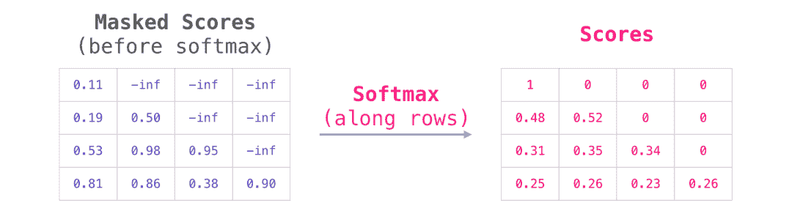

此分数表的含义如下：

*   当模型处理数据集中的第一个示例（第一行）时，这里只包含了一个单词（「robot」），所以 100% 的注意力都在该单词上。

*   当模型处理数据集中的第二个示例（第二行）时，这里包含了（「robot must」），当它处理单词「must」时，48% 的注意力会在「robot」上，而另外 52% 的注意力会在「must」上。

*   以此类推

**GPT-2 的掩模自注意力机制**

接下来，我们将更详细地分析 GPT-2 的掩模自注意力机制。

1\. 模型评价时：一次只处理一个词

我们可以通过掩模自注意机制的方式执行 GPT-2。但是在模型评价时，当我们的模型每轮迭代后只增加一个新单词时，沿着先前已经处理过的路径再重新计算词（tokrn）的自注意力是效率极低的。

在这种情况下，我们处理第一个词（暂时忽略 <s>）

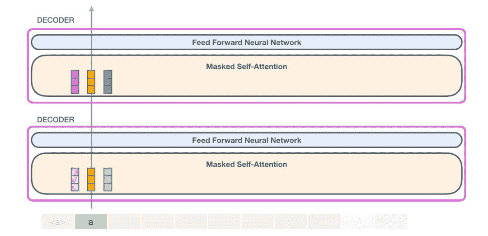

GPT-2 保存了词「a」的键向量和值向量。每个自注意力层包括了该词相应的键和值向量：

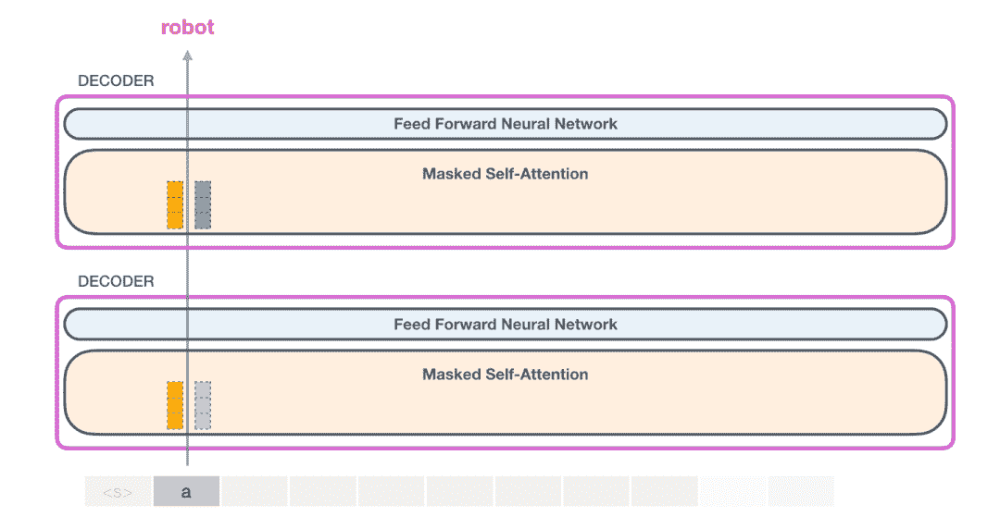

在下一次迭代中，当模型处理单词「robot」时，它不再需要为词「a」生成查询、键和值向量。它只需要复用第一次迭代中保存的向量:

现在，在下一次迭代中，当模型处理单词 robot 时，它不再需要为 token「a」生成查询、键和值向量。它只需要复用第一次迭代中保存的向量:

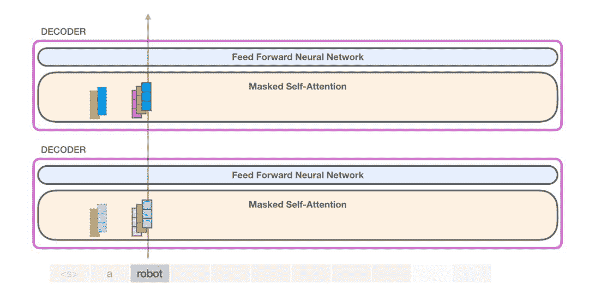

2\. GPT-2 自注意力机制:1-创建查询、键和值

假设模型正在处理单词「it」。对于下图中底部的模块来说，它对该词的输入则是「it」的嵌入向量+序列中第九个位置的位置编码：

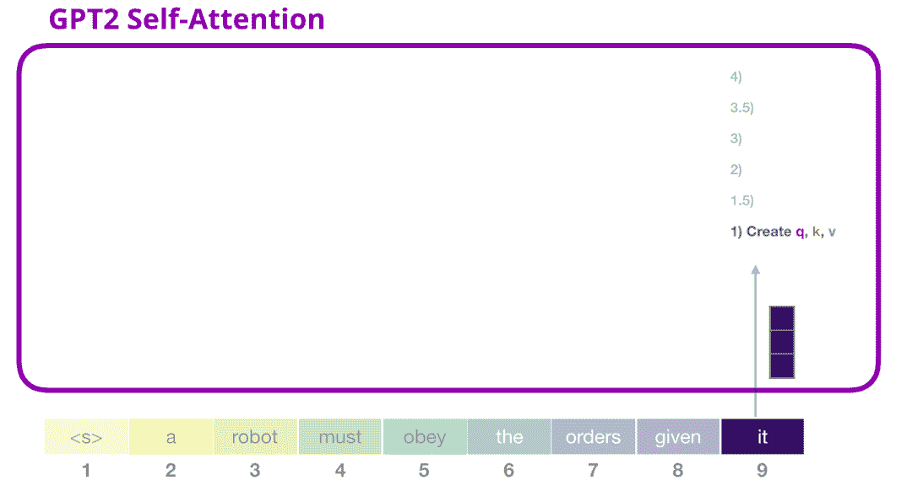

Transformer 中的每个模块都有自己的权重（之后会详细分析）。我们首先看到的是用于创建查询、键和值的权重矩阵。

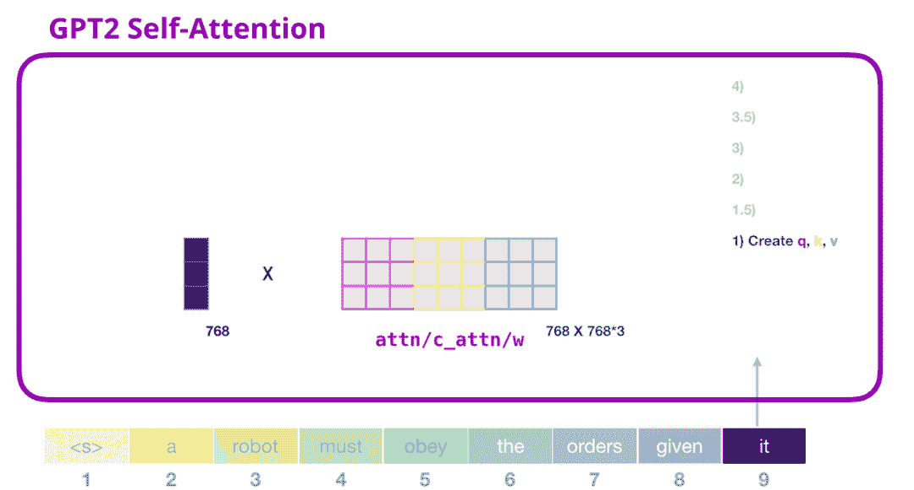

自注意力机制将它的输入与权重矩阵相乘（并加上一个偏置向量，这里不作图示）。

相乘后得到的向量从基本就是单词「it」的查询、键和值向量连接 的结果。

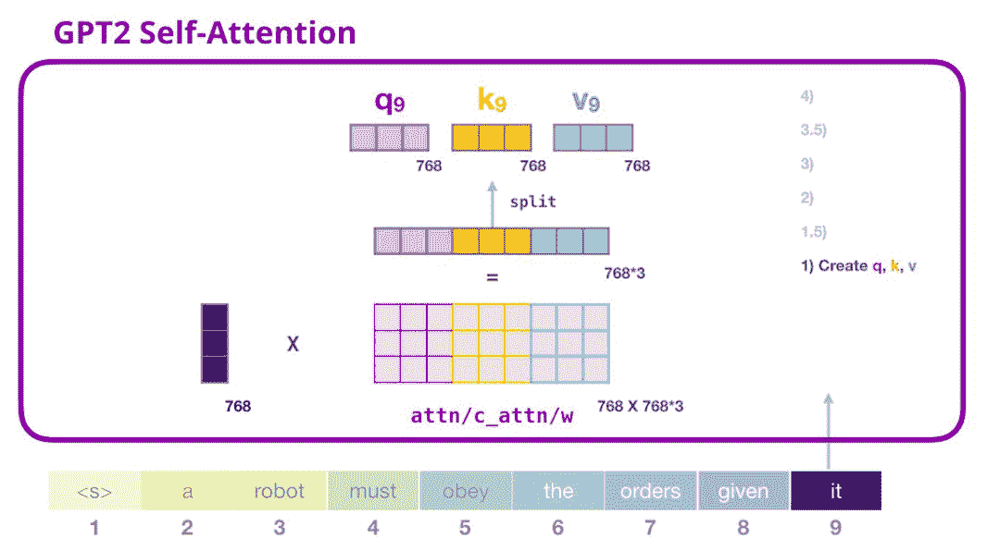

将输入向量和注意力权重向量相乘（之后加上偏置向量）得到这个词的键、值和查询向量。

3\. GPT-2 自注意力机制：1.5-分裂成注意力头

在前面的示例中，我们直接介绍了自注意力机制而忽略了「多头」的部分。现在，对这部分概念有所了解会大有用处。自注意力机制是在查询（Q）、键（K）、值（V）向量的不同部分多次进行的。「分裂」注意力头指的是，简单地将长向量重塑成矩阵形式。在小型的 GPT-2 中，有 12 个注意力头，因此这是重塑矩阵中的第一维：

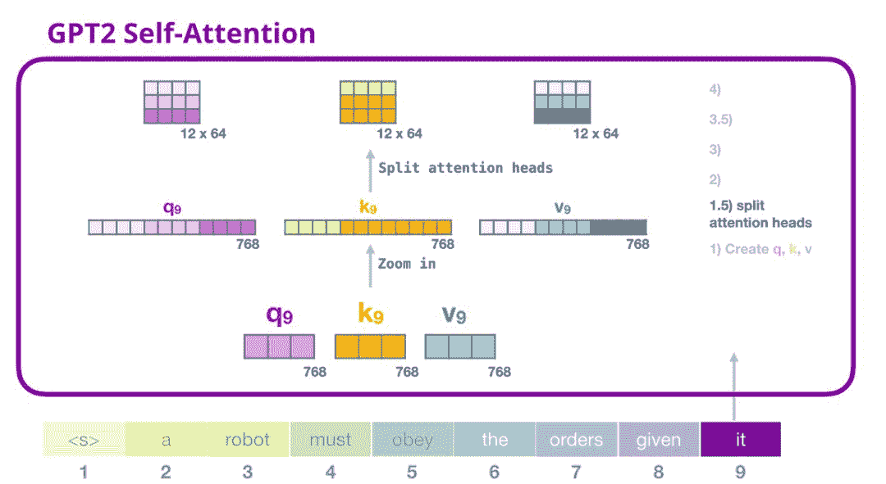

在前面的示例中，我们介绍了一个注意力头的情况。多个注意力头可以想象成这样（下图为 12 个注意力头中的 3 个的可视化结果）：

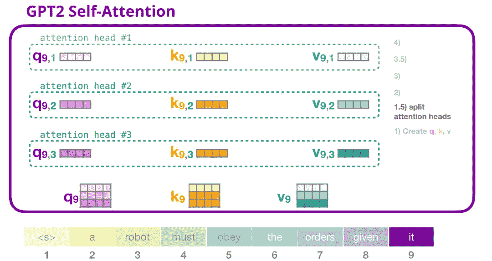

4\. GPT-2 自注意力机制：2-计算注意力得分

我们接下来介绍计算注意力得分的过程——此时我们只关注一个注意力头（其它注意力头都进行类似的操作）。

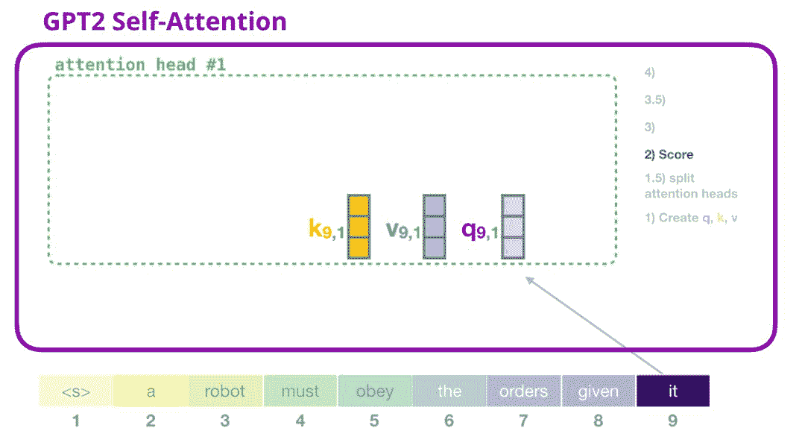

当前关注的词（token）可以对与其它键词的键向量相乘得到注意力得分（在先前迭代中的第一个注意力头中计算得到）：

5\. GPT-2 自注意力机制：3-求和

正如前文所述，我们现在可以将每个值向量乘上它的注意力得分，然后求和，得到的是第一个注意力头的自注意力结果：

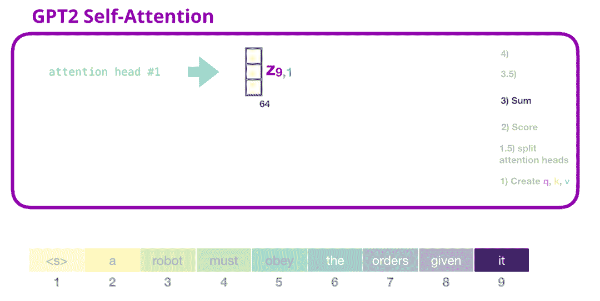

6\. GPT-2 自注意力机制：3.5-合并多个注意力头

我们处理多个注意力头的方式是先将它们连接成一个向量：

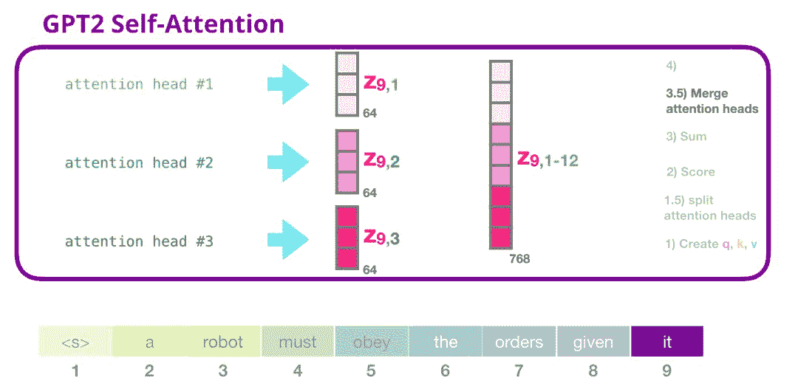

但是这个向量还不能被传递到下一个子层。我们首先需要将这个隐含状态的混合向量转变成同质的表示形式。

7\. GPT-2 自注意力机制：4-投影

我们将让模型学习如何最好地将连接好的自注意力结果映射到一个前馈神经网络可以处理的向量。下面是我们的第二个大型权重矩阵，它将注意力头的结果投影到自注意力子层的输出向量中：

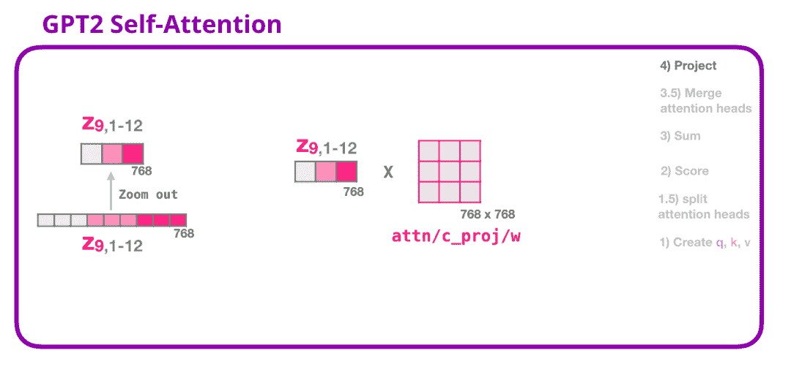

通过这个操作，我们可以生成能够传递给下一层的向量：

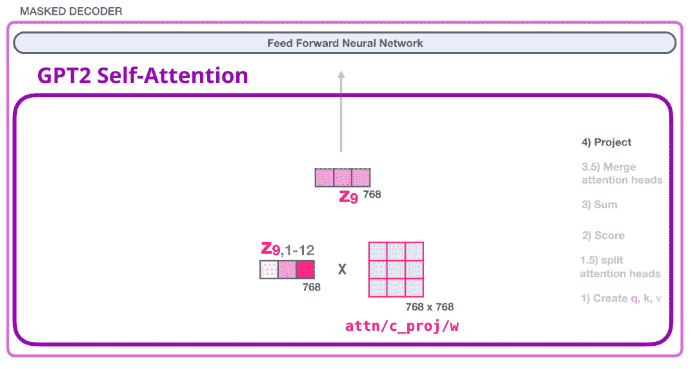

8\. GPT-2 全连神经网络：第一层

在全连接神经网络中，当自注意力机制已经将合适的上下文包含在其表征中之后，模块会处理它的输入词。它由两层组成：第一层的大小是模型的 4 倍（因为小型 GPT-2 的大小为 768 个单元，而这个网络将有 768*4=3072 个单元）。为什么是 4 倍呢？这只是原始 transformer 的运行大小（模型维度为 512 而模型的第一层为 2048）。这似乎给 transformer 模型足够的表征容量来处理目前面对的任务。

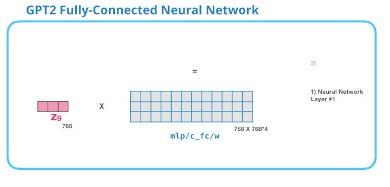

9\. GPT-2 全连神经网络：第二层-投影到模型的维度

第二层将第一层的结果投影回模型的维度大小（小型 GPT-2 的大小为 768）。这个乘法结果是该词经过 transformer 模块处理的结果。

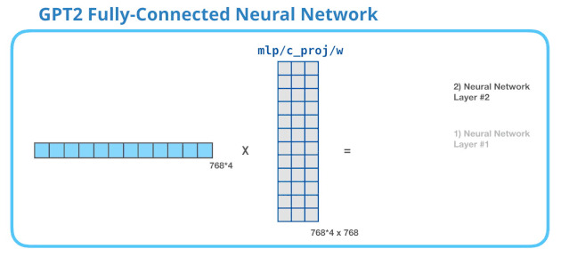

**你成功处理完单词「it」了！**

我们尽可能详细地介绍了 transformer 模块。现在，你已经基本掌握了 transformer 语言模型内部发生的绝大部分情况了。回顾一下，一个新的输入向量会遇到如下所示的权重矩阵：

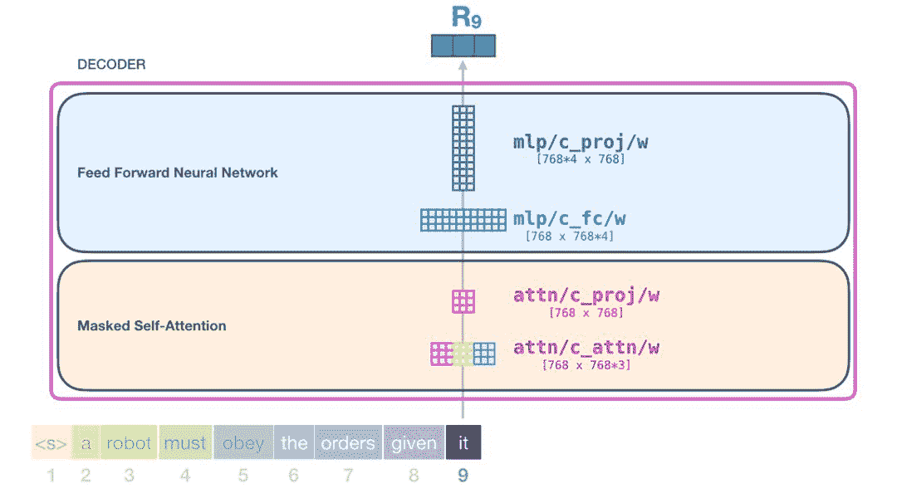

而且每个模块都有自己的一组权重。另一方面，这个模型只有一个词嵌入矩阵和一个位置编码矩阵：

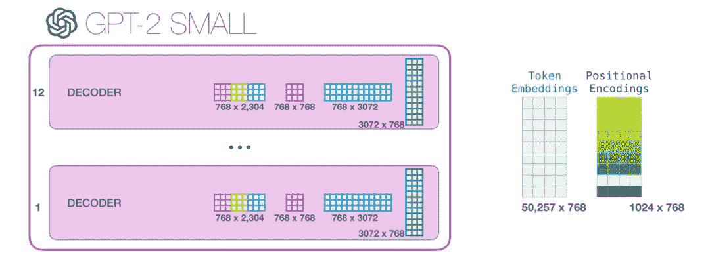

如果你想了解模型中的所有参数，下面是对它们的详细统计结果：

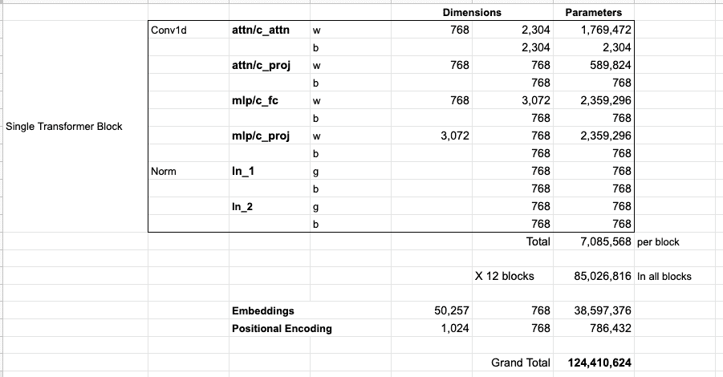

出于某些原因，该模型共计有 1 亿 2,400 万个参数而不是 1 亿 1,700 万个。我不确定这是为什么，但是这似乎就是发布的代码中的数目（如果本文统计有误，请读者指正）。

**第三部分：****语言建模之外**

只包含解码器的 transformer 不断地表现出在语言建模之外的应用前景。在许多应用程序中，这类模型已经取得了成功，它可以用与上面类似的可视化图表来描述。在文章的最后，让我们一起来回顾一下其中的一些应用。

**机器翻译**

进行翻译时，模型不需要编码器。同样的任务可以通过一个只有解码器的 transformer 来解决：

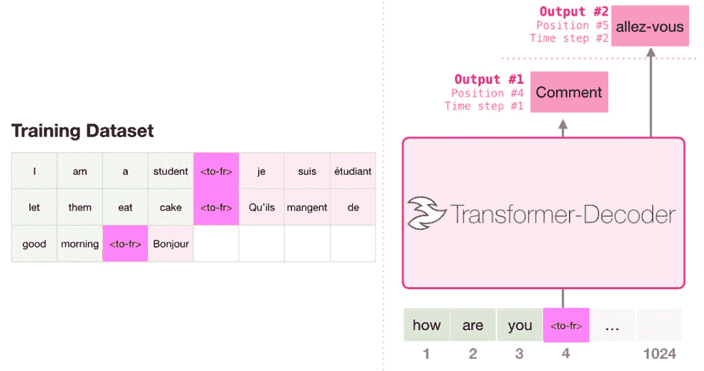

**自动摘要生成**

这是第一个训练只包含解码器的 transformer 的任务。也就是说，该模型被训练来阅读维基百科的文章（没有目录前的开头部分），然后生成摘要。文章实际的开头部分被用作训练数据集的标签：

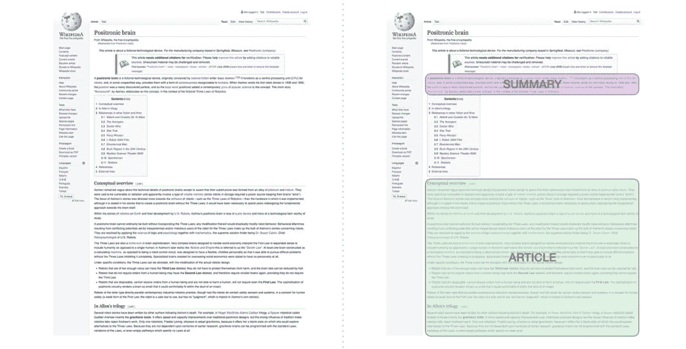

论文使用维基百科的文章对模型进行了训练，训练好的模型能够生成文章的摘要：

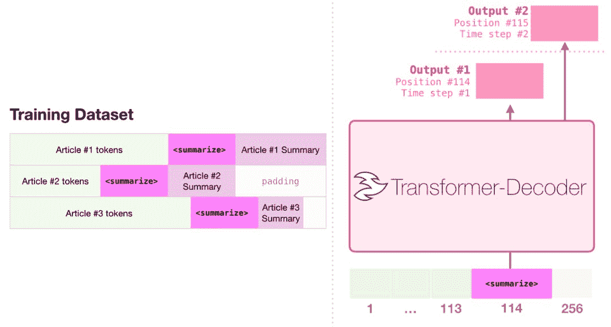

**迁移学习**

在论文「Sample Efficient Text Summarization Using a Single Pre-Trained Transformer」（https://arxiv.org/abs/1905.08836）中，首先使用只包含解码器的 transformer 在语言建模任务中进行预训练，然后通过调优来完成摘要生成任务。结果表明，在数据有限的情况下，该方案比预训练好的编码器-解码器 transformer 得到了更好的效果。

GPT2 的论文也展示了对语言建模模型进行预训练后取得的摘要生成效果。

**音乐生成**

音乐 transformer（https://magenta.tensorflow.org/music-transformer）采用了只包含解码器的 transformer (https://magenta.tensorflow.org/music-transformer%EF%BC%89%E9%87%87%E7%94%A8%E4%BA%86%E5%8F%AA%E5%8C%85%E5%90%AB%E8%A7%A3%E7%A0%81%E5%99%A8%E7%9A%84transformer) 来生成具有丰富节奏和动感的音乐。和语言建模相似，「音乐建模」就是让模型以一种无监督的方式学习音乐，然后让它输出样本（我们此前称之为「随机工作」）。

你可能会好奇，在这种情境下是如何表征音乐的？请记住，语言建模可以通过对字符、单词（word）、或单词（word）某个部分的词（token）的向量表征来实现。面对一段音乐演奏（暂时以钢琴为例），我们不仅要表征这些音符，还要表征速度——衡量钢琴按键力度的指标。

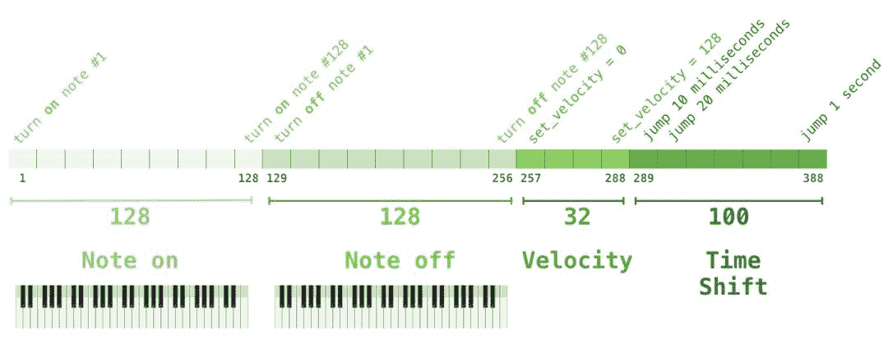

一段演奏可以被表征为一系列的 one-hot 向量。一个 MIDI 文件可以被转换成这样的格式。论文中展示了如下所示的输入序列的示例：

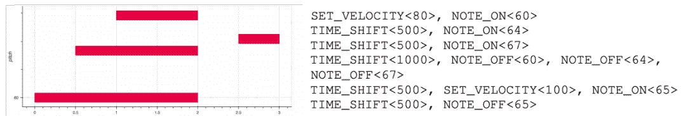

这个输入序列的 one-hot 向量表征如下：

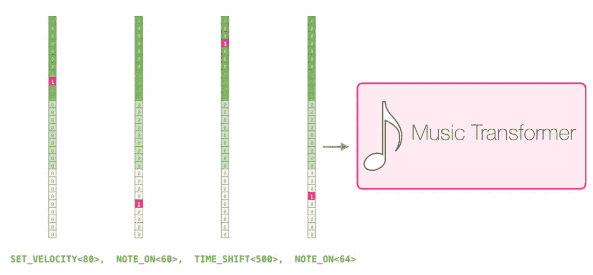

我喜欢论文中用来展示音乐 transformer 中自注意力机制的可视化图表。我在这里加了一些注释：

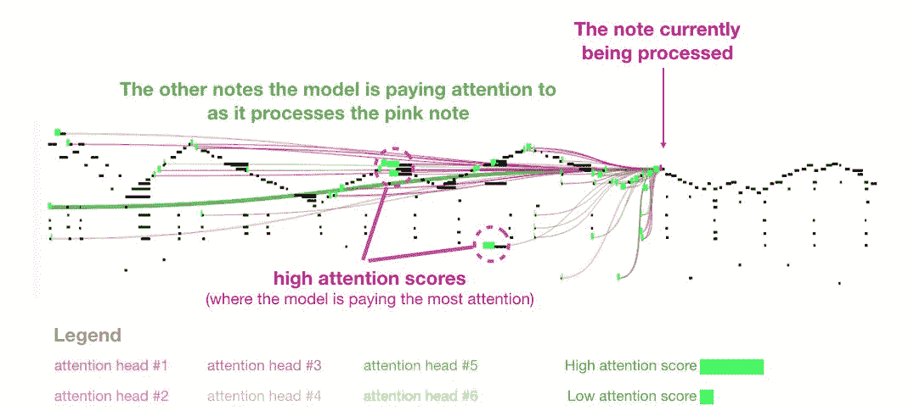

这段作品中出现了反复出现的三角轮廓。当前的查询向量位于后面一个「高峰」，它关注前面所有高峰上的高音，一直到乐曲的开头。图中显示了一个查询向量（所有的注意力线来源）和正要处理的以前的记忆（突出了有更高 softmax 概率的音符）。注意力线的颜色对应于不同的注意力头，而宽度对应于 softmax 概率的权重。

如果你想进一步了解这种音符的表征，请观看下面的视频：https://www.youtube.com/watch?v=ipzR9bhei_o

**结语 **

至此，我们的 GPT-2 的完全解读，以及对父类模型（只包含解码器的 transformer）的分析就到此结束了。希望读者能通过这篇文章对自注意力机制有更好的理解。在了解了 transformer 内部的工作原理之后，下次再遇到它，你将更加得心应手。

*原文地址：**https://jalammar.github.io/illustrated-gpt2/*

********本****文为机器之心编译，**转载请联系本公众号获得授权****。**
✄------------------------------------------------**加入机器之心（全职记者 / 实习生）：hr@jiqizhixin.com****投稿或寻求报道：**content**@jiqizhixin.com****广告 & 商务合作：bd@jiqizhixin.com**