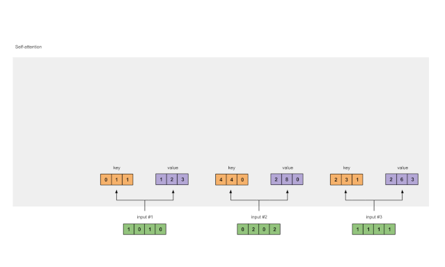
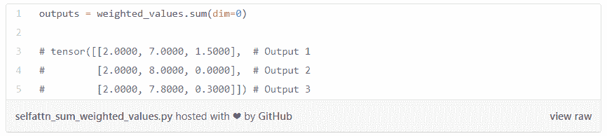

# 包学包会，这些动图和代码让你一次读懂「自注意力」

> 原文：[`mp.weixin.qq.com/s?__biz=MzA3MzI4MjgzMw==&mid=2650775568&idx=4&sn=24d8a21c7ef0031ec045bb54d8682a05&chksm=871a646eb06ded78383fcaf86cdb6640f7ba957216bfab442a4671ce53aed0b223d89307cf54&scene=21#wechat_redirect`](http://mp.weixin.qq.com/s?__biz=MzA3MzI4MjgzMw==&mid=2650775568&idx=4&sn=24d8a21c7ef0031ec045bb54d8682a05&chksm=871a646eb06ded78383fcaf86cdb6640f7ba957216bfab442a4671ce53aed0b223d89307cf54&scene=21#wechat_redirect)

选自 towardsdatascience

**作者：Raimi Karim**

**机器之心编译**

**参与：****Panda W、杜伟**

> BERT 及其多种变体已经在多种语言理解任务上取得了非常出色的表现，这些架构全都基于 Transformer，而 Transformer 又使用了一种名为「自注意力」的方法。本文将通过图示和代码对自注意力机制进行透彻的解读。当然，在阅读本文之前，你可能也想了解什么是注意力机制。没有问题，同一位作者机器学习工程师 Raimi Karim 之前已经通过类似的方式解读过了：[《图解神经机器翻译中的注意力机制》](https://mp.weixin.qq.com/s?__biz=MzA3MzI4MjgzMw==&mid=2650757075&idx=4&sn=56c59e46ba4ca2c420119aadef72600f&scene=21#wechat_redirect)。


BERT、RoBERTa、ALBERT、SpanBERT、DistilBERT、SesameBERT、SemBERT、MobileBERT、TinyBERT 和 CamemBERT 有什么共同点？别说「BERT」，那不是我想要的答案。

答案：自注意力（self-attention）。

我们要探讨的不仅是名字里面带有「BERT」的架构，而是「基于 Transformer」的架构。基于 Transformer 的架构主要用在语言理解任务的建模中；这种架构没有使用神经网络中的循环（recurrence）来学习输入和输出之间的全局依赖关系，而是完全依靠自注意力。

**但自注意力背后的数学原理是怎样的呢？**

这就是本文所要探讨的主题。本文的主要内容是带你纵览自注意力模块中所涉及的数学运算。你在读完本文之后，应该就有能力从头开始编写自注意力模块代码了。

本文的目标不是提供自注意力模块中不同数值运算和数学运算背后的直观理解和解读，也不是为了说明 Transformer 中使用自注意力的原因和方式（这方面的解释网上能找到很多）。本文也不会刻意说明注意力（attention）和自注意力的差别。

**自注意力是什么？**

你可能会想自注意力与注意力可能有相似之处，你的想法是对的！它们的概念基本一样，也有很多共同的数学运算。

自注意力模块有 n 个输入，并会返回 n 个输出。这个模块中发生了什么？用门外汉的话来说，自注意力机制让每个输入都会彼此交互（自），然后找到它们应该更加关注的输入（注意力）。自注意力模块的输出是这些交互的聚合和注意力分数。

**图示**

下面将按照以下步骤通过图示来说明自注意力：

1\. 准备输入 2\. 初始化权重 3\. 推导键（key）、查询（query）和值（value）4\. 计算输入 1 的注意力分数 5\. 计算 softmax6\. 将分数与值相乘 7\. 对加权的值求和，得到输出 18\. 为输入 2 和 3 重复 4-7 步骤

备注：在实践中，这些数学运算是经过向量化的，即所有输入会一起经历这样的数学运算。我们会在后面的代码章节看到这一点。

**第一步：准备输入**

*图 1.1：**准备输入。*

为了方便说明，我们先来 3 个输入，每个输入的维度为 4.

```py
Input 1: [1, 0, 1, 0] 
Input 2: [0, 2, 0, 2]
Input 3: [1, 1, 1, 1] 
```

**第二步：****初始化权重**

每个输入必须有 3 个表征（见下图）。这些表征被称为键（key，橙色）、查询（query，红色）和值（value，紫色）。在此示例中，我们设这些表征的维度为 3。因为每个输入的维度为 4，所以这意味着每组权重的形状为 4×3。

备注：后面我们会看到，值的维度也就是输出的维度。


*图 1.2：为每个输入推导键、查询和值。*

为了得到这些表征，每个输入（绿色）都要与一组键的权重、一组查询的权重、一组值的权重相乘。在这个示例中，我们按如下方式初始化这三个权重：

键的权重：

```py
[[0, 0, 1],
 [1, 1, 0],
 [0, 1, 0],
 [1, 1, 0]] 
```

查询的权重：

```py
[[1, 0, 1],
 [1, 0, 0],
 [0, 0, 1],
 [0, 1, 1]] 
```

值的权重：

```py
[[0, 2, 0],
 [0, 3, 0],
 [1, 0, 3],
 [1, 1, 0]] 
```

备注：在神经网络设置中，这些权重通常是较小的数值，初始化也是使用合适的随机分布来实现，比如高斯分布、Xavier 分布、Kaiming 分布。

**第三步：推导键、查询和值**

现在我们有三组权重了，我们来实际求取每个输入的键、查询和值的表征：

输入 1 的键表征：

```py
[0, 0, 1]
[1, 0, 1, 0] x [1, 1, 0] = [0, 1, 1]
               [0, 1, 0]
               [1, 1, 0] 
```

使用同样一组权重求取输入 2 的键表征：

```py
[0, 0, 1]
[0, 2, 0, 2] x [1, 1, 0] = [4, 4, 0]
               [0, 1, 0]
               [1, 1, 0] 
```

使用同样一组权重求取输入 3 的键表征：

```py
 [0, 0, 1]
[1, 1, 1, 1] x [1, 1, 0] = [2, 3, 1]
               [0, 1, 0]
               [1, 1, 0] 
```

向量化以上运算能实现更快的速度：

```py
[0, 0, 1]
[1, 0, 1, 0]   [1, 1, 0]   [0, 1, 1]
[0, 2, 0, 2] x [0, 1, 0] = [4, 4, 0]
[1, 1, 1, 1]   [1, 1, 0]   [2, 3, 1] 
```


*图 1.3a：**推导每个输入的键表征。*

通过类似的方式，我们求取每个输入的值表征：

```py
[0, 2, 0]
[1, 0, 1, 0]   [0, 3, 0]   [1, 2, 3] 
[0, 2, 0, 2] x [1, 0, 3] = [2, 8, 0]
[1, 1, 1, 1]   [1, 1, 0]   [2, 6, 3] 
```

*图 1.3b：推导每个输入的值表征。*

最后还有查询表征：

```py
[1, 0, 1]
[1, 0, 1, 0]   [1, 0, 0]   [1, 0, 2]
[0, 2, 0, 2] x [0, 0, 1] = [2, 2, 2]
[1, 1, 1, 1]   [0, 1, 1]   [2, 1, 3] 
```

*图 1.3c：**推导每个输入的查询表征。*

备注：在实践中，可能还会为矩阵乘法的积添加一个偏置向量。

**第四步：计算输入 1 的注意力分数**

*图 1.4：根据查询 1 计算注意力分数（蓝色）。*

为了求取注意力分数，我们首先求输入 1 的查询（红色）与所有键（橙色，包括其自身的键）的点积。因为有 3 个键表征（因为输入有 3 个），所以会得到 3 个注意力分数（蓝色）。

```py
[0, 4, 2]
[1, 0, 2] x [1, 4, 3] = [2, 4, 4]
            [1, 0, 1] 
```

注意这里仅使用了输入 1 的查询。后面我们会为其它查询重复同一步骤。

备注：上面的运算也被称为点积注意力（dot product attention），这是众多评分函数中的一个，其它评分函数还包括扩展式点积和 additive/concat，请参阅[《图解神经机器翻译中的注意力机制》](https://mp.weixin.qq.com/s?__biz=MzA3MzI4MjgzMw==&mid=2650757075&idx=4&sn=56c59e46ba4ca2c420119aadef72600f&scene=21#wechat_redirect)。

**第五步：计算 softmax**


*图 1.5：**对注意力分数（蓝色）执行 softmax。*

对这些注意力分数（蓝色）进行 softmax:

```py
softmax([2, 4, 4]) = [0.0, 0.5, 0.5] 
```

**第六步：将分数与值相乘**


*图 1.6：**通过将值（紫色）与分数（蓝色）相乘，推导加权的值表征（黄色）。*

每个输入的经过 softmax 的注意力分数（蓝色）与其对应的值（紫色）相乘。这会得到 3 个对齐向量（alignment vector，黄色）。在本教程中，我们称之为加权值（weighted value）。

```py
1: 0.0 * [1, 2, 3] = [0.0, 0.0, 0.0]
2: 0.5 * [2, 8, 0] = [1.0, 4.0, 0.0]
3: 0.5 * [2, 6, 3] = [1.0, 3.0, 1.5] 
```

**第七步：对加权的值求和，得到输出 1**


*图 1.7：对所有加权值（黄色）求和得到输出 1（深绿色）。*

将所有加权值（黄色）按元素求和：

```py
[0.0, 0.0, 0.0]
+ [1.0, 4.0, 0.0]
+ [1.0, 3.0, 1.5]
-----------------
= [2.0, 7.0, 1.5] 
```

所得到的向量 [2.0, 7.0, 1.5]（深绿色）是输出 1，这是基于输入 1 的查询表征与所有其它键（包括其自身的）的交互而得到的。

**第八步：为输入 2 和 3 重复 4-7 步骤**

现在已经完成了对输出 1 的求解，我们再为输出 2 和输出 3 重复步骤 4-7。我相信现在你完全能自己完成这些计算了。

*图 1.8：**为输入 2 和 3 重复之前的步骤。*

备注：因为使用了点积评分函数，所以查询和键的维度必须总是一致。但是，值的维度可能不同于查询和键。由此造成的结果是所得输出的维度与值的维度一致。

**代码**

下面是用 PyTorch 写的代码。PyTorch 是一个使用 Python 的常用深度学习框架。为了在代码中享受 @ 算子、.T 和 None 索引方法的 API 的便利，请确保你使用的是 Python 3.6 或更新版本以及 PyTorch 1.3.1。请跟随以下步骤，直接将代码复制到 Python/IPython REPL 或 Jupyter Notebook 中。

第一步：准备输入


 第二步：初始化权重


第三步：推导键、查询和值


第四步：计算注意力分数


第五步：计算 softmax


第六步：将分数与值相乘


第七步：对加权值求和



备注：PyTorch 已经为这些运算提供了一个 API，即 nn.MultiheadAttention。但是，这个 API 需要你输入键、查询和值的 PyTorch 张量。此外，这个模块的输出会经过一次线性变换。

**扩展用于 Transformer**

那么，接下来又如何呢？Transformer！实际上我们正处于深度学习研究和高计算资源齐头并进的激动人心的时代。Transformer 源自论文《Attention Is All You Need》https://arxiv.org/abs/1706.03762，最早是为神经机器翻译而生的。在此基础上，研究者继续向前——组合、分拆、添加和扩展，最后将 Transformer 扩展到了更多语言任务上。

这里我简要说说我们可以怎样将自注意力扩展用于 Transformer 架构：

*   在自注意力模块内：维度、偏置；

*   自注意力模块的输入：嵌入模块、位置编码、截断、掩码；

*   添加更多自注意模块：多头、层堆叠；

*   自注意力模块之间的模块：线性变换、层归一化

**参考和相关文章**

*   https://arxiv.org/abs/1706.03762

*   https://jalammar.github.io/illustrated-transformer/

*   https://towardsdatascience.com/attn-illustrated-attention-5ec4ad276ee3

*原文链接：https://towardsdatascience.com/illustrated-self-attention-2d627e33b20a*

**[机器之心「SOTA 模型」](http://mp.weixin.qq.com/s?__biz=MzA3MzI4MjgzMw==&mid=2650770891&idx=1&sn=25bde35991047a997337c8dd25350089&chksm=871a49b5b06dc0a36fc3407e3643550ef97f72b007e67c4f4be250bfd60c9fdc5389624569c0&scene=21#wechat_redirect)****：****22****大领域、127 个任务，机器学习 SOTA 研究一网打尽。******

点击阅读原文，立即访问。