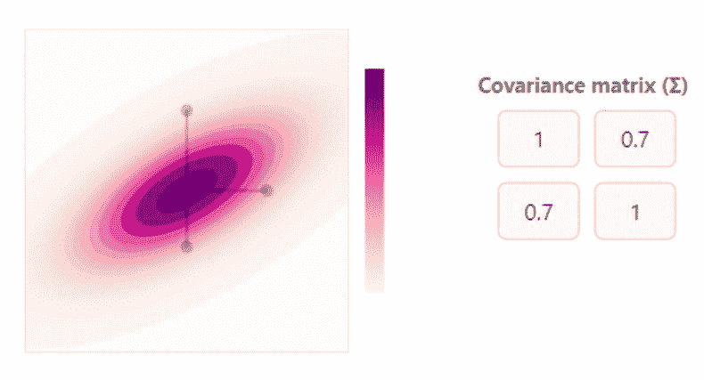
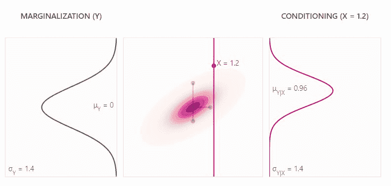
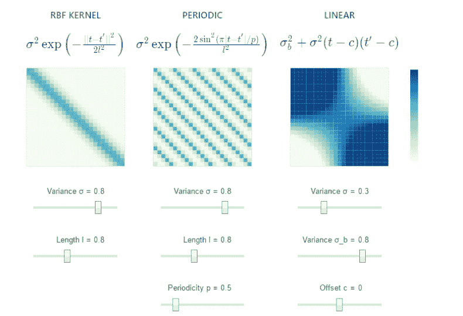
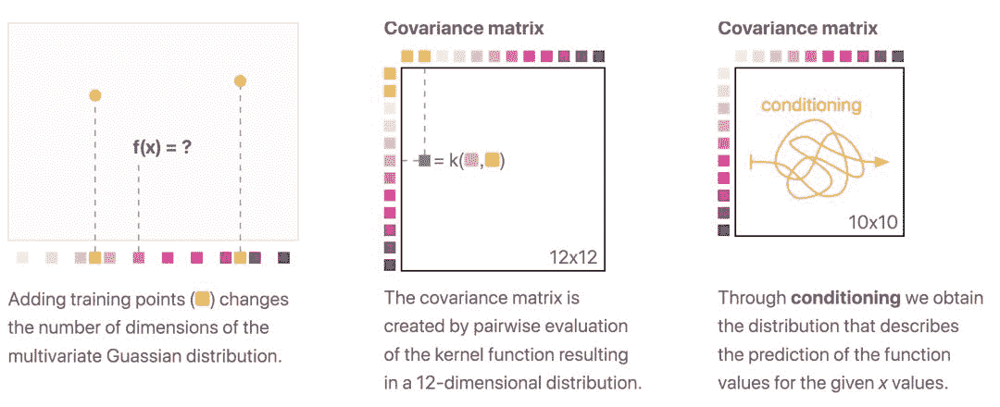
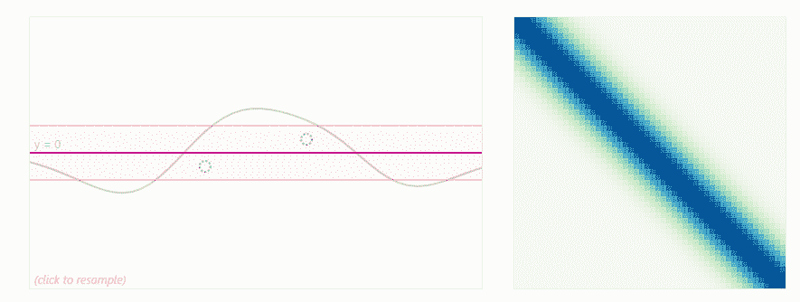
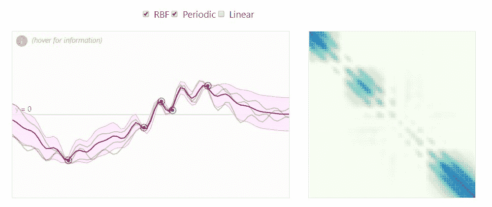

# 看得见的高斯过程：这是一份直观的入门解读

> 原文：[`mp.weixin.qq.com/s?__biz=MzA3MzI4MjgzMw==&mid=2650756950&idx=4&sn=eff13e168444e3b26205e5db7474e134&chksm=871a9328b06d1a3e82f2a5a08b45eeb4999d1d8f09a570a417582215ca491284055e06d5fc24&scene=21#wechat_redirect`](http://mp.weixin.qq.com/s?__biz=MzA3MzI4MjgzMw==&mid=2650756950&idx=4&sn=eff13e168444e3b26205e5db7474e134&chksm=871a9328b06d1a3e82f2a5a08b45eeb4999d1d8f09a570a417582215ca491284055e06d5fc24&scene=21#wechat_redirect)

选自 Distill

**作者：Jochen Görtler、Rebecca Kehlbeck、Oliver Deussen**

**参与：Yi Bai、张倩、王淑婷**

> 高斯过程可以让我们结合先验知识，对数据做出预测，最直观的应用领域是回归问题。本文作者用几个互动图生动地讲解了高斯过程的相关知识，可以让读者直观地了解高斯过程的工作原理以及如何使其适配不同类型的数据。

**引言**

即使读过一些机器学习相关的书，你也未必听说过高斯过程。当然了，若是听说过也无妨，复习一下基础知识也能帮你唤醒记忆。本文旨在向读者介绍高斯过程，并且把它背后的数学原理讲得更加直观易懂。

高斯过程是机器学习工具箱里一种相当有用的工具 [1]。它让我们得以结合先验知识，对数据做出预测。它最直观的应用领域是回归问题，比如在机器人学里会用到。同时，也可以把它拓展到分类和聚类任务里。我们先小小复习一下：回归的目的是为了找到一个函数来尽可能贴近地描述一组给定的数据点。这个过程叫做用函数拟合数据。对于一组既定的训练数据点，或许潜在有无限多个函数可以用来做拟合。高斯过程则为此提供了一个优雅的解决方案——给每个这类函数分配一个概率值 [1]。这个概率分布的均值便代表了这个数据最有可能的表征。而且，概率的方法使我们可以把对预测的置信度结合到回归的结果里去。

首先，我们将探索高斯回归的数学基础。你可以通过文中的互动图，以及上手感受具体的例子来理解这些知识。它们有助于解释每个组件的影响，并展示高斯过程的灵活性。希望你在阅读本文之后，对高斯过程的工作原理以及如何把它适配给不同类型的数据能有一个直观的理解。

**多元高斯分布**

在探索高斯分布之前，我们需要理解它们的数学基础。从名字我们可以得知，高斯分布（也叫做正态分布）是高斯过程的基础构件。而我们最感兴趣的是多元高斯分布，其每个随机变量都呈正态分布，联合分布也是高斯的。一般来说，多元高斯分布由均值向量 μ 和协方差矩阵 Σ 定义。

均值向量μ 描述了该分布的期望值，它的每个组件描述了对应维度的均值。Σ 对每个维度的方差进行建模，并确定不同随机变量之间的关联。协方差矩阵总是对称且半正定的（positive semi-definite）[4]。Σ 的对角线由第 i 个随机变量的标准差σ_i 组成，而非对角线的元素则描述了每个元素σ_ij 之间的相关性。

我们称 X 符合正态分布。协方差矩阵Σ 描述了该分布的形状，它由期望值 E 所定义：

从图形上来看，该分布以均值为中心，由协方差矩阵决定其形状。下图展示了这些参数对于一个二维高斯分布的影响。每个随机变量的标准差在协方差矩阵的对角线上，而其它的值则显示了它们之间的协方差。

这是一个互动式的图，通过拖动图中的三个点，你可以调节每个维度上的方差，以及两个随机变量之间的关联。紫色的部分指的是分布内高概率的区域。

高斯分布被广泛应用于为真实世界建模，有时在原分布未知的情况下作为替代品，有时用于中心极限定理。接下来我们会进一步讲解如何操纵高斯分布，以及如何从中获得有用的信息。

**边缘化和条件作用**

高斯分布有一个很赞的代数性质：它在条件作用和边缘化情况下是封闭的。意思是，经过这些运算后，在结果中得到的分布依旧是高斯分布，这就使得很多统计学和机器学习中的问题变得易解。接下来，我们将进一步看看这两个运算，它们是高斯过程的基础。

边缘化和条件作用都作用于原始分布的子集，我们将使用以下符号：

其中 X 和 Y 代表原始随机变量的子集。

通过边缘化，我们可以获取多元概率分布的一部分信息。给定随机变量 X 和 Y 组成的向量的正态概率分布 P(X,Y)，我们可以用以下方法确定他们的边缘概率分布： 

这个公式所表达的意思很直接了当：X 和 Y 这两个子集各自只依赖于它们 μ 和 Σ 中对应的值。因此，要从高斯分布中边缘化一个随机变量，我们只需把μ 和Σ 里那些对应的变量丢掉就行。

这个公式的意思是，如果我们只对 X=x 的概率感兴趣，我们要考虑 Y 所有可能的值，它们齐心协力才能得到最终的结果。

高斯过程的另一个重要运算是条件作用，它可以用于得到一个变量在另一个变量条件下的概率分布。和边缘化类似，这个运算也是封闭的，会得到一个不同的高斯分布。条件运算是高斯过程的基石，它使贝叶斯推断成为可能。条件作用如下定义：

要注意的是，新的均值只依赖于作为条件的变量，而协方差矩阵则和这个变量无关。

了解了必要的公式以后，我们要思考的是：如何从视觉层面理解这两个运算。虽然边缘化和条件作用可以用于多维的多元分布，还是用下图中的二维分布作为例子更加好理解。边缘化可以理解为在高斯分布的一个维度上做累加，这也符合边缘分布的一般定义。条件作用也有个很好的几何表达——我们可以把它想象成在多元分布上切下一刀，从而获得一个维数更少的高斯分布。

*中间是一个二元正态分布。图左是该分布关于 Y 做边缘化的结果，类似于沿着 Y 轴做累加。图右是以给定的 X 为条件的分布，类似于在原始分布上切下一刀。你可以通过拖动图中的点来修改这个高斯分布和作为条件的变量。*

**高斯过程**

复习好了多元高斯分布的基础属性，我们接着就可以把它们组装到一起，来定义高斯过程，并展示怎么用高斯过程来解决回归问题。

首先，我们把视角从连续函数转移到函数的离散表达：相比于找一个隐函数而言，我们对预测具体点的函数值更感兴趣，这些点叫做测试点 X。对应地，我们把训练数据称为 Y。那么，高斯过程背后的关键点在于所有的函数值都来源于多元高斯分布。这意味着联合概率分布 P(X,Y) 跨越了我们想要预测的函数的可能取值空间。这个测试数据和训练数据的联合分布有∣X∣+∣Y∣维。

为了在训练数据上进行回归，我们会用贝叶斯推断来处理这个问题。贝叶斯推断的核心思想就是：在获得新的信息以后，更新当前的假设。对于高斯过程来说，这个信息指的就是训练数据。因此，我们感兴趣的是条件概率 P(X|Y)。最后，还记得高斯分布在条件作用下是封闭的吗？所以 P(X|Y) 也是正态分布的。

好了，我们已经集齐了高斯过程的基本框架，只差一个东西：我们怎么才能建立起这个分布，定义均值μ 和协方差矩阵Σ？方法是：使用核函数 k，具体细节将在下一节具体讨论。但在这之前，我们先回忆一下怎么用多元高斯分布来估算函数值。下图中的例子包含十个测试点，我们将在十个点上预测函数。

*这也是一个互动式的图*

在高斯过程中，我们把每个测试点作为一个随机变量，多元高斯分布的维数和随机变量的数目一致。由于我们想要预测函数在∣X∣=N 个测试点上的取值，对应的多元高斯分布也是 N 维的。用高斯过程做预测最终可以归结为在这个分布上做采样。这样，我们就可以把结果向量上的第 i 个成员作为第 i 个测试点的对应函数值。

**核函数**

让我们回想一下，为了建立起我们要的分布，首先要定义 μ 和 Σ。在高斯过程中，我们往往假设 μ =0，这样可以简化条件作用所需要的公式。这样做假设总是没错的，就算 μ≠0，我们也可以在预测结束后把μ 加回到结果函数值中。所以配置μ 非常简单，更有意思的是这个分布的另一个参数。

高斯过程中巧妙的一步是如何设置协方差矩阵Σ。协方差矩阵不仅仅描述了这个分布的形状，也最终决定了我们想要预测的函数所具有的特性。我们通过求核函数 k 的值来生成协方差矩阵，这个核函数通常也被称为协方差函数，作用在两两成对的所有测试点上。核函数接收到的输入是两个点，，返回的是一个标量，表达了这两个点之间的相似度。

我们将测试点两两配对，在这个函数上求值以获取协方差矩阵，这个步骤在下图中也有所显示。为了对核函数的作用有一个更直观的理解，我们可以想一想协方差矩阵中元素描述的是什么。Σ_ij 描述的是第 i 个点和第 j 个点之间的相互影响，这和多元高斯分布的定义一致。在多元高斯分布的定义中，Σ_ij 定义了第 i 个随机变量和第 j 个随机变量之间的相关性。由于核函数描述的是函数值之间的相似度，它便控制了这个拟合函数可能拥有的形状。注意，当我们选择一个核函数时，我们要确保它生成的矩阵遵循协方差矩阵的属性。

核函数被广泛应用于机器学习，比方说支持向量机。它之所以这么受欢迎，是因为它让我们得以在标准的欧几里得距离（L2 距离）之外衡量相似度。很多核函数会把输入点嵌到更高维的空间里去测量相似度。下图介绍了高斯过程的一些常见核函数。对于每个核函数，我们用 N=25 个呈线性、范围在 [-5,5] 的点生成协方差矩阵。矩阵中的元素显示出点和点之间的协方差，取值在 [0,1] 之间。

*上图展示了高斯过程可以使用的各种核函数。每个核函数的参数不同，你可以拖动滑块改变这些参数的值。当你点击某个滑块时，可以看到图右侧中当前参数是如何影响核函数的。*

核函数可分为平稳和非平稳的类型。平稳核函数，例如径向基函数核（RBF）或者周期核，都具有平移不变性，两点之间的协方差只取决于它们之间的相对位置。非平稳核函数，比如线性核，就没有这个限制且取决于绝对位置。径向基函数核的平稳特性可以从其协方差矩阵的对角线带来观察（如下图）。增加长度参数会使得这个带状区域变得更宽，因为距离较远的点彼此之间的相关性增加了。对于周期核，我们还有个参数 P 来决定周期，从而控制了函数每次重复之间的距离。相比之下，线性核的参数 C 让我们得以改变各个函数交汇的点。

还有很多其它的核函数可以描述不同类别的函数，它们使函数拥有我们所希望的形状。Duvenaud 的《Automatic model construction with Gaussian processes》对不同核函数进行了概览，值得一观。我们还可以把几个核函数结合起来用，不过这个以后再讲。

**先验分布**

回到我们原来的回归任务，正如我们之前提到过的，高斯过程定义了潜在函数的概率分布。由于这是一个多元高斯分布，这些函数也呈正态分布。我们通常假设μ= 0，姑且先考虑还没有观察到任何训练数据的情况。在贝叶斯推断的框架下，我们称之为先验分布 P(X)。

如果还没观察到任何训练样本，该分布会如我们刚开始所假设的，围绕 μ=0 展开。先验分布的维数和测试点的数目 N=∣X∣一致。我们将用核函数来建立协方差矩阵，维数为 N×N。

我们在上一章看过不同核函数的例子，由于核函数被用于定义协方差矩阵的内容，它也就决定了在这个包含所有可能的函数的空间里，哪些类型的函数可能性更大。先验分布还不包含任何额外的信息，这就给了我们一个绝佳的机会来呈现核函数对于函数分布的影响。下图显示了用不同核函数产生的先验分布可以获取到的潜在函数的一些样本。

*点击图片可以得到一系列在高斯过程中使用指定核函数时的连续采样。在每次采样过后，之前的样本会在背景里被淡化。一段时间后，大概可以看到这些函数围绕均值 µ呈正态分布。*

通过调节参数，你可以控制所获得的函数的形状，这同时也会改变预测的置信度。方差σ 是一个所有核函数都常见的参数，如果减小它，采样到的函数就会更加紧密地围绕在均值μ 周围。对于线性核而言，设置 σb = 0，我们会得到一组精确地交汇在点 c 的函数，而设置σ_b = 0.2，则会引入一些不确定性，采样到的各个函数会大致经过点 c 附近。

**后验分布** 

那么如果我们观察到了训练数据，会发生什么呢？我们来回顾一下贝叶斯推断的模型，它告诉我们可以把这个额外的信息结合到模型里去，从而得到后验分布 P(X|Y)。我们来进一步看看在高斯过程里怎么用上它。

首先，我们得到测试点 X 和训练点 Y 之间的联合分布 P(X,Y)，这是一个维数为∣Y∣+∣X∣的多元高斯分布。下图中可以看到，我们把训练点和测试点拼接到一起，计算对应的协方差矩阵。

接下来我们要在高斯分布上做一个之前定义过的运算：通过条件作用从 P(X,Y) 得到 P(X|Y)。这个新分布的维数和测试点的数目 N 一致，呈正态分布。要重点注意的是，条件作用以后均值和标准差会相应发生变化：X∣Y∼N(μ′,Σ′)，具体的细节可以在讲边缘化和条件作用的章节找到。直观上讲，就是训练点为候选的函数设了一个限定范围：要经过训练点。

*增加训练点 (■) 会改变多元高斯分布的维数；通过两两配对核函数的值生成协方差矩阵，结果是一个十二维的分布；在条件作用下，我们会得到一个分布，这个分布可以描述我们对于给定 x 值所预测的函数值。*

和先验分布类似，我们可以通过对该分布采样获得一个预测结果。然而，由于采样包含随机性，我们无法保证结果能很好地拟合数据。为了优化预测结果，我们可以用到高斯分布的另一个基础运算。

通过对每个随机变量做边缘化操作，我们可以为第 i 个测试点提取到对应的均值函数的值μ'i，以及标准差σ'i=Σ'ii。和先验分布不同的是，我们做先验分布时会设μ= 0，在那个情况下均值并不太重要。而当我们把条件作用施加在测试数据和训练数据的联合分布上时，得到的分布往往会有个非零的均值，μ′≠ 0。提取μ′ 和 σ′ 不仅会使预测更有意义，还表示出了预测值的置信度。

下图（原图为互动图）展示了一个条件分布的例子。刚开始的时候，没有观察到任何训练点，所以预测的均值保持在 0，标准差对每个测试点来说都是一样的。把光标悬停在协方差矩阵上，你可以看到每个点对当前测试点的影响。只要还没观察到任何训练点，只有相邻的点对彼此有影响。

通过点击可以激活训练点，从而得到一个受到约束的分布。这个变化体现在协方差矩阵的内容里，并且会改变预测到的函数具有的均值和标准差。正如我们所料，在靠近训练数据的区域，预测的不确定性很小，离得越远，不确定性越大。

*没激活任何训练数据的时候，图中显示的是一个高斯过程的先验分布，它使用的是径向基函数核。光标悬停在协方差矩阵上时，渐变色上的不透明度显示了一个函数值对它的相邻点的影响。当我们观察到训练数据的时候，这个分布会发生变化。可以通过点击单个点激活它们。然后，高斯过程被约束，倾向于给那些与这些点相交的函数更高的概率。对训练数据的最佳阐释就蕴含在更新过的均值函数里。*

在受到约束的协方差矩阵中，我们可以看到相邻点之间的相关性会被训练数据所影响。如果预测的点在训练数据上，它和其他点就不存在相关性，所以，这个函数必须直接经过它。更远的预测值也会受到训练数据的影响，程度和它的距离相关。

**结合不同的核函数**

正如我们之前介绍的，高斯过程的强大在于它所选的核函数。这一点使得专家可以把某个领域的知识引入到这个过程中，使得高斯过程足够灵活，足以捕捉训练数据中的趋势。比如，一个专家可以通过为径向基函数核选取一个合适的带宽，来控制结果中的函数的平滑度。

核函数的一大优势是，它们可以被结合起来，形成一个更加专精的核函数。这使得某个领域的专家可以加入更多的信息，使预测更加精确。通常我们结合不同核函数的方法是把它们相乘。我们可以考虑一下两个核函数的情况，比如说一个径向基函数核 k_rbf 和一个周期核 k_per。我们是这样把它们结合起来的：

在下图（原图为互动图）中，原始的训练数据呈上升趋势并有周期性偏离。如果只用一个线性核，可能会得到这些点的一个普通线性回归。乍一看，径向基函数核可以准确地逼近这些点。但由于径向基函数核是平稳的，在远离观察到的训练数据的地方，它总是会回到均值μ= 0。这就使得预测特别早或者特别晚的时间点时，结果不太准确。只有通过结合几个核函数，才能同时保持数据的周期特性和均值非零的趋势。比如，这个方法可以用于分析天气数据。

*通过点击复选框，我们可以把不同的核函数结合成一个新的高斯过程。只有结合了多个核函数，我们才可能捕捉到更复杂的训练数据的特性。*

**结论**

读过本文以后，你应该对高斯过程有了一个整体的印象，更加了解它们是如何运作的。正如我们所见，高斯过程为回归问题提供了一个灵活的框架，并且拥有一些拓展功能使它更加通用。如果要处理真实世界的数据，我们经常会发现测量值受到不确定性和误差的影响。利用高斯过程可以定义一个核函数来拟合我们的数据，并为预测结果增加不确定性。比如，McHutchon 等人 [7] 对高斯过程进行了一个特殊的拓展，使其可以兼容包含噪音的输入。

虽然我们大都在回归问题的语境下讨论高斯过程，它也可以用在其它的任务上，比如模型剥离和假设检验。通过比较不同核函数在数据集上的效果，某个领域的专家可以借由恰当地结合核函数或是为其选择参数，来嵌入额外的知识。由于在很多情况下我们无法拥有这样的专家，人们也在研究如何使用深度学习 [8, 9] 从给定数据中学得专用的核函数。此外，也有多篇论文 [10, 11] 探讨了贝叶斯推断、高斯过程和深度学习之间的联系。**

*原文地址：https://www.jgoertler.com/visual-exploration-gaussian-processes/*

****本文为机器之心编译，**转载请联系公众号获得授权****。**

✄------------------------------------------------

**加入机器之心（全职记者 / 实习生）：hr@jiqizhixin.com**

**投稿或寻求报道：**content**@jiqizhixin.com**

**广告 & 商务合作：bd@jiqizhixin.com**