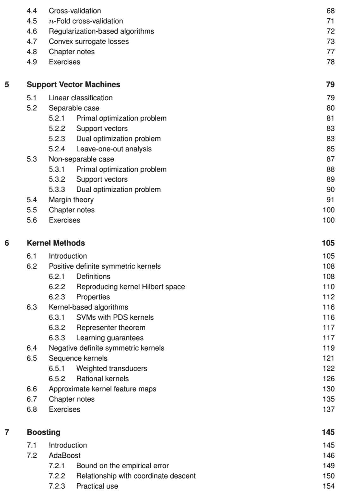

# 十四年的 NYU 教学精华，开放书《机器学习基础》第二版可以下载啦

> 原文：[`mp.weixin.qq.com/s?__biz=MzA3MzI4MjgzMw==&mid=2650762305&idx=2&sn=24793710f3f19f229993b7fa8df7f86e&chksm=871aa83fb06d2129f80ca6123fd73cdf927dfa45d80cc8858c7c14f9fea445930a2abfdc5b8f&scene=21#wechat_redirect`](http://mp.weixin.qq.com/s?__biz=MzA3MzI4MjgzMw==&mid=2650762305&idx=2&sn=24793710f3f19f229993b7fa8df7f86e&chksm=871aa83fb06d2129f80ca6123fd73cdf927dfa45d80cc8858c7c14f9fea445930a2abfdc5b8f&scene=21#wechat_redirect)

机器之心报道

**作者：思源**

> 从 05 年到 19 年，Mehryar Mohri 在纽约大学已经教过 14 年的 Foundations of Machine Learning 课程。在 2012 年，他就完成了第一版的《机器学习基础》，这本书的数学氛围非常浓厚。2018 年 Mohri 等研究者又完成了第二版，现在第二版及其资料都已经开放下载。

*   书籍主页：https://cs.nyu.edu/~mohri/mlbook/

*   百度云下载地址：https://pan.baidu.com/s/194wEpl5fsyJHKE49uc92pg；提取码: xud2

《机器学习基础》（Foundations of Machine Learning）是对机器学习的通用简介，可作为研究者的参考书和学生的教科书来使用。该书覆盖机器学习领域的基础现代话题，同时提供讨论和算法证明所需的理论基础与概念工具。这本书还介绍了算法应用的多个关键方面。

这本书旨在呈现最新的理论工具和概念，同时提供准确的证明。该书写作风格力求简洁，同时讨论了机器学习领域的一些关键复杂话题，以及多个开放性研究问题。一些经常与其他话题混合的话题以及没有得到足够关注的话题在本书中得到了单独讨论和重视，例如，这本书专门有一个章节讲多类别分类、排序和回归。

这本书覆盖了机器学习领域的大量重要话题，但作者也省略了个别话题，如图模型和流行的神经网络，这是出于简洁性的考虑，以及这些方法暂时缺少一些坚实的理论保证。

**什么样的读者适合读**

这本书针对的读者群体是机器学习、统计学及相关领域的学生和研究者。它可用作机器学习研究生和高年级本科生的教材，或者科研讨论会的参考书。

本书前三四章主要讲理论，为后续章节夯实理论基础。其他章各自独立，第 6 和 13 章除外，第六章介绍了和后面章节有关的一些概念，第十三章和 第十二章关联度很高。每一章的最后都有一系列练习题（附完整答案）。

本书希望读者熟悉线性代数、概率和算法分析。但是，为了进一步帮助到大家，这本书的扩展附录中还包括：对线性代数的概述、凸优化简介、概率论简介、对书中算法分析和讨论有用的一些集中不等式（Concentration inequality），以及信息论简介。

**第二版的小目标**

Mehryar Mohri 等作者的目标是为多个主题和领域提供统一的内容框架，而不是其它书籍采用的专题展示。这些专题书籍只描述某个特殊的视角或主题，例如贝叶斯视角或核方法主题。这本书有比较强的理论基础，证明与分析也会着重强调，因此它相比很多书籍都有较大的差别。

在第二版中，作者们更新了整本书。其主要改变体现在很多章节的写作风格、新的图表可视化、简化的内容与推导过程、对现有章节的一些补充，特别是第六章与第十七章等一些新的章节。此外，作者们新添了完整的章节「模型选择」（第四章），这是非常重要的一个主题，但以前只简要讨论过。

对于第二版的最后，作者在附录中添加了很多新内容，包括线性代数和概率论等数学基础，也包括了信息论等机器学习基础。另外，作者为新章节提供了很多练习题与解决方案，读者也可以做做习题。

**补充资料**

这本书提供了很多材料，其中大多数都是纽约大学 Mehryar Mohri 的课程机器学习基础（Foundations of Machine Learning）提供的。这门课已经开展了 14 年，这本书也是该课程的内容概述。Mehryar Mohri 表示，正因为该课程学生的一些好建议，第二版才能最终出版。

*   课程主页：https://cs.nyu.edu/~mohri/ml18/

该课程主页上有额外的家庭作业、课件和项目等资料，配合书籍使用效果更佳。

**目录**

****本文为机器之心报道，**转载请联系本公众号获得授权****。**

✄------------------------------------------------

**加入机器之心（全职记者 / 实习生）：hr@jiqizhixin.com**

**投稿或寻求报道：**content**@jiqizhixin.com**

**广告 & 商务合作：bd@jiqizhixin.com**