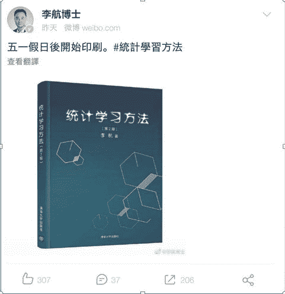

# 李航《统计学习方法》第二版上线，6 年耕耘增加无监督学习（新书赠送）

> 原文：[`mp.weixin.qq.com/s?__biz=MzA3MzI4MjgzMw==&mid=2650761696&idx=1&sn=e748ee422289339ae46201deb8e65042&chksm=871aad9eb06d248850442b161c6a5beada2f979928ecdb1ca184b3f65e1c551580ec764bd8b1&scene=21#wechat_redirect`](http://mp.weixin.qq.com/s?__biz=MzA3MzI4MjgzMw==&mid=2650761696&idx=1&sn=e748ee422289339ae46201deb8e65042&chksm=871aad9eb06d248850442b161c6a5beada2f979928ecdb1ca184b3f65e1c551580ec764bd8b1&scene=21#wechat_redirect)

机器之心报道

**机器之心编辑部**

> 统计学习即机器学习，是计算机及其应用领域的一门重要学科。此前，李航老师完成的《统计学习方法》是了解机器学习最好的教材之一，该书从 2005 年开始写作一直到 2012 年完成，包含了众多主要的监督学习算法与模型。最近，《统计学习方法》第二版正式发布，通过 6 年时间的努力，在第一版的基础上又增加了无监督学习的主要算法与模型。

李航博士告诉机器之心，《统计学习方法》第二版新加了无监督学习方面的内容，并对第一版的监督学习方法做了一些修改。总体而言，第二版可以分为监督学习和无监督学习两篇。从这两大块出发，基本上传统机器学习的主要概念就能一步步掌握了。

具体而言，第一篇介绍了感知机、朴素贝叶斯法、决策树、支持向量机、提升方法、EM 算法、隐马尔可夫模型和条件随机场等算法，它们都是非常经典的监督学习方法。第二篇主要讨论了聚类方法、奇异值分解、主成分分析、潜在语义分析、马尔可夫链蒙特卡罗法和潜在狄利克雷分配等算法，它们都是非常经典的无监督学习方法。

除有关统计学习、监督学习和无监督学习的概论和总结的四章外，每章介绍一种方法。叙述力求从具体问题或实例入手，由浅入深，阐明思路，给出必要的数学推导，便于读者掌握统计学习方法的实质，学会运用。

为满足读者进一步学习的需要，书中还介绍了一些相关研究，给出了少量习题，列出了主要参考文献。

此外，联合清华大学出版社，机器之心将为读者们赠送 10 本新书。感兴趣的读者可留言你的读书感想，或说出你最期待的深度学习或强化学习内容，点赞量最高的 10 位读者将获得赠书。

**站在经典之上的《统计学习方法》**

在第一版中，很多同学会发现整本书的数学气息非常浓厚，大部分算法都给出了推导过程。这些算法都是非常基础与经典的机器学习方法，理解它们需要有比较坚实的数学基础。但是在深度学习时代，这些经典算法被大家关注得比较少，反观常见的深度学习方法与技巧，却不一定有传统方法那样的理论。

在深度学习时代，我们更多的是根据经验、实验和「启发式」方法理解模型。那么，站在经典机器学习之上的《统计学习方法》，又能怎样帮助我们学习前沿的算法与技巧呢？

李航老师表示他会继续写深度学习、强化学习相关的内容，包括前馈神经网络和卷积、循环神经网络等，他也会保留前面几版的数学风格。但是对于传统机器学习与深度学习之间的关系，李航老师表示：「它们两者在技术上是一脉相承的，中间并不可以割裂。」理解经典 ML 的数学原理，也是为前沿 DL 提供新的背景知识或洞见。

李航老师说：「在我面试员工的时候，也会发现这样的问题，大家对深度学习了解得很多，但对传统机器学习了解得非常少。这种现象并不好，例如我们在 TensorFlow 上实现某个模型，然后就直接跑实验，这样对很多基本概念了解得都不够。理想情况下，我们应该更全面地理解机器学习的概念与理论，再做深度学习实践，也就是说对传统 ML 的理解有助于更好地跑 DL 模型。」

当然每一个研究者或开发者的精力都是有限的，因此李航老师表示：「这本书的每一章都是相对比较独立的，大家可以有选择地阅读相关章节。在以后加入深度学习与强化学习后，不同章节也应该是相互独立的。当然还是把这些章节联系起来一起看，这样就能掌握整个脉络和发展。」

此外，尽管深度学习在众多任务上都有极好的效果，但也不能说传统机器学习就没什么用了。李航老师说：「例如在小数据集或简单问题上，SVM 或 GBDT 这些方法在实践中用得还是挺多的，我们对这些基础方法最好有一个深入的理解。」

**正确理解《统计学习方法》的定位**

在第二版的序言中，上面描述到「本书是统计机器学习及相关课程的教学参考书，适用于高等院校文本数据挖掘、信息检索及自然语言处理等的大学生、研究生，也可供从事计算机应用相关的研发人员参考。」

对于书本的整体定位，李航老师说：「这本书的内容本身是最基础的，也就是机器学习领域大家都应该掌握的东西，从这种意义上来说确实是一本入门书籍。但是我并没有从入门的角度写这本书，而是更多地把一些最基本的概念，提纲挈领地整理出来。你也可以认为是从教材的角度来写这些内容，因此这本书适合多次阅读，需要经常查看，而不是看一遍就了事。」

很多读者也会反馈这本书的阅读体验，有的认为数学太多、有的认为数学太少或不够详细等等。李航老师认为，如果没有足够的相关数学知识，那么看这本书会比较吃力。他说：「听到了一些概念，但又不了解细节，想要更详细地从头理解，那么这个时候阅读这本书是合适的。」

这本书比较适合有一定基础的读者，不论是 ML 基础还是数学基础。它不太适合特别入门的初学者，也不太适合概率论、统计学都不太了解的入门者，但这些基础知识可以通过其它课程或教材快速补全，再来学习《统计学习方法》就非常合适了。当然，读者也可以一边阅读《统计学习方法》，一边补全基础知识，这样学习可能效率更高。

**一步步走来的《统计学习方法》**

其实《统计学习方法》第一版内容主要涵盖的是监督学习，为大家提供了极为精炼的介绍。当时，李航博士完成这本书花费了 7 年时间，涵盖了工业上最常见与最实用的各种算法。

如今又经过 6 年写作，第二版上线，增加了经典无监督学习的相关内容。李航博士表示这其中有读者的期待，他也希望这本新书能为大家提供更多的帮助。

而关于如今比较热门的深度学习、强化学习等内容，李航博士可能会在未来的三至四年内加进来，发布新的版本。

「其实跟我当初设想的也不太一样，也是阴差阳错走到这一步。我本来没计划写这么多，就是有读者的期待，还有这本书对大家有一定的帮助，所以下决心之后把深度学习和强化学习也再加上。因为我都是业余时间写的，所以花的时间比较多。」

总体而言，李航老师希望在未来的时间内把深度学习和强化学习写完，希望国内读者在了解机器学习基本方法时，有一本比较完善的参考书籍。李航说：「我知道这本书在工业界参考地比较多，因为我一直在业界工作，站在应用的角度可以了解哪些方法是重要的。」

所以，李航老师最后表示：「我希望《统计学习方法》不仅仅是教材，它还能为业界的工程师提供一些有用的帮助。」

**目录**

《统计学习方法》第二版主要分为两部分，目前在京东和淘宝等平台上已经可以预订了。第一部分的监督学习在内容主题上和第一版基本一致，这里就只展示了大章节标题。第二部分的无监督学习是全新的内容，因此这里展示了更多的细节。

**第一篇监督学习**

*   第一章统计学习及监督学习概论

*   第二章感知机

*   第三章近邻法

*   第四章朴素贝叶斯法

*   第五章决策树

*   第六章逻辑斯谛回归与最大熵模型

*   第七章支持向量机

*   第八章提升方法

*   第九章 EM 算法及其推广

*   第十章隐马尔可夫模型

*   第十一章条件随机场

*   第十二章监督学习方法总结

**第二篇无监督学习**

第十三章无监督学习概论

*   13.1.1 无监督学习基本原理

*   13.1.2 基本问题

*   13.1.3 机器学习三要素

*   13.1.4 无监督学习方法

第十四章聚类方法

*   14.1 聚类的基本概念

*   14.1.1 相似度或距离

*   14.1.2 类或簇

*   14.1.3 类与类之间的距离

*   14.2 层次聚类

*   14.3 k 均值聚类

*   14.3.1 模型

*   14.3.2 策略

*   14.3.3 算法

*   14.3.4 算法特点

*   本章概要

*   继续阅读

*   习题

*   参考文献

第十五章奇异值分解

*   15.1 奇异值分解的定义与性质

*   15.1.1 定义与定理

*   15.1.2 紧奇异值分解与截断奇异值分解

*   15.1.3 几何解释

*   15.1.4 主要性质

*   15.2 奇异值分解的计算

*   15.3 奇异值分解与矩阵近似

*   15.3.1 弗罗贝尼乌斯范数

*   15.3.2 矩阵的优近似

*   15.3.3 矩阵的外积展开式

*   本章概要

*   继续阅读

*   习题

*   参考文献

第十六章主成分分析

*   16.1 总体主成分分析

*   16.1.1 基本想法

*   16.1.2 定义和导出

*   16.1.3 主要性质

*   16.1.4 主成分的个数

*   16.1.5 规范化变量的总体主成分

*   16.2 样本主成分分析

*   16.2.1 样本主成分的定义和性质

*   16.2.2 相关矩阵的特征值分解算法

*   16.2.3 数据局正的奇异值分解算法

*   本章概要

*   继续阅读

*   习题

*   参考文献

第十七章潜在语义分析

*   17.1 单词向量空间与话题向量空间

*   17.1.1 单词向量空间

*   17.1.2 话题向量空间

*   17.2 潜在语义分析算法

*   17.2.1 矩阵奇异值分解算法

*   17.2.2 例子

*   17.3 非负矩阵分解算法

*   17.3.1 非负矩阵分解

*   17.3.2 潜在语义分析模型

*   17.3.3 非负矩阵分解的形式化

*   17.3.4 算法

*   本章概要

*   继续阅读

*   习题

*   参考文献

第十八章概率潜在语义分析

*   18.1 概率潜在语义分析模型

*   18.1.1 基本想法

*   18.1.2 生成模型

*   18.1.3 共现模型

*   18.1.4 模型性质

*   18.2 概率潜在语义分析的算法

*   本章概要

*   继续阅读

*   习题

*   参考文献

第十九章马尔可夫链蒙特卡罗法

*   19.1 蒙特卡罗法

*   19.1.1 随机抽样

*   19.1.2 数学期望估计

*   19.1.3 积分计算

*   19.2 马尔可夫链

*   19.2.1 基本定义

*   19.2.2 离散状态马尔可夫链

*   19.2.3 连续状态马尔可夫链

*   19.2.4 马尔可夫链的性质

*   19.3 马尔可夫链蒙特卡罗法

*   19.3.1 基本想法

*   19.3.2 基本步骤

*   19.3.3 马尔可夫链蒙特卡罗法与统计学习

*   19.4 Metropolis-Hastings 算法

*   19.4.1 基本原理

*   19.4.2 Metropolis-Hastings 算法

*   19.4.3 单分量 Metropolis-Hastings 算法

*   19.5 吉布斯抽样

*   19.5.1 基本原理

*   19.5.2 吉布斯抽样算法

*   19.5.3 抽样计算

*   本章概要

*   继续阅读

*   习题

*   参考文献

第二十章潜在狄利克雷分配

*   20.1 狄利克雷分布

*   20.1.1 分布定义

*   20.1.2 共轭先验

*   20.2 潜在狄利克雷分配模型

*   20.2.1 基本想法

*   20.2.2 模型定义

*   20.2.3 概率图模型

*   20.2.4 随机变量序列的可交换性

*   20.2.5 概率公式

*   20.3 LDA 的吉布斯抽样算法

*   20.3.1 基本想法

*   20.3.2 算法的主要部分

*   20.3.3 算法的后处理

*   20.3.4 算法

*   20.4 LDA 的变分 EM 算法

*   20.4.1 变分推理

*   20.4.2 变分 EM 算法

*   20.4.3 算法推导

*   20.4.4 算法总结

*   本章概要

*   继续阅读

*   习题

*   参考文献

第二十一章 PageRank 算法

*   21.1 PageRank 的定义

*   21.1.1 基本想法

*   21.1.2 有向图和随机游走模型

*   21.1.3 PageRank 的基本定义

*   21.1.4 PageRank 的一般定义

*   21.2 PageRank 的计算

*   21.2.1 迭代算法

*   21.2.2 幂法

*   21.3.3 代数算法

*   本章概要

*   继续阅读

*   习题

*   参考文献

第二十二章无监督学习方法总结

*   22.1 无监督学习方法的关系和特点

*   22.1.1 各种方法之间的关系

*   22.1.2 无监督学习方法

*   22.1.3 基础及其学习方法

*   22.2 话题模型之间的关系和特点

*   参考文献

附录 A 梯度下降法

附录 B 牛顿法和拟牛顿法

附录 C 拉格朗日对偶性

附录 D 矩阵的基本子空间

附录 E KL 散度的定义和狄利克雷分布的性质

索引

****本文为机器之心报道，**转载请联系本公众号获得授权****。**

✄------------------------------------------------

**加入机器之心（全职记者 / 实习生）：hr@jiqizhixin.com**

**投稿或寻求报道：**content**@jiqizhixin.com**

**广告 & 商务合作：bd@jiqizhixin.com**