# 学它！李航《统计学习方法》课件，清华大学深圳研究院教授制作

> 原文：[`mp.weixin.qq.com/s?__biz=MzA3MzI4MjgzMw==&mid=2650773920&idx=2&sn=af25fc911fc2d6ec644210b9f402d985&chksm=871a5ddeb06dd4c8eea29554ff4a8cbe0c4ea0226aa2adb98a0fe187219658a0ab73bc18fbe9&scene=21#wechat_redirect`](http://mp.weixin.qq.com/s?__biz=MzA3MzI4MjgzMw==&mid=2650773920&idx=2&sn=af25fc911fc2d6ec644210b9f402d985&chksm=871a5ddeb06dd4c8eea29554ff4a8cbe0c4ea0226aa2adb98a0fe187219658a0ab73bc18fbe9&scene=21#wechat_redirect)

机器之心整理

**参与：张倩、**丽慧****

> 李航老师的《统计学习方法》是了解机器学习最好的教材之一，该书从 2005 年开始写作，一直到 2012 年完成，今年 5 月份又上线了第二版。最新版本包含众多主要的监督和无监督学习算法与模型，可以说是机器学习的入门宝典。许多机器学习培训班、互联网企业的面试、笔试题目都参考这本书。为了让大家更加系统、高效地学习这本书，作者李航博士推荐了清华大学深圳研究院袁春教授制作的相关课件，学习者可以免费下载。

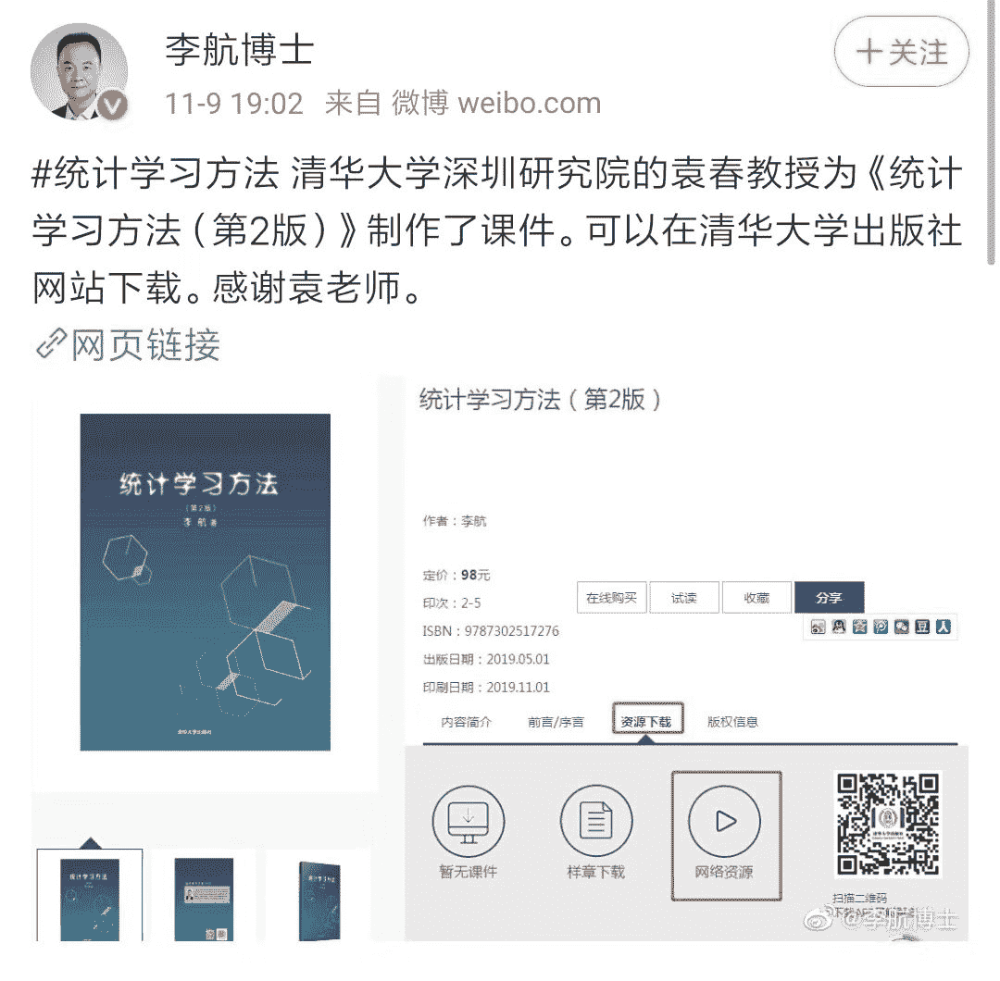李航是日本东京大学计算机科学博士，曾任微软亚洲研究院高级研究员及主任研究员、华为诺亚方舟实验室首席科学家，现任字节跳动人工智能实验室总监。他的研究方向包括信息检索、自然语言处理、统计机器学习及数据挖掘等。《统计学习方法》（第 2 版）全面系统地介绍了统计学习的主要方法，分为监督学习和无监督学习两篇。第一篇介绍了感知机、朴素贝叶斯法、决策树、支持向量机、提升方法、EM 算法、隐马尔可夫模型和条件随机场等算法，都是非常经典的监督学习方法。第二篇主要讨论了聚类方法、奇异值分解、主成分分析、潜在语义分析、马尔可夫链蒙特卡罗法和潜在狄利克雷分配等算法，都是非常经典的无监督学习方法。除有关统计学习、监督学习和无监督学习的概论和总结的四章外，每章介绍一种方法。叙述力求从具体问题或实例入手，由浅入深，阐明思路，给出必要的数学推导，便于读者掌握统计学习方法的实质，学会运用。为满足读者进一步学习的需要，书中还介绍了一些相关研究，给出了少量习题。作为最好的机器学习教材之一，《统计学习方法》成为国内很多高校机器学习相关专业的理想教材，清华大学便是其中之一。袁春教授在清华大学主要讲授「计算机视觉」、「大数据机器学习」等课程，《统计学习方法》被选为「大数据机器学习」课程的主要教材，课件也围绕本书展开。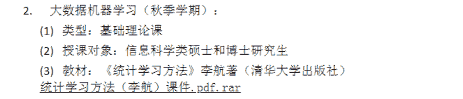**课件内容总览****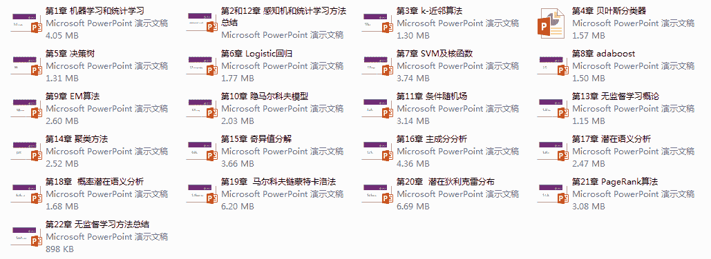**课件下载链接：https://pan.baidu.com/s/1HUw0MeBD-1LP-r441oykhw 课件总共 22 章，与书籍目录分别对应，前 12 章为监督学习部分，对比第 1 版在监督学习方法上进行了一些修改，但出入不大。13 章-22 章为新增的无监督学习部分，这里将做更详细的内容介绍。第一章的课件主要对机器学习的概念、学术资源、发展历程、期刊会议等基础知识进行了总体概括，并指出了机器学习和统计学习之间的关联与差异，介绍了统计学习道路上的一些基础知识，包括方法分类、模型、策略、算法等。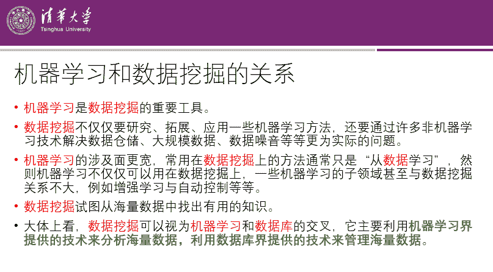除此之外，第二章直到第十三章以前的内容，与上一版内容基本一致，此处仅介绍课件标题，内容详情可通过链接下载查看。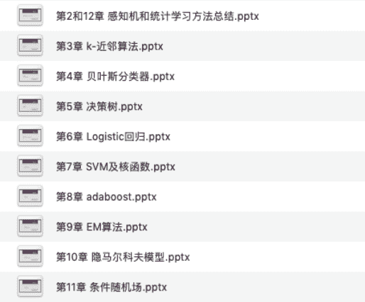从第十三章开始，就是《统计学习方法》第 2 版中新增的无监督学习部分，读过的人都说好。第十三章是无监督学习概论，介绍了无监督学习的基本原理和基本问题，以及无监督学习的三要素和学习方法，有着提纲契领的作用，一些重点内容在后面还会有单独的课件讲述。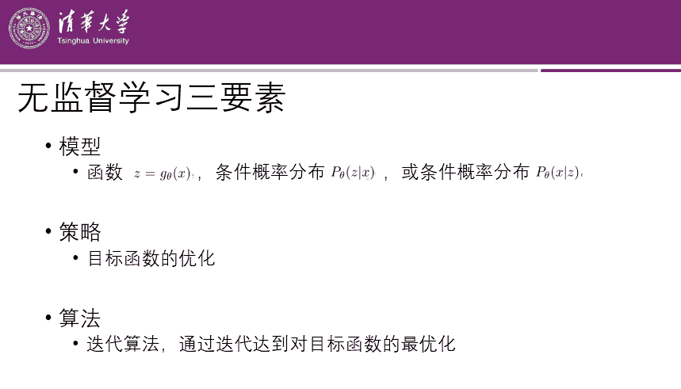第十四章是聚类方法，讲了「什么是聚类」、「相似度或距离」、「类或簇」、「类与类之间的距离」、「层次聚类」等等与「类」各种相关的知识。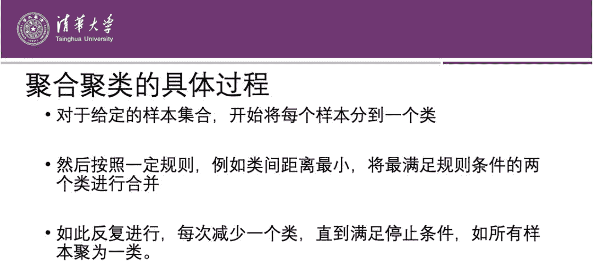第十五章讲的是奇异值分解，从定义开始，大概花了 20 页来讲解奇异值分解基本定理，之后还有奇异值分解的计算、矩阵的最优近似、矩阵的外积展开式等等。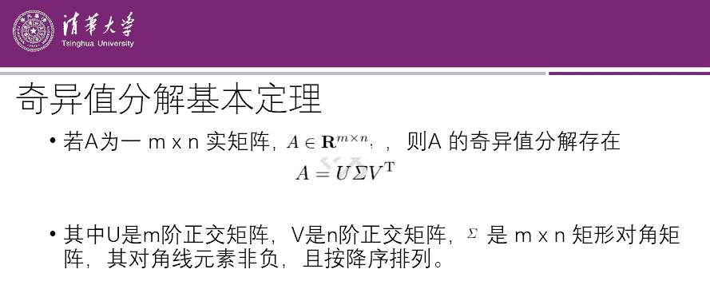第十六章是主成分分析，是一种常用的无监督学习方法，也是一种数学上用来的降维的常用方法，主要用于发现数据中的基本结构，即数据中变量之间的关系。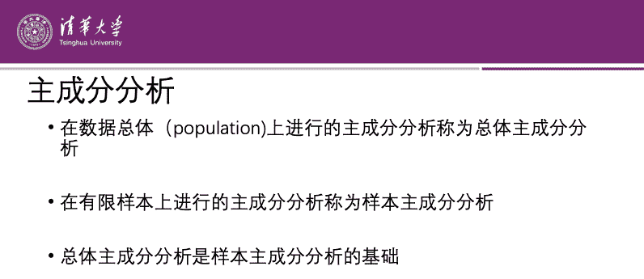第十七章是潜在语义分析，这种分析方法主要通过矩阵分解，发现文本与单词之间的基于话题的语义关系。该方法常用于文本的话题分析。这一章课件对单词向量空间、话题向量空间以及发现文本与单词之间的基于话题的语义关系等概念和方法进行了详细的介绍。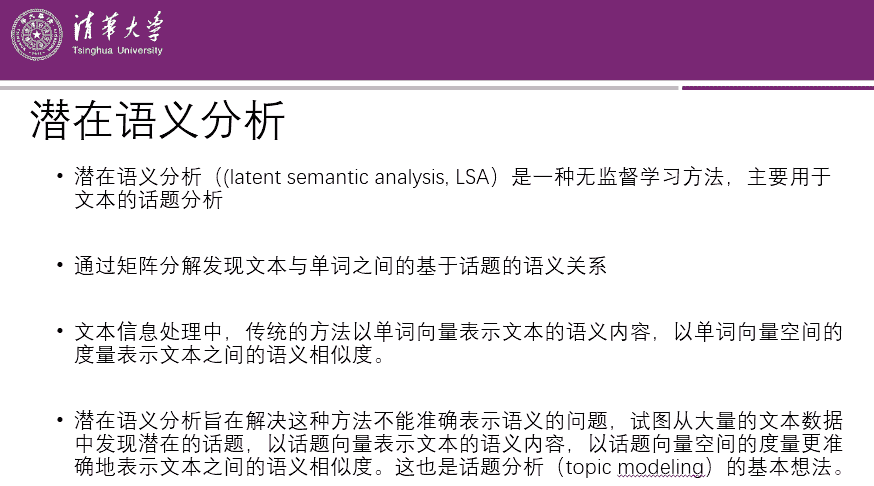第十八章介绍了概率潜在语义分析，这是一种利用概率生成模 型对文本集合进行话题分析的无监督学习方法。课件重点讨论了生成模型、共现模型、模型参数、模型的几何解释、概率潜在语义分析与潜在语义分析的关系等内容。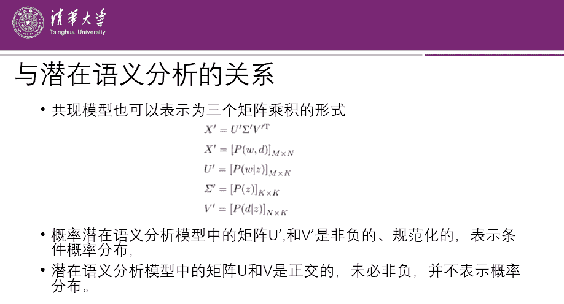第十九章是马尔可夫链蒙特卡罗法，按照蒙特卡罗法→马尔可夫链→马尔可夫链蒙特卡罗法的顺序循序渐进地讲解了马尔可夫链蒙特卡罗法，此外还包括 Metropolis-Hastings 算法（最基本的马尔可夫链蒙特卡罗法）、吉布斯采样（更简单、使用更广泛的马尔可夫链蒙特卡罗法）等方面的详细内容。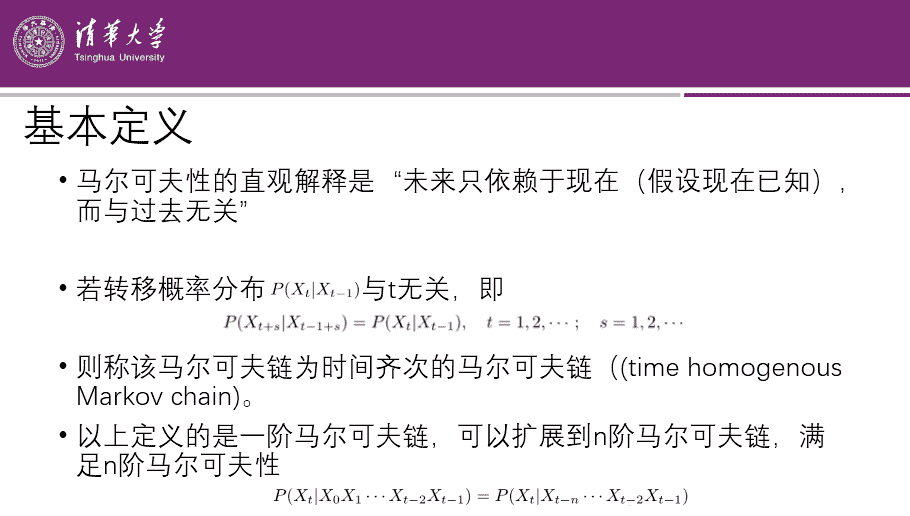第二十章介绍了潜在狄利克雷分配（LDA），包括狄利克雷分布、潜在狄利克雷分配模型、LDA 的变分 EM 算法等内容，内容非常详尽，PPT 超过 100 页。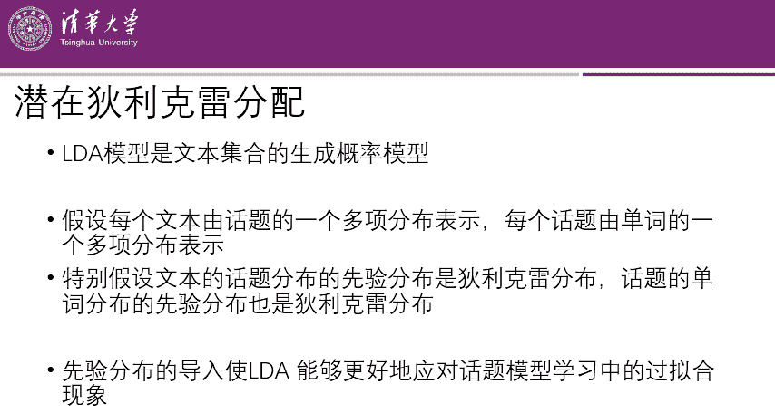第二十一章介绍了 PageRank 算法，包括该算法的基本定义、一般定义、计算方法（迭代算法、幂法、代数算法）等。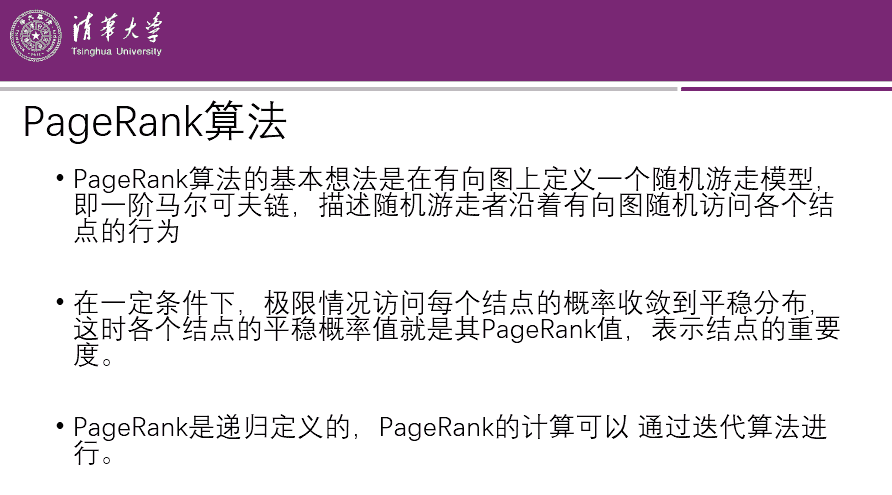课件的最后一章总结了常见的无监督学习方法以及各种方法之间的关系。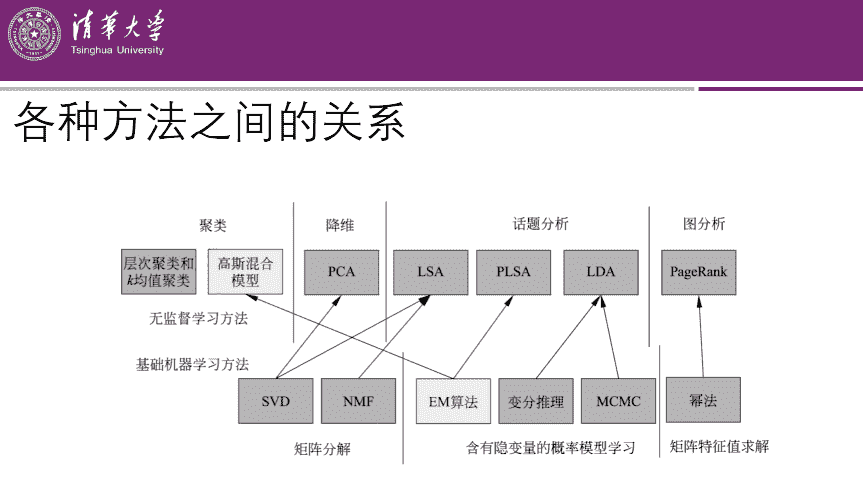

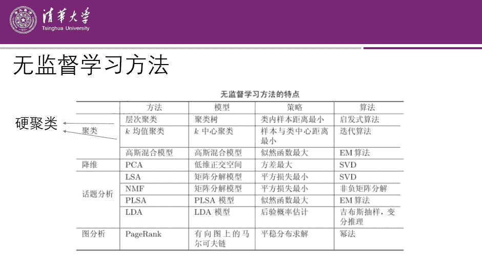

除了这份课件之外，机器之心此前还报道过这本书第一版的[代码实现项目](http://mp.weixin.qq.com/s?__biz=MzA3MzI4MjgzMw==&mid=2650753926&idx=2&sn=7cbdf9f35308370f0c9f4b63e1d95d1c&chksm=871a8ff8b06d06ee8e3bf6b3379ef9f9b5c6e8e1cee6d1385decd252148178096fc7db29e187&scene=21#wechat_redirect)。项目作者在 GitHub 网站搜集了一些代码进行整理，并做了一定的修改，使用 Python3.6 实现了第 1-13 章的课程代码。目前，该项目在 GitHub 上的 star 量已经超过 7800，感兴趣的读者可以参考。*项目地址：**https://github.com/fengdu78/lihang-code*

第三届机器之心**「Synced Machine Intelligence Awards」**年度奖项评选正在进行中。本次评选设置**六大奖项****，**重点关注人工智能公司的产品、应用案例和产业落地情况，基于真实客观的产业表现筛选出最值得关注的企业，为行业带来实际的参考价值。

**参选报名日期**：2019 年 10 月 23 日~2019 年 12 月 15 日**评审期**：2019 年 12 月 16 日~2019 年 12 月 31 日**奖项公布**：2020 年 1 月

点击**阅读原文**，查看更多详情并报名参选。