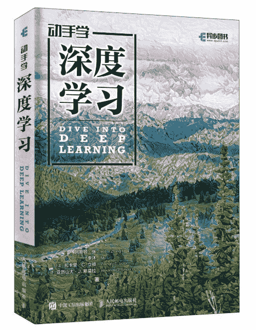
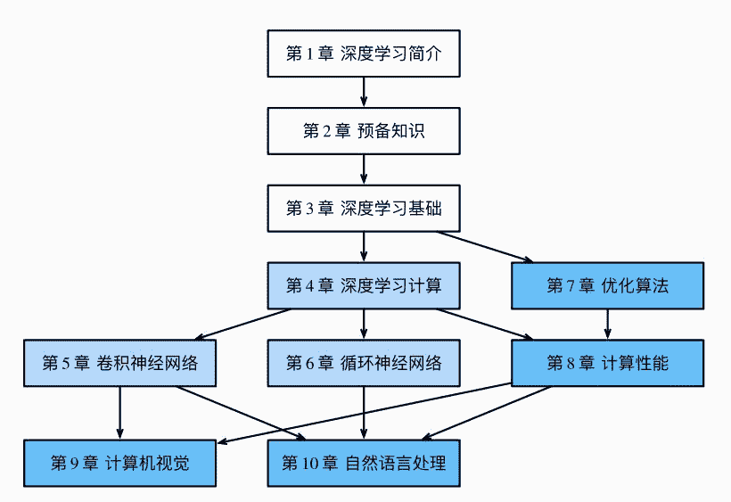
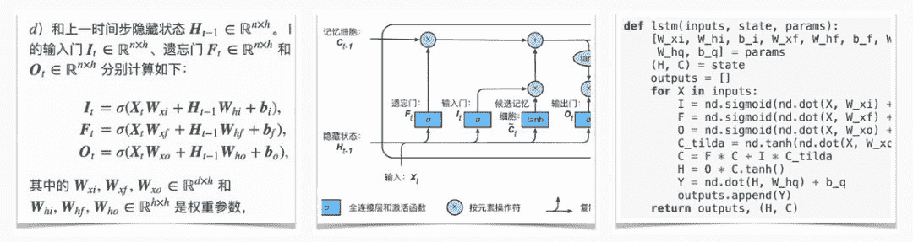
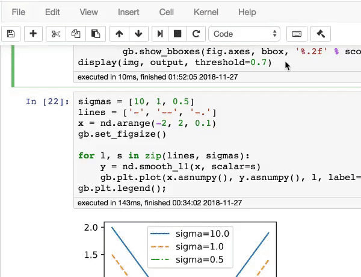
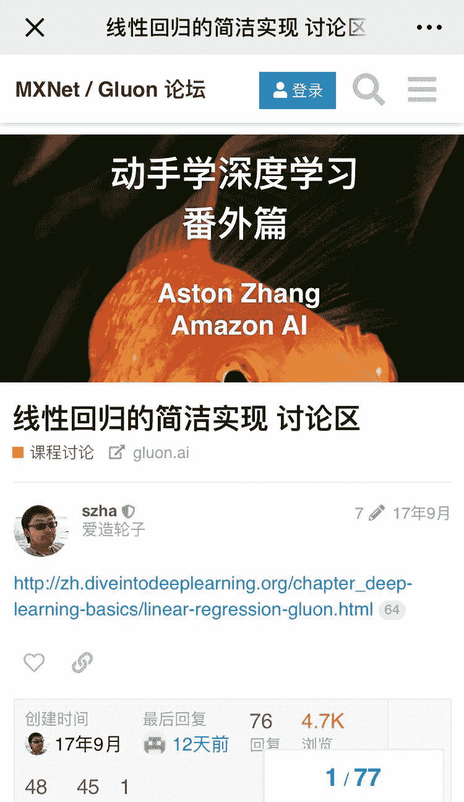
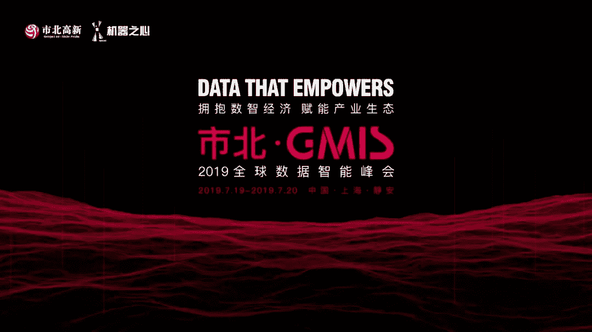

# 实战入门深度学习，李沐中文新书赠送

> 原文：[`mp.weixin.qq.com/s?__biz=MzA3MzI4MjgzMw==&mid=2650765937&idx=3&sn=ad2bba1ff1402b063e019bb87db81040&chksm=871abe0fb06d3719ed8df79e1851d63c0da7e3ea01a9ae855c9116e6be1a6d6ed2fa16efec17&scene=21#wechat_redirect`](http://mp.weixin.qq.com/s?__biz=MzA3MzI4MjgzMw==&mid=2650765937&idx=3&sn=ad2bba1ff1402b063e019bb87db81040&chksm=871abe0fb06d3719ed8df79e1851d63c0da7e3ea01a9ae855c9116e6be1a6d6ed2fa16efec17&scene=21#wechat_redirect)

机器之心报道

**作者：一鸣**

> 2018 年底，机器之心介绍了李沐等人开源的中文书籍《[动手学深度学习](http://mp.weixin.qq.com/s?__biz=MzA3MzI4MjgzMw==&mid=2650752789&idx=3&sn=97ec8d2f293fbe1e090b452514b9da53&chksm=871a836bb06d0a7d9229edb252c0ef883fbe5296cb65f5b005e2d6c00767b1a7e277ea298be7&scene=21#wechat_redirect)》。不久前，该书纸质版上线，机器之心联合人民邮电出版社，向购买机器之心 GMIS 大会门票的读者免费赠送 20 本书籍。

近年来，不论是计算机专业的学生，还是已在科技互联网行业从业多年的技术人员和其他从业者，人们对深度学习的兴趣从未如此高涨。虽然许多深度学习领域的专家学者开设了各种各样的入门课程和教材，但真正系统性梳理这一领域知识、同时能够提供理论讲解和代码实现的书籍屈指可数。此外，由于语言等因素，中文版本的优秀深度学习教材也是凤毛麟角。

之前，亚马逊首席科学家李沐等人曾以电子版的形式在 GitHub 上开源了一本深度学习中文书籍——《动手学深度学习》，这是一本深度学习的入门教程类书籍，其英文版被加州大学伯克利分校的「深度学习导论（STAT 157）」课程采用。2019 年李沐等在加州大学伯克利分校教授深度学习课程时使用了这本教程。目前，该项目在 GitHub 上已获得超过一万颗星，吸引了大量深度学习研究人员、技术人员和学生参与学习、讨论和贡献。最近，该书发布了纸质版，帮助更多对深度学习有兴趣的读者更好地学习。

**作者介绍**

本书的主要作者有四位，分别是：

李沐：亚马逊首席科学家，美国卡内基梅隆大学计算机系博士。

阿斯顿·张：亚马逊应用科学家，美国伊利诺伊大学香槟分校计算机科学博士。

扎卡里 C. 立顿：亚马逊应用科学家，美国卡内基梅隆大学助理教授，加州大学圣迭戈分校计算机科学博士。

亚历山大 J. 斯莫拉：亚马逊副总裁/杰出科学家，德国柏林工业大学计算机科学博士。

此外，本书在开源社区还有 100 余位贡献者。作者在纸质版前言中对所有参与贡献者致谢。

**内容简介**

《动手学深度学习》是一本教材，涵盖了深度学习中大部分的知识点。该书首先介绍深度学习的预备知识和基础知识，然后介绍其中的数学计算理论，之后主要介绍深度学习中的两大重要网络模型——卷积神经网络和循环神经网络。此外，这本书专门提到了优化算法和提升计算性能的方法。最后，该书介绍了深度学习的两个主要应用领域——计算机视觉和自然语言处理。

该书的章节结构见下图：

*该书的结构*

**公式+图示+代码**

本书最大的亮点在于，每一个知识点都由三个部分组成：公式+图示+代码。

公式用于准确地理解深度学习算法的实现细节，图示则从直观的数据层面展示了计算过程，最终的代码部分为读者提供了清晰的程序实现方式。

如图所示：以 LSTM 网络为例，左图为 LSTM 的公式，提供了在每一时间步中输入门、遗忘门等的计算过程；中间的图则表示了 LSTM 单元内部的计算方法；右图则提供了代码实现（基于 MXNet）。

**在 Jupyter Notebook 中学习**

本书的第二个亮点是：所有的纸质版内容和 Jupyter Notebook 无缝衔接。本书提供了 Jupyter 资源库，每一章内容都是一个 Jupyter 笔记本文件。这样一来，只要进入书对应的 Jupyter 笔记本，读者就可以运行对应的代码块，并查看运行结果和图表了。

*本书附带 Jupyter Notebook 资源，读者可根据说明使用 Jupyter Notebook 运行代码。*

**丰富的讨论社群**

由于本书已在 GitHub 社区开源，有百余位参与者共同贡献了其中的内容，因此本书自诞生起便具备开源属性。为了继承开源的传统，方便读者之间进行交流和探讨，纸质版书籍的每一章都附带二维码，读者可以扫码直达 MXNet 的 Gluon 讨论区，和其他读者一起参与课程讨论。

*书中每个章节都设有讨论区。*

**书籍目录**

*   引言

*   前言

*   深度学习简介

*   如何使用本书

*   预备知识

*   获取和运行本书代码

*   数据操作

*   自动求梯度

*   查阅 MXNet 文档

*   深度学习基础

*   线性回归

*   线性回归的从零开始实现

*   线性回归的 Gluon 实现

*   Softmax 回归

*   图像分类数据集（Fashion-MNIST）

*   Softmax 回归的从零开始实现

*   Softmax 回归的 Gluon 实现

*   多层感知机

*   多层感知机的从零开始实现

*   多层感知机的 Gluon 实现

*   模型选择、欠拟合和过拟合

*   权重衰减

*   丢弃法

*   正向传播、反向传播和计算图

*   数值稳定性和模型初始化

*   实战 Kaggle 比赛：房价预测

*   深度学习计算

*   模型构造

*   模型参数的访问、初始化和共享

*   模型参数的延后初始化

*   自定义层

*   读取和存储

*   GPU 计算

*   卷积神经网络

*   二维卷积层

*   填充和步幅

*   多输入通道和多输出通道

*   池化层

*   卷积神经网络（LeNet）

*   深度卷积神经网络（AlexNet）

*   使用重复元素的网络（VGG）

*   网络中的网络（NiN）

*   含并行连结的网络（GoogLeNet）

*   批量归一化

*   残差网络（ResNet）

*   稠密连接网络（DenseNet）

*   循环神经网络

*   语言模型

*   循环神经网络

*   语言模型数据集（周杰伦专辑歌词）

*   循环神经网络的从零开始实现

*   循环神经网络的 Gluon 实现

*   通过时间反向传播

*   门控循环单元（GRU）

*   长短期记忆（LSTM）

*   深度循环神经网络

*   双向循环神经网络

*   优化算法

*   优化与深度学习

*   梯度下降和随机梯度下降

*   小批量随机梯度下降

*   动量法

*   Adagrad

*   RMSProp

*   Adadelta

*   Adam

*   计算性能

*   命令式和符号式混合编程

*   异步计算

*   自动并行计算

*   多 GPU 计算

*   多 GPU 计算的 Gluon 实现

*   计算机视觉

*   图像增广

*   微调

*   目标检测和边界框

*   锚框

*   多尺度目标检测

*   目标检测数据集（皮卡丘）

*   单发多框检测（SSD）

*   区域卷积神经网络（R-CNN）系列

*   语义分割和数据集

*   全卷积网络（FCN）

*   样式迁移

*   实战 Kaggle 比赛：图像分类（CIFAR-10）

*   实战 Kaggle 比赛：狗的品种识别 (ImageNet Dogs)

*   自然语言处理

*   词嵌入（word2vec）

*   近似训练

*   Word2vec 的实现

*   子词嵌入（fastText）

*   全局向量的词嵌入（GloVe）

*   求近义词和类比词

*   文本情感分类：使用循环神经网络

*   文本情感分类：使用卷积神经网络（textCNN）

*   编码器—解码器（seq2seq）

*   束搜索

*   注意力机制

*   机器翻译

*   附录

*   主要符号一览

*   数学基础

*   使用 Jupyter 笔记本

*   使用 AWS 运行代码

*   GPU 购买指南

*   如何为本书贡献

*   gluonbook 包索引

**如何获赠《动手学深度学习》？**

「市北·GMIS 2019 全球数据智能峰会」将于 7 月 19 日- 20 日在上海市静安区举行。本次峰会以数据智能为主题，力邀全球 30 余位重磅嘉宾，将进行 24 场主题演讲、2 个圆桌论坛、4 个 Session、1 场 AI 画展和「AI00」数据智能榜单发布。

即日起购买「市北·GMIS 2019」大会门票，并在购票时备注「动手学深度学习」，即可获赠一本新书，限量 20 本，按购票时间，送完为止。

**市北·GMIS 2019**全球数据智能峰会于**7 月 19 日-20 日**在上海市静安区举行。本次峰会以**「数据智能」**为主题，聚焦最前沿研究方向，同时更加关注数据智能经济及其产业生态的发展情况，为技术从研究走向落地提供借鉴。

本次峰会设置主旨演讲、主题演讲、AI 画展、「AI00」数据智能榜单发布、闭门晚宴等环节，已确认出席嘉宾如下：

我们为广大学生用户准备了最高优惠的学生票，点击**阅读原文**即刻报名。