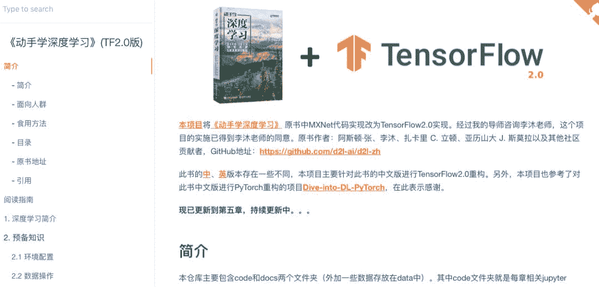

# 全新版本，李沐《动手学深度学习》TF2.0 版本来了

> 原文：[`mp.weixin.qq.com/s?__biz=MzA3MzI4MjgzMw==&mid=2650776025&idx=3&sn=5f9613d74613a765cdc9cf12f5f731ad&chksm=871a65a7b06decb165aa3aebdd2c320f9b5bbb15960e7c4371645f4a31d9f4c5a7fd15d5c626&scene=21#wechat_redirect`](http://mp.weixin.qq.com/s?__biz=MzA3MzI4MjgzMw==&mid=2650776025&idx=3&sn=5f9613d74613a765cdc9cf12f5f731ad&chksm=871a65a7b06decb165aa3aebdd2c320f9b5bbb15960e7c4371645f4a31d9f4c5a7fd15d5c626&scene=21#wechat_redirect)

机器之心整理

**参与：一鸣**

> 还记得李沐老师的《动手学深度学习》吗？近日，该书的 TF2.0 代码复现项目来了。

UC 伯克利李沐的《动手学深度学习》开源书一经推出便广受好评。很多开发者使用了书的内容，并采用各种各样的深度学习框架将其复现。据机器之心所知，现在已有 MXnet（原版）和 PyTorch 版本。近日，《动手学深度学习》书又有了一个新的复现代码版本——TensorFlow2.0 版。这一项目登上了 12 月 9 日的 GitHub 热榜，一天获得了百星。项目地址：https://github.com/TrickyGo/Dive-into-DL-TensorFlow2.0 项目作者表示，该项目是基于中文版的书进行的更新和重构，在代码上参考了 PyTorch 版本。目前该项目已更新到第五章，仍在继续更新。本项目主要两位作者来自北大软件和微电子学院。项目已获得李沐老师本人同意。**TF2.0 版的《动手学》怎么样**本项目包括 code 和 doc 两个文件夹。其中 code 保存了 Jupyter 格式的代码，而 doc 则是 md 格式的书籍文件。由于原书使用的是 MXnet，因此代码和文本略有不同。**书籍内容展示**考虑到 md 格式对公式的展示不太优秀，作者使用 docsify (https://docsify.js.org/#/zh-cn/) 将文本转到了 GitHub pages 上，你可以像浏览网页那样阅读全书。网页展示地址：https://trickygo.github.io/Dive-into-DL-TensorFlow2.0从网页来看，目前确实更新到了第五章，但是考虑到这是一个小团队做的代码重构工作，能完成这么多实属不易。**代码展示**在书中，代码和文本是穿插进行了，因此可以一边读书一边写代码复现，还可以随时随地检查结果。以「构建 MLP 网络」为例，作者提供了最 Python 的复现方法——为模型定义一个类，并继承 tf.keras.Model 的基类。在 TF2.0 的代码中，这是一种较为稳妥的方法。当然，也有这样较为简单的实现代码。总之，代码非常简洁易懂。**全书目录**和之前机器之心介绍过的一样，这里提供全书目录，供读者参考。

*   简介

*   阅读指南

*   1\. 深度学习简介

*   2\. 预备知识

*   2.1 环境配置
*   2.2 数据操作
*   2.3 自动求梯度
*   2.4 查阅文档

*   3\. 深度学习基础

*   3.1 线性回归

*   3.2 线性回归的从零开始实现

*   3.3 线性回归的简洁实现

*   3.4 softmax 回归

*   3.5 图像分类数据集（Fashion-MNIST）

*   3.6 softmax 回归的从零开始实现

*   3.7 softmax 回归的简洁实现

*   3.8 多层感知机

*   3.9 多层感知机的从零开始实现

*   3.10 多层感知机的简洁实现

*   3.11 模型选择、欠拟合和过拟合

*   3.12 权重衰减

*   3.13 丢弃法

*   3.14 正向传播、反向传播和计算图

*   3.15 数值稳定性和模型初始化

*   3.16 实战 Kaggle 比赛：房价预测

*   4\. 深度学习计算

*   4.1 模型构造

*   4.2 模型参数的访问、初始化和共享

*   4.3 模型参数的延后初始化

*   4.4 自定义层

*   4.5 读取和存储

*   4.6 GPU 计算

*   5\. 卷积神经网络

*   5.1 二维卷积层

*   5.2 填充和步幅

*   5.3 多输入通道和多输出通道

*   5.4 池化层

*   5.5 卷积神经网络（LeNet）

*   5.6 深度卷积神经网络（AlexNet）

*   5.7 使用重复元素的网络（VGG）

*   5.8 网络中的网络（NiN）

*   5.9 含并行连结的网络（GoogLeNet）

*   5.10 批量归一化

*   5.11 残差网络（ResNet）

*   5.12 稠密连接网络（DenseNet）

*   6\. 循环神经网络

*   6.1 语言模型

*   6.2 循环神经网络

*   6.3 语言模型数据集（周杰伦专辑歌词）

*   6.4 循环神经网络的从零开始实现

*   6.5 循环神经网络的简洁实现

*   6.6 通过时间反向传播

*   6.7 门控循环单元（GRU）

*   6.8 长短期记忆（LSTM）

*   6.9 深度循环神经网络

*   6.10 双向循环神经网络

*   7\. 优化算法

*   7.1 优化与深度学习

*   7.2 梯度下降和随机梯度下降

*   7.3 小批量随机梯度下降

*   7.4 动量法

*   7.5 AdaGrad 算法

*   7.6 RMSProp 算法

*   7.7 AdaDelta 算法

*   7.8 Adam 算法

*   8\. 计算性能

*   8.1 命令式和符号式混合编程

*   8.2 异步计算

*   8.3 自动并行计算

*   8.4 多 GPU 计算

*   9\. 计算机视觉

*   9.1 图像增广

*   9.2 微调

*   9.3 目标检测和边界框

*   9.4 锚框

*   9.5 多尺度目标检测

*   9.6 目标检测数据集（皮卡丘）

*   待更新...

*   10\. 自然语言处理

*   10.1 词嵌入（word2vec）

*   10.2 近似训练

*   10.3 word2vec 的实现

*   10.4 子词嵌入（fastText）

*   10.5 全局向量的词嵌入（GloVe）

*   10.6 求近义词和类比词

*   10.7 文本情感分类：使用循环神经网络

*   10.8 文本情感分类：使用卷积神经网络（textCNN）

*   10.9 编码器—解码器（seq2seq）

*   10.10 束搜索

*   10.11 注意力机制

*   10.12 机器翻译

**怎样使用这一项目**作者在项目介绍中提供了两种使用方法，你可以从网页上阅读全书和配套代码，并一步一步跟着复现。当然，还有另一种本地浏览的方法。具体而言，你需要首先安装 docify-cli 工具：

```py
npm i docsify-cli -g 
```

接着将本项目 clone 到本地并进入目录：

```py
git clone https://github.com/TrickyGo/Dive-into-DL-TensorFlow2.0
cd Dive-into-DL-TensorFlow2.0 
```

然后可以运行一个本地服务器，你可以在浏览器中输入 http://127.0.0.1:3000，然后就可以实时访问文档并查看渲染效果了。

```py
docsify serve docs 
```

**[机器之心「SOTA 模型」](http://mp.weixin.qq.com/s?__biz=MzA3MzI4MjgzMw==&mid=2650770891&idx=1&sn=25bde35991047a997337c8dd25350089&chksm=871a49b5b06dc0a36fc3407e3643550ef97f72b007e67c4f4be250bfd60c9fdc5389624569c0&scene=21#wechat_redirect)****：****22****大领域、127 个任务，机器学习 SOTA 研究一网打尽。**

****