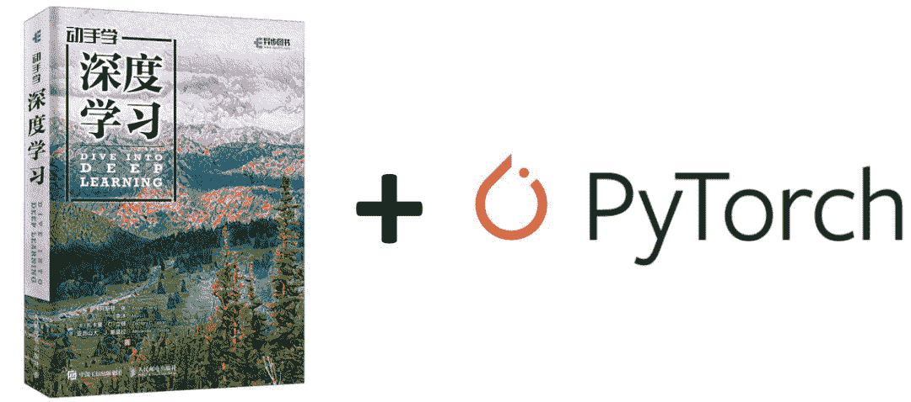
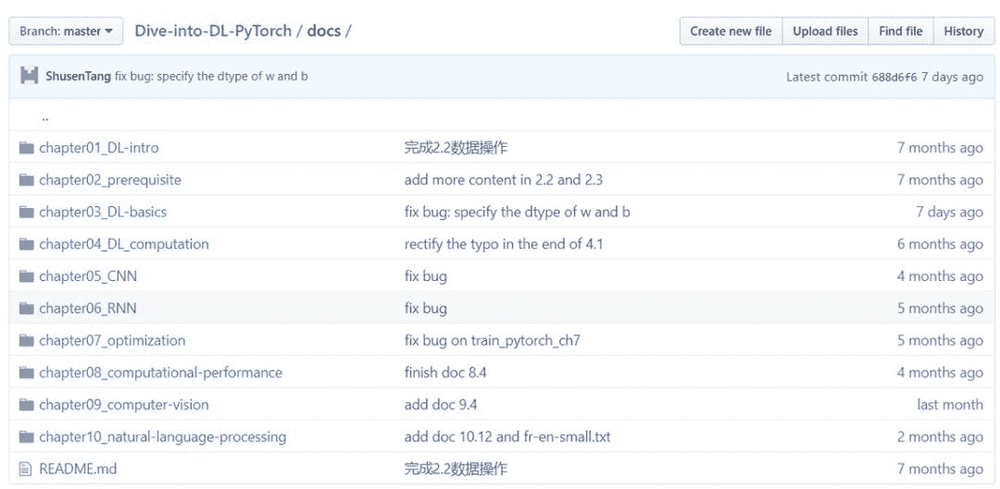
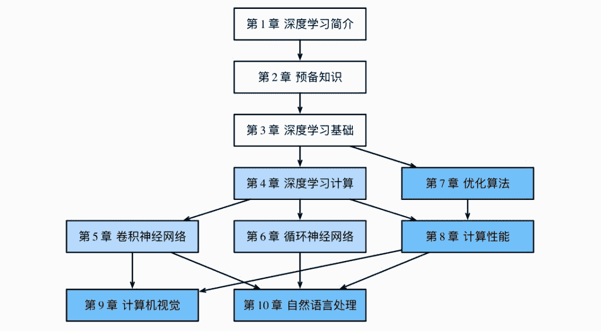
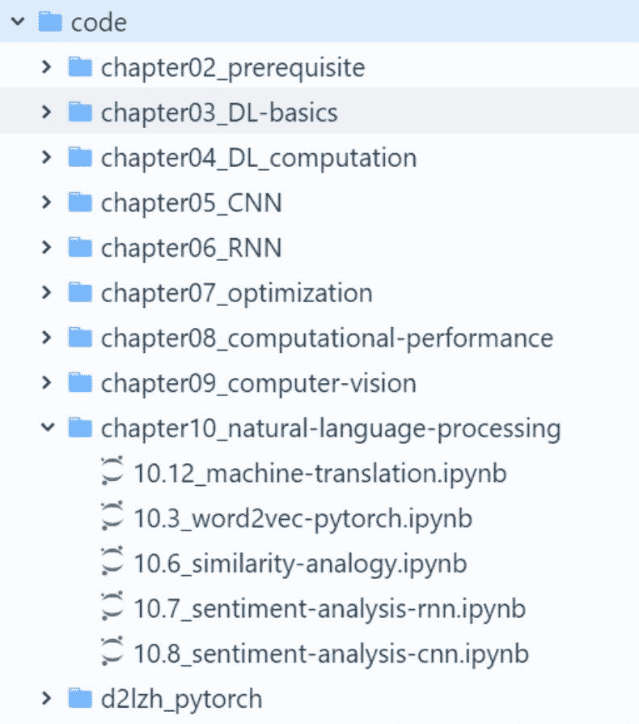
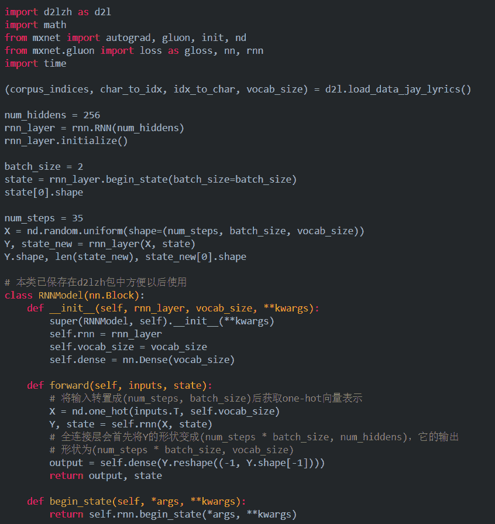
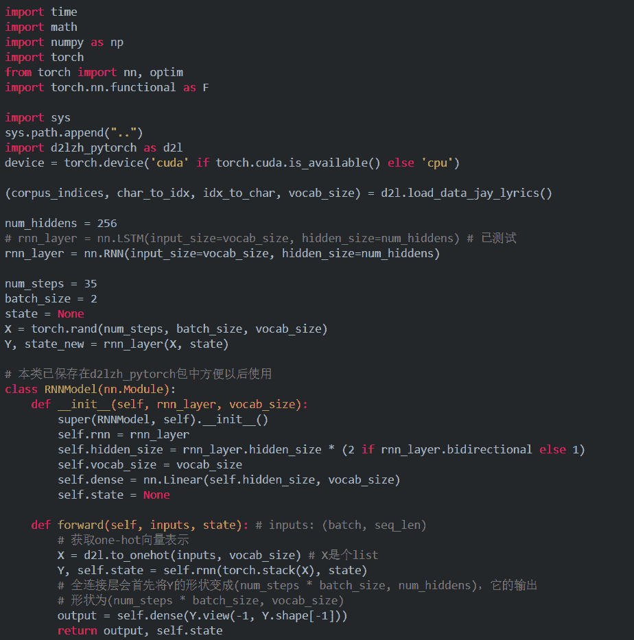

# PyTorch 版《动手学深度学习》开源了，最美 DL 书遇上最赞 DL 框架

> 原文：[`mp.weixin.qq.com/s?__biz=MzA3MzI4MjgzMw==&mid=2650770115&idx=2&sn=4f50bfdfaaa58245c22c2a069940e910&chksm=871a4ebdb06dc7ab025366335198dc9d86f8ae5bb5838ca6f02b90452251274f0da701908404&scene=21#wechat_redirect`](http://mp.weixin.qq.com/s?__biz=MzA3MzI4MjgzMw==&mid=2650770115&idx=2&sn=4f50bfdfaaa58245c22c2a069940e910&chksm=871a4ebdb06dc7ab025366335198dc9d86f8ae5bb5838ca6f02b90452251274f0da701908404&scene=21#wechat_redirect)

机器之心报道

**项目作者：ShusenTang**

**参与：思**

> 想要入门最前沿的深度学习，想要玩最常见的深度学习框架？那就用 PyTorch 版的《动手学深度学习》吧，零基础也能入门 DL。

李沐等人的开源中文书《动手学深度学习》现在有 PyTorch 版实现了。不论是原书中的示例代码，还是实战项目，原来的 MXNet 都可以无缝转化到 PyTorch 代码。项目作者在保持原书内容基本不变的情况下，将 MXNet 代码都转换为了 PyTorch，想要学习 DL 和 PyTorch 的小伙伴们可以试试啊。

*   项目地址：https://github.com/ShusenTang/Dive-into-DL-PyTorch

近年来，不论是计算机专业的学生，还是已在科技互联网行业从业多年的技术人员和其他从业者，人们对深度学习的兴趣从未如此高涨。但是，由于语言等因素，中文版本的优秀深度学习教材也是凤毛麟角。之前，亚马逊首席科学家李沐等人曾以电子版的形式在 GitHub 上开源了一本深度学习中文书籍——《动手学深度学习》，这是一本深度学习的入门教程类书籍。其英文版被 UC 伯克利「深度学习导论（STAT 157）」课程采用，2019 年李沐等在教授深度学习课程时也使用了这本教程。

*   中文版开源地址：https://github.com/d2l-ai/d2l-zh

目前，该项目在 GitHub 上已获得超过 1.1 万星，并且中文版电子书还发布了纸质版书籍。不过虽然书籍非常优秀，但还是有一些读者不太习惯用 Gluon 来写代码，毕竟开源项目大部分都是 TF 或 PyTorch 写的。现在好了，我们可以直接结合书籍内容和 PyTorch 框架，更深入地理解 DL。**项目怎么样**项目作者表示，该仓库主要包含 code 和 docs 两个文件夹。其中 code 文件夹就是每章相关 jupyter notebook 代码（基于 PyTorch）；docs 文件夹就是 markdown 格式的《动手学深度学习》书中的相关内容，它也是基于 PyTorch 的。由于原书内容使用的是 MXNet 框架，所以 docs 内容可能与原书略有不同，但是整体内容是一样的。如下所示为 docs 目录下的文档，它一共包含十章，大部分内容已经非常完整了，即 1-8 章和第十章，只有第九章计算机视觉还在继续补全中。

其实新项目的内容结构与组织方式和原书是一样的，上面展示的 docs 目录主要可以分为三部分：基础知识（1-3 章）、现代深度学习技术（4-6 章）、计算性能与应用（7-10）。如下所示为全书不同章节的主题与依赖关系，箭头表示上一章有助于理解下一章。除了内容，另一大部分就是实战代码了，随书代码基本都转化为了 PyTorch，它如同原书一样也是用 Jupyter Notebook 写的，这样更好地展示代码与文字解释。因为 GitHub 加载 Jupyter Notebook 挺慢的，所以最好还是下到本地查阅。最后，《动手学深度学习》与 PyTorch 也是非常好的搭档，也就是说我们不需要任何机器学习或深度学习背景知识，只需要了解基本数学与 Python 编程就可以了。

**从 MXNet 到 PyTorch**

这样看起来可能不太直观，我们可以通过两个案例看看原版《动手学深度学习》随书代码和 PyTorch 版之间的区别。如果我们抽取使用循环神经网络构建语言模型的分布代码，就能看看原版 Gluon 和新版 PyTorch 之间的区别。如下是原书采用 RNN 建模语言模型的部分代码（原书 6.5 章），我们主要抽取了模型定义部分：如上可以改写为对应的 PyTorch 代码，它们的风格虽然都非常简洁，但还是有一些不同的。********本****文为机器之心报道，**转载请联系本公众号获得授权****。**
✄------------------------------------------------**加入机器之心（全职记者 / 实习生）：hr@jiqizhixin.com****投稿或寻求报道：**content**@jiqizhixin.com****广告 & 商务合作：bd@jiqizhixin.com**