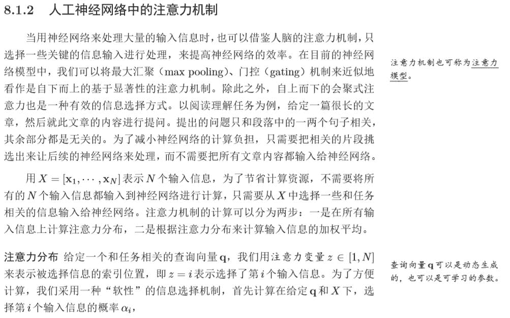

# 开放下载！复旦大学邱锡鹏教授发布教科书《神经网络与深度学习》

> 原文：[`mp.weixin.qq.com/s?__biz=MzA3MzI4MjgzMw==&mid=2650760037&idx=1&sn=9c5a6e22c324430e7f796e146d107361&chksm=871aa71bb06d2e0d2df715c8146f6bc751e4ed14b541f2053208bbc7b6fcedb8002107ef146e&scene=21#wechat_redirect`](http://mp.weixin.qq.com/s?__biz=MzA3MzI4MjgzMw==&mid=2650760037&idx=1&sn=9c5a6e22c324430e7f796e146d107361&chksm=871aa71bb06d2e0d2df715c8146f6bc751e4ed14b541f2053208bbc7b6fcedb8002107ef146e&scene=21#wechat_redirect)

机器之心报道

**书籍作者：邱锡鹏**

**机器之心编辑部**

> 从 2016 到 2019，根据多年教学和研究经验，邱锡鹏教授完成了深度学习教科书《神经网络与深度学习》！目前这本教科书的全书内容、习题和 PPT 资源都已经开放。

邱老师昨天就在知乎发布了这本书：「整本书终于写完了，虽然还有很多不足。但先告一段落，不然就得无限期拖延下去。感谢众多热心网友的意见和建议。全书的内容可以从这里（https://nndl.github.io/）下载。个人能力有限，书中难免有不当和错误之处，还望读者海涵和指正，不胜感激。」

*   知乎地址：https://zhuanlan.zhihu.com/p/61591812

*   随书练习题：https://github.com/nndl/exercise

总体而言，这本书从基础到研究前沿介绍了深度学习的核心概念与理论。我们不仅能了解到全连接、卷积和循环等基本深度神经网络网络，同时还能学习到前沿的 Transformer 等模型，当然所需的数学基础在附录也都是有提供的。这本 446 页的深度学习开放教科书，足够我们了解 DL 的前前后后。

邱老师是复旦大学计算机科学技术学院的副教授与博士生导师，他目前主要从事自然语言处理、深度学习等方向的研究，在 ACL、EMNLP、AAAI、IJCAI 等计算机学会 A/B 类期刊、会议上发表 50 余篇学术论文。此外，邱老师还是 FudanNLP 的开发者和 FastNLP 的负责人，这两个开源项目都旨在提供更好的 NLP 工具。

邱老师个人主页：https://xpqiu.github.io/

如下我们将截取原书部分内容与练习题，希望其能介绍整体结构与大致内容。作为一本优秀的深度学习中文教科书，它真的值得大家下载与阅读。

**前言**

本书的写作目的是使得读者能够掌握神经网络与深度学习技术的基本原 理，知其然还要知其所以然。全书共 15 章。第一章是绪论，介绍人工智能、机器 学习、深度学习的概要，使读者对相关知识进行全面的了解。第 2、3 章介绍了 机器学习的基础知识。

第 4、5、6 章分别讲述三种主要的神经网络模型：前馈神 经网络、卷积神经网络和循环神经网络。第七章介绍神经网络的优化与正则化方 法。第八章介绍神经网络中的注意力机制和外部记忆。第九章简要介绍了一些无 监督学习方法。第十章中介绍一些和模型独立的机器学习方法：集成学习、协 同学习、自学习、多任务学习、迁移学习、终身学习、小样本学习、元学习等。这些都是目前深度学习的难点和热点问题。

第十一章介绍了概率图模型的基本概 念，为后面的章节进行铺垫。第十二章介绍两种早期的深度学习模型：玻尔兹曼 机和深度信念网络。第十三章介绍最近两年发展十分迅速的深度生成模型：变分自编码器和对抗生成网络。第十四章介绍了深度强化学习的知识。第十五章介绍了 应用十分广泛的序列生成模型。

2015 年复旦大学计算机学院开设了《神经网络与深度学习》课程，当时还 没有关于深度学习的系统介绍。讲好深度学习并不是一件容易的事，课程涉及 知识点非常多并且比较杂乱，也和实践结合十分紧密。作为任课教师，我尝试 将梳理了深度学习的知识体系，并写了一本讲义放在网络上。

虽然现在看起来 当时对深度学习的理解仍然十分粗浅，且讲义存在很多错误，但依然受到了很 多热心网友的反馈和鼓励。2016 年，华章公司的姚蕾编辑多次拜访并希望能将 这个讲义整理成书。一方面被姚蕾编辑的诚意打动，另一方面也确实感到应该 有一本面向在校学生和相关从业人员的关于深度学习的专门书籍，最终有了正 式出版的意愿。

但我依然低估了写书的难度，一方面是深度学习的发展十分迅 速，而自己关于深度学习的认知也不断变化，导致已写好的内容经常需要修改，另一方面是平时的科研工作十分繁忙，很难抽出大段的时间来静心写作，因此 断断续续的写作一直拖延至今。

虽然我自己理想中著书立说的境界是自己在某一个领域有自己的理论体 系，将各式各样的方法都统一到自己的体系下，并可以容纳大多数技术，从新的 角度来重新解释这些技术。本书显然还达不到这样的水平，但希望能结合自身 的经验，对神经网络和深度学习的相关知识进行总结、梳理，通过写书这一途 径，也使得自己更加能够深入理解深度学习这一领域，并提高自己的理论水平。

简要目录如下：

**第一部分 入门篇**

第一章 绪论

第二章 机器学习概述

第三章 线性模型

**第二部分 基础模型**

第四章 前馈神经网络

第五章 卷积神经网络

第六章 循环神经网络

第七章 网络优化与正则化

第八章 注意力机制与外部记忆

第九章 无监督学习

第十章 模型独立的学习方式

**第三部分 进阶模型**

第十一章 概率图模型

第十二章 深度信念网络

第十三章 深度生成模型

第十四章 深度强化学习

第十五章 序列生成模型

附录 A 线性代数

附录 B 微积分

附录 C 数学优化

附录 D 概率论

附录 E 信息论

当然实际的书籍目录会展示更多的细节，读者可下载原书查阅：

**内容**

对于内容而言，其实是需要读者自己体会的，因此我们截取书籍的一小节内容，读者可拜读拜读。

**随书代码与练习题**

除了提供一些示例代码，例如 PyTorch 或 TensorFlow 的分类回归问题，邱老师还提供了很多练习题，目前主要有第 3、4、5、6、11、14 章的内容。例如在第六章循环神经网络中，其练习题为使用循环神经网络实现唐诗生成任务。

该题目的要求为，补全程序前面的 3 个空和生成诗歌的一段代码，并以「日 、红 、山 、夜 、湖、海 、月」词汇开头生成诗词。

该项目提供了对应的数据和部分代码，我们只需要根据要求填补完全就行了，例如在诗词生成的 TensorFlow 实现中，我们需要补全的模型架构代码为：

其它还有很多练习，包括受限玻尔兹曼机、混合高斯模型、黑白棋游戏（强化学习）和卷积神经网络等等。

最后，这本开放书籍确实很全面，也有很多配套资源，说不定学习小组又可以组织起来了～

