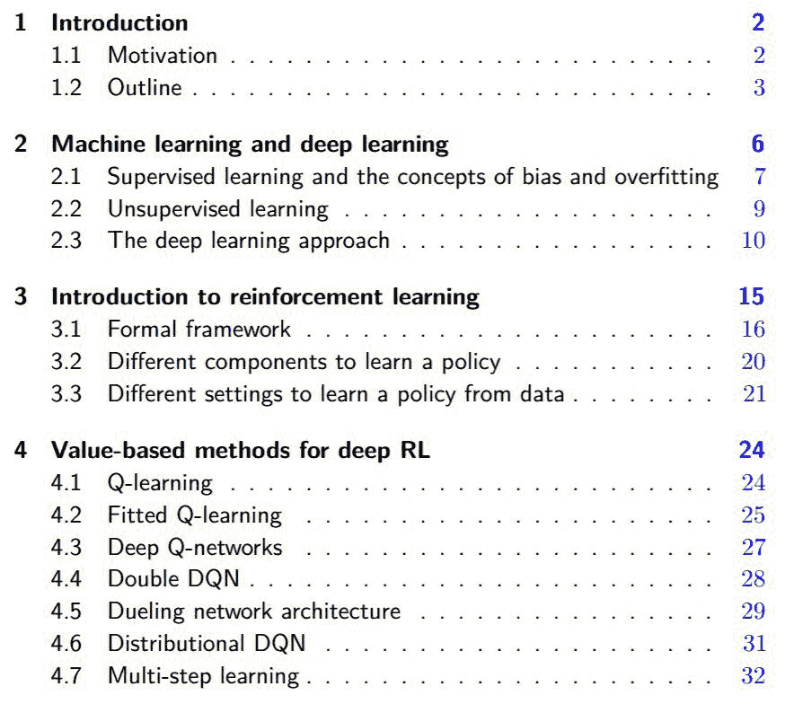
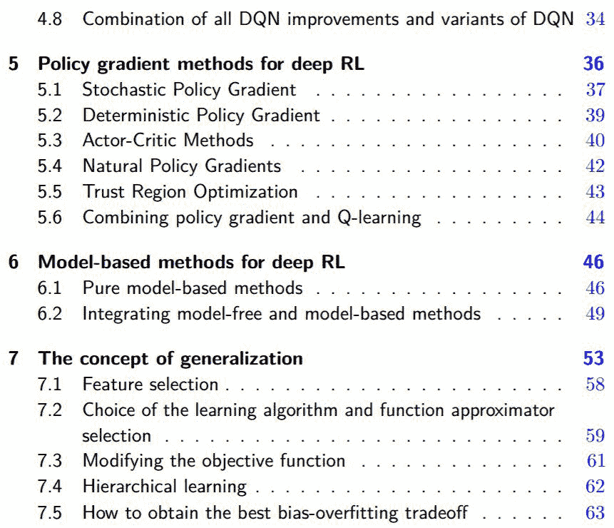
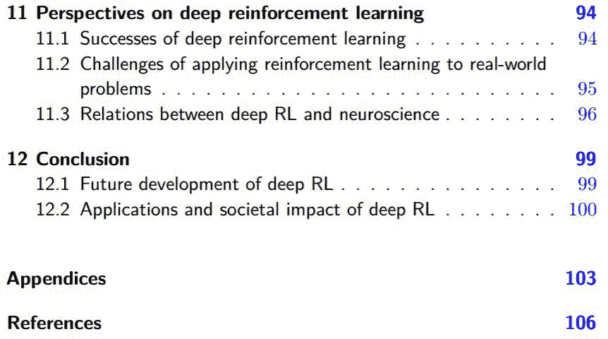
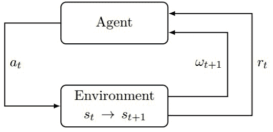
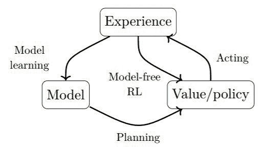
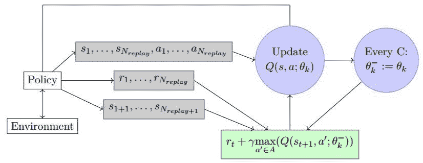
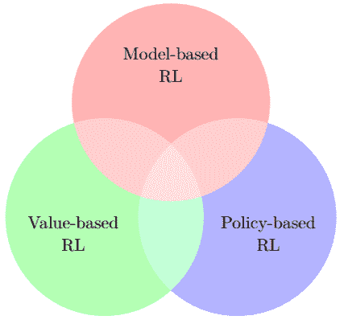

# 「机器学习基础与趋势」系列丛书最新成员：140 页《深度强化学习入门》发布

> 原文：[`mp.weixin.qq.com/s?__biz=MzA3MzI4MjgzMw==&mid=2650756137&idx=4&sn=9b8b3e00a9c0395fda50d76983815dc1&chksm=871a9057b06d1941bd6614114fe749737679dcaf2754c8f48fdd9db6d78689dafcdd6456506c&scene=21#wechat_redirect`](http://mp.weixin.qq.com/s?__biz=MzA3MzI4MjgzMw==&mid=2650756137&idx=4&sn=9b8b3e00a9c0395fda50d76983815dc1&chksm=871a9057b06d1941bd6614114fe749737679dcaf2754c8f48fdd9db6d78689dafcdd6456506c&scene=21#wechat_redirect)

选自 arXiv

**作者：****Vincent Francois-Lavet****等**

**参与：Panda**

> 深度强化学习已经为围棋、视频游戏和机器人等领域带来了变革式的发展，成为了人工智能领域的一大主流研究方向。近日，麦吉尔大学、谷歌大脑和 Facebook 的多位研究者在 arXiv 发布了 140 页的《深度强化学习入门》文稿，对深度强化学习的当前发展和未来趋势进行了系统性的总结和介绍。本书是伯克利知名机器学习专家 Michael Jordan 教授主编的「机器学习基础与趋势」系列丛书中最新加入的一本。机器之心摘取翻译了其中部分内容以呈现本书的结构脉络，更多内容请查阅原文。

本书地址：https://arxiv.org/abs/1811.12560v2

丛书地址：https://www.nowpublishers.com/MAL

**1 引言**

**1.1 动机**

机器学习领域的一大核心主题是序列决策。该任务是在不确定的环境中根据经验决定所要执行的动作序列。序列决策任务涵盖种类广泛的潜在应用，有望对很多领域产生影响，比如机器人、医疗保健、智能电网、金融、自动驾驶汽车等等。

受行为心理学的启发（如 Sutton, 1984），研究者为这一问题提出了一种形式框架，即强化学习（RL）。其主要思想是人工智能体（agent）可以通过与其环境（environment）进行交互来学习，这类似于生物智能体。使用收集到的经历（experience），人工智能体可以根据某种形式的累积奖励（reward）来优化某些目标（objective）。原则上而言，这种方法可应用于任何类型的依赖于过去经历的序列决策问题。对于这样的任务，环境可能是随机的；智能体可能仅能观察有关当前状态的部分信息；观察结果可能是高维的（比如帧和时间序列）；智能体可能会自由地在环境中收集经历；或者相反，数据可能会有所限制（比如，没有准确的模拟器或数据有限）。

过去几年来，由于在解决高难度序列决策问题上所取得的成功，强化学习越来越流行。其中多项成果可归功于强化学习与深度学习技术（LeCun et al., 2015; Schmidhuber, 2015; Goodfellow et al., 2016）的组合。这一组合也被称为「深度强化学习」，在具有高维状态空间的问题中最有用。之前的强化学习方法在特征选择上存在一个困难的设计问题（Munos and Moore, 2002; Bellemare et al., 2013）。但是，由于深度强化学习能够从数据中学到不同层面的抽象，因此其也已经在具有更少先验知识的复杂任务中取得了成功。比如，深度强化学习智能体可以成功学习由成千上万像素构成的视觉感官信号输入（Mnih et al., 2015）。这使得其有可能模拟人类解决问题的某些能力，即使是在高维空间也可以——这在几年前还是难以想象的。

深度强化学习在游戏领域有一些非常突出的成果，包括使用像素输入在 Atari 游戏上达到了超越人类玩家的水平（Mnih et al., 2015）、掌握了围棋（Silver et al., 2016a）、在扑克游戏上击败了顶级职业玩家（Brown and Sandholm, 2017; Moravčik et al., 2017）。深度强化学习也有应用于现实世界应用的潜力，比如机器人（Levine et al., 2016; Gandhi et al., 2017; Pinto et al., 2017）、自动驾驶汽车（You et al., 2017）、金融（Deng et al., 2017）和智能电网（François-Lavet, 2017）。尽管如此，应用深度强化学习算法还面临着一些难题。其中，有效地探索环境以及在稍有不同的环境中泛化出优良行为的能力还不能轻松地获得。因此，根据各种不同的序列决策任务设定，研究者们已经为深度强化学习框架提出了很多算法。

**1.2 大纲 **

这份「深度强化学习入门」的目标是指导读者有效地使用和理解核心的方法，以及提供更深度阅读的索引。在读完这份介绍之后，读者应当能够理解不同的重点深度强化学习方法和算法，并且应该能够应用它们。读者也应该能收获足够的背景知识，以便进一步研读科研文献或从事深度强化学习研究。

第二章将介绍机器学习领域和深度学习方法。目标是提供一个一般的技术背景以及简要解释深度学习在更广泛的机器学习领域中的位置。我们假设读者已经了解了基本的监督学习和无监督学习概念；但我们还是会简要回顾一下这些要点。

第三章将介绍一般的强化学习框架以及马尔可夫决策过程（MDP）的情况。我们将在这样的背景中介绍可用于训练深度强化学习智能体的不同方法。一方面，学习一个价值函数（第四章）和/或策略的直接表征（第五章）属于所谓的「无模型方法」。另一方面，可以使用学习到的环境模型的规划算法属于所谓的「基于模型的方法」（第六章）。

第七章将专门介绍强化学习的「泛化」概念。我们将会讨论基于模型方法和无模型方法中不同元素的重要性：（1）特征选取，（2）函数近似方法选择，（3）修改目标函数和（4）分层学习。在第八章，我们将给出在在线环境中使用强化学习时所面临的主要难题。我们将重点讨论探索-利用困境和重放记忆的使用。

第九章将概述不同的用于评估强化学习算法的已有基准。此外，我们还会提供一组最佳实践，以确保在不同基准上所得结果的一致性和可再现性。

第十章会讨论比 MDP 更一般的设定：（1）部分可观察马尔可夫决策过程（POMDP），（2）MDP 的分布（而不是给定的 MDP）与迁移学习的概念，（3）无明确奖励函数的学习，（4）多智能体系统。我们会描述如何在这些设定中使用深度强化学习。

第十一章会从更广泛的视角介绍深度强化学习。其中包括讨论深度强化学习在不同领域的应用以及已经取得的成功和仍待解决的挑战（比如机器人、自动驾驶汽车、智能电网、医疗保健等）。我们还会简要介绍深度强化学习与神经科学之间的关系。

最后，我们将在第十二章中进行总结，并展望深度强化学习技术的未来发展、未来应用以及深度强化学习和人工智能的社会影响。

**深度强化学习入门（An Introduction to Deep Reinforcement Learning）**

深度强化学习是强化学习（RL）和深度学习的组合。这一研究领域已经有能力解决多种之前超出了机器能力的复杂决策任务。因此，深度强化学习在医疗保健、机器人、智能电网、金融等很多领域都催生出了很多新应用。这份文稿将对深度强化学习模型、算法和技术进行介绍，其中会重点介绍与泛化相关的方面以及深度强化学习可被用于实际应用的方式。我们假设读者已经熟悉基本的机器学习概念。

*图 3.1：强化学习中智能体与环境的交互*

*图 3.3：强化学习不同方法的一般模式。直接方法是使用价值函数或策略的表征来在环境中活动。间接方法是使用环境的模型。*

*图 3.4：深度强化学习方法的一般模式*

*图 4.1：DQN 算法图示*

*图 6.1：MCTS 算法执行蒙特卡洛模拟以及通过更新不同节点的统计数据来构建树的示意图。基于从当前节点 s_t 收集的统计数据，MCTS 算法会选择一个要在实际环境中执行的动作。*

*图 6.2：可能的强化学习算法空间的维恩图*

*图 9.2：OpenAI Gym 提供的 MuJoCo 运动基准环境的截图*

**11 剖析深度强化学习**

这一章首先将介绍深度强化学习的主要成功之处。然后我们会描述在解决范围更大的真实世界问题时所面临的主要难题。最后，我们会讨论深度强化学习与神经科学的一些相似之处。

**11.1 深度强化学习的成功**

深度强化学习技术已经展现出了能解决之前无法解决的多种问题的能力。下面是一些广为人知的成就：

*   在根据像素输入玩 Atari 游戏方面达到超越人类的水平（Mnih et al., 2015）

*   掌握围棋（Silver et al., 2016a）

*   在一对一无限制德州扑克游戏中击败职业扑克玩家：Libratus（Brown and Sandholm, 2017）和 Deepstack（Moravčik et al., 2017）

这些在常见游戏中取得的成就是很重要的，因为它们展现了深度强化学习在需要处理高维输入的各种复杂和多样的任务中的潜力。深度强化学习已经展现出了很多真实世界应用潜力，比如机器人（Kalashnikov et al., 20180、自动驾驶汽车（You et al., 2017）、金融（Deng et al., 2017）、智能电网（François-Lavet et al., 2016b）、诊断系统（Fazel-Zarandi et al., 2017）。事实上，深度强化学习系统已经被用在了生产环境中。比如，Gauci et al. (2018) 描述了 Facebook 使用深度强化学习的方式，比如用于推送通知和使用智能预取的更快视频加载。

强化学习也可用于人们或许认为仅使用监督学习也足以完成的领域，比如序列预测（Ranzato et al., 2015; Bahdanau et al., 2016）。为监督学习任务设计合适的神经架构也被视为一类强化学习问题（Zoph and Le, 2016）。注意，这些类型的任务也可使用进化策略解决（Miikkulainen et al., 2017; Real et al., 2017）。

最后还要指出，深度强化学习也可用于计算机科学领域内一些经典的基础算法问题，比如旅行商问题（Bello et al., 2016）。这是一个 NP 完全问题，能使用深度强化学习解决它的可能性表明了深度强化学习对其它一些 NP 完全问题（条件是可以利用这些问题的结构）的潜在影响

**11.2 将强化学习应用于真实世界问题所面临的挑战 **

原则上讲，这份深度强化学习入门中讨论的算法可被用于解决许多不同类型的真实世界问题。在实践中，即使是在任务定义良好的情况下（有明确的奖励函数），也仍然存在一个基本难题：由于安全、成本或时间限制，在实际环境中通常不可能让智能体自由和充分地交互。我们可将真实世界应用分为两大主要类别：

2.  可能无法再获取新的观察（比如批设定）。这类情况包括医疗试验、依赖于天气情况或交易市场（比如能源市场或股票市场）的任务。

注意，这两种情况也有可能组合到一起，此时环境的动态也许可以被模拟，但却依赖于一个有外在原因的时间序列，而这个序列只能通过有限的数据获取（François-Lavet et al., 2016b）。

为了处理这些限制，存在几个不同的重要因素：

*   人们可以设计泛化能力更好的学习算法，和/或使用迁移学习方法。

**12 总结 **

序列决策仍然是一个活跃的研究领域，有很多理论的、方法的和试验的难题有待解决。深度学习领域的重要进展已经为强化学习和深度学习结合的领域带来了很多新的发展道路。尤其是深度学习带来的重要的泛化能力为处理大规模的高维状态和/或动作空间带来了新的可能性。有足够的理由相信这种发展在未来几年里还会继续，带来更高效的算法和很多新应用。

**12.1 深度强化学习的未来发展 **

我们在这份手稿中强调，深度强化学习领域最核心的问题之一是泛化的概念。为此，深度强化学习领域的新进展势必推进当前这一趋势：使算法可微分，从而可将它们嵌入到特定的神经网络形式中，进而实现端到端的训练。这能为算法带来更丰富和更智能的结构，从而更适用于在更抽象层面上的推理，这能让智能算法实现应用的范围在当前基础上实现进一步提升。智能的架构也可用于分层学习，其中时间抽象领域还需要更多进展。

可以预见，我们将会看到深度强化学习算法进入元学习和终身学习的方向，从而可将之前的知识（比如以预训练网络的形式）嵌入进来，以提升性能和改善训练时间。另一个关键挑战是提升模拟和真实情况之间的当前的迁移学习能力。这让智能体可以在模拟中学习解决复杂的决策问题（并有可能以一种灵活的方式收集样本），然后在真实世界环境中使用所学到的技能，在机器人和自动驾驶汽车等领域得到应用。

最后，我们预期深度强化学习技术将会发展出更好的好奇心驱动的能力，从而让它们能在环境中自行发现知识。********

****本文为机器之心编译，**转载请联系本公众号获得授权****。**

✄------------------------------------------------

**加入机器之心（全职记者 / 实习生）：hr@jiqizhixin.com**

**投稿或寻求报道：**content**@jiqizhixin.com**

**广告 & 商务合作：bd@jiqizhixin.com**