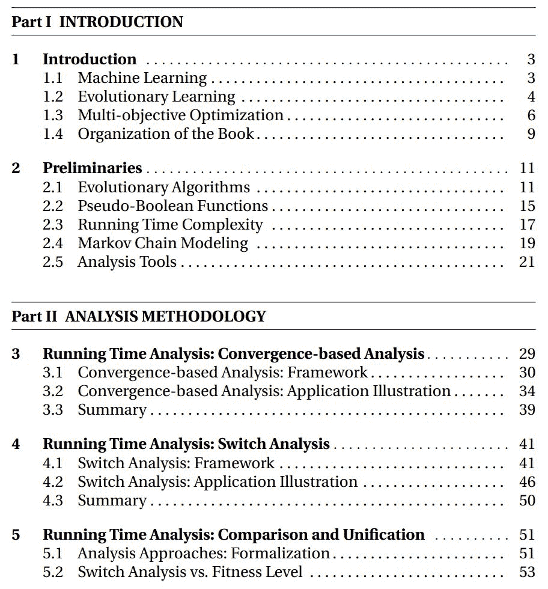
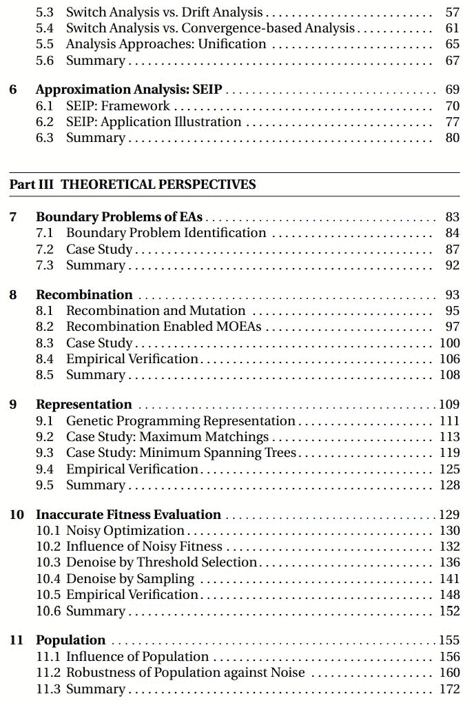
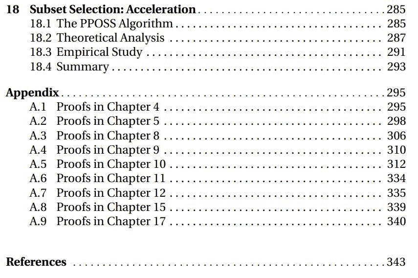

# 南大周志华、俞扬、钱超最新力作：《演化学习：理论与算法进展》正式上线

> 原文：[`mp.weixin.qq.com/s?__biz=MzA3MzI4MjgzMw==&mid=2650762622&idx=2&sn=38ab3c9af4e5cd1dc796e4678f413736&chksm=871aa900b06d2016b4328096011c2e64764845482b0b970488f91bfcc7d672aa092f5dbacbb3&scene=21#wechat_redirect`](http://mp.weixin.qq.com/s?__biz=MzA3MzI4MjgzMw==&mid=2650762622&idx=2&sn=38ab3c9af4e5cd1dc796e4678f413736&chksm=871aa900b06d2016b4328096011c2e64764845482b0b970488f91bfcc7d672aa092f5dbacbb3&scene=21#wechat_redirect)

机器之心报道

**作者：思源、李亚洲**

> 梯度下降或最速下降法，是机器学习最为重要的模块之一。尤其是在深度学习时代，梯度下降已成为不可或缺的组成部分。但同时，梯度下降也限制了机器学习推广到更广泛的一些任务中，例如不可微的目标函数。这一缺陷，却正好能被本书的主题「演化学习」解决。

最近，南京大学周志华教授、俞扬教授、钱超博士出版了一本名为「演化学习：理论与算法进展」的专著。在这本书中，总结了作者在这个主题上近二十年的研究成果，并从理论到算法概述了它对目前机器学习研究的意义。

目前，该书已在 Springer 官网正式上线，且开放了本书第一章的访问，为期一个月。

书籍地址：https://www.springer.com/cn/book/9789811359552

**书籍简介**

本世纪初，本书第一作者周志华与其合作者开展了「选择性集成」的研究，通过从一批训练好的神经网络中选择一个子集进行结合，泛化性能甚至优于结合所有神经网络。该工作中引入了一种名为遗传算法的演化算法（Evolutionary Algorithm, EA）。

周志华认为，演化算法作为一种强大的非经典优化方法，可能对许多机器学习任务都有用。但那时候，演化算法基本上都还是纯启发式的，理论氛围浓厚的机器学习社区并不青睐这一类方法。周志华相信演化算法在应用中神秘成功的背后必有理论解释，并决定开始研究。周志华的学生俞扬、钱超也相继投入该领域的研究，这一研究就是十几二十年。

最开始研究演化算法时，作者们遇到了很多困难。正如俞扬所说：「从 2005 年硕士入学开始，抱着演化算法理论这个硬骨头就开始啃。这个领域真是四处不讨好，让我深刻体验了什么叫冷板凳。即使是在演化计算领域里，对于搞应用的来说，理论太滞后，没有指导意义，甚至关注理论进展的人都很少。而放在整个人工智能领域里，更是艰难，当时演化计算就已经是在顶级会议上冷下去的话题了。」

经过周志华等研究者的共同努力，目前演化学习已经不再是完全缺乏理论支撑的「玄学」，其关键成分上已经有了理论结果，并且对算法设计能够给出一定的指导，使得演化学习成为一个有理论基础的研究领域。总而言之，这本书大部分内容都是三位作者在过去近二十年里取得的研究成果，值得一读。

**内容概要**

机器学习之所以称之为「学习」，很大程度在于模型会通过最优化方法逐渐「学习」一些新知识。但目前主流模型常常要求目标函数是连续、可微的，不然的话梯度下降方法难以有效。这是一个很强的要求，别说可微的目标函数，在一些机器学习任务中甚至都难以定义明确的目标函数。

这时就可以考虑使用无需明确给出目标函数形式的演化学习技术。而演化算法确实在很多应用中产生了令人惊艳的结果。不过由于演化算法的「启发式氛围」太过浓厚，很多结果都是经验性的，缺乏理论支持。最近很多研究者都在努力解决这个问题，而这本书则介绍了这方面的一系列探索与研究工作。

本书包含四部分内容：

*   第一部分介绍了演化学习和一些基础知识，它能为读者提供一些预备知识。

*   第二部分给出了关于演化学习的两个最重要性质——时间复杂度和近似能力——的理论分析方法。这一部分给出的方法是演化学习理论分析的通用性基础工具。

*   第三部分给出了关于演化学习的关键技术环节的理论分析，包括演化算法的算子、表征、评估和种群等。

*   第四部分以选择性集成等机器学习任务为例，展示了如何分析和设计有理论支撑的演化学习算法。

作者们希望第二部分的通用理论工具可以帮助到有兴趣探索演化学习理论基础的读者；希望第三部分的理论结果可以加深读者对演化学习过程行为的理解，并且提供一些关于算法设计的见解；此外，作者们还希望第四部分的算法可以有效地用于机器学习实际应用中。

**作者简介**

本文作者主要有三位：

周志华，现任南京大学人工智能学院院长，南京大学计算机科学与技术系主任、南京大学计算机软件新技术国家重点实验室常务副主任、机器学习与数据挖掘研究所 (LAMDA) 所长，校学术委员会委员。周志华是 ACM、AAAI、AAAS、IEEE 和 IAPR Fellow，主要从事人工智能、机器学习、数据挖掘等领域的研究工作。

俞扬，博士，南京大学教授，博士生导师。主要研究领域为人工智能、机器学习、强化学习。2011 年 8 月加入南京大学计算机科学与技术系、机器学习与数据挖掘研究所（LAMDA）从事教学与科研工作。俞扬获得了 4 项国际论文奖励和 2 项国际算法竞赛冠军，入选 2018 年 IEEE Intelligent Systems 杂志评选的「国际人工智能 10 大新星」，获 2018 亚太数据挖掘「青年成就奖」，受邀在 IJCAI'18 作关于强化学习的「青年亮点」报告。

钱超，南京大学，博士。主要研究方向为演化计算与机器学习。以第一作者在 AIJ、TEvC、ECJ、Algorithmica、NIPS、IJCAI、AAAI 等国际一流期刊和会议上发表二十余篇论文。获 ACM GECCO'11 最佳理论论文奖、IDEAL'16 最佳论文奖，担任 IEEE 计算智能学会 Task Force on Theoretical Foundations of Bio-inspired Computation 主席，入选中国科协「青年人才托举工程」。

**什么是演化学习**

对于大部分读者而言，机器学习和梯度下降已经是老朋友了，但演化学习却相对陌生。我们可以将各种机器学习算法总结为三大主要模块，即如下所示的模型表征、模型优化和模型评估。

*原书图 1.1：典型机器学习过程的三大组成模块。*

我们很容易理解，ML 需要支持向量机、神经网络或决策树等算法构建模型空间，然后在训练数据上利用学习算法找更好的解决方案。当然，在找最优模型的过程中，模型评估会将模型的好坏直接反馈给学习算法，从而指导学习的持续进行。

那么 EA 在机器学习中处于什么位置呢？按照维基百科的描述：「演化算法启发自生物的演化机制，模拟繁殖、突变、遗传重组、自然选择等演化进程，从而对最优化问题的候选解做演化计算。」所以，演化算法对应于上图的学习算法，它是一种模拟自然演化的「学习过程」。

所以演化学习究竟是怎样进行的，它会不会也有这样一个整体框架？后面我们将介绍该书第一章描述的演化学习。

**演化学习的主要流程**

演化算法（EA）是一大类启发式的随机优化算法，它受到了自然演化的很多启发。一般 EA 会考虑两个关键因素来模拟自然过程，即变异繁殖（variational reproduction）和择优挑选（superior selection）。尽管演化算法有很多不同的实现，例如遗传算法（GA）、遗传规划（GP）和进化策略（ES），但典型的 EA 主要能抽象为以下四个步骤：

1\. 生成一组初始解（称为种群/Population）；

2\. 基于现有的种群繁衍一些新的解（solution）；

3\. 移除种群中相对差的解；

4\. 返回第二步并重复运行，直到遇到了终止标准。

这四步可以构成演化算法的主要流程：

*原书图 1.2：演化算法的一般结构。*

**演化算法实例**

在使用 EA 解决最优化问题之前，我们需要决定如何表示解（solution）。例如，如果问题是从基准集中选择一个子集，那么一个解可以自然地表示为一个布尔值（0 或 1）向量。如下图 1.3 所示，{v1, v2, . . . , v8} 的子集能自然地表示为长度为 8 的布尔值向量。其中第 i 个元素为 1 意味着选择了 v_i，因此 {v1, v3, v4, v5} 能表示为 (1, 0, 1, 1, 1, 0, 0, 0)。

*原书图 1.3：表示解的一个案例。*

基于解的表征方法，EA 通过图 1.2 所示的循环就开始了演化。在循环演化过程中，EA 会保留解的整个种群，并通过迭代繁衍新的后代解而不停地更新种群。突变与重组（或称为交叉）是繁衍的两种常见操作方法。突变（Mutation）会随机修改一个解以生成新的解。

如下，图 1.4 展示了布尔值向量所产生的单个元素突变，即随机选择一个元素，并将其修改为另一个布尔值。

*原书图 1.4：布尔值向量解上的单比特变异。算法首先会随机选择 Parent 解上的一个位置，然后改变该位置的布尔值，并生成后代解。*

重组会混合 2 个或多个解以生成新的解。下图 1.5 展示了两个布尔值向量所完成的单点重组，即随机选择一个位置，然后交换该位置后面的值。

*原书图 1.5：两个布尔值向量上的单点重组。算法随机选择两个 Parent 解的某个相同位置，并交换该位置后面的值而生成两个后代解。*

新生成后代解之后，我们需要使用适应度函数（fitness function）度量它们的好坏。如果我们使用某些挑选机制，从老种群的解、新生成的后代解中择优挑选，那么就能构建新的种群。当满足停止标准时，演化周期就结束了。目前有一些停止准则，例如是否有满足预定义质量的解、计算资源的预算上限（例如运行时间）、或解不会随着迭代的进行继续提升。

从整个迭代过程中可以看到，EA 在求解最优化问题时，它只需要以某种方法表示解，并能够对解的好坏进行评估，从而可以搜索更好的解。因此，EA 在没有梯度信息、甚至在没有明确目标函数时都能使用，它只需要存在某种方法能通过实验或模拟评估解的好坏就行。因此，EA 被视为一种通用的最优化算法，我们甚至能以「黑盒」的方式解决某个最优化问题。

由于通用属性，很多研究者已经利用 EA 来解决机器学习中的复杂最优化问题。例如，EA 可以用来最优化神经网络，包括连接权重、架构和学习规则。这种演化的人工神经网络模型能实现非常好的性能，甚至能媲美手动设计的模型。然而，尽管演化学习已经取得了很多成功，但它缺少坚实的理论基础，也很难受到机器学习社区的广泛认同，本书介绍了作者们为此作出的努力。

**附全书目录**

****本文为机器之心报道，**转载请联系本公众号获得授权****。**

✄------------------------------------------------

**加入机器之心（全职记者 / 实习生）：hr@jiqizhixin.com**

**投稿或寻求报道：**content**@jiqizhixin.com**

**广告 & 商务合作：bd@jiqizhixin.com**