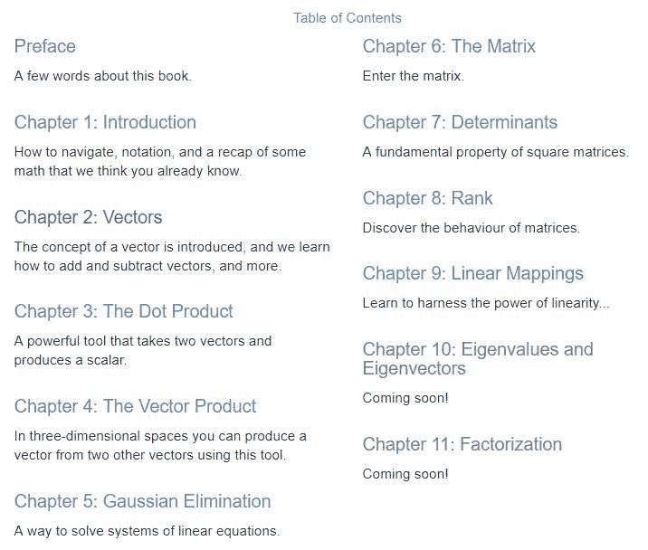

# 沉浸式学习线性代数！这里有一本全交互的线性代数书

> 原文：[`mp.weixin.qq.com/s?__biz=MzA3MzI4MjgzMw==&mid=2650757879&idx=3&sn=9f314715be35e1137fecaf8d40ef3edf&chksm=871a9e89b06d179ff0528d6b16a713567649c16216bce3758810f9dc4eb84f64b67c7ede5972&scene=21#wechat_redirect`](http://mp.weixin.qq.com/s?__biz=MzA3MzI4MjgzMw==&mid=2650757879&idx=3&sn=9f314715be35e1137fecaf8d40ef3edf&chksm=871a9e89b06d179ff0528d6b16a713567649c16216bce3758810f9dc4eb84f64b67c7ede5972&scene=21#wechat_redirect)

机器之心编辑

**参与：路**

> 今天，我们给大家介绍一本好玩的线性代数书籍。线性代数的书籍那么多，这本却独具特色。准确来讲，量词似乎不能用「本」，因为它需要在网页上阅读，更重要的是，书里的图是可以动的，读者还可以拖动图。这种交互式图看起来很有意思～

书籍地址：http://immersivemath.com/ila/index.html

*书中的三维立体动态插图。*

《Immersive Linear Algebra》的作者是 J. Ström、K. Åström、T. Akenine-Möller，全书共包含 12 个部分：序言和 11 个正文章节。书籍内容涵盖：向量、点积、向量积（叉积）、高斯消元法、矩阵、行列式、秩、线性映像、特征值和特征向量、因式分解。

2015 年 9 月 7 日，这本书首次上线，发布了前四部分。目前这本书尚未完成，最后两部分「特征值和特征向量」和「因式分解」还在进行中。

作者在本书序言中解释了为什么用现在这样的呈现方式：

> 常言道：「一图胜千言」，对于教科书来讲，图往往可以代替大量文字。但是，我们认为交互式插图可以表达更多，因此我们决定用这类图来帮助完成这本线性代数书籍。我们认为这些图会使学习和消化线性单数知识更加简单快捷。此外，我们还添加了一些其他功能（如常见线性代数术语的弹窗帮助），我们认为这些功能有助于读者更方便快速地阅读和理解此书。
> 
> 这本书的每一章节首先是一个交互式具体图示，展示某个概念的原理。然后是更正式的数学知识，其中的数学概念被概括化，甚至会更加抽象。我们认为每一章开头先用简单具体的示例吸引读者的注意力，这有助于读者更简单地理解整章的知识。

正如作者所说，这本书的巧妙之处在于：

*   可视化效果好：交互式图片，帮助读者理解线性代数知识。

*   弹窗注释：光标放在书中灰色字处，即会弹出帮助窗口，解释术语的意义。

**可视化**

我们先来看每一章节开头的示例动图，拿第二章向量举例：

*读者可以点击该图片，通过交互式操作了解「向量」是什么。*

接下来，我们来看章节正文中的其他图片。

该图展示了向量没有特定的起始位置。图中所有箭头都代表同一个向量。

此外，读者还可以点击书中的图片，拖动图发生改变。

*使用鼠标拖拽书中插图。*

**弹窗注释**

本书整理了一些常见的线性代数术语，用灰色字体标出。读者在阅读时将鼠标光标放在灰色字处，在字的下方将出现弹窗，解释该术语的意思。如下图所示：

这本书通过生动的可视化方式帮助读者轻松地理解线性代数概念和知识，同时交互式的阅读方式既有趣，又能增加读者的阅读专注度。再加上对线性代数术语的弹窗注释，这本书不失为一本很好的线性代数书籍。

关于该书籍的好玩之处，作者也做了一个简单的介绍视频，感兴趣的请戳：

[`v.qq.com/iframe/preview.html?width=500&height=375&auto=0&vid=o0843skyo2c`](https://v.qq.com/iframe/preview.html?width=500&height=375&auto=0&vid=o0843skyo2c)

****本文为机器之心编辑，**转载请联系本公众号获得授权****。**

✄------------------------------------------------

**加入机器之心（全职记者 / 实习生）：hr@jiqizhixin.com**

**投稿或寻求报道：**content**@jiqizhixin.com**

**广告 & 商务合作：bd@jiqizhixin.com**