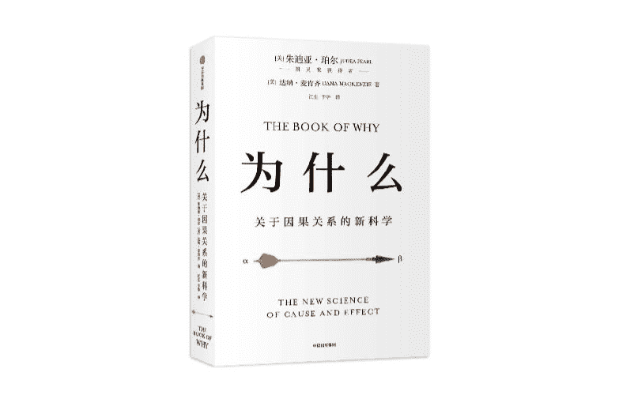
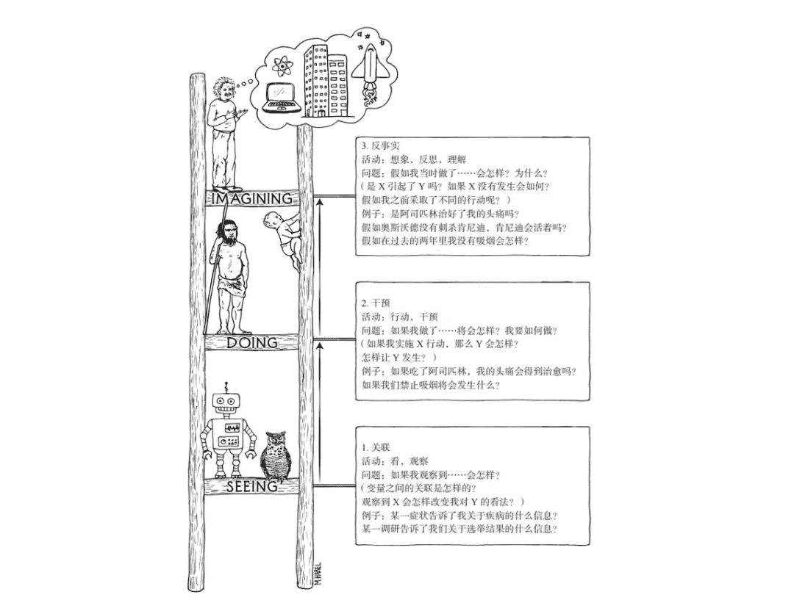
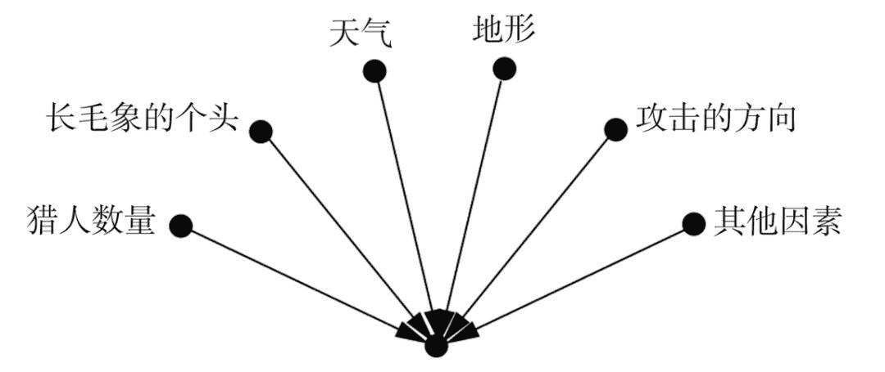
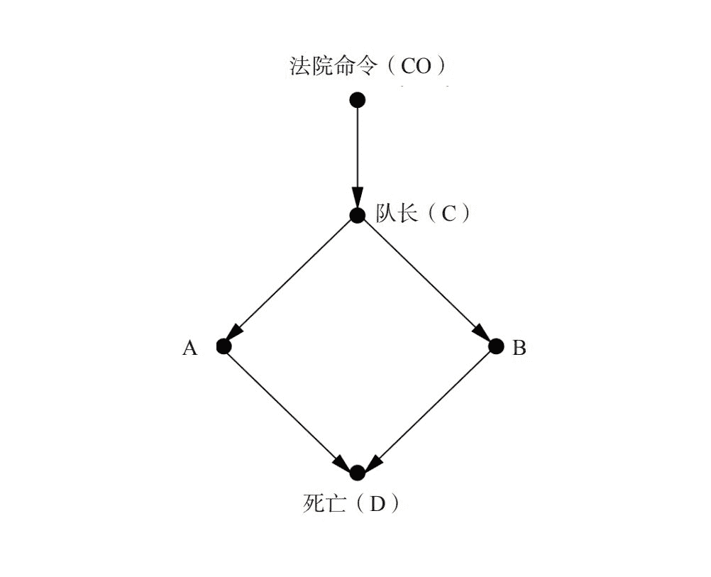
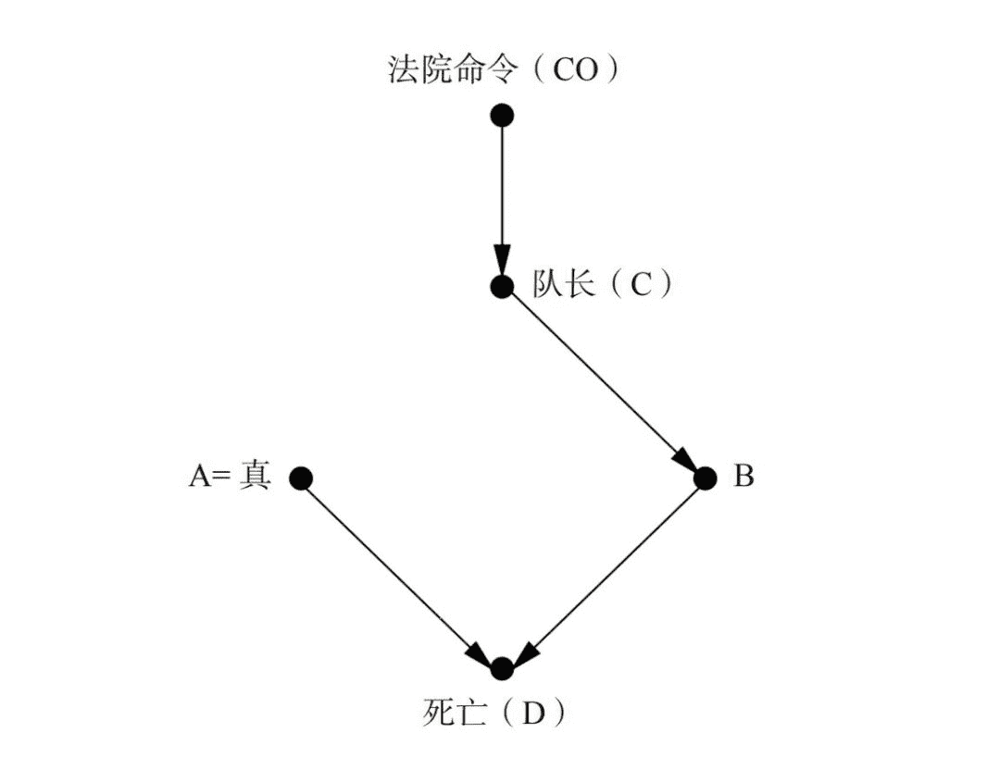

# 一场因果革命，Judea Pearl 最新力作《为什么》中文版发布（赠书）

> 原文：[`mp.weixin.qq.com/s?__biz=MzA3MzI4MjgzMw==&mid=2650764315&idx=4&sn=7d858388aaf81c69693a09d18313f716&chksm=871ab065b06d3973b7da56ce3263c143018eff09dc5671308f9968356d555bee5fadd0b11596&scene=21#wechat_redirect`](http://mp.weixin.qq.com/s?__biz=MzA3MzI4MjgzMw==&mid=2650764315&idx=4&sn=7d858388aaf81c69693a09d18313f716&chksm=871ab065b06d3973b7da56ce3263c143018eff09dc5671308f9968356d555bee5fadd0b11596&scene=21#wechat_redirect)

机器之心报道

**作者：一鸣、思**

> 如果说科学的本质是寻找变量之间的因果关系，那么过去几年机器学习的研究和努力依然没有触及问题的本质。在这本书中，让我们重新思考什么是因果关系，什么是因果与统计之间的桥梁。也许自带因果的机器学习，才适合做推理与决策。

正如图灵奖获得者，贝叶斯网络之父 Judea Pearl 所言，机器学习不过是在拟合数据和概率分布曲线。变量的内在因果关系不仅没有被重视，反而被刻意忽略和简化。如果要真正解决科学问题，甚至开发具有真正意义智能的机器，因果关系是必然要迈过的一道坎。

Judea Pearl 在最新的《The book of Why》中批判了传统统计学存在的问题，并进一步介绍了使用因果推理的数学工具，研究变量关系的新方法。

今年，该书被翻译成中文，即将付梓出版。联合中信出版社，机器之心也将为购票参加市北·GMIS 2019 大会的读者进行赠书活动，数量有限，先到先得。

**Judea Pearl：我们需要一场「因果革命」**

提到 Judea Pearl，熟悉机器学习领域的读者应该不会陌生。他提出了著名的贝叶斯网络，是 2011 年图灵奖的获得者。

虽然 Pearl 已经是领域内知名的学者，但是他自嘲自己是「AI 社区的反叛者」。原因在于，Pearl 对人工智能的发展方向和主流趋势持相反意见。Pearl 认为，尽管现有的机器学习模型已经取得了巨大的进步，但遗憾的是，所有的模型不过是对数据的精确曲线拟合。从这一点而言，现有的模型只是在上一代的基础上提升了性能，在基本的思想方面没有任何进步。

那么，怎样才能推动 AI 社区解决这一问题呢？在[之前的采访中](http://mp.weixin.qq.com/s?__biz=MzA3MzI4MjgzMw==&mid=2650735722&idx=2&sn=bd84ae4473fc0ce87429f981b59ef4f1&chksm=871ac014b06d49028354e8d1725899451516b5c0578229d44a31f6d60d0714971782612fa17f&scene=21#wechat_redirect)，Pearl 认为，我们需要一场「因果革命」。研究者应该考虑采用因果推断模型，从因果而非单纯的数据角度进行研究。他认为，我们在过去一段时间错过了对因果推断的研究机会，这原本是科学研究的核心：寻找变量的因果关系。

*图注：Judea Pearl*

然而，当前统计机器学习主要关注对表征的拟合，寻找的是变量之间的相关性，而非潜在的因果性。这样的认识会使科学研究停留在较浅的关联层面，导致模型的鲁棒性和可解释性丧失，阻断了进一步探究干预变量，以及反事实推断（即假设某一变量完全相反而其他变量不变时，该变量对结果的影响）的能力。Pearl 认为，智能的机器应该能够彼此沟通交流，通过提出反事实对话（如「你应该怎样做」）而作出更好的表现。

Pearl 感到遗憾的是，当前一部分研究者依然沉浸于机器学习模型带来的巨大进步中，缺乏对研究的内省。因此，Pearl 和他的同事在 2018 年完成了著作《The Book of Why: The New Science of Cause and Effect》。Pearl 在书中详细地阐述自己在这一领域的研究成果，希望能够促进人们反思当前的研究方向。

**因果关系这本书都讲了啥**

Judea Pearl 在书籍前言中表示，整本书主要从三方面描绘因果推断的全景图：

*   首先，用非数学的语言阐述因果革命的知识内涵，说明它将怎样影响我们的生活和未来。

*   其次，分享在解决重要的因果问题时，我们的科学家前辈走过的英勇征程。

*   最后，回溯因果革命在人工智能领域的发源地，目的是向你介绍如何开发出用因果语言进行交流的机器人。

因为这本书是科普读物，所以并不要求读者拥有非常强的数学基础。Judea Pearl 会用读者的语言组织思路，猜测读者的背景及可能提出的问题。如果读者想重新审视机器学习的发展历程和其中存在的问题，并力求寻找一种弥补措施，Pearl 的这本心血之作，值得读者细细品读。

**内容概要**

Pearl 在本书中重点阐述了自己在因果推断领域的研究和思考，并将这些研究通过读者能够理解的数学形式展示出来。总体而言，Pearl 介绍了通向科学分析的路径：因果之梯。Pearl 表示，科学研究需要从从观察，到干预，最终到反事实推理，而整本书的各个章节都围绕着这三部分展开讨论。

首先是底层，指的是对于事物现象的一般性观察，并根据观察的现象，发现其中的关联性。中间一层则是干预，即通过对变量的改变，研究这一变量对结果的影响，包括是否改变结果的性质，以及改变的强度。最后则是反事实，即通过模拟控制其他变量，仅翻转被研究的变量，探讨可能的发展。

*因果之梯的三个层级。每向上前进一层时，下层的问题都可以被上层的结果直接解决。*

当前的机器学习模型，在 Pearl 看来，只能停留于第一阶段。这是因为，统计机器学习模型仅能够对现象（数据）进行观察，并拟合一个可能的概率分布。这种拟合的结果是，模型仅能够发现两个变量之间的相关性，而非真正的因果性。

因为统计学关注第一阶段观察，因此获得的相关性会带来的一系列研究问题。例如由于无法分离变量「混杂」问题，统计学可能对变量进行错误的控制，以致造成错误的相关关系推断。

在最后介绍反事实阶段中，Pearl 还重点介绍了自己的相关研究成果：

*   第一，Pearl 会通过图的形式，定性、定量地描述变量之间的因果关系和影响程度。

*   第二，Pearl 阐述了自己在贝叶斯网络方面的研究，以及在面对复杂因果概率问题中的解决方法。

*   第三，Pearl 介绍了使用 d-分离的方法，使用因果论领域的数学工具，将统计学中难以剥离和控制的变量，简单地从变量中分离。

*   第四，Pearl 谈到如何使用结构化因果方程的方式，最终登上因果之梯的最高点：反事实推理。

在本书的最后，Pearl 从数学讲解中脱离出来，针对当前的大数据、人工智能等方面的话题提出了自己的见解。

**什么是因果推断？**

那么这本书最核心的概念，因果推断到底是什么呢？机器之心摘取了第一章节的部分内容，其形象地解释因果推断，感兴趣的读者快来试读吧。

Pearl 在书中认为，因果推断是一种通过事物的原因推导至某个肯定结果的逻辑方式。通过因果推断，人类可以很好的解决生活和科学中遇到的问题。而如果能够完全掌握这一方法，就能够在计算机上模拟因果推断，进而设计强大的自动化机器。机器最终可以帮助人类解决科学界悬而未决的问题，并最终从环境中不断的学习新的因果知识。

为了将语言中的因果关系使用数学形式表达，Pearl 提出了因果图。因果图一种图形式的模拟，代表变量之间存在的因果关系。点代表变量，带有指向的边则表示了变量的因果关系影响。这种点-边的关系图被称为因果图。Pearl 认为因果图可以良好的展示因果关系。如果每个边带有一个权重，则可以表示不同因素对于这一结果的影响强度大小。

*成功狩猎长毛象的已知影响因素。假设某个原始人需要狩猎长毛象，则对其成果狩猎的因素（变量）可以用点表示，边则表示这些因素对结果（狩猎成功与否）具有影响因素。*

如果使用因果图，可以模拟预测某一变量对结果的影响。例如，在明确了一个变量关系的因果图后，通过删除某条边（表示隔离某个变量对结果的影响），则可以清楚地预测在缺失该变量的情况下，它对结果的影响。

*假设有一法院对犯人下达死刑命令，通过执行队长向两个行刑人下达指令。*

上图展示了法院命令 CO、队长 C、行刑者 A、行刑者 B 变量对犯人 D 的影响。因果图表示的是法院下达命令，队长收到命令，将命令同时传达给 A、B，A 和 B 收到命令后，同时对犯人执行死刑的完整流程。由于设定 A、B 都必须收到队长的命令后才能执行，并且必须执行。可以观察到，AB 执行，D 死亡。关联关系可以认为，D 的死亡是 AB 一同执行的结果。

*本图是假设了队长 C 没有下达命令给 A（移除了 AC 的边），但 A 依然提前执行的情况下（人为设定 A 为真），犯人是否死亡的因果图。*

通过上图，可以判断，即使没有命令但 A 仍执行（为真）的情况下，犯人 D 依然死亡。但是，这一推理和 B 对 D 的状态无关，即 A 为真肯定会导致 D（死亡），但 B 的状态在因果推理中无法说明。作者通过这一例子说明，当 AB 被观察到同时执行，确实可以看到 D 的死亡。但 D 的死亡，也可能是 A 独立导致的，而非 AB 同时为真的结果。因此，因果图相较基于观察相关性的研究，更能够发现变量内部的因果关系。

通过因果图，我们能快速了解变量之间的因果关系，这也就是因果推断了。如果机器学习也能理解变量的这种关系，那么预测结果也就天然可解释了，这样的机器学习系统才是最稳健的。

**全书目录**

如下所示为全书目录，根据因果之梯，第 2 到 6 章介绍的是第一阶段的观察；第七章介绍的是第二阶段的干预；最后第八章介绍的就是反事实。了解因果之梯后，再利用新工具与新方法就能尝试解决以前的难题。

*   前 言 III

*   导言：思维胜于数据

*   第一章 因果关系之梯

*   第二章 从海盗到豚鼠：因果推断的起源

*   第三章 从证据到因：当贝叶斯牧师遇见福尔摩斯先生

*   第四章 混杂和去混杂：或者，消灭潜伏变量

*   第五章 烟雾缭绕的争论：净化空气

*   第六章 大量的悖论！

*   第七章 超越调整：征服干预之峰

*   第八章 反事实: 挖掘原本可能的世界

*   第九章 中介: 寻找一种机制

*   第十章 大数据，人工智能和大问题

*   致谢 

*   参考文献 

**如何获赠《The book of Why》？**

即日起购买「市北·GMIS 2019」大会门票，并在购票时备注「why」，即可获赠 Judea Pearl 最新力作《The book of Why》一本，限量 10 本，按购票时间，送完为止。

**市北·GMIS 2019**全球数据智能峰会于**7 月 19 日-20 日**在上海市静安区举行。本次峰会以**「数据智能」**为主题，聚焦最前沿研究方向，同时更加关注数据智能经济及其产业生态的发展情况，为技术从研究走向落地提供借鉴。

本次峰会设置主旨演讲、主题演讲、AI 画展、「AI00」数据智能榜单发布、闭门晚宴等环节，已确认出席嘉宾如下：

大会**早鸟票**已开售，我们也为广大学生用户准备了最高优惠的学生票，点击**阅读原文**即刻报名。