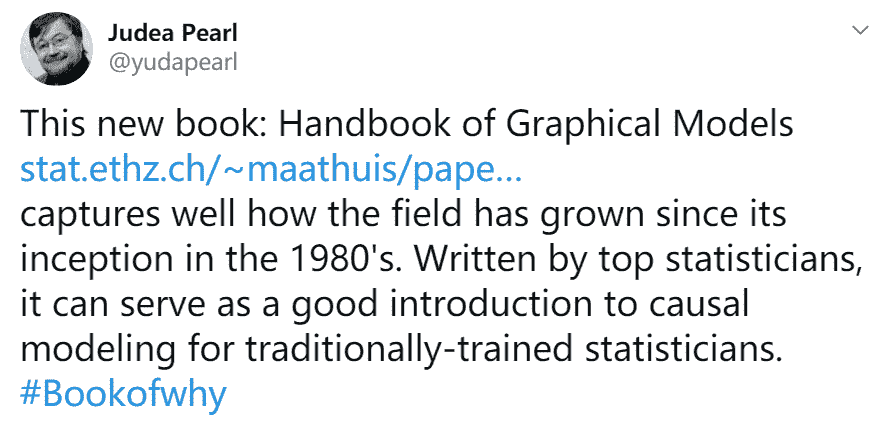
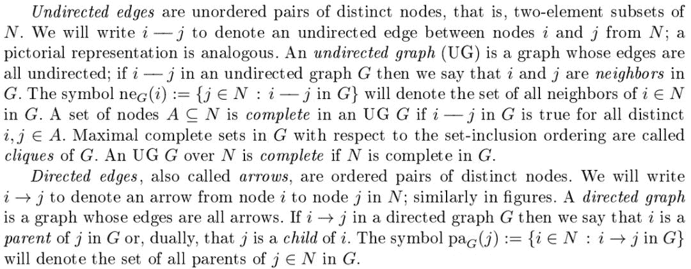
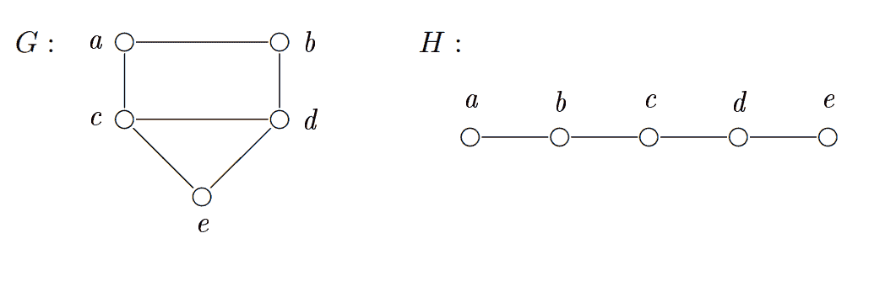
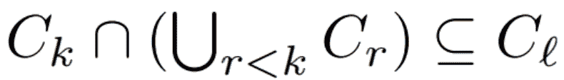

# 五百、页开放书搞定概率图建模，图灵奖得主 Judea Pearl 推荐

> 原文：[`mp.weixin.qq.com/s?__biz=MzA3MzI4MjgzMw==&mid=2650770891&idx=5&sn=7fac59c32f2c31ad5c311bb166cfbf6e&chksm=871a49b5b06dc0a367d699fe485b051dd38b177f67cc32dd98ee67fcf77588a9da32c0a06b64&scene=21#wechat_redirect`](http://mp.weixin.qq.com/s?__biz=MzA3MzI4MjgzMw==&mid=2650770891&idx=5&sn=7fac59c32f2c31ad5c311bb166cfbf6e&chksm=871a49b5b06dc0a367d699fe485b051dd38b177f67cc32dd98ee67fcf77588a9da32c0a06b64&scene=21#wechat_redirect)

机器之心整理

**参与：张倩、思**

> 500 页图模型巨著，从图、概率图、统计和因果推理带你纵览神奇的图模型。

对因果推理感兴趣的读者想必对图灵奖得主 Judea Pearl 并不陌生，他的[《The Book of Why: The New Science of Cause and Effect》](http://mp.weixin.qq.com/s?__biz=MzA3MzI4MjgzMw==&mid=2650764315&idx=4&sn=7d858388aaf81c69693a09d18313f716&chksm=871ab065b06d3973b7da56ce3263c143018eff09dc5671308f9968356d555bee5fadd0b11596&scene=21#wechat_redirect)详细阐述了自己在因果推理领域的研究成果，深受国内外读者的欢迎。近日，这位大牛在 Twitter 上推荐一本新书——《Handbook of Graphical Models》。书籍链接：https://stat.ethz.ch/~maathuis/papers/Handbook.pdf 该书由多位世界知名的统计学家合作完成，整理了图模型自上世纪 80 年代诞生以来的发展脉络，可以为传统数据科学工作者学习因果建模提供一份有价值的入门材料。该书由 Marloes Maathuis（苏黎世联邦理工学院统计学教授）、Mathias Drton（华盛顿大学统计学教授）、Steffen Lauritzen（哥本哈根大学数理统计教授）、Martin Wainwright（加州大学伯克利分校统计学、电子工程与计算机科学教授）以及多位贡献者合作完成。

*本书的主要作者（从左至右：Marloes Maathuis、Mathias Drton、Steffen Lauritzen、Martin Wainwright）。*

**图模型是什么？**图模型是一种与图相关的统计模型。图的节点对应感兴趣的随机变量，边编码变量之间允许的条件依赖。基于图模型的因式分解特性便于使用多元分布进行易于处理的计算，使得该模型成为许多应用中的有用工具。此外，有向图模型容许直观的因果解释，已经成为因果推理的基石。**为什么要读这本书？**虽然目前已经有很多关于图模型的优秀书籍，但这一领域发展得如此之快，单个作者很难覆盖其全部内容。而且，图模型本来就是跨学科的，其成果来自多个学科，如统计学、计算机科学、电气工程、生物学、数学和哲学。通过介绍这些领域领先的研究成果，这本新书可以让我们看到图模型的当前发展状况。**书中写了哪些内容？**全书共分为 5 大部分，包含 21 个章节：

*   条件独立性和马尔科夫性质

*   因式分解概率分布，并计算

*   统计推理

*   因果推理

*   应用

第一部分介绍了与图模型相关的基础知识，包括图如何编码随机变量之间的条件独立性（变量联合分布的因式分解）。第二部分讲如何基于特定图模型进行高效计算，重点解释了相关因式分解特性的利用。第三部分将重点转到统计推理问题，如学习图和从可用数据中估计相关参数。第四部分是关于有向无环图的因果解释。相关章节概览了因果推理的图方法基本概念，同时还讨论了一些统计问题，如从数据中学习有向无环图。最后一部分介绍了图模型在司法科学、生物学等学科中的应用。了解了这本书的基本信息之后，我们来看一下书中的详细内容。**图的定义**整本书都是围绕「图」这一数据结构，而图模型将图中的节点视为随机变量，将连接的边视为独立性关系，那么图模型也就成为了一种强大的建模工具。作为图模型的基础，我们先要了解「图」的标准定义，因此我们可以看看在这本书中 1.6 小节到底是如何定义图的。这一章节介绍了关于图最基本的概念。现在若定义 N 为有限非空索引集的通用符号，其元素对应于随机变量，并且在图模型中以节点的方式出现。通过 N 定义的图可以理解为将 N 作为节点集合，本章考虑的图没有多重边，因此它们通过边可以分为无向图和有向图。

*注：**上面是原文对无向图和有向图的标准定义，其中无向图指节点间的边全是没有指向的，而有向图指节点间的边是有指向的。*给定在 N 上定义的图 G（无向图或有向图），且有非空节点集 T ⊆ N，那么由 G 诱导出的子图（induced subgraph）T 可以表示为 G_T。具体而言，G_T 表示在集合 T 上的图，其中所有的边即 G 中 T 个子节点间的边。图 G 在 N 上的游走（walk）可以表示为从 i_1 到 i_k（k ≥ 1）的节点序列，序列中每一对相邻的节点在图 G 中都有一条边相连。游走的端节点为 i_1 和 i_k，如果 k ≥ 3，那么其余的节点可以表示为 i_l（1 < l < k），它们都是内部节点。游走过程中边的数量 k - 1 被称为游走的长度。如果 i_1, ..., i_k 是唯一的，那么该游走就称为图 G 的径（Path）；如果 k≥ 4，且满足 i_1 = i_k、i_1, . . . , i_k−1 是唯一的，那么这样的游走可以称为环（Cycle）。在有向图 G 中，一条径或者一个环之所以称为有向，是因为对于所有内部节点 l=1, ..., k-1，都有 i_l → i_l+1。

*图 1.3：**两种无向图。*如果有向图 G 不包括有向环，那么它按照惯例就可以称为有向无环图（DAG）。DAG 有一个众所周知的等价描述，即如果有向图 G 能枚举节点 i_1, ..., i_|N|，且它们的指向是一致的，那么就可以称为 DAG。即如果图 G 中 i_l → i_k，那么有 l < k。另外一种重要的概念是弦图（无向图），弦图满足对于节点至少为 4 的环，它都至少有一条弦。也就是说，环中节点的边，并不是构成环的边。一种非常著名的等价定义方法可以表示为，一个弦图 G 指的是它的团可以以序列的方式组织 C_1, ...,C_m（m ≥ 1），它满足 running intersection 属性：对于所有 k ≥ 2，存在 l < k 以令。**目录**最后，让我们看看整本书的目录和主题（滑动目录向下翻页）。

********本****文为机器之心整理，**转载请联系本公众号获得授权****。**
✄------------------------------------------------**加入机器之心（全职记者 / 实习生）：hr@jiqizhixin.com****投稿或寻求报道：**content**@jiqizhixin.com****广告 & 商务合作：bd@jiqizhixin.com**