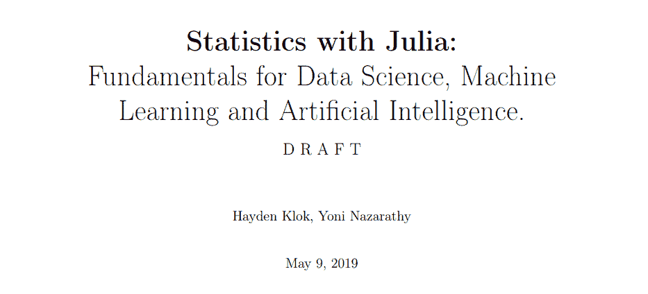
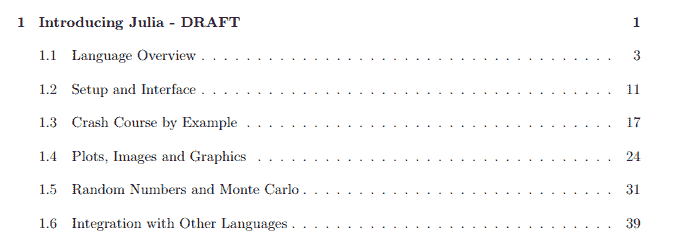

# 如何用 Julia 做数据统计？这里有一本全面教材（附代码图示）

> 原文：[`mp.weixin.qq.com/s?__biz=MzA3MzI4MjgzMw==&mid=2650766791&idx=5&sn=bee9cbcb6d9e16663b37283a9e803bb0&chksm=871ab9b9b06d30af40b5eff5b7edfa27bc9b7d9c2e80d6e1176c992e68c93dee66366f685da9&scene=21#wechat_redirect`](http://mp.weixin.qq.com/s?__biz=MzA3MzI4MjgzMw==&mid=2650766791&idx=5&sn=bee9cbcb6d9e16663b37283a9e803bb0&chksm=871ab9b9b06d30af40b5eff5b7edfa27bc9b7d9c2e80d6e1176c992e68c93dee66366f685da9&scene=21#wechat_redirect)

机器之心报道

**参与：高璇、张倩**

> 去年 8 月份，MIT 正式发布了 [Julia 1.0](http://mp.weixin.qq.com/s?__biz=MzA3MzI4MjgzMw==&mid=2650746791&idx=3&sn=bd348998f7c60d94ec7fea914841c6a1&chksm=871aebd9b06d62cf6e3263cd3d74ae86bb5fdf25dd84225d07515516cf5846bc5eaa4d2d31ab&scene=21#wechat_redirect)，在开发者社区引起了很大的轰动。这一语言易于使用、速度快、效率高，在科学计算、数据处理、机器学习领域都非常受欢迎。那么，这么好用的语言要怎么学呢？近日，来自昆士兰大学的 Hayden Klok、Yoni Nazarathy 撰写了一本结合统计学和 Julia 语言的教程，不仅将 Julia 作为工具介绍为读者，还梳理了机器学习、数据科学和人工智能所需的统计学基本概念。

目前，作者已将该书的草稿开源。

*   书籍链接：https://people.smp.uq.edu.au/YoniNazarathy/julia-stats/StatisticsWithJulia.pdf

在本书「前言」部分，作者介绍了他们的写作初衷、目标读者、全书概要等信息。

**写作初衷 & 目标读者**

写这本书的最初原因是 2016 年底为昆士兰大学的统计学课程准备材料。当时，Julia 语言虽然只是 0.5 版，但已经显示出强大的功能和适应性。出于这个原因，我们在课程中选择使用 Julia，因为早期让学生接触有关 Julia 的统计知识，可以让他们在未来的职业生涯中熟练使用 Julia 进行数据科学、数值计算和机器学习任务。这种选择当时也遭到了一些学生和同事的反对，那时跟现在一样，R 语言统治着统计世界，Python 主宰着机器学习世界。那么为什么要选择 Julia？

主要有三个原因：高性能、简单性和灵活性。Julia 正在迅速成为数据科学、统计学、机器学习、人工智能和一般科学计算领域的主要语言之一。它像 R 语言、Python 和 Matlab 一样易于使用，但由于其类型系统和即时编译，它可以更有效地执行计算。这使得它在运行时间和开发时间方面都很快。此外，还有多种多样的 Julia 包。这其中就包括数据科学家、统计学家或机器学习从业者需要的高级方法。因此，该语言具有广泛的应用范围。

编写本书的目的是为了梳理机器学习、数据科学和人工智能所需的统计学基本概念。这是为了将 Julia 作为计算工具介绍给读者。本书还旨在为数据科学家、机器学习从业者、生物统计学家、金融专业人士以及工程师提供参考，帮他们重新回顾统计学知识或者填补理解空白。在当今世界，这些学生、专业人士或研究人员经常使用先进的方法和技术。然而，我们常常需要退一步，探索或重新审视基本概念。借助 Julia 等编程语言重新审视这些概念，可以使概念具体化。

现在，距离我们开始写这本书已经两年半了，Julia 也已经有了 1.0 以上的版本。这本书也逐渐完善了。任何想要使用 Julia 的人都可以轻松部署 Julia。然而，目前 Julia 的许多用户都是核心开发人员，他们为语言的标准库以及广泛的程序包生态系统做出了贡献。因此，目前可用的大部分 Julia 资料都是针对其他开发人员而非最终用户。这就是我们的书发挥作用的地方，因为它是为最终用户编写的。

代码示例是以简单的格式编写的，有时会牺牲效率和通用性，但更易于阅读。每个代码示例旨在传达某一特定的统计知识点，同时会介绍 Julia 编程概念。在某种程度上，代码示例能让人想到老师在讲座中用来说明概念的示例。想了解本书的内容，不需要事先了解统计知识，实际上只需要了解一些基本的编程经验和基本数学符号即可。

**全书概要**

该书共包含 10 章和 3 个附录。可以连续阅读，也可以自己决定阅读顺序。

第一章是对 Julia 的介绍，包括它的设置、包管理器和本书中使用的主要包。为了说明一些语言的特性，通过代码示例介绍一些基本语法和程序结构。

第二章探讨基本概率，重点关注事件、结果、独立性和条件概率概念。我们提出了几个典型的概率示例以及探索性的仿真代码。

第三章探讨了随机变量和概率分布，重点介绍 Julia 分布包的使用。将离散、连续、单变量和多变量概率分布作为一个教学任务加以介绍和探讨。这是通过仿真和显式分析以及绘制分布的相关函数图来完成的，如 PMF、PDF、CDF 等。

第四章暂时不谈概率概念，重点介绍了数据处理、数据汇总和数据可视化。引入 DataFrame 的概念作为存储可能丢失值的异构数据类型的机制。数据帧在 Julia 中是数据科学和统计的重要组成部分，就像在 R 和 Python 中一样。本章还介绍了经典描述统计学及其在 Julia 中的应用。此外，还引入了核密度估计和经验累积分布函数等概念。本章最后将介绍使用文件的一些基本功能。

第五章介绍了一般的统计推断思想。通过仿真和分析实例给出了样本均值和样本方差的抽样分布，说明了中心极限定理和相关结果。然后探讨统计估计的一般概念，包括矩量法和最大似然估计方法的基本例子，然后是简单的置信区间。本章还介绍了统计假设检验的基本概念，以及贝叶斯统计的基本概念。

第六章介绍了一个和两个样本的各种实际置信区间。本章从均值的标准置信区间开始，然后发展到更现代的 bootstrap 方法和预测区间。本章还是研究模型假设对推理影响的切入点。

第七章侧重于假设检验。本章从总均值的标准 t 检验开始，然后介绍两种均值比较的假设检验。然后，进行方差分析（ANOVA），以及检查独立性和拟合优度的假设检验。接下来向读者介绍功率曲线。本章最后介绍了一个很少涉及到的性质，即 p 值的分布。

第八章介绍了最小二乘和统计线性回归模型。它首先介绍最小二乘法，然后进入线性回归统计模型，包括假设检验和置信带。还探讨了其他回归概念。包括假设检查、模型选择、交互等。

第九章概述了几种更先进的机器学习概念。首先，介绍了研究数据的机器学习范例。包括训练、验证和测试。然后介绍了机器学习中偏差和方差的概念。这与将正则化思想应用于线性模型是相辅相成的。然后本章继续讨论了逻辑回归和广义线性模型。然后介绍了进一步的监督学习方法，包括线性分类、随机森林、支持向量机和深度神经网络。然后介绍了一些无监督的方法，包括 k 均值和主成分分析（PCA）。本章最后简要介绍了马尔可夫决策过程和强化学习。

第十章讨论了应用概率的随机模型，让读者了解随机建模和蒙特卡罗模拟的优点。本章侧重于动态系统，探讨了马尔可夫链、离散事件模拟和可靠性分析，以及处理随机数生成的几个方面。************

********本****文为机器之心报道，**转载请联系本公众号获得授权****。**

✄------------------------------------------------

**加入机器之心（全职记者 / 实习生）：hr@jiqizhixin.com**

**投稿或寻求报道：**content**@jiqizhixin.com**

**广告 & 商务合作：bd@jiqizhixin.com**