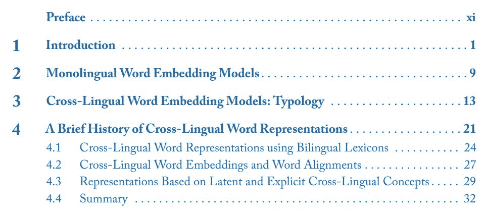
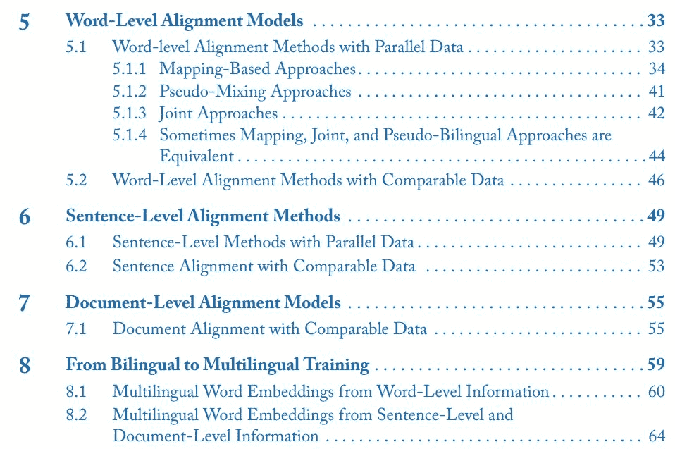
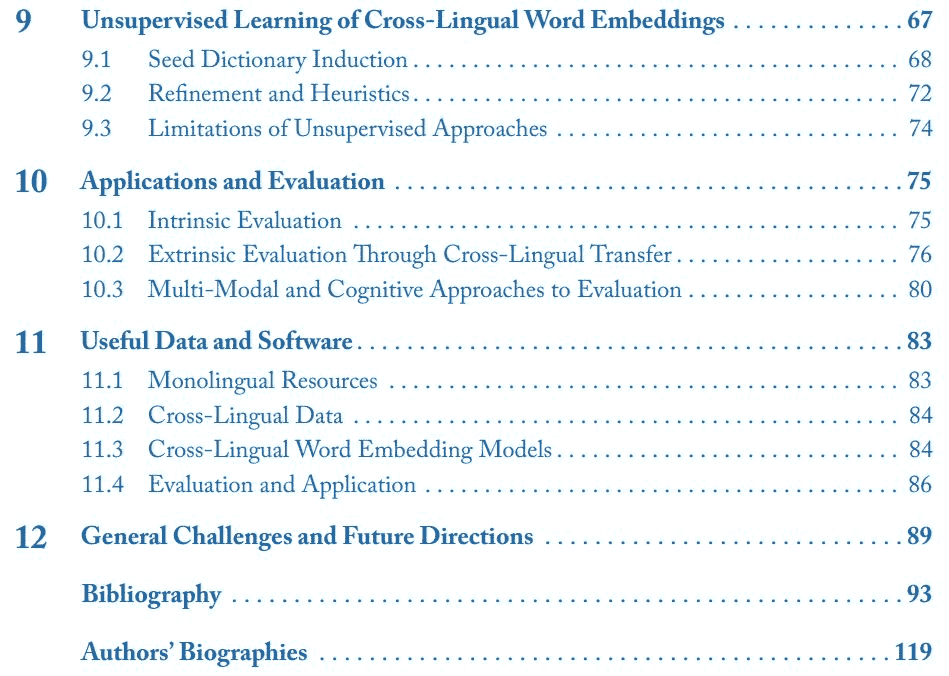
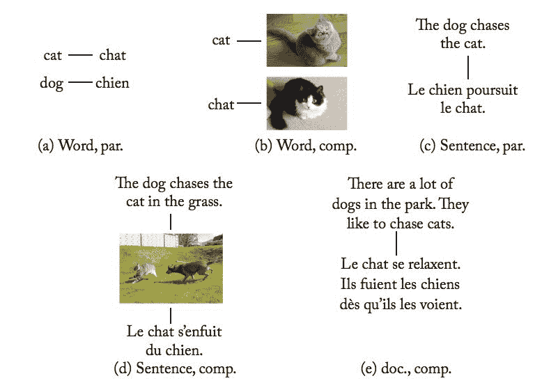
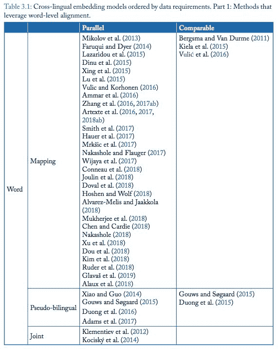
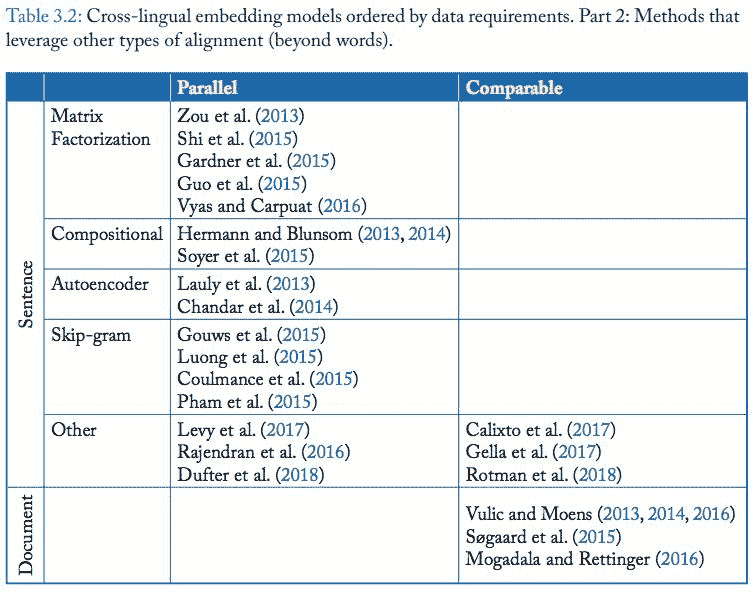

# 系统探讨「跨语言词嵌入」，这是一本刚出炉新书

> 原文：[`mp.weixin.qq.com/s?__biz=MzA3MzI4MjgzMw==&mid=2650764134&idx=3&sn=3b537c5bd6de11cd32dd40ffab1b4da0&chksm=871ab718b06d3e0e8d4ccdd8eee77ea8cadd2bfb32da58aa6d71ac297450832af5d8b0859463&scene=21#wechat_redirect`](http://mp.weixin.qq.com/s?__biz=MzA3MzI4MjgzMw==&mid=2650764134&idx=3&sn=3b537c5bd6de11cd32dd40ffab1b4da0&chksm=871ab718b06d3e0e8d4ccdd8eee77ea8cadd2bfb32da58aa6d71ac297450832af5d8b0859463&scene=21#wechat_redirect)

机器之心报道

**参与：路**

> 近日，自然语言领域专家、DeepMind 研究科学家 Sebastian Ruder 等人发表了新书《Cross-Lingual Word Embeddings》。这本书由哥本哈根大学 Anders Søgaard、剑桥大学 Ivan Vulić、DeepMind Sebastian Ruder 与谷歌 Manaal Faruqui 合著，主要探讨自然语言处理领域中的跨语言词嵌入问题。

大部分 NLP 问题是关于英语语言处理的，英语语言具备优秀的语言技术支持，而同类的支持对于阿尔巴尼亚语、缅甸语、宿务语等语种而言非常有限。弥补不同语种之间的数字鸿沟对于科学和民主都至关重要，同时这也代表了一种巨大的增长潜力。而其关键挑战在于，对齐不同语言的基础语义单元。

四位作者在《Cross-Lingual Word Embeddings》一书中，研究并讨论了从之前到近阶段关于此类对齐的监督和无监督学习研究。具体而言，这本书系统性地探讨了「跨语言词嵌入」问题，全书使用了一致的符号，并以可比较的形式介绍可用方法，从而帮助读者更容易地对比大量不同方法。

作者为这些不同方法建立了关联，而这在之前是没有过的，而且他们还以非常紧凑的方式展示了快速增长的研究文献。此外，作者还讨论了如何更好地评估跨语言词嵌入方法，并调查了方便对该主题感兴趣的学生和研究者使用的资源。

**目录**

该书的目录如下所示：

*   这本书第二章主要介绍了最常用的单语言词嵌入模型；

*   第三章介绍了本书的一项主要贡献：监督式跨语言词嵌入模型的分类标准：对齐的类型、可比较性；

*   第四章介绍了概述了跨语言词表征的历史；

*   第五、六、七章分别介绍了词级、句子级、文档级对齐模型；

*   第八章介绍了哪些双语方法可以扩展到多语环境中；

*   第九章介绍了，不依赖于显式双语监督信号、以无监督方式学习跨语言词嵌入的近期研究；

*   第十章探讨了跨语言词嵌入模型的任务、基准和评估，以及常见应用；

*   第十一章列举了适用于对该领域感兴趣的学生及研究者的资源；

*   第十二章介绍了跨语言词嵌入领域的挑战以及未来研究方向。

**监督式跨语言词嵌入模型的分类**

我们简要介绍一下该书第三章的内容，即作者们认为的监督式跨语言词嵌入模型的分类。

他们按照两个维度来划分：监督所需对齐的类型、对齐编码的可对比性，即根据跨语言词嵌入模型使用的数据类型进行分类。

具体而言：

*   对齐类型：跨语言词嵌入模型使用不同类型的双语监督信号：词级、句子级、文档级。一些监督信号更细粒度，例如，词级对齐更容易展示两个单词在对应语境中是否语义对应或类似；但有时候研究者需要依赖较为粗粒度的信号，比如将句子或文档进行对齐。

*   可对比性：这些方法要么需要平行数据库（如不同语言的译文），要么需要可比较数据（其与平行数据在一些方面上是类似的）。平行数据中存在词义或句子意思的近似一对一对应；而可比较数据不存在语义对应，而是相似词、句子或文档之间的近似一对一对应，比如同样主题的文档。最常用的可比较数据资源是维基百科，研究者可以从中轻松抓取同一主题的多语言文档（或网页）。简言之，「平行数据」指意义对应，「可比较数据」指相同主题的数据。

作者将对齐类型分为三类：词级、句子级和文档级，并以此为基础对对齐信号的数据类型进行分类（平行数据 vs 可比较数据）。

下图展示了不同对齐类型的数据源示例。

*表 3.1 和 3.2 展示了在这种分类方法下的跨语言词嵌入模型分类结果。*

其中表 3.1 列举了词对齐类型的方法：

从该表中可以看出，词对齐类型方法在近期研究中是主流。

下表 3.2 列举了其他两种对齐类型（句子对齐和文档对齐）的方法：

这本书按照该分类方法进行不同方法的介绍、分析和对比，细致地介绍了跨语言词嵌入问题。

对跨语言词嵌入主题感兴趣的读者，可通过此书查看更多内容。

*链接：http://www.morganclaypoolpublishers.com/catalog_Orig/product_info.php?products_id=1419*

****本文为机器之心报道，**转载请联系本公众号获得授权****。**

✄------------------------------------------------

**加入机器之心（全职记者 / 实习生）：hr@jiqizhixin.com**

**投稿或寻求报道：**content**@jiqizhixin.com**

**广告 & 商务合作：bd@jiqizhixin.com**