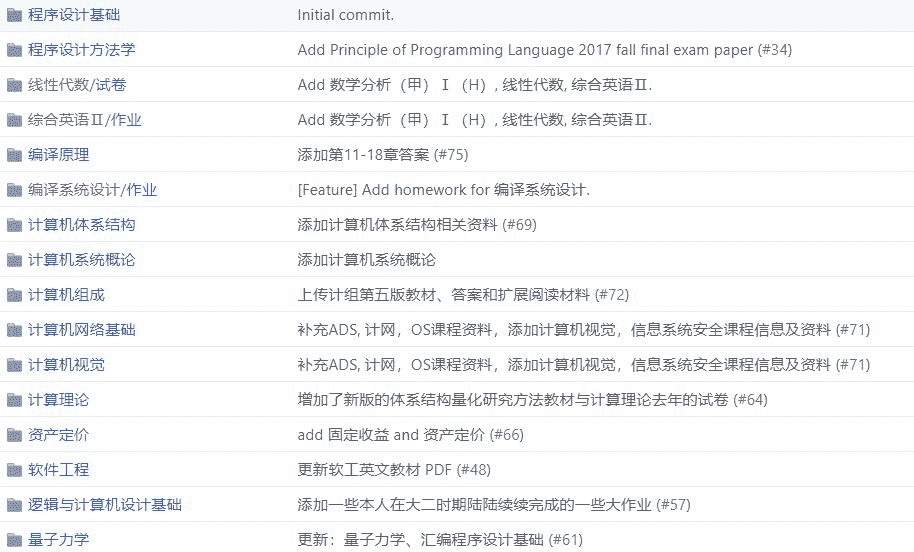
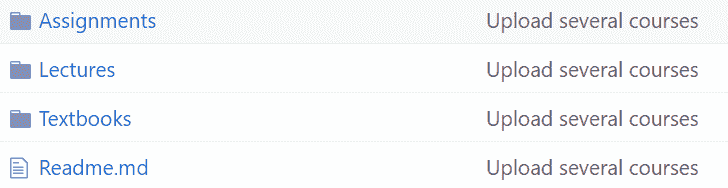
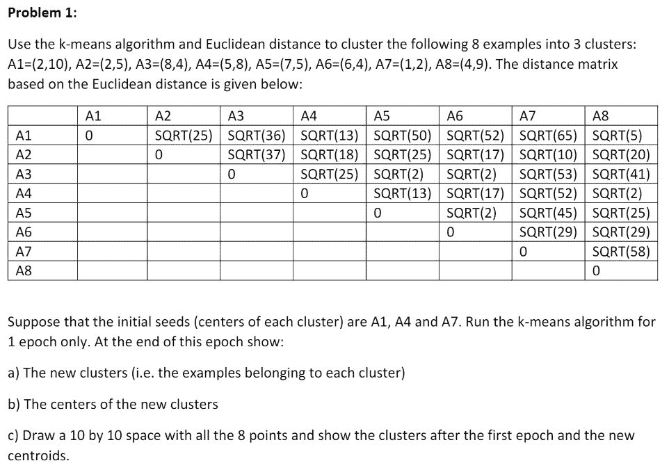
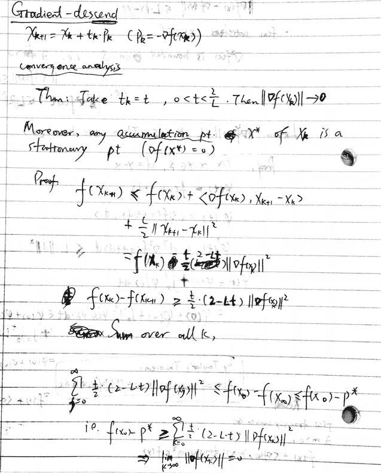
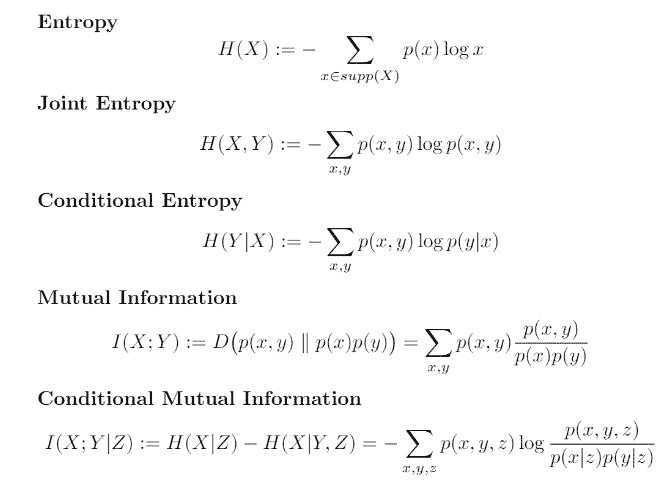
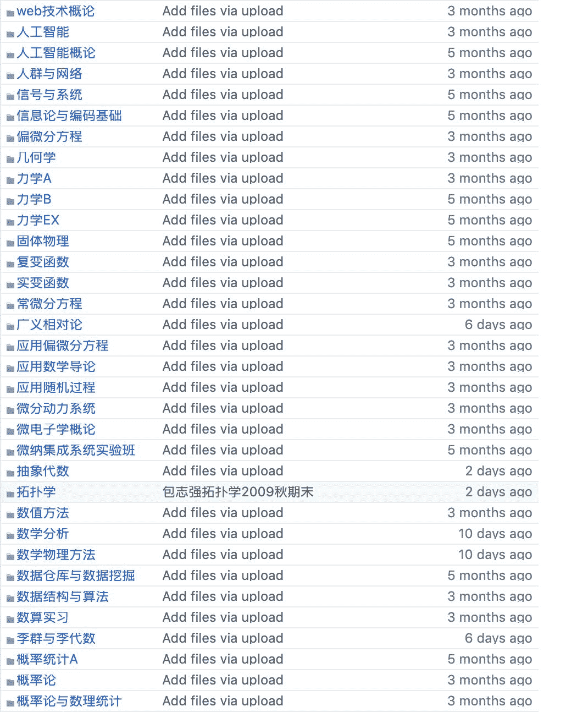
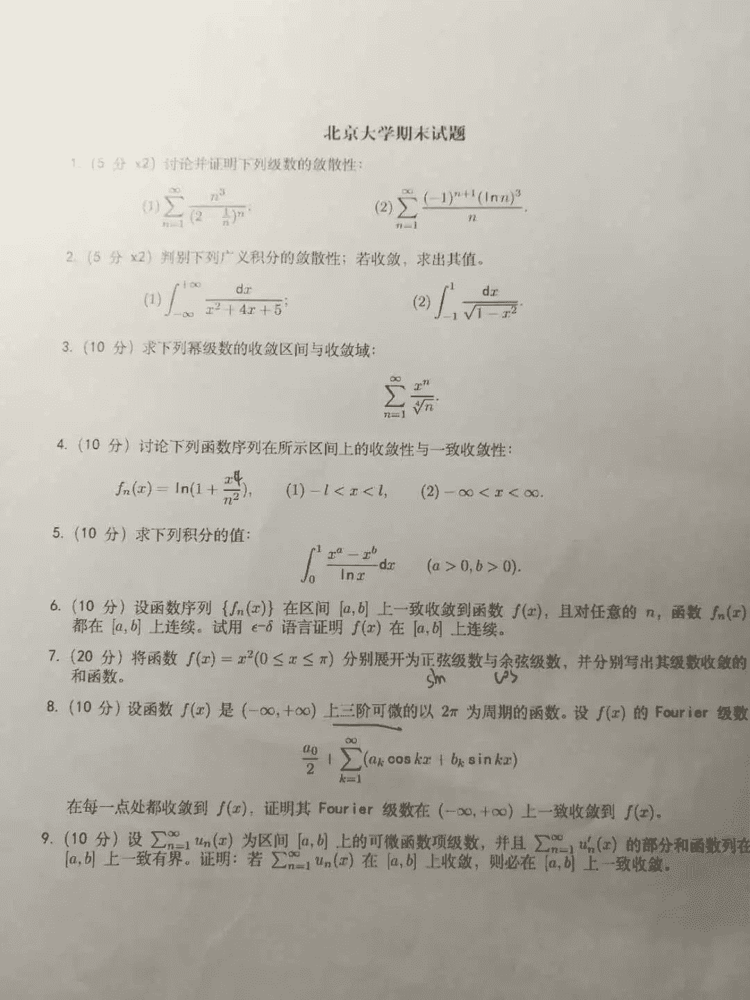
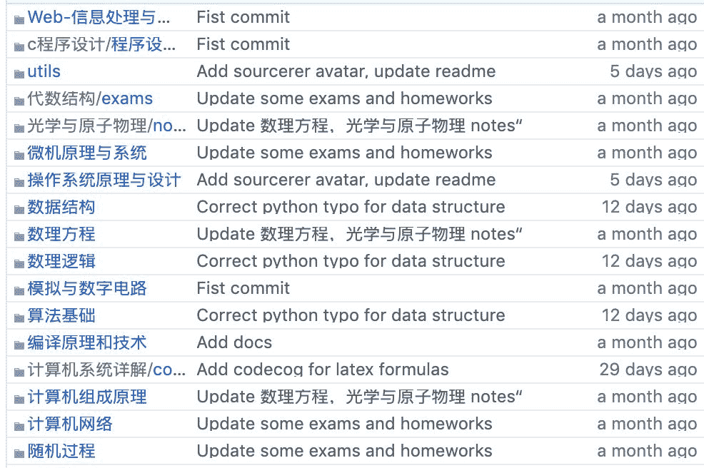

# 最强学习资料：国内多所重点大学课程攻略

> 原文：[`mp.weixin.qq.com/s?__biz=MzA3MzI4MjgzMw==&mid=2650760514&idx=1&sn=654f0b55d8803442f9a8c2a78a2848bf&chksm=871aa13cb06d282a1865ef737c938257450a75f5a71c3f0a5719549e7bfe3e57547d14932b1b&scene=21#wechat_redirect`](http://mp.weixin.qq.com/s?__biz=MzA3MzI4MjgzMw==&mid=2650760514&idx=1&sn=654f0b55d8803442f9a8c2a78a2848bf&chksm=871aa13cb06d282a1865ef737c938257450a75f5a71c3f0a5719549e7bfe3e57547d14932b1b&scene=21#wechat_redirect)

机器之心报道

**机器之心编辑部**

或许每个经历过大学生涯的人都会有这样的感受：曾经努力收集各种课程资料，但在修完一门课程之后却会发现遗漏了很多重点内容。每一代前辈总结出的经验也常常因为无处传承而逐渐遗漏消失。

为了减少重复劳动，让我们不再孤军奋战，来自浙江大学、北京大学等国内高校的贡献者们发起了课程资料民间整理项目。目前各家大学的课程资料整理已搭建了自己的网站，在 GitHub 上积累了大量 Star。

这些内容不仅是教材的电子版，也有历年试卷、复习资料、习题答案甚至选课攻略。作者表示，希望能够将这些隐晦的、不确定的、口口相传的资料和经验，变为公开的、易于获取的和大家能够共同完善、积累的共享资料。

目前这些项目已经包含了大多数计算机科学方面的课程。

其实说到课程攻略共享计划，大家可能都会想到浙大开源的项目，它从数学、物理、计算机、化学和其他通识课出发介绍大量课程攻略与资料。浙大的共享项目目前包括 50+的主题，如下展示了其中一些：

浙大共享项目地址：https://github.com/QSCTech/zju-icicles

**机器学习资料哪家强**

作为最早搭建起来的课程攻略共享计划之一，浙大的开源项目主要是「全」。但是对于机器学习学习者而言，这些资料很少深入到 ML 核心课程，它们还是比较广泛的计算机学科资料。因此，我们这里主要介绍上海交通大学的课程攻略，它包含 ML 领域的大量主题。

上海交大的资源非常适合了解机器学习相关的学习内容与主题，每一个课程文件下都有 PPT、参考课本、作业和笔记等。

项目地址：https://github.com/CoolPhilChen/SJTU-Courses

*   计算机

*   CS125 程序设计

*   CS221 数据结构

*   CS222 算法分析与设计

*   CS258 信息论

*   CS385 机器学习

*   EI331 信号与系统

*   EI332 计算机组成

*   EI338 计算机系统工程

*   EI339 人工智能

*   SE305 数据库技术

*   高级算法

*   数学

*   MA357 数理统计

*   X071571 最优化方法

*   MA26035 测度与概率论

如上很多主题都是学机器学习该了解的，不论是程序设计打造编程功底、最优化方法打造机器「学习过程」，还是人工智能或机器学习等直接相关的主题，我们都应该有所了解。

例如在 CS385 机器学习中，作者介绍了讲师和课程主页等标配内容，同时也提供了课本、PPT 和作业下载。课本也就是大名鼎鼎的《模式识别与机器学习》（Bishop, PRML）和《机器学习》（周志华），课程 PPT 则从最简单的线性模型到 EM 算法涉及主要的 9 个主题。

CS385 还提供了 5 次家庭作业，每一次家庭作业都包含多个问题，不过我们暂时没发现有解题方案。上海交大家庭作业的风格如下：

对了，机器学习这门课是大三下学习期开的，感兴趣的读者可详细看看这些资料。

当然，这个项目其它主题也非常详细，例如最优化方法，除了前面提到的几种资源，它还额外提供了课堂手写笔记。如下展示了最优化方法中的手写「课堂笔记」，梯度下降的收敛性分析。

此外，整个项目对在校生有更大的帮助，通过前面那些资源可以了解课程大致内容与方向，复习的时候也有更多的资料。例如在信息论这个主题中，该项目还提供了期中考试的复习材料，这些材料总结了信息论的核心概念。如下是一些信息熵的概念，机器学习中也经常用得上：

**其他国内课程**

除了前面介绍的课程资源，小编还发现了其他几所高校的课程资源，如北大、中科大和清华。

北大课程资源收录了专业课、公选课、英语课等多类不同课程。以专业课为例，作者进行了详细的分类，如人工智能、人工智能概论、抽象代数和概率论等。部分内容最近一次更新是两天前。

*北大课程资源部分截图*

北大课程资源项目地址：https://github.com/lib-pku/libpku

目前，该 Github 项目已经有 1.2 万左右的星标，3800 左右的 Fork。

*该资源中收录了很多北京大学的期中、期末考卷。**这张 17-18 年信息科学技术学院的高数 b 期末考题你可以做出几道？*

中科大的这一课程资源项目收录了中国科学技术大学众多课程资源的笔记，总结，经验等学生自己原创的内容。

中科大项目地址：https://github.com/USTC-Resource/USTC-Course

此外，从大一上到大四上，清华大学计算机系课程攻略项目按照学期整理了该校计算机系的课程资源。中山大学同样整理了期末考试的往年试卷、复习资料等辅助内容。课程资源再多，学到才是自己的，建议读者们根据自己的需求有针对的进行学习。

最后，知识的传承是一个长期任务，欢迎大家继续作出贡献！

****本文为机器之心报道，**转载请联系本公众号获得授权****。**

✄------------------------------------------------

**加入机器之心（全职记者 / 实习生）：hr@jiqizhixin.com**

**投稿或寻求报道：**content**@jiqizhixin.com**

**广告 & 商务合作：bd@jiqizhixin.com**