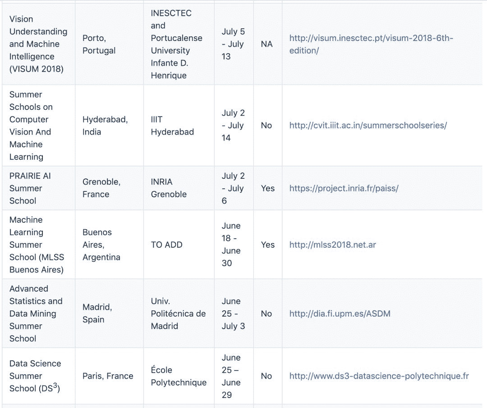

# 做个爱学习的孩子！收藏 2019 知名机器学习暑期学校大列表

> 原文：[`mp.weixin.qq.com/s?__biz=MzA3MzI4MjgzMw==&mid=2650755184&idx=2&sn=672070cc28912e9ee0978b0d5165477b&chksm=871a940eb06d1d18b226ebccdbcb59dec88d2e1bdb6973e5cf27737f45340e3f4d8e5757391d&scene=21#wechat_redirect`](http://mp.weixin.qq.com/s?__biz=MzA3MzI4MjgzMw==&mid=2650755184&idx=2&sn=672070cc28912e9ee0978b0d5165477b&chksm=871a940eb06d1d18b226ebccdbcb59dec88d2e1bdb6973e5cf27737f45340e3f4d8e5757391d&scene=21#wechat_redirect)

机器之心报道

**参与：李亚洲**

> 2018 年，机器之心为大家介绍了大量的[教程](http://mp.weixin.qq.com/s?__biz=MzA3MzI4MjgzMw==&mid=2650754836&idx=1&sn=6e05e0961bb0aa292cb2d3059aa04e00&chksm=871a8b6ab06d027cb60f470abf45885b81faf60c91d5757f8da69eea203bf85ff2e61bc1292c&scene=21#wechat_redirect)、课程等学习资源。新的一年已经到来，小编在此文章中为热爱学习的读者们推荐 2019 年暑期课程列表，收藏了吧！

Github 项目地址：https://github.com/sshkhr/awesome-mlss

在此列表中，作者列出了这些暑期学习的开办地点、组织方、日期、截止日期、是否有资助等信息。其中包括我们所熟知的由 CIFAR 等机构主办的 DLRL 暑期学校。

2019 年知名暑期学校的信息如下：

除了 2019 年即将举办的暑期学校，作者还列出了已经结束的 18 个 2018 年暑期学校的信息。据机器之心了解，这些课程在结束后会陆续放出相关视频与 PPT 资源，例如我们每年都会为读者推荐多伦多的深度学习与强化学习暑期学校的学习资源：

[重磅｜Yoshua Bengio 组织深度学习暑期班，你想见的一流学者和热门课程都来了（附 17 个课程 PPT）](http://mp.weixin.qq.com/s?__biz=MzA3MzI4MjgzMw==&mid=2650718072&idx=1&sn=93f90c233077280da3097f397da6260b&scene=21#wechat_redirect)

*   [重磅 | Yoshua Bengio 深度学习暑期班，35 个授课视频全部开放（附观看地址）](http://mp.weixin.qq.com/s?__biz=MzA3MzI4MjgzMw==&mid=2650718578&idx=1&sn=ff7d748b149e7952c9fa3b53cefd5afc&scene=21#wechat_redirect)

*   [蒙特利尔大学开放 MILA 2017 夏季深度学习与强化学习课程视频（附完整 PPT）](http://mp.weixin.qq.com/s?__biz=MzA3MzI4MjgzMw==&mid=2650730321&idx=1&sn=dbf710544d5a00341fca20dd814a33a3&chksm=871b2b2fb06ca239a2b4b4c9d7ce35e831eef85faaf57f83e527cce949df6e2fecd7a9f8b206&scene=21#wechat_redirect)

*   [资源 | Bengio 等人的 2018 夏季课程视频终放出，但有些沉重](http://mp.weixin.qq.com/s?__biz=MzA3MzI4MjgzMw==&mid=2650750516&idx=2&sn=cc159764187479a67539b58e931ed31f&chksm=871afa4ab06d735ca7f13e58001244d1af9b839531922ffac208e27297a789156b013ae19703&scene=21#wechat_redirect)

*   [MILA 2018 夏季深度学习与强化学习课程资源大放送](http://mp.weixin.qq.com/s?__biz=MzA3MzI4MjgzMw==&mid=2650750266&idx=1&sn=8581754df249ddaaa1b72ae37f9fcf9e&chksm=871af944b06d70524fa06cbc5a5dd19e30c81b32efdf1622813321f80be75b1af6e51d593fac&scene=21#wechat_redirect)

只能远程学习的读者可以保持关注。********

****本文为机器之心报道，**转载请联系本公众号获得授权****。**

✄------------------------------------------------

**加入机器之心（全职记者 / 实习生）：hr@jiqizhixin.com**

**投稿或寻求报道：**content**@jiqizhixin.com**

**广告 & 商务合作：bd@jiqizhixin.com**