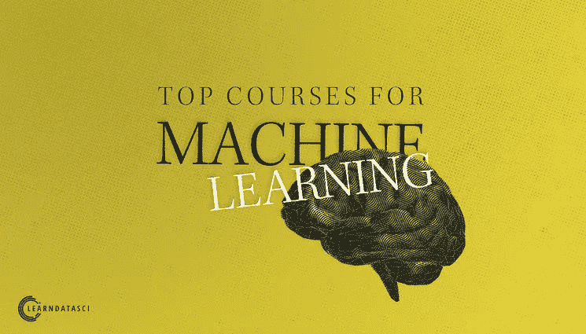

# 选机器学习课程怕踩雷？有人帮你选出了 top 5 优质课

> 原文：[`mp.weixin.qq.com/s?__biz=MzA3MzI4MjgzMw==&mid=2650757990&idx=2&sn=2a1184c71aab94ae51cdc730da4ac1cd&chksm=871a9f18b06d160e955aa5db8c28bc662cc583f0e294417b3db179fb9db58d2a8a458548095d&scene=21#wechat_redirect`](http://mp.weixin.qq.com/s?__biz=MzA3MzI4MjgzMw==&mid=2650757990&idx=2&sn=2a1184c71aab94ae51cdc730da4ac1cd&chksm=871a9f18b06d160e955aa5db8c28bc662cc583f0e294417b3db179fb9db58d2a8a458548095d&scene=21#wechat_redirect)

选自 Medium

**作者****：LearnDataSci**

**机器之心编译**

> 本文作者在多年研究在线学习图景、在不同平台注册大量机器学习课程后，收集了目前最好的 5 门机器学习课程。

机器学习根植于统计学，正在逐渐成为最有趣、发展最快的计算机科学领域之一。机器学习可应用到无数行业和应用中，使其更加高效和智能。

聊天机器人、垃圾邮件过滤、广告服务、搜索引擎和欺诈检测，这些都是机器学习模型在日常生活中的应用实例。机器学习使我们为人类力不能及的事找到模式、创建数学模型。

与涉及探索性数据分析、统计学、通信和可视化技术的数据科学课程不同，机器学习课程主要讲授机器学习算法、数学原理，以及如何使用某种编程语言写算法。

本文介绍了 top 5 机器学习课程：

*   吴恩达《机器学习》课程：https://www.learndatasci.com/out/coursera-machine-learning/

*   吴恩达《深度学习专项课程》：https://www.learndatasci.com/out/coursera-deep-learning-specialization/

*   SAEED AGHABOZORGI 主讲的 Machine Learning with Python 课程：https://www.learndatasci.com/out/coursera-ibm-machine-learning-python/

*   Advanced Machine Learning 专项课程：https://www.learndatasci.com/out/coursera-advanced-machine-learning-specialization/

*   哥伦比亚大学的 Machine Learning 课程：https://www.learndatasci.com/out/edx-columbia-machine-learning/

**筛选标准**

本文介绍的 5 门机器学习课程遵循以下标准：

*   严格专注于机器学习领域。

*   使用免费开源的编程语言，如 Python、R 或 Octave。

*   使用免费开源的库。

*   包含编程作业和实践。

*   解释算法运行的数学原理。

*   学员可以自己调节进度，大约每月可以获取新的课程。

*   讲师有趣、课堂有趣。

*   在不同网站和论坛上的评分和评价高于平均值。

*   若想尽快全面地学习机器学习，那么学习者还应该在在线学习之外看一些相关书籍。作者推荐了以下两本书籍，这两本书对作者的学习带来了很大影响。

**书籍**

**1\. An Introduction to Statistical Learning: with Applications in R **

免费在线版地址：http://www-bcf.usc.edu/~gareth/ISL/

这本书具备清晰直接的解释和示例，可以帮助读者提升对基础机器学习技术的数学理解。这本书更加偏重理论，但仍然包含一些使用 R 语言的练习和示例。

**2\. Hands-On Machine Learning with Scikit-Learn and TensorFlow: Concepts, Tools, and Techniques to Build Intelligent Systems**

这本书是对上一本书的良好补充，它主要涉及使用 Python 的机器学习应用。这本书搭配以下任意一门课程，可以帮助大家强化编程技能，了解如何直接将机器学习应用到项目中。

以下是本文的重头戏：top 5 机器学习课程。

**一、吴恩达《机器学习》课程**

这门课适合初学者，其讲师和创建者是斯坦福大学教授、谷歌大脑联合创始人、Coursera 联合创始人吴恩达。

这门课的作业要求使用开源编程语言 Octave，而不是 Python 或 R。这对于很多人来说有些怪异，但对于新手而言，Octave 是学习机器学习基础的简单方式。

整体来看，这门课程的材料翔实，直接由吴恩达授课，详细解释了每个算法必需的所有数学知识，还涉及了一些微积分知识和线性代数知识。这门课程基本上是独立的，不过提前了解一些线性代数知识会很有帮助。

*   课程提供者：吴恩达，斯坦福大学

*   费用：免费；如需课程证书，则需 79 美元

课程结构：

*   单变量线性回归

*   线性代数概要

*   多变量线性回归

*   Octave/Matlab 教程

*   Logistic 回归

*   正则化

*   神经网络：表征

*   神经网络：学习

*   使用机器学习的建议

*   机器学习系统设计

*   支持向量机

*   降维

*   异常检测

*   推荐系统

*   大规模机器学习

*   应用案例：Photo OCR

该课程持续时间为 11 周。如果可以坚持上完整个课程，你将在大约四个月内对机器学习有一个较好的基本了解。

之后，你可以再学习感兴趣的高阶或专项课程，如深度学习、机器学习工程等。

这门课程对于新手来说无疑是最好的课程。

参考文章：[资源 | 吴恩达《机器学习》笔记，哥大研究生献上](http://mp.weixin.qq.com/s?__biz=MzA3MzI4MjgzMw==&mid=2650752922&idx=2&sn=7ee3962b266b695e330a409325dcbe43&chksm=871a83e4b06d0af257d89e302ee09aaf7a985e7b33e89830d87f5f42ad6f50bae8fbbb920237&scene=21#wechat_redirect)

**二、吴恩达深度学习专项课程**

该课程同样是吴恩达开设的。这是一个更高级的课程系列，适用于任何对机器学习、深度学习及其原理和应用感兴趣的人。

该课程共包括 5 门课，每门课的作业和授课都使用 Python 编程语言和 TensorFlow 神经网络库。该课程是吴恩达机器学习课程的良好后续，因为授课风格类似，而且你还可以学习使用 Python 进行机器学习。

*   课程提供者：吴恩达，deeplearning.ai

*   费用：免费；如需课程证书，则 49 美元/月

课程结构：

1\. 神经网络和深度学习

*   深度学习简介

*   神经网络的基本概念

*   浅层神经网络

*   深度神经网络

2\. 改善神经网络：调参、正则化和优化

*   深度学习的实践

*   优化算法

*   超参数调整、批归一化和编程框架

3\. 构建机器学习项目

*   机器学习策略（1）

*   机器学习策略（2）

4\. 卷积神经网络

*   卷积神经网络基础

*   深度卷积模型：案例研究

*   目标检测

*   特殊应用：人脸识别和神经风格迁移

5\. 序列模型

*   循环神经网络

*   自然语言处理和词嵌入

*   序列模型和注意力机制

要想理解该课程中介绍的算法，你应该先熟悉线性代数和机器学习。如果你需要关于学习所需数学知识的建议，可以参阅文末的学习指南（Learning Guide）。

参考文章：

*   [吴恩达 Deeplearning.ai 课程学习全体验：深度学习必备课程（已获证书）](http://mp.weixin.qq.com/s?__biz=MzA3MzI4MjgzMw==&mid=2650729826&idx=1&sn=9efa4e62ae2456cc509b85a66a376be4&chksm=871b291cb06ca00ac758954e0d76301490af5d5f4d6ab5824f0e46ae0b0dbfa891fb9b210036&scene=21#wechat_redirect)

*   [入门 | 吴恩达 Deeplearning.ai 全部课程学习心得分享](http://mp.weixin.qq.com/s?__biz=MzA3MzI4MjgzMw==&mid=2650732373&idx=2&sn=a9e7e73cf7341e82ab8b803bbcc9a4b0&chksm=871b332bb06cba3d7568b77e5a9067d3e57ab066044cd2617958987805dd2b070feb0c4360a9&scene=21#wechat_redirect) 

*   [资源 | 吴恩达 deeplearning.ai 五项课程完整笔记了解一下？](http://mp.weixin.qq.com/s?__biz=MzA3MzI4MjgzMw==&mid=2650739143&idx=2&sn=a8f9c0dd6e41756e724caf96c2243fb9&chksm=871ad5b9b06d5caf35ab9995ed1b67aba2a1d75454e74532276f836da8e7bdf2765be09f1089&scene=21#wechat_redirect)

*   [这是一份优美的信息图，吴恩达点赞的 deeplearning.ai 课程总结](http://mp.weixin.qq.com/s?__biz=MzA3MzI4MjgzMw==&mid=2650738808&idx=1&sn=950b3a51af28a0434018343a2810bc82&chksm=871ad406b06d5d1000a246ea73acb9bec34e9b1de8f19fc90e473f071a2c40667676a174eb1b&scene=21#wechat_redirect)

**三、用 Python 进行机器学习**

这也是一个适合初学者的课程，只关注最基本的机器学习算法。讲师、幻灯片动画和对算法的解释结合得非常好，能让你对基本概念有直观的了解。

该课程使用 Python，但对算法背后的数学知识讲得较少。通过每个模块，你将有机会在浏览器中下载一个交互式 Jupyter notebook 来实践你学到的新概念。每个 notebook 会巩固你的知识，并提供了在真实数据上使用算法的具体说明。

*   课程提供者：IBM, Cognitive Class

*   费用：免费；如需课程证书，则 39 美元/月

课程结构：

*   机器学习导论

*   回归

*   分类

*   聚类

*   推荐系统

*   期末专题

这门课提供的最大好处之一是为每个算法提供了实用的建议。在讲授新算法时，讲师会介绍它的工作原理、优缺点以及你应该在什么样的情况下使用它。其它课程很少会涉及这些，但这些信息对于初学者理解更广泛的背景很重要。

**四、高阶机器学习专项课程**

这是关于机器学习的另一个高阶课程。如果你想尽可能多地学习机器学习技术，该专项课程就是一个很好的选择。

这门课程的教学非常好：很精彩，而且简明扼要。由于这是一门高级课程，因此你需要更多的数学知识。如果你已经参加了一门初级课程，并且复习了线性代数和微积分，这门课将是你补充机器学习其它专业知识的很好选择。

本课程涵盖的大部分内容对许多机器学习项目至关重要。

*   课程提供者：俄罗斯国家研究型高等经济大学（National Research University Higher School of Economics，HSE）

*   费用：免费；如需课程证书，则 49 美元/月

课程结构：

1\. 深度学习导论

*   优化简介

*   神经网络简介

*   图像深度学习

*   无监督表征学习

*   序列深度学习

*   最终项目

2\. 如何在数据科学竞赛中获胜：向顶尖 kaggler 学习

*   介绍和回顾

*   模型的特征处理和生成

*   最终项目说明

*   探索性数据分析

*   验证

*   数据泄露

*   度量优化

*   高级特征工程 1

*   超参数优化

*   高级特征工程 2

*   集成

*   竞赛介绍

*   最终项目

3\. 机器学习贝叶斯方法

*   贝叶斯方法和共轭先验简介

*   期望最大化算法

*   变分推断和隐含狄利克雷分布（LDA）

*   马尔科夫链蒙特卡洛

*   变分自编码器

*   高斯过程和贝叶斯优化

*   最终项目

4\. 实用强化学习

*   简介

*   强化学习核心：动态规划

*   无模型方法

*   基于近似值的方法

*   基于策略的方法

*   探索

5\. 计算机视觉中的深度学习

*   图像处理和计算机视觉简介

*   视觉识别的卷积特征

*   目标检测

*   目标跟踪和动作识别

*   图像分割与合成

6\. 自然语言处理

*   概念介绍和文本分类

*   语言建模和序列标注

*   语义向量空间模型

*   序列到序列任务

*   对话系统

7\. 用机器学习应对大型强子对撞机的挑战

*   面向数据科学家的粒子物理学导论

*   粒子鉴别

*   在稀有衰变中探索新物理学

*   在新 CERN 实验中用机器学习寻找暗物质暗示

*   检测器优化

完成该系列课程大概需要 8-10 个月的时间，所以如果你从今天开始学习，在近一年的时间里，你将学到大量关于机器学习以及前沿应用的知识。

在这几个月里，你还将创建几个真正的项目。这些项目将极大丰富你的简历，让你的 GitHub 更吸引人。

**五、机器学习**

这是数学基础要求最高的一门高级课程。你的线性代数、微积分、概率、编程基础都需要非常牢固。该课程的有趣编程作业可以使用 Python 或 Octave 完成，但不提供关于这两种语言的课程。

该课程最大的亮点在于其涵盖了机器学习的概率方法。如果你之前读过《Machine Learning: A Probabilistic Perspective》等教科书，那么这门课程将成为良好的补充。

*   课程提供者：哥伦比亚大学

*   费用：免费；如需课程证书，则需 300 美元

课程结构：

*   最大似然估计、线性回归、最小二乘法

*   岭回归、偏差-方差、贝叶斯法则、最大后验概率推理

*   最近邻分类、贝叶斯分类器、线性分类器、感知机

*   Logistic 回归、拉普拉斯近似、核方法、高斯过程

*   最大间隔、支持向量机（SVM）、树、随机森林、Boosting 算法

*   聚类、K-均值、EM 算法、缺失数据

*   混合高斯过程、矩阵分解

*   非负矩阵分解、隐因子模型、主成分分析及其变体

*   马尔科夫模型、隐马尔科夫模型

*   连续状态空间模型、关联分析

*   模型选择、未来走向

许多针对初学者的课程可能已经介绍过上述很多主题，但这个课程的数学却是实打实的。如果你已经学过这些，想在数学上更进一步，并且想通过做编程作业推导出一些算法，那么这个课程值得一试。

**学习指南**

首先介绍一下多数机器学习课程需要的知识储备。

**课程知识储备**

高阶课程需要以下知识储备：

*   线性代数

*   概率

*   微积分

*   编程

这些是理解机器学习内在工作原理的必备知识。许多初学者课程通常要求至少有一些编程基础，并熟悉线性代数的基础知识，如向量、矩阵及其符号。

本文提及的第一份课程——吴恩达的《机器学习》复习了大部分所需数学知识，但如果你之前没有学过线性代数，那么同时学习机器学习和线性代数可能会有点困难。

如果你需要温习数学基础知识，请参考以下建议：

推荐学习 Python，因为多数机器学习课程用的编程语言都是 Python。即使你学的是吴恩达的《机器学习》课程（该课程用 Octave），你也应该抽时间学一下 Python，因为早晚都得用到。dataquest.io 也是一份极好的 Python 资源，其交互式浏览器环境中有很多免费的 Python 课程。

这些知识储备有助于初步了解算法的工作原理。

**基础算法**

以下是大家需要熟悉和练习使用的基础算法集合：

*   线性回归

*   Logistic 回归

*   k-均值聚类

*   k-最近邻

*   支持向量机（SVM）

*   决策树

*   随机森林

*   朴素贝叶斯

这些算法是必须了解的，当然还有很多其他算法。上述课程介绍了这些算法及其变体。理解这些技术的原理以及何时使用它们对处理新项目非常重要。

除了这些基础算法之外，还有一些比较高级的技术需要学习：

*   集成

*   Boosting

*   降维

*   强化学习

*   神经网络和深度学习

这只是开始，这些算法通常是最有趣的机器学习解决方案中会使用到的，它们对你的工具箱来说也是个有效的补充。

与基础技术一样，每学习一项新工具，你就要直接将其应用到项目中，以加深理解、融会贯通。

**解决项目**

在线学习机器学习很有难度，当然回报也很大。不过你要记住，只看讲课视频、做测验并不能证明你真的在学习教材。如果你创建一个与课程使用数据和目标皆不同的项目，那么你会学到更多。

在你刚开始学习机器学习基础知识时，你就应该寻找一些有趣的数据，以便实践新技能。上述课程将使学习者了解何时应用算法，因此在自己的项目中应用机器学习算法是一项不错的实践。

通过试错、探索和反馈，你会发现如何使用不同的技术、如何衡量结果、如何分类或预测。关于 ML 项目，这里有一份示例列表，参见：https://github.com/NirantK/awesome-project-ideas。

解决项目会帮助你更好、更高级地理解机器学习。如果你开始了解更高级的概念（如深度学习），那么将有无数种技术和方法去理解和使用。

**阅读新研究**

机器学习是一个快速发展的领域，每天都有新技术和应用出现。你掌握了机器学习基础知识之后，可以阅读自己感兴趣的研究论文。

有一些网站可以即时获取感兴趣领域的新论文。比如谷歌学者，输入关键词「machine learning」和「twitter」，或其他感兴趣的主题，点击「Create Alert」，即可通过电子邮件获取相关新论文通知。

养成每周阅读提醒邮件的习惯，浏览论文以确定是否有阅读的必要，然后深入理解某项研究的具体内容。如果某些研究与你正在做的项目相关，你可以看看是否可以将这些技术应用到自己的问题上。

**结语**

机器学习是一个非常有趣的领域，值得你去学习和体验，希望在这里你可以找到一个适合自己的课程。

机器学习是数据科学的一个重要组成部分，如果你对统计、可视化、数据分析等方面感兴趣的话，可以参考关于顶级数据科学课程推荐的文章：https://www.learndatasci.com / best-data-science-online-courses /。

*原文链接：https://medium.com/@LearnDataSci/top-5-machine-learning-courses-for-2019-8a259572686e*

****本文为机器之心编译，**转载请联系本公众号获得授权****。**

✄------------------------------------------------

**加入机器之心（全职记者 / 实习生）：hr@jiqizhixin.com**

**投稿或寻求报道：**content**@jiqizhixin.com**

**广告 & 商务合作：bd@jiqizhixin.com**