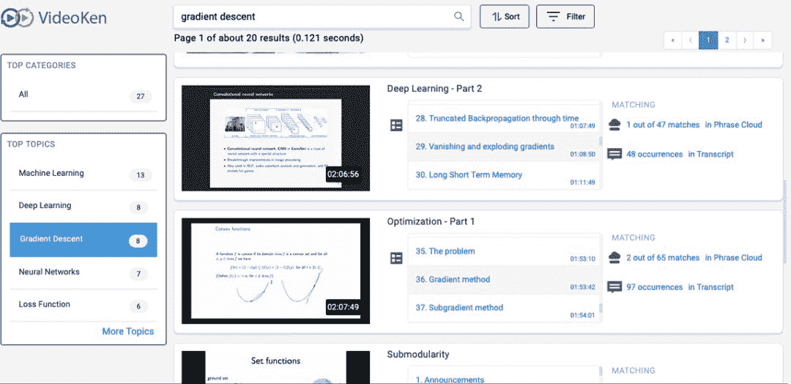
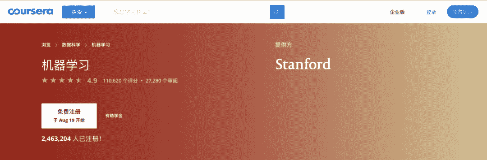
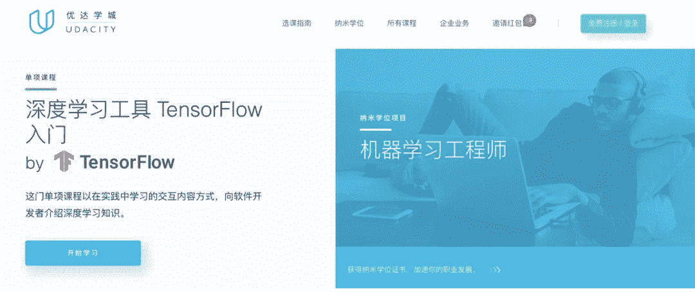
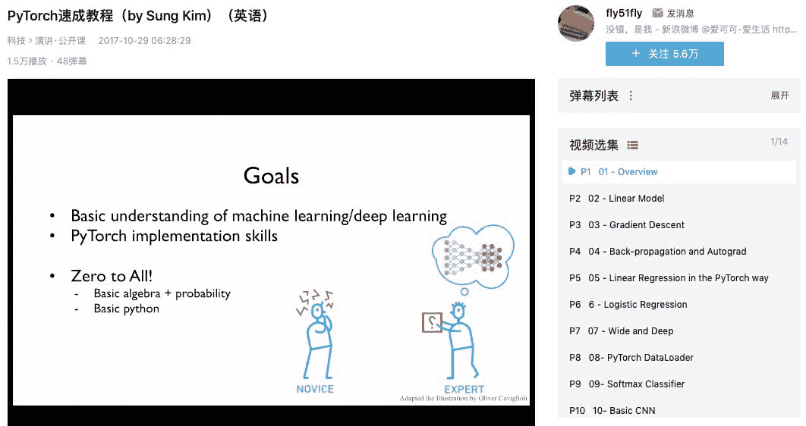
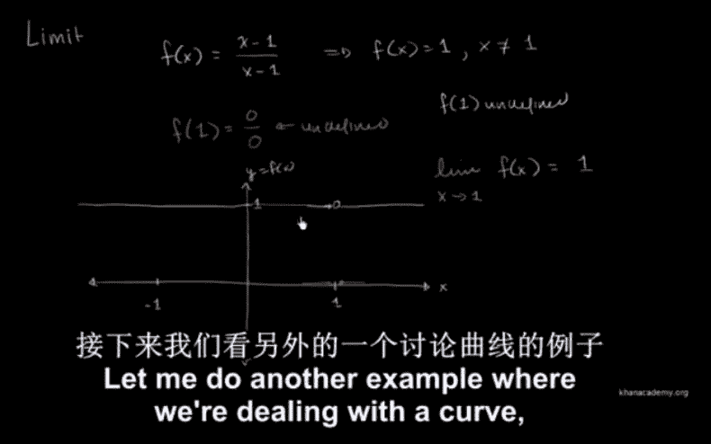
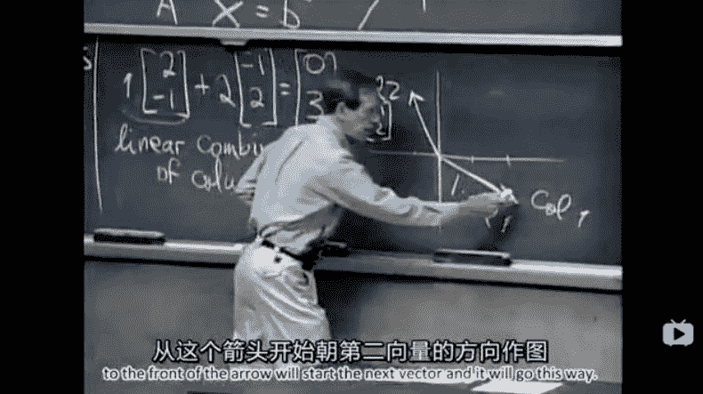
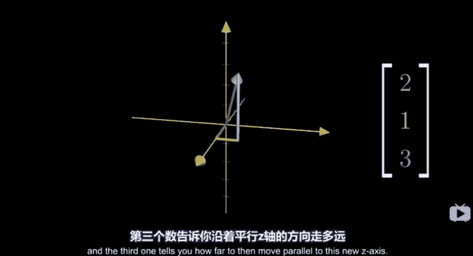

# 硬核暑假要学习：Imperial College London 开放 ML 暑期课程视频

> 原文：[`mp.weixin.qq.com/s?__biz=MzA3MzI4MjgzMw==&mid=2650768000&idx=4&sn=e9a6a915336f85cc8150b637c013ee57&chksm=871a46feb06dcfe8a8c8e7fbfde26a7c60046ea2c330eaa3f334076e321fd5b291e2762255be&scene=21#wechat_redirect`](http://mp.weixin.qq.com/s?__biz=MzA3MzI4MjgzMw==&mid=2650768000&idx=4&sn=e9a6a915336f85cc8150b637c013ee57&chksm=871a46feb06dcfe8a8c8e7fbfde26a7c60046ea2c330eaa3f334076e321fd5b291e2762255be&scene=21#wechat_redirect)

机器之心整理

**参与：一鸣、杜伟**

> 暑期课程是近来非常受欢迎的一种学习方式。国内外很多大学的学生会在放假时寻找大学内或其他大学开发的暑期课程项目。近日，由 DeepMind、英国帝国理工学院等开放的暑期课程视频已开源了。读者朋友可以足不出户，在暑假为自己充充电。

**课程内容**本次课程是一个 12 天的密集课程，涵盖机器学习中广泛的主题，包括优化、贝叶斯推理到深度学习、强化学习等。本次课程的目标是为学生提供机器学习的大体概念，并助力学生成为机器学习研究者。虽然课程提到，他们面向的受众是正在 PhD 前期阶段的学生，但是他们仍欢迎硕士生、博士后、甚至是一些大学教员，说明这些课程主要是为了建立基础的理论和概念，所以难度不算太高。课程官网：https://github.com/mlss-2019/slides**课程资源**本课程的资源现已公开。机器之心观看了一部分视频。和一些已有的课程视频略有不同，本课程**可根据知识点直接从一两个小时课程的中段开始听**。这样对于已经有基础的读者朋友来说，只需要根据每个视频提供的知识点，点击需要查缺补漏的地方就可以了。此外，视频也提供了文本，方便反复查阅。视频资源地址：

*   https://www.bilibili.com/video/av63474628?from=search&seid=2913855858421454954

*   https://search.videoken.com/（可按照关键词导航到知识点）

*该网站包含了所有的课程视频，读者可以在左侧边栏或搜索框提供关键词，网站会自动标红对应的视频中的知识点，方便查找。***课程目录**课程目录如下：**Deep Learning (Kevin Webster, Pierre Richemond, Kai Arulkumaran)**

*   Lecture slides

*   Tutorial

*   Video recording, Part 1

*   Video recording, Part 2

*   Video recording, Part 3

**Optimization (John Duchi)**

*   Lecture slides

*   Tutorial

*   Video recording, Part 1

*   Video recording, Part 2

**Variational Inference (Shakir Mohamed)**

*   Lecture slides 

*   Tutorial

*   Video recording, Part 1

*   Video recording, Part 2

**Reinforcement Learning (Katja Hofmann)**

*   Lecture slides

*   Tutorial

*   Video recording, Part 1

*   Video recording, Part 2

**Interpretability (Sanmi Koyejo)**

*   Lecture slides

*   Video recording, Part 1

*   Video recording, Part 2

**Gaussian Processes (James Hensman)**

*   Lecture slides

*   Tutorial

*   Video recording, Part 1

*   Video recording, Part 2

**Kernels (Lorenzo Rosasco)**

*   Lecture slides

*   Tutorial

*   Video recording, Part 1

*   Video recording, Part 2

**MCMC (Michael Betancourt)**

*   Lecture slides

*   Tutorial

*   Video recording, Part 1

*   Video recording, Part 2

*   Video recording, Part 3

**AI for Good (Julien Cornebise and Moustapha Cisse)**

*   Video recording

**Approximate Bayesian Computation (Sarah Filippi)**

*   Lecture slides

*   Tutorial

*   Video recording, Part 1

*   Video recording, Part 2

**Fairness and Ethics in AI (Timnit Gebru)**

*   Lecture slides

*   Video recording

**Speech Processing (Karen Livescu)**

*   Lecture slides

*   Tutorial

*   Video recording, Part 1

*   Video recording, Part 2

**Learning Theory (Samory Kpotufe)**

*   Lecture slides

*   Video recording, Part 1

**Machine Learning in Computational Biology (Barbara Engelhardt)**

*   Lecture slides

*   Video recording

**Submodularity (Stefanie Jegelka)**

*   Lecture slides

*   Tutorial

*   Video recording

**授课者简介**这些课程的授课者既有来自帝国理工、麻省理工、斯坦福、伊利诺伊大学香槟分校、哥伦比亚大学、普林斯顿大学等著名大学的助理教授和副教授，也有来自谷歌、DeepMind、微软剑桥研究院、PROWLER.io、Element AI 等科技公司和科研机构的研究人员。这些授课者在各自的研究领域内都有着丰富的理论知识和实操经验，相信他们的授课内容会给学生们带来一些不一样的东西。**其他视频课程资源**关于机器学习的课程资源已经是汗牛充栋了，机器之心在此整理了一些不错的课程，帮助读者更好地学习。**机器学习理论**1\. 吴恩达机器学习公开课

*   介绍：这几乎是接触过机器学习的人都知道的课程，即使是完全没有基础的小白也可以入门的机器学习理论课程。课程涵盖了机器学习大部分的理论内容，非常适合入门。

*   课程链接：https://www.coursera.org/learn/machine-learning

2\. 李宏毅机器学习课程

*   介绍：李宏毅教授的机器学习课程人气不输吴恩达，再加上中文授课，理解起来更加容易。机器之心前一段时间曾转载介绍过[李宏毅机器学习课程](http://mp.weixin.qq.com/s?__biz=MzA3MzI4MjgzMw==&mid=2650767463&idx=1&sn=f3dba2069d04303f88e503db771f6957&chksm=871a4419b06dcd0fa7d48a74e78a999518f33eff9ac8b8e1d5704b45311230d4ffa22fe385e7&scene=21#wechat_redirect)笔记开源的新闻。

*   课程链接：https://www.bilibili.com/video/av59538266

**机器学习实战**1\. Udacity 的 TensorFlow2.0 实战教程

*   介绍：TensorFlow 进入 2.0 时代，很多人内心是崩溃的，因为好不容易用习惯了的 API 又变了。当然，TensorFlow 官方考虑到了这个问题，于是和 Udacity 合作提供了 TensorFlow2.0 的实战教程，目前已更新了十几节视频。

*   课程链接：https://cn.udacity.com/course/intro-to-tensorflow-for-deep-learning--ud187

2\. 从零开始的 PyTorch 课程

*   PyTorch 是 TensorFlow 的老对头，深度学习框架中冉冉升起的新星。有很多想写「Pythonic」代码的数据科学家会选择入门 PyTorch。这里机器之心推荐一个英文的 PyTorch 视频课程，从零开始掌握 PyTorch 的全部内容。

*   课程链接：https://www.bilibili.com/video/av15823922

**数学基础**1\. 可汗学院的「微积分预备」课程

*   介绍：这是一个为没有任何数学基础的人准备的微积分预备课程，提供了很多用于学习微积分的预备知识，如极限的相关知识、二项式定理等。

*   课程链接：https://www.bilibili.com/video/av14223492

2\. MIT 的线性代数课程

*   介绍：这是一个极其全面的线性代数课程，从几何空间入手介绍线性代数的原理。Gillbert Strang 老爷子非常有激情，几个小时大课听下来都不觉得很累很难。当然，画质较老，需要适应。

*   课程链接：https://www.bilibili.com/video/av36568126

3.Blue1Brown 的「线性代数的本质」课程

*   介绍：这位大神的课程强烈推荐。本教程用最简单的方式介绍线性代数的知识。耐心看下去，没有不懂的。

*   课程链接：https://www.bilibili.com/video/av5987715

*参考链接：*

*https://search.videoken.com/
https://github.com/mlss-2019/slides
https://sites.google.com/view/mlss-2019/home*

********本****文为机器之心整理，**转载请联系本公众号获得授权****。**
✄------------------------------------------------**加入机器之心（全职记者 / 实习生）：hr@jiqizhixin.com****投稿或寻求报道：**content**@jiqizhixin.com****广告 & 商务合作：bd@jiqizhixin.com**