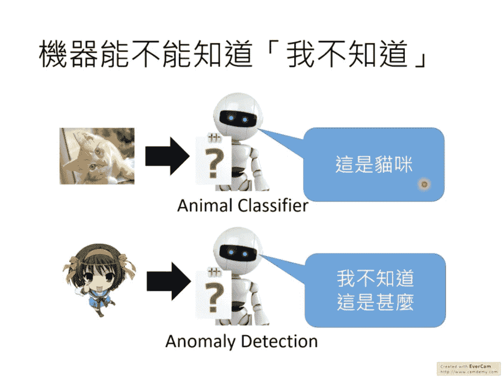
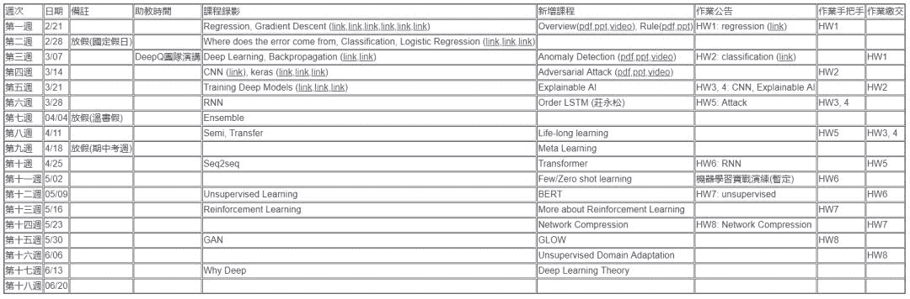
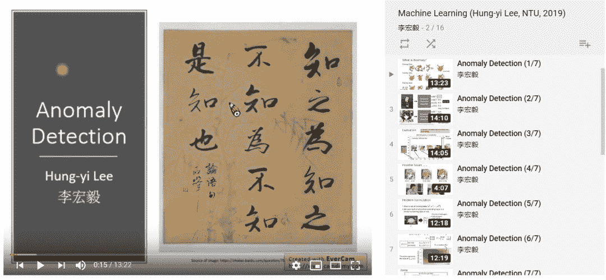
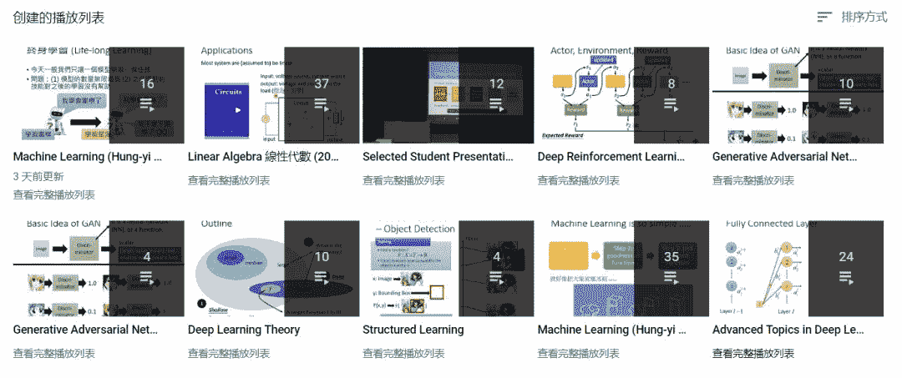

# 中文课程！台大李宏毅机器学习公开课 2019 版上线

> 原文：[`mp.weixin.qq.com/s?__biz=MzA3MzI4MjgzMw==&mid=2650758780&idx=2&sn=25dbf006ead8e67676ba3d7062324ede&chksm=871a9a02b06d1314b4b76e4f4f2c35c0f47e378a12909ceeb1643e40d654cfe997fefef8e005&scene=21#wechat_redirect`](http://mp.weixin.qq.com/s?__biz=MzA3MzI4MjgzMw==&mid=2650758780&idx=2&sn=25dbf006ead8e67676ba3d7062324ede&chksm=871a9a02b06d1314b4b76e4f4f2c35c0f47e378a12909ceeb1643e40d654cfe997fefef8e005&scene=21#wechat_redirect)

机器之心编辑

**参与：思源、泽南**

> 台大教授李宏毅的机器学习课程经常被认为是中文开放课程中的首选。李教授的授课风格风趣幽默，通俗易懂，其课程内容中不仅有机器学习、深度学习的基础知识，也会介绍 ML 领域里的各种最新技术。近日，2019 版的课程资料与视频终于上线了！

*   课程资料链接：http://speech.ee.ntu.edu.tw/~tlkagk/courses_ML19.html

*   课程视频（Bilibili）：https://www.bilibili.com/video/av46561029/

*   YouTube 链接：https://www.youtube.com/playlist?list=PLJV_el3uVTsOK_ZK5L0Iv_EQoL1JefRL4

李宏毅（Hung-yi Lee）目前任台湾大学电机工程学系和电机资讯学院的助理教授，他曾于 2012 年获得台湾大学博士学位，并于 2013 年赴麻省理工学院（MIT）计算机科学和人工智能实验室（CSAIL）做访问学者。他的研究方向主要是机器学习（深度学习）和语音识别。

此前，他的 2016 版《机器学习》课程视频曾是流行学习资料。

*有一个懂二次元的教授真不容易。*

2019 版《机器学习》课程目录，括号内为新增内容：

*   回归、梯度下降

*   分类、逻辑回归，错分类的原因

*   深度学习，反向传播（异常检测）

*   卷积神经网络、Keras（对抗样本攻击）

*   训练深度学习模型（可解释 AI）

*   循环神经网络（Order LSTM）

*   Ensemble

*   半监督学习、迁移学习（终身学习）

*   （元学习）

*   seq2seq（Transformer）

*   （Few/Zero shot learning）

*   无监督学习（BERT）

*   强化学习（更细化）

*   （网络压缩）

*   生成对抗网络（GLOW）

*   （无监督域适应）

*   为什么要使用深度学习（深度学习理论）

看过李宏毅 2017 秋季机器学习课程的同学都知道，他介绍的基础内容非常仔细。例如对于循环神经网络，他会带我们手动运算一遍，从而弄清楚各时间步的输入、储存的记忆和具体运算过程等等。在 19 年的新课中，李宏毅重点开放新课相关的视频与作业。

其中新增课程大部分都是近来比较流行的研究前沿，例如 Seq2Seq 中的全注意力网络 Transformer、生成模型最近流行的新范式流模型（Glow）。这些内容可作为以前 17 年秋季课程的补充，从而让视频整体更接近当下前沿。

目前李宏毅已经放出了异常检测和对抗攻击的视频，它们都是新增加的内容。这些新增的内容最好可以和主课程一起看，因此可以有更好的理解。例如异常检测何以和深度学习基础一起看，对抗攻击可以和卷积神经网络一起看等等。

如上展示的是 YouTube 视频截图，还没科学上网的同学也可以直接看爱可可老师传到 B 站的资源。当然 YouTube 除了新更新的一系列课程，李宏毅老师已经发布了更多的课程主题，例如线性代数、深度强化学习、生成对抗网络、深度学习理论、机器学习（17 年秋季）等。

其中 17 年秋季的机器学习对机器学习及深度学习做了一个整体的概要，这也是李宏毅课程必看的一部分。学完机器学习课程后，基本上我们对各种主题都有一定的理解，因此可以进一步看他关于深度学习高级主题、生成对抗网络等的见解。如下为李宏毅开放的各种主题与视频列表：

最后，看视频做作业都需要坚持，希望大家都能将这些资源化为自己的知识。**********

****本文为机器之心编辑，**转载请联系本公众号获得授权****。**

✄------------------------------------------------

**加入机器之心（全职记者 / 实习生）：hr@jiqizhixin.com**

**投稿或寻求报道：**content**@jiqizhixin.com**

**广告 & 商务合作：bd@jiqizhixin.com**