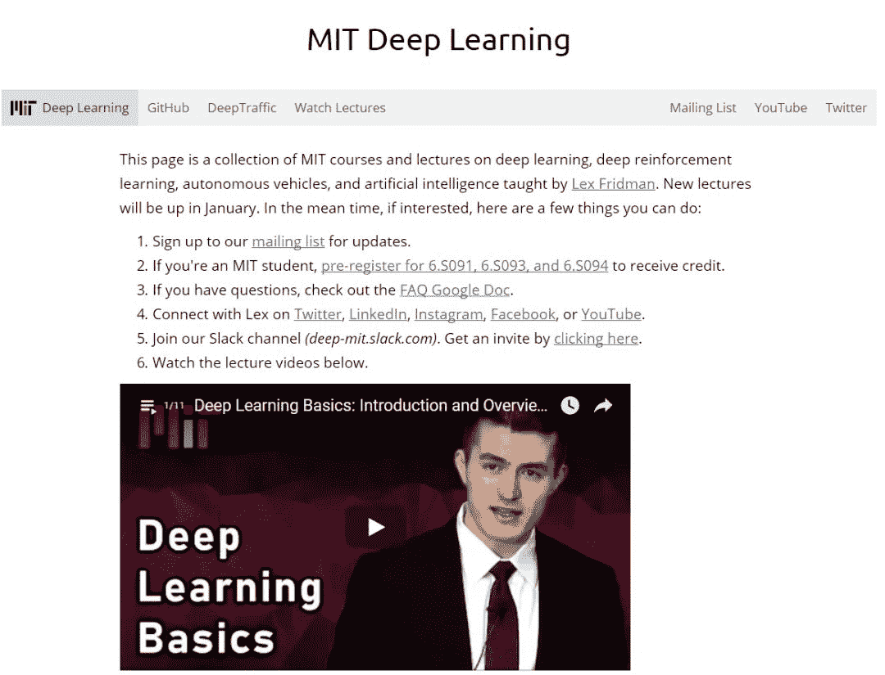
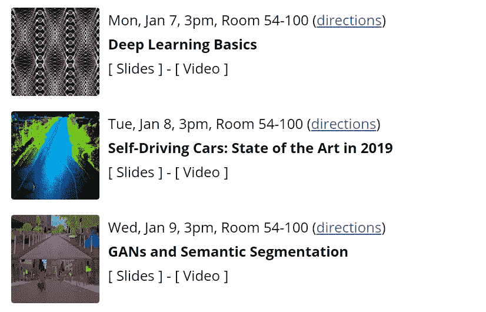
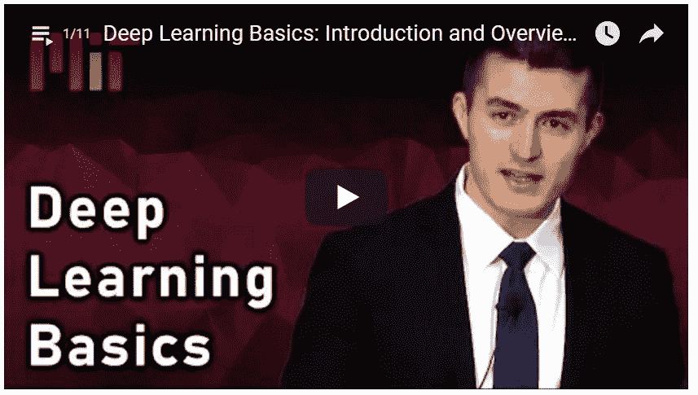
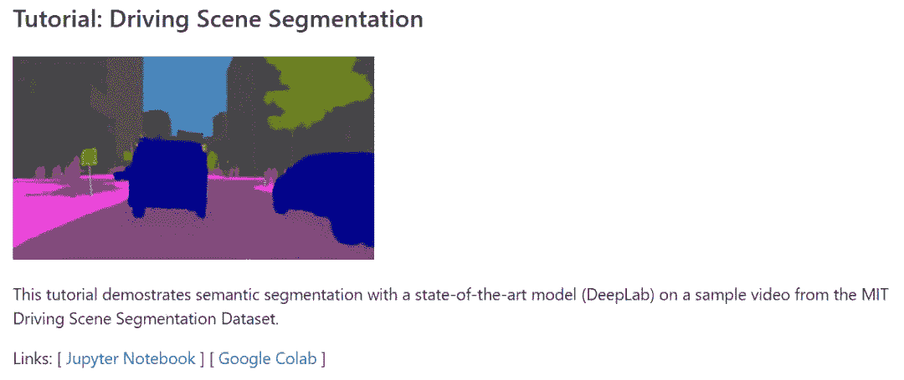
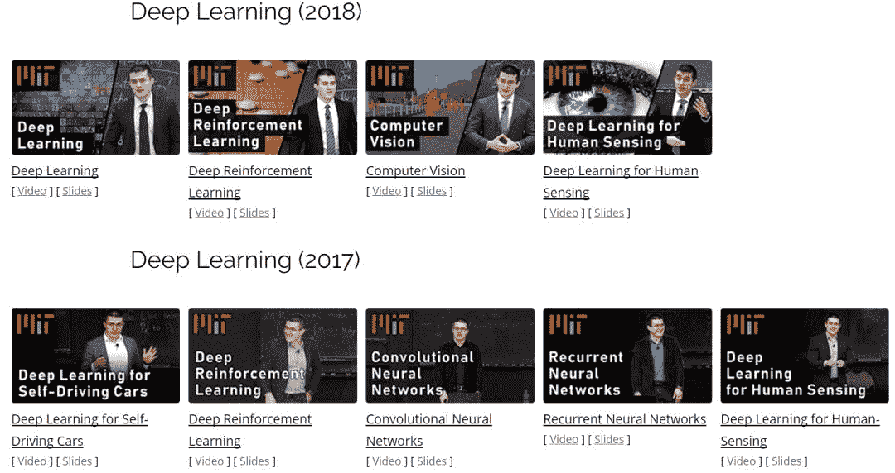
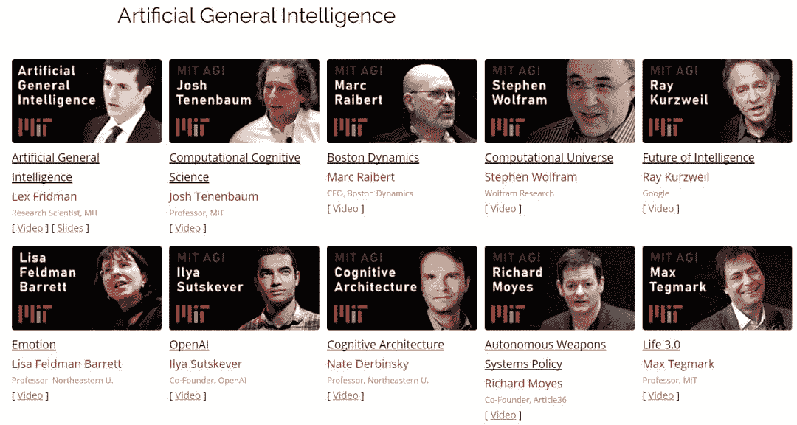
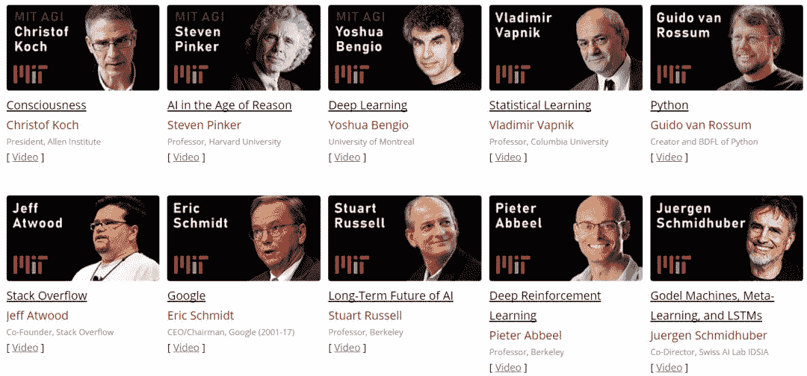

# MIT 2019 深度学习课程开课，第一课视频&PPT 已放出

> 原文：[`mp.weixin.qq.com/s?__biz=MzA3MzI4MjgzMw==&mid=2650755649&idx=4&sn=8fd9d34e090532ca0ed355243b9b6163&chksm=871a963fb06d1f29c9e7f7be31eb83ea27b4c4e439dfc969795a942914c9fdd01305bbb3658a&scene=21#wechat_redirect`](http://mp.weixin.qq.com/s?__biz=MzA3MzI4MjgzMw==&mid=2650755649&idx=4&sn=8fd9d34e090532ca0ed355243b9b6163&chksm=871a963fb06d1f29c9e7f7be31eb83ea27b4c4e439dfc969795a942914c9fdd01305bbb3658a&scene=21#wechat_redirect)

机器之心报道

**作者：刘晓坤、张倩**

> MIT 2019 年为期一个月的深度学习课程已于月初开课，包含自动驾驶汽车的深度学习、深度强化学习、以人为中心的人工智能等主题。目前，课程第一课——《深度学习基础》视频和 PPT 已经放出，其余部分也将陆续发布。

课程地址：https://deeplearning.mit.edu/

这个网页集合了 MIT 开设的深度学习、深度强化学习、自动驾驶以及人工智能的免费课程和讲座视频，讲师是 Lex Fridman。2019 年的最新视频会在这个月开始陆续更新。

Lex Fridman 是 MIT 的研究科学家，致力于以人为本的人工智能，兴趣是开发感知、规划和人机交互的深度学习方法，最近由于视频中的认知负荷估算工作获得了 2018 年 CHI 最佳论文荣誉奖。

**课程主题及时间表**

以下是每门课程的主题和时间表，课程结束后几天就会放出免费视频。

*   6.S094：自动驾驶汽车的深度学习（第 1、2 周）

*   6.S091：深度强化学习（第 3 周）

*   6.S093：以人为中心的人工智能（第 4 周）

6.S094 的课程部分包括三部分：深度学习基础、自动驾驶汽车：2019 年的当前最佳技术、GAN 和语义分割。

**第一课视频及 PPT**

「自动驾驶汽车的深度学习」部分的第一堂课——《深度学习基础》已于 1 月 7 日开课，目前已经放出了视频和 PPT。

*   视频：https://www.youtube.com/watch?v=O5xeyoRL95U

    *   PPT：https://www.dropbox.com/s/c0g3sc1shi63x3q/deep_learning_basics.pdf?dl=0

第一节课《深度学习基础》主要介绍了：

*   简介

*   一张幻灯片了解深度学习

*   深度学习思想和工具的历史

*   TensorFlow 简单示例

*   一张幻灯片了解 TensorFlow

*   深度学习是表征学习

*   为什么要使用深度学习

*   监督学习的挑战

*   关键的低级概念

*   更高级别的方法

*   走向通用人工智能

**GitHub 上的有趣实现**

在相关 GitHub 页面中，MIT 提供了几个有趣的实现，可以在 Colab 或 Jupyter Notebook 上运行。如下图所示，使用 DeepLab 对来自 MIT 驾驶场景分割数据集的样本视频进行语义分割。

项目地址：https://github.com/lexfridman/mit-deep-learning

**科技公司高管讲座**

在讲座部分，MIT 邀请了众多来自科技公司的自动驾驶研究院的科学家，包括英伟达、奥迪、Voyage、Waymo 和 Aptiv。

后面的两门课程中，6.S091 包含深度强化学习入门、基本原理和当前最佳研究的概述；6.S093 包括主题包括用深度学习理解人类的情绪、面部身份、认知负荷、身体姿势、自然语言处理等。

**往年课程**

如果第一部分视频看不够，还可以看看往年的课程视频，也都在同一个网页上，如下所示。

**常见问题解答**

为了回答求知者的疑问，Lex 老师提供了一个答疑文档。

文档地址：https://docs.google.com/document/d/1ZqgghxV1lpZeWUv5zNK0gMUBHfYTw9n6eYzzx9j8nok/edit#

以下是文档的部分内容：

Q：教学和嘉宾讲座的视频是否会发布？何时发布？

A：会的！我相信每个人都能免费获取这一课程资料。在少数情况下，嘉宾不愿意放出自己的讲座视频，请大家尊重他们的意愿。当然，我会尽量说服他们，让每个人都能免费获取这一教学资源，从而受到更多启发，以改善人工智能系统并造福世界。我们会在视频录制后尽快发布在 https://www.youtube.com/lexfridman 或 https://deeplearning.mit.edu/。

Q：该课程有直播吗？

A：不会。

Q：上这门课需要什么预备知识？

A：没有正式的预备知识要求，但具备 Python 和 Javascript 的基本知识可能有助于你做出一个神经网络，这是本课程组织的竞赛之一。

Q：可以上手的项目何时发布？

A：我们正在努力创建一些面向所有人的有趣项目，创建完成后会通过网站、邮件、Slack 及其他渠道发布这些项目。********

*参考内容：https://www.reddit.com/r/MachineLearning/comments/afb8j0/d_mit_deep_learning_basics_introduction_and/*

****本文为机器之心报道，**转载请联系本公众号获得授权****。**

✄------------------------------------------------

**加入机器之心（全职记者 / 实习生）：hr@jiqizhixin.com**

**投稿或寻求报道：**content**@jiqizhixin.com**

**广告 & 商务合作：bd@jiqizhixin.com**