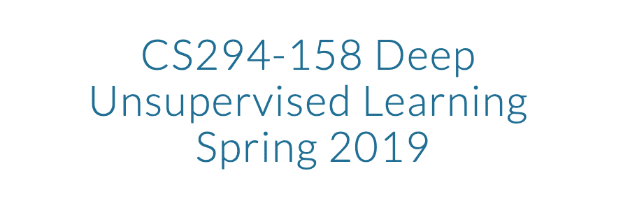
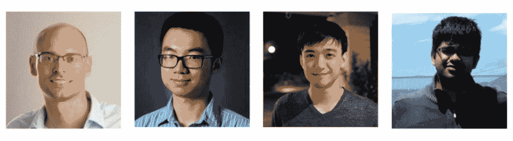

# 十四、周无监督学习课程，UC 伯克利出品，含课件、视频

> 原文：[`mp.weixin.qq.com/s?__biz=MzA3MzI4MjgzMw==&mid=2650772369&idx=4&sn=61e8952d27ca5c46abd82fba1d494692&chksm=871a57efb06ddef9f0ccc29bd6d6bdc41a4fc569cf10d965e60f363366b7497f3cbd325942f1&scene=21#wechat_redirect`](http://mp.weixin.qq.com/s?__biz=MzA3MzI4MjgzMw==&mid=2650772369&idx=4&sn=61e8952d27ca5c46abd82fba1d494692&chksm=871a57efb06ddef9f0ccc29bd6d6bdc41a4fc569cf10d965e60f363366b7497f3cbd325942f1&scene=21#wechat_redirect)

机器之心整理

**参与：郑丽慧**

> 这份来自 UC 伯克利最新的无监督深度学习 CS294-158 课程总共 14 周，资源中包括 YouTube 高清视频和课件，绝对是不容错过的学习课程。

这份课程涵盖了两个无需标签数据的深度学习领域：深度生成模型（Deep Generative Models）和自监督学习（Self-supervised Learning）。生成模型的最新进展使得可以对高维原始数据进行逼真的建模，例如自然图像，音频波形和文本语料库；自我监督学习的进步已经开始缩小监督表征学习与无监督表征学习之间的差距，以微调未见任务。
本课程将涵盖这些主题的理论基础及其新启用的应用程序，你可以观看 YouTube 讲座视频，还可以下载课件的 PDF 版。课程链接：https://sites.google.com/view/berkeley-cs294-158-sp19/home**导师阵容介绍**这门课程的导师共有 4 位，分别是 Pieter Abbeel、Peter Chen、Jonathan Ho 和 Aravind Srinivas。*从左至右分别是 Pieter Abbeel、Peter Chen、Jonathan Ho 和 Aravind Srinivas。*自 2008 年起，Pieter Abbeel 就在加州伯克利任教，是加州伯克利机器人实验室的负责人，也是机器人公司 covariant.ai 的联合创始人，是机器人领域的专家。陈曦（Peter Chen）、何俊森（Jonathan Ho）、阿拉维·斯里尼瓦斯（Aravind Srinivas）三人均为 Pieter Abbeel 名下的博士研究生。**14 周课程安排表****第一周（1/30）**
课程 1a：课程概要课程 1b：激励课程 1c：基于似然的模型 I：自回归模型**第二周（2/6）**课程 2a：基于似然的模型 I：自回归模型（ctd）（与第 1 周幻灯片相同）课程 2b：无损压缩课程 2c：基于似然的模型 II：流模型**第三周（2/13）**课程 3a：基于似然的模型 II：流模型（ctd）（与第二周幻灯片相同）课程 3b：潜在模型变量 I**第四周（2/13）**课程 4a：潜在模型变量 II 课程 4b：Bits-Back 编码**第五周（2/27）**课程 5a：潜在模型变量总结（和潜在模型变量 II 幻灯片相同）课程 5b：ANS 编码（和 Bits-Back 编码的幻灯片相同）课程 5c：隐式模型/生成对抗网络**第 X 周（3/6）**最终项目讨论环节**第六周（3/13）**
课程 6a：隐式模型/生成对抗网络（与 5c 幻灯片相同）课程 6b：非生成式表征学习（3/24 更新）**第七周（3/20）**课程 7:非生成式表现学习（与 6b 幻灯片相同）**春假周（3/27）**由学生自行决定**第八周（4/3）**课程 8a：无监督学习的优势/短板课程 8b：半监督学习课程 8c：伊利亚·苏茨克弗（Ilya Sutskever）嘉宾课程**第九周（4/10）**课程 9a：无监督分布对齐课程 9b：阿约沙·埃夫罗斯（Alyosha Efros）嘉宾课程**第十周（4/17）**课程 10:语言模型（亚历克·拉德福德）**第十一周（4/24）**课程 11:强化学习中的表征学习**第十二周（5/1）**课程 12:亚伦·范登奥德（Aaron van den Oord）嘉宾课程（幻灯片不可用）**第十三周（5/8）**考前复习周：无课程**第十四周（5/15）**最终项目展示********本****文为机器之心整理，**转载请联系本公众号获得授权****。**
✄------------------------------------------------**加入机器之心（全职记者 / 实习生）：hr@jiqizhixin.com****投稿或寻求报道：**content**@jiqizhixin.com****广告 & 商务合作：bd@jiqizhixin.com**