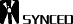

# 吴恩达深度学习课最新补充教程：交互式 demo 助你轻松理解神经网络初始化

> 原文：[`mp.weixin.qq.com/s?__biz=MzA3MzI4MjgzMw==&mid=2650762796&idx=5&sn=0720ce571c06caaa4d81078ca8060eee&chksm=871aaa52b06d23445685e63cb1f1880eb122f78aab015b733ba6a139699c574eace7f5a5b862&scene=21#wechat_redirect`](http://mp.weixin.qq.com/s?__biz=MzA3MzI4MjgzMw==&mid=2650762796&idx=5&sn=0720ce571c06caaa4d81078ca8060eee&chksm=871aaa52b06d23445685e63cb1f1880eb122f78aab015b733ba6a139699c574eace7f5a5b862&scene=21#wechat_redirect)

选自 deeplearning.ai

**机器之心编译**

**参与：路、思源**

> 初始化对深度神经网络的收敛有重要影响。优秀的初始化模式可以加速训练，但是需要小心操作以避免常见的陷阱。deeplearning.ai 最新上线了 AI Notes 栏目，以长文的形式作为《深度学习专项课程》的补充。其具备交互式的 demo，有助于读者轻松掌握深度学习基础概念。AI Notes 的第一篇教程就是「初始化神经网络」。

这篇教程共包括四部分：有效初始化的重要性、梯度爆炸或消失问题、什么是恰当的初始化，以及 Xavier 初始化的数学证明。

**1\. 有效初始化的重要性**

要想构建一个机器学习算法，通常你需要定义一个架构（如 Logistic 回归、支持向量机、神经网络），然后训练它学习参数。以下是训练神经网络的常见过程：

1.  初始化参数

2.  选择优化算法

3.  重复以下步骤：

1.  将输入向前传播

2.  计算成本函数

3.  使用反向传播传递成本对参数的梯度

4.  根据优化算法，基于梯度更新每个参数

之后，给出一个新的数据点，你就可以使用该模型预测其类别了。

初始化步骤对模型的最终性能至关重要，它需要正确的方法。下面给出了一个交互式 demo，你可以尝试使用不同的方法初始化网络，观察不同的初始化对网络学习的影响。

*在此 demo 中，可以任意选择输入数据集、选择初始化方法，并实时查看训练效果。*

你注意到当初始化方法为 zero 时，梯度和权重的变化吗？

> 用零初始化所有权重，会使得神经元在训练过程中学习同样的特征。

事实上，任意常数初始化方法性能都不好。例如一个具备两个隐藏单元的神经网络，假设我们将所有偏置初始化为 0，将所有权重初始化为常量 α。如果我们在网络中前向传播输入 (x_1,x_2)，则两个隐藏单元的输出均为 relu(α x_1+α x_2)。因此，两个神经元在训练过程中的演化是对称的，也就阻止了不同的神经元学习不同的特征。

当使用太小或太大的值初始化权重时，成本函数曲线有什么变化呢？

> 尽管打破了对称性，但使用太小或太大的值初始化权重会分别导致学习缓慢或发散。

因此，选择恰当的初始化值对于高效训练而言是必要的。

**2\. 梯度爆炸或消失问题**

考虑以下这个 9 层神经网络：

在优化的每一次迭代中，我们观察到随着梯度从输出层向输入层传递，反向传播的梯度要么太大要么太小。这一结果是合理的，大家不妨考虑以下例子。

假设所有激活函数都是线性（恒等函数），那么输出激活如下：

其中，L=10，W^[L] 及其它 W 是 2×2 的矩阵，层 [1] 到 [L-1] 都只有两个神经元。如果我们假设 W^[1] 到 W^[L-1] 都等于 W，则输出预测为（其中 W^L-1 是矩阵 W 的 L-1 次方，W^[L] 表示第 L 个矩阵）。

那么当初始化值过小、过大或合适时，结果会如何呢？

**案例 1：过大初始化值导致梯度爆炸**

考虑当每个权重的初始化值都比恒等矩阵略大的情况。

上式可以简化为，a^[l] 的值随着 l 呈指数倍增长。当这些激活值被用于反向传播时，就会导致梯度爆炸问题。即，成本对参数的梯度过大，导致成本值在其极小值周围振荡。

**案例 2：过小初始化值导致梯度消失**

类似地，考虑每个权重的初始化值略小于恒等矩阵的情况。

上式可简化为，激活值 a^[l] 随着 l 呈指数倍下降。当这些激活被用于反向传播时，会导致梯度消失问题。成本关于参数的梯度过小，导致成本在到达极小值之前已经收敛。

总之，用不合适的值进行权重初始化会导致神经网络训练发散或速度缓慢。虽然我们用简单的对称权重矩阵说明梯度爆炸和梯度消失问题，但这一观察也适用于任意过大或过小的初始化值。

**3\. 如何找到合适的初始化值**

为了阻止梯度爆炸或消失，我们需要坚持以下规则：

*   激活值的均值应为零。

*   每一层激活值的方差应该保持一致。

在这两个假设下，反向传播的梯度信号就不会在任意层中被过小或过大的值相乘，从而在不出现梯度爆炸或消失等问题。

具体来说，想象一个层 l，其前向传播是：

我们需要遵循下式：

确保零均值，保持每一层的输入方差值不变，从而确保不会出现梯度爆炸和消失问题。该方法适用于前向传播和反向传播。推荐使用 Xavier 初始化方法（或其变体），对于每一个层 l：

也就是说，层 l 的所有权重是从正态分布中随机选取的，该分布的均值 μ=0，方差 ，其中 n^[l-1] 是层 l-1 中的神经元数量。偏置被初始化为 0。

下面的交互式图展示了 Xavier 初始化对每一层激活的影响，下图展示的是一个五层的全连接神经网络。

*在此交互式图中，你可以加载 MNIST 数据集，选择初始化方法，执行训练并观察不同初始化方法的效果。*

**Xavier 初始化的数学证明**

Xavier 初始化保持每一层的方差不变。我们假设每一层的激活值是围绕 0 的正态分布。有时理解数学证明有助于掌握概念，但没有数学也可以理解基础理念。

我们使用第 3 部分介绍的层 l，假设其激活函数为 tanh。其前向传播如下所示：

我们目标是推导出 Var(a^[l-1]) 和 Var(a^[l]) 之间的关系。然后我们将理解如何初始化权重，使得 Var(a^[l-1]) = Var(a^[l])。

假设我们使用合适的值初始化网络，且输入是经过归一化的。在训练的早期，我们处于 tanh 的线性模式。值足够小，使 tanh(z^[l]) ≈ z^[l]，这意味着：

此外，，其中。出于简洁性考虑，我们假设 b^[l] = 0。因此，逐元素查看前面的公式 Var(a^[l-1]) = Var(a^[l]) 可以得到：

一个常见的数学 trick 是在方差之外求和。为此，我们必须遵循以下三个假设：

1.  权重独立，且同分布；

2.  输入独立，且同分布；

3.  权重和输入互相独立。

从而得到：

另一个常见的数学 trick 是将积的方差转化为方差的积，公式如下：

使用该公式，以及，得到：

快完成了！第一个假设引出 ，第二个假设引出 ，因为权重是使用零均值进行初始化的，输入是经过归一化的。从而得到：

第一个假设表明：

第二个假设引出：

它们都具备同样的思想：

组合起来，得到：

完成了！如果我们想要各个层的方差保持一致，我们需要。这证明了 Xavier 初始化的方差选择。

注意，在之前的步骤里，我们没有选择特定层 l。因此，我们证明了该公式适用于所有层。假设 L 是输出层。在每一层使用该公式，则我们可以将输出层的方差推导至输入层的方差：

根据我们的权重初始化方式，输出和输入层方差之间的关系将会变化巨大。注意以下三种情况：

因此，为了避免前向传播信号的消失或爆炸，我们必须通过初始化，使 n^[l−1]Var(W^[l])=1。

通过以上证明，我们研究了在前向传播过程中计算的激活值。同样的结果也适用于反向传播梯度。同理，为了避免梯度爆炸或消失，我们必须通过初始化，使 n^[l]Var(W^[l])=1。

**结论**

在实践中，机器学习工程师使用 Xavier 初始化时，要么将权重初始化为或。后一个分布的方差项是的均值。

以上是 Xavier 初始化的理论证明。Xavier 初始化使用的是 tanh 激活函数。此外还有大量初始化方法。如果你使用 ReLU 激活函数，那么常用的初始化方法是 He 初始化。He 初始化的理论证明要更复杂一些，但它遵循同样的思维过程。********

*原文链接：http://www.deeplearning.ai/ai-notes/initialization/*

****本文为机器之心编译，**转载请联系本公众号获得授权****。**

✄------------------------------------------------

**加入机器之心（全职记者 / 实习生）：hr@jiqizhixin.com**

**投稿或寻求报道：**content**@jiqizhixin.com**

**广告 & 商务合作：bd@jiqizhixin.com**