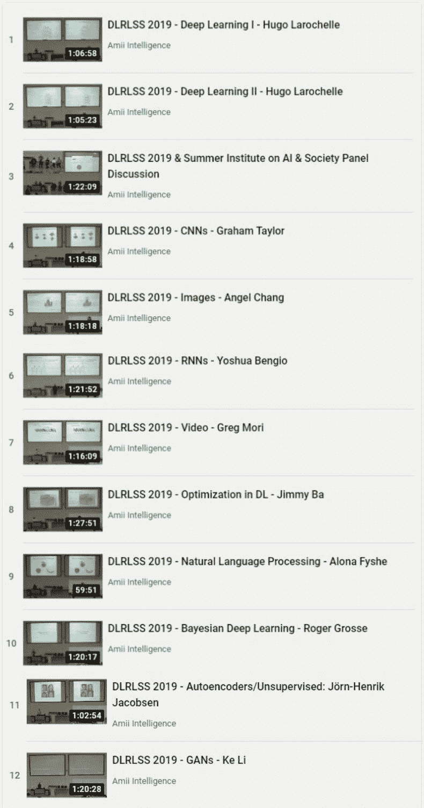
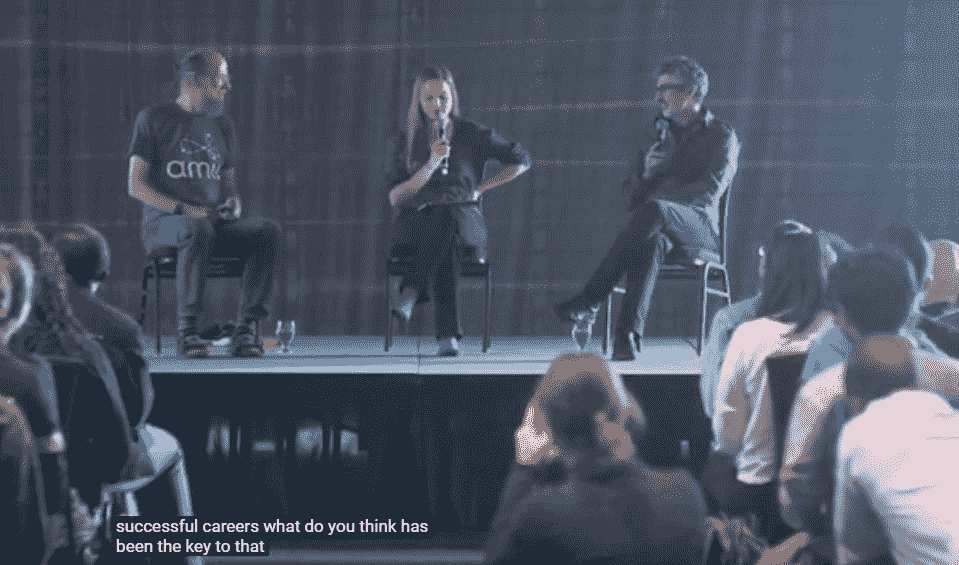

# Bengio、Sutton 的深度学习&强化学习暑期班又来了，2019 视频已放出

> 原文：[`mp.weixin.qq.com/s?__biz=MzA3MzI4MjgzMw==&mid=2650772701&idx=2&sn=5663b931956f2be636b508cf9437aab8&chksm=871a50a3b06dd9b535bfc7be40988daefb85dd8339a20ef1351203e833905fd06636de6f823c&scene=21#wechat_redirect`](http://mp.weixin.qq.com/s?__biz=MzA3MzI4MjgzMw==&mid=2650772701&idx=2&sn=5663b931956f2be636b508cf9437aab8&chksm=871a50a3b06dd9b535bfc7be40988daefb85dd8339a20ef1351203e833905fd06636de6f823c&scene=21#wechat_redirect)

机器之心整理

**参与：张倩、郑丽慧**

> 每年夏季，Yoshua Bengio 等人都会组织深度学习&强化学习夏季课程，从理论到实践，覆盖机器学习发展前沿的方方面面。今年夏季课程的视频已经全部出炉，导师包括 Yoshua Bengio、Richard Sutton 等业内大牛，Youtube 可在线观看，还有实时机翻字幕。

*   课程地址：https://dlrlsummerschool.ca/

*   视频地址：https://www.youtube.com/playlist?list=PLKlhhkvvU8-aXmPQZNYG_e-2nTd0tJE8v

心心念念的 2019 深度学习&强化学习夏季课程终于来了。机器之心从 2016 年起就开始报道这一夏季课程，每一年都是大师云集，几十节课程视频都干货满满、广受好评。坏消息是，这一年的课程依旧没有字幕；好消息是，我们终于可以享受 Youtube 自动生成的字幕了，而且可以自动翻译成中文。**十几年风雨无阻的夏季课程**2005 年，加拿大高等研究院（CIFAR）的「机器与大脑学习计划」在多伦多举办了第一届深度学习&强化学习暑期班，希望能够培养下一代 AI 研究人员。许多以前的学生都已经成为一些顶级科技公司和大学实验室的负责人。今年的暑期课程于 2019 年 7 月 24 日至 8 月 2 日在加拿大阿尔伯塔省埃德蒙顿举行，课程聚集了研究生、博士后和业界人员，涵盖了深度学习和强化学习的基础研究、最新发展和实际应用。参加者可直接跟从世界知名的研究人员和讲师学习。与往年一样，课程的每一个主题及讲师都是该领域的资深研究者，其中包括图灵奖得主、深度学习三巨头之一的 Yoshua Bengio、强化学习教父 Richard Sutton 等。其他讲师也大多来自谷歌大脑、DeepMind 等业内知名机构和西蒙弗雷泽大学、阿尔伯塔大学等名校。今年的课程依然分为深度学习夏季课程（DLSS）和强化学习夏季课程（RLSS）。前者将涵盖深度神经网络的基础和应用，从根本概念到前沿研究成果统统包含在内。后者将涵盖强化学习的基础知识，并展示其最新的研究趋势和发现。**干货满满之余，听大牛谈职业发展**今年放出的课程共包含 34 个视频。包含深度学习和强化学习的基础、应用与前沿发展。**深度学习**深度学习部分涵盖神经网络、卷积神经网络、循环神经网络、用于视频和图像的深度学习、自然语言处理、贝叶斯深度学习、生成对抗网络、无监督学习等主题。其中，「神经网络」部分的讲师与去年一样，都是 Hugo Larochelle，他是谷歌大脑研究科学家、机器学习专家、布鲁克大学信息学教授，专攻计算机视觉和自然语言处理领域的深度神经网络。PPT 可以参考去年的版本：

*   http://videolectures.net/site/normal_dl/tag=1199109/DLRLsummerschool2018_larochelle_neural_networks1_01.pdf；

*   http://videolectures.net/site/normal_dl/tag=1199103/DLRLsummerschool2018_larochelle_neural_networks2_01.pdf

「卷积神经网络」的主讲者是 Graham Taylor，他是圭尔夫大学工程学副教授，Azrieli 全球学者，NextAI 的学术总监，以及 Vector Vector Institute for AI 的成员。

被称为「深度学习三巨头」之一的蒙特利尔大学计算机科学与运算研究系教授 Yoshua Bengio 今年也出现在了导师天团中，不同的是，今年他多了一个身份：2018 年图灵奖获得者。Bengio 今年主讲的依然是「循环神经网络」，相关 PPT 可以参考去年版本：

*   http://videolectures.net/site/normal_dl/tag=1199112/DLRLsummerschool2018_bengio_RNNs_01.pdf

此外，西蒙弗雷泽大学计算机科学学院助理教授 Angel Chang、教授 Grag Mori、阿尔伯塔大学助理教授 Alona Fyshe、多伦多大学计算机科学助理教授 Roger Grosse 等人还分别主讲了「图像深度学习」、「人体运动识别」、「自然语言处理」、「贝叶斯深度学习」等课程。**强化学习**今年的强化学习课程包含生物强化学习、样本高效的强化学习、bandit 算法、分级强化学习、将强化学习应用于机器人等主题。这部分的主讲者包含阿尔伯塔大学计算机科学学院助理教授 Adam White、谷歌研究科学家 Csaba Szepesvári、微软研究经理 Harm Van Seijen、DeepMind 研究团队负责人 Doina Precup、阿尔伯塔大学计算机科学学院教授 Michael Bowling 等人。「强化学习教父」Rich Sutton 以一堂关于强化学习前沿研究的课程作为 2019 年度 DLRL 的收官之作。除了这些常规知识性课程外，今年的课程中还穿插了一些讨论课，让学生有机会与 Richard Sutton、 Yoshua Bengio 等人讨论职业发展问题。对这部分感兴趣的同学可以参考第 26 个视频。**往年课程参见：**[资源 | Bengio 等人的 2018 夏季课程视频终放出，但有些沉重 ](http://mp.weixin.qq.com/s?__biz=MzA3MzI4MjgzMw==&mid=2650750516&idx=2&sn=cc159764187479a67539b58e931ed31f&chksm=871afa4ab06d735ca7f13e58001244d1af9b839531922ffac208e27297a789156b013ae19703&scene=21#wechat_redirect)[MILA 2018 夏季深度学习与强化学习课程资源大放送](http://mp.weixin.qq.com/s?__biz=MzA3MzI4MjgzMw==&mid=2650750266&idx=1&sn=8581754df249ddaaa1b72ae37f9fcf9e&chksm=871af944b06d70524fa06cbc5a5dd19e30c81b32efdf1622813321f80be75b1af6e51d593fac&scene=21#wechat_redirect)[蒙特利尔大学开放 MILA 2017 夏季深度学习与强化学习课程视频（附完整 PPT）](http://mp.weixin.qq.com/s?__biz=MzA3MzI4MjgzMw==&mid=2650730321&idx=1&sn=dbf710544d5a00341fca20dd814a33a3&chksm=871b2b2fb06ca239a2b4b4c9d7ce35e831eef85faaf57f83e527cce949df6e2fecd7a9f8b206&scene=21#wechat_redirect)[重磅 | Yoshua Bengio 深度学习暑期班学习总结，35 个授课视频全部开放（附观看地址）](http://mp.weixin.qq.com/s?__biz=MzA3MzI4MjgzMw==&mid=2650718578&idx=1&sn=ff7d748b149e7952c9fa3b53cefd5afc&chksm=871b050cb06c8c1a54fa4137b167e721b3687a892a3eb98313db2c531a4f77dacc594b542319&scene=21#wechat_redirect)

第三届机器之心**「Synced Machine Intelligence Awards」**年度奖项评选正在进行中。本次评选设置**六大奖项****，**重点关注人工智能公司的产品、应用案例和产业落地情况，基于真实客观的产业表现筛选出最值得关注的企业，为行业带来实际的参考价值。

**参选报名日期**：2019 年 10 月 23 日~2019 年 12 月 15 日**评审期**：2019 年 12 月 16 日~2019 年 12 月 31 日**奖项公布**：2020 年 1 月

点击**阅读原文**，查看更多详情并报名参选。