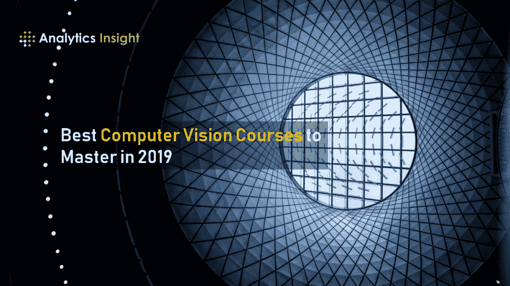

# 二千零一十九、年最佳计算机视觉课程推荐

> 原文：[`mp.weixin.qq.com/s?__biz=MzA3MzI4MjgzMw==&mid=2650765106&idx=3&sn=aaab84fa4bd79aa69ae506aa8caf9cb8&chksm=871ab34cb06d3a5a16b0a7cfcaf40c365dbdd5fac9402d8138c907345d716578fd892edc0eed&scene=21#wechat_redirect`](http://mp.weixin.qq.com/s?__biz=MzA3MzI4MjgzMw==&mid=2650765106&idx=3&sn=aaab84fa4bd79aa69ae506aa8caf9cb8&chksm=871ab34cb06d3a5a16b0a7cfcaf40c365dbdd5fac9402d8138c907345d716578fd892edc0eed&scene=21#wechat_redirect)

选自 analyticsinsight

**作者****：****Kamalika Some**

**机器之心编译** 

**机器之心编辑部**

> 除了 CS231n，你还可以看哪些？

随着人工智能成为当今时代的流行词汇，企业竞相角逐，努力把握并适应人工智能带来的种种变化。在求职过程中，很多年轻的专业人士想要在数据科学和机器学习行业获得蒸蒸日上的事业，因此他们想要学习最新的人工智能课程并将学习经历添加到简历中，从而在竞争中拔得头筹。

但遗憾的是，专业人士往往受限于时间，因此搜索一些最佳的网络课程成为最终解决方案，你可以在适当的时候学习这些课程并向专业迈出自己的一步。

在所有颠覆性技术中，计算机视觉领域吸引了专业人士和学术界最大的关注。以下是为大家推荐的 2019 年最佳计算机视觉课程，希望为那些想继续学习但受限于时间的专业人士提供参考：

*   **课程：Python Project: Pillow, Tesseract, Opencv By University of Michigan**

*   链接：https://www.coursera.org/learn/python-project

*   讲师：Christopher Brooks（密歇根大学）

*   密歇根大学开设的这门 Python Project 是一门中级课程，课程对象是那些想要在计算机视觉领域打稳基础的学员，课程可在 Coursera 在线平台观看。在该课程中，你可以了解到第三方 API 相关知识，使用 Python 图像库处理图像，将光学字符识别应用于图像，从而使用 OpenCV 库识别文本和人脸。你将在课程学习中用到图像库，并执行文本剪切、尺寸调整和覆盖操作。整个课程合理地分为几个部分，易于学员跟上进度。切记，你必须通过分级评估才能获得课程认证，也才有机会完成整个课程项目。

*   **课程：*Deep Learning: Advanced Computer Vision***

*   链接：https://www.udemy.com/advanced-computer-vision/

*   讲师：Lazy Programmer Inc.

*   在该课程中，你可以学习如何创建目标检测系统，该系统可以定位目标、预测其标签并将图像进行分类。课程中的所有主题都非常详尽，还包含有适当的例子和展示。课程中用到的代码都可以从 GitHub 上下载。该课程涵盖 67 讲，终身有效，可以在 Udemy 在线学习平台上购买。

*   **课程：Computer Vision Certification by State University of New York**

*   链接：https://www.coursera.org/specializations/computervision

*   讲师：Radhakrishna Dasari、Junsong Yuan（纽约州立大学法布罗分校）

*   这一专项课程旨在帮你打下坚实的研究基础。在该课程中，你将探索实现视觉应用的基本要素，从编辑图像到自动驾驶汽车读取交通信号，再到工业机器人与人类协作。此外，你还有机会通过在线实验室来获得编写计算机视觉代码的实践经验，该实验室使用 MATLAB 并支持工具箱。课程中的概念、公式都有详尽的文本、图表做出解释。如果想要获得认证，你必须参加分级评估和测试。

*   **课程：Convolutional Neural Networks**

*   讲师：吴恩达等人

*   链接：https://www.coursera.org/learn/convolutional-neural-networks

*   卷积神经网络（Coursera）课程包含构建卷积神经网络所需的关键特性和概念。此外，调试代码的技巧、建议和最佳实践也包含在内。你可以通过课程演示和逐步的指导来学习，同时有机会完成作业并应用课堂上介绍的技术。该课程分为几个部分，还附有几个小评估和问题，以便学员容易跟上。要获得结业证书，你需要完成所有的分级评估和练习。

*   **课程：Deep Learning and Computer Vision A-Z: OpenCV, SSD & GANs**

*   讲师：Hadelin de Ponteves 等人

*   链接：https://www.udemy.com/course/computer-vision-a-z/

*   这一课程将带你进入人工智能世界，学会如何使用最新技术开发出强大的 app。在该课程中，你可以探索方法、基本概念和开发过程，并在实践中应用理论。目前这一课程已经获得了超过 2 万次评分，而且分数很高。这门课程的讲师都是知名专家，他们会使用多种示例来解释概念，这些示例有助于你对课程主题有更清楚的了解。这一课程目前有 78 讲，另有 7 篇文章和 5 个下载源。

*原文链接：**https://www.analyticsinsight.net/best-computer-vision-courses-to-master-in-2019/*

**深度****Pro**

**理论详解 | 工程实践 | 产业分析 | 行研报告**

机器之心最新上线深度内容栏目，汇总 AI 深度好文，详解理论、工程、产业与应用。这里的每一篇文章，都需要深度阅读 15 分钟。

**今日深度推荐**

CVPR 2019 提前看：少样本学习专题

ICLR 2019 论文解读：量化神经网络

万字长文带你解读 NLP 深度学习的各类模型

点击图片，进入小程序深度 Pro 栏目

PC 点击阅读原文，访问官网

更适合深度阅读

www.jiqizhixin.com/insight

每日重要论文、教程、资讯、报告也不想错过？

[点击订阅每日精选](https://mp.weixin.qq.com/s?__biz=MzIyMjE2ODk5NQ==&mid=2247483701&idx=1&sn=f6f5c2f1ef750490595b03f8650aff72&scene=21#wechat_redirect)