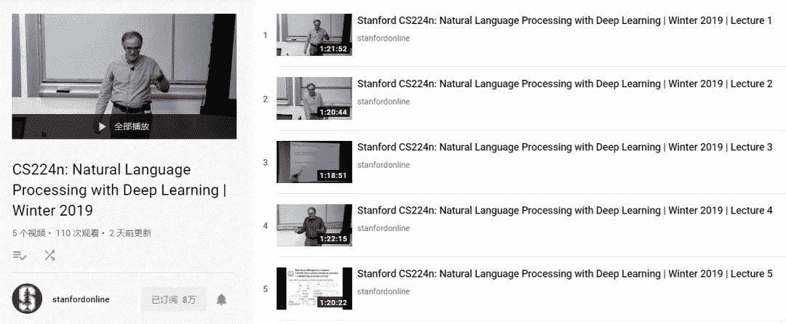
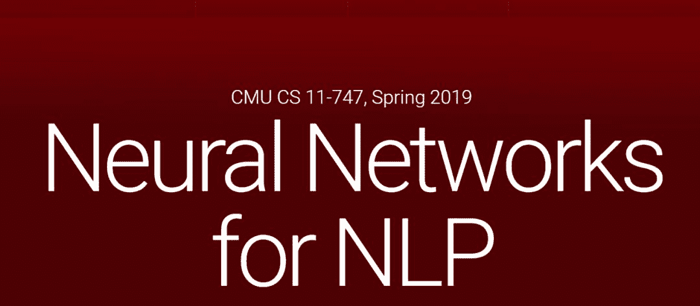

# 学习时间！2019 斯坦福 CS224n、CMU NLP 公开课视频开放啦

> 原文：[`mp.weixin.qq.com/s?__biz=MzA3MzI4MjgzMw==&mid=2650758563&idx=3&sn=91db157f614f29b1d5bbcfcd94c7da34&chksm=871a99ddb06d10cbfedf8d01c4413d189772bcfb479d41bbf4576274be4534891a52616b500b&scene=21#wechat_redirect`](http://mp.weixin.qq.com/s?__biz=MzA3MzI4MjgzMw==&mid=2650758563&idx=3&sn=91db157f614f29b1d5bbcfcd94c7da34&chksm=871a99ddb06d10cbfedf8d01c4413d189772bcfb479d41bbf4576274be4534891a52616b500b&scene=21#wechat_redirect)

机器之心报道

**参与：思源**

> 2019 年，自然语言处理公开课开始学了～

你知道入门自然语言处理（NLP）的「标配」公开课 CS224n 么，它和计算机视觉方面的课程 CS231n 堪称绝配，它们都是斯坦福的公开课。但是自 2017 年以来，NLP 有了很多重大的变化，包括 Transformer 和预训练语言模型等。以前开放的是 17 年年初的课程，很多激动人心的前沿模型都没有介绍，而最近 CS224n 终于开始更新 19 年课程的视频。

与此同时，CMU 的 NLP 公开课 CS 11-747 也一直在更新今年的授课视频，它同样介绍了近来 NLP 的主要发展。目前 CS 11-747 已经更新了 14 个课时，从词嵌入、注意力机制到强化学习都有涉及。

以下展示了这两项 NLP 公开课的资源地址，爱可可老师将视频和字幕都上传到了 B 站。

**CS224n：**

*   课程主页：http://web.stanford.edu/class/cs224n/index.html

*   YouTube：https://www.youtube.com/playlist?list=PLoROMvodv4rOhcuXMZkNm7j3fVwBBY42z

*   Bilibili：https://www.bilibili.com/video/av46216519/

**CS 11-747：**

*   课程主页：http://phontron.com/class/nn4nlp2019/

*   YouTube：https://www.youtube.com/playlist?list=PL8PYTP1V4I8Ajj7sY6sdtmjgkt7eo2VMs

*   Bilibili：https://www.bilibili.com/video/av40929856/ 

**斯坦福 NLP 公开课** 

CS224n 是一门关于自然语言处理的专项课程，虽然有很多公开课都会涉及循环神经网络或语言建模等内容，但很少如它那样会系统地介绍自然语言处理任务。包括词嵌入、依存关系解析、神经机器翻译、语音识别和语义消歧等。此外在 19 年的新课程中，它还会重点介绍最近非常流行的 Transformer 和预训练表征，这些系统化的新内容真的很令人期待。

CS224n 的主讲教师为 Christopher Manning 与 Abigail See，其中 Manning 为斯坦福的机器学习教授，Abigail 为斯坦福的博士生。在 17 年的课程中，CS224n 采用的是 TensorFlow，今年则采用更加简洁的 PyTorch。不过今年并没有专门介绍 PyTorch 的课时，所以还需要读者预先学习 PyTorch。

CS224n 的课程笔记、PPT 资料以及作业都可以在主页上获取，目前 19 年课程就差最后的「NLP 未来发展」以及课程设计就完成了。课程视频目前发布了前 5 个，后面还会继续发布。因为这些视频需要手动制作并校对字幕，而不是直接利用 YouTube 自动生成字幕，所以放出来的速度可能不会太快。

如下所示，前几课主要介绍了词嵌入和数学基础，其中我们会发现传统词嵌入引入了很多新观点。例如 NeurIPS 2018 的高分论文 On the Dimensionality of Word Embedding，其提出了一个理解词嵌入维度的理论框架，从而学习合理的词嵌入维度。

**CMU NLP 公开课** 

该课程先简单地概览了深度神经网络，随后课程主体将介绍如何把神经网络用于各种 NLP 任务。每一部分都会介绍自然语言中的特定问题与现象，并描述这些问题的难点与一些优秀的解决方案。在整个课程中，我们将学到创建深度学习模型的各种技术，包括建模不同长度和结构的句子、处理大型自然语言数据、半监督和无监督学习、结构化预测和多语言建模等等。

CS 11-747 的授课老师主要有 Graham Neubig 和 Antonios Anastasopoulos，其中 Graham 是卡内基梅隆大学的教授，Antonios 是 CMU NeuLab 的博士后。19 年新课主要增了 ELMo/BERT 上下文词表示、模型可解释性等内容，同时还会提供 PyTorch/DyNet 代码示例。

目前该课程已经发布了 14 个视频，它要到 4 月 30 号才结课。已完成章节的 PPT、示例代码和补充资料都可以在主页上找到，视频也在同步更新。因为拍摄的课程视频使用自动字幕，所以视频的更新速度非常快。但是更新快也会有局限，有一些视频拍摄的不够精细，黑板上写的东西看不清，且代码展示与讲解有时候会被 PPT 遮挡。

最后，这两个课程各有优势，一起学习效果更佳～********

****本文为机器之心报道，**转载请联系本公众号获得授权****。**

✄------------------------------------------------

**加入机器之心（全职记者 / 实习生）：hr@jiqizhixin.com**

**投稿或寻求报道：**content**@jiqizhixin.com**

**广告 & 商务合作：bd@jiqizhixin.com**