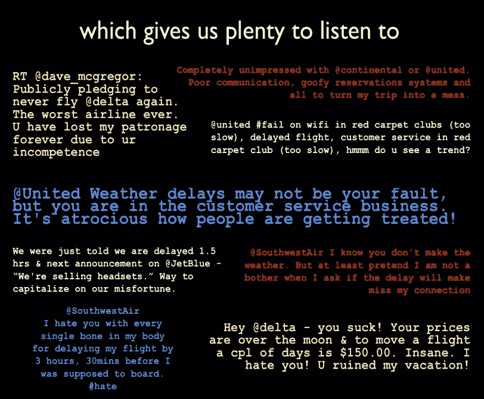

# 只知道 CS224N？斯坦福最新推出 NLU 公开课 CS224U

> 原文：[`mp.weixin.qq.com/s?__biz=MzA3MzI4MjgzMw==&mid=2650764408&idx=3&sn=26409fd7864d2ce76e26463c3ca9839f&chksm=871ab006b06d39102cf139a1cfde19dc9ce4201d49d132b577578339eb2ec67d3d38f20ba232&scene=21#wechat_redirect`](http://mp.weixin.qq.com/s?__biz=MzA3MzI4MjgzMw==&mid=2650764408&idx=3&sn=26409fd7864d2ce76e26463c3ca9839f&chksm=871ab006b06d39102cf139a1cfde19dc9ce4201d49d132b577578339eb2ec67d3d38f20ba232&scene=21#wechat_redirect)

机器之心报道

**参与：思源、一鸣、张倩**

> NLP 标准公开课 CS224N 已经开放一段时间了，相信很多读者已经学了一遍了。最近，斯坦福自然语言理解公开课 CS224u 也开放了，所有课件、代码和视频都已经开放。嗯，是时候该学一波 CS224u 了。

*   课程主页：http://web.stanford.edu/class/cs224u/

*   代码地址：https://github.com/cgpotts/cs224u/

*   视频地址：https://www.youtube.com/playlist?list=PLoROMvodv4rObpMCir6rNNUlFAn56Js20

*   B 站视频地址：https://www.bilibili.com/video/av56067156/

**这门课讲了什么？有门槛吗？**

这门面向项目的课程侧重于开发系统和算法，以实现对自然语言的鲁棒机器理解。课程利用了来自语言学、自然语言处理和机器学习的理论概念。本课程还将包含有关项目开发、研究结果呈现以及与业界沟通的特殊课程。

在这门课程中，你将会学到词汇语义学、语义的分布式表征、关系抽取、语义分析、情感分析以及对话智能体等相关课程。

当然，该课程也有一定的门槛，要求参与课程的学生必须学过一些自然语言处理、数据结构与算法等相关课程，机器学习的基础知识也是必需的。此外，该课程比较特殊的地方在于，它要求学生了解逻辑学和语义学等相关知识，或者学过这些课程。

总体而言，如果读者已经看完了 CS224N 2019 年的开放课程，且想要更详细地了解自然语言理解这一问题，学习 CS224u 2019 是一个极好的选择。

**课程方向与目标**

整个课程的主题可以分为两大问题，即合成与学习。对于语义合成，我们需要探索如何从小的语义单位构造出大的语义，例如单词的语义表征怎么就能够造出句子的语义表征。对于学习，那我们就比较熟悉了，也就是如何构建一个能从数据中学习语义解释的模型。

最后，该课程的目标非常明确，即为成为 NLU 研究者或工程师打造坚实的理论和实战基础。整体课程内容足够支持我们完成一个非常不错的 NLU 项目，并足够强大到在 NLP 会议上展示我们的成果。

**什么是自然语言理解**

自然语言理解指的是使电脑或机器理解人类语言的相关技术。自然语言理解是自然语言处理（NLP）的子任务，也是最为重要的任务。只有让机器理解人类语言，才能使其进行处理，甚至完成生成任务。

**发展历史**

和 NLP 类似，NLU 的发展也经历了从模式匹配、专家系统、机器学习到深度学习的发展过程。其历史可以概括为以下五个阶段：

*   1960 年代：小规则集的模式匹配；

*   1970-1980 年代：基于大量的语言学知识、逻辑驱动的基础系统，应用非常少；

*   1990 年代中期：NLP 领域迎来统计学革命，NLU 式微；

*   2000 年代后期：NLU 重回舞台，混合了现代和过去几十年的技术；

*   2010 年代中期：深度学习完全把持 NLU，如 LSTM、seq2seq 等

**应用** 

自然语言理解技术被广泛应用于多个需要对语言进行深层理解的领域，如机器阅读理解、智能语音问答、人机对话等。例如，在一些差旅 app 上，已经可以根据用户语音，自动为其订购机票、酒店、安排出发返程的时间表。其背后使用的就是自然语言理解技术。

*通过自然语言理解，智能体能「理解」说话内容，并给出回答。*

*自然语言理解能区分评论情感，并对航班做出正确评分。*

**课程大纲**

以下就是主要的课程主题了，该课程从今年 4 月份开始到 6 月份结束，囊括了自然语言理解的方方面面。每一个课程主题又会引出各种话题扩展，包括前沿论文的讲解、优秀模型的实现或重要问题的圆桌讨论等。

**课程概览**

1\. 分布式词表征

2\. 有监督情感分析

3\. 自然语言推理

4\. 基础语言理解

5\. 语义分析

6\. 利用较难的生成任务评估 NLU 模型

7\. 带语境词的表征

8\. 针对 NLU 的长文本表征

9\. 介绍如何写论文和做展示

10\. NLP 数据增强

11\. 探测黑箱子模型

如下展示了所有课程大纲，包括各种子话题与学习资源。在课程主页中，该大纲链接了对应的文本或代码，其中额外教程通过 Jupyter Notebook 展示、课程主题通过课件展示、参考论文则直接链接到了 PDF。

****本文为机器之心报道，**转载请联系本公众号获得授权****。**

✄------------------------------------------------

**加入机器之心（全职记者 / 实习生）：hr@jiqizhixin.com**

**投稿或寻求报道：**content**@jiqizhixin.com**

**广告 & 商务合作：bd@jiqizhixin.com**