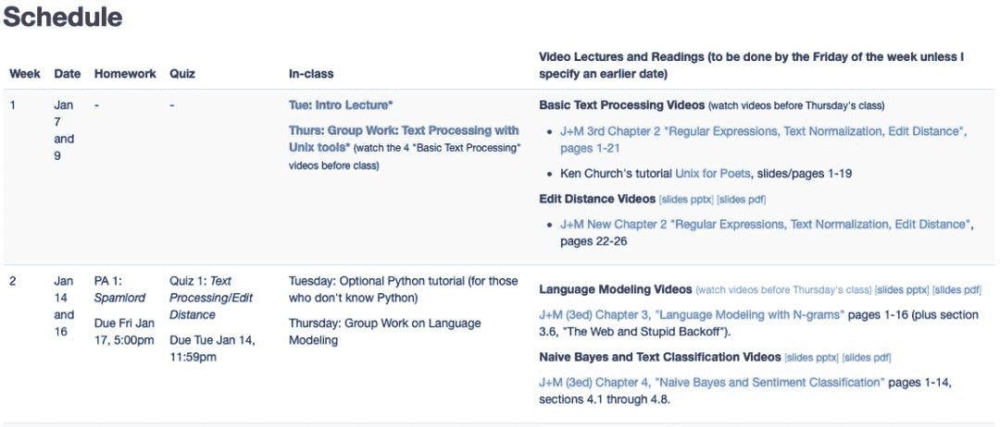

# 社科 NLP 课程来了：斯坦福开年公开课主讲 NLP 和社交网络应用

> 原文：[`mp.weixin.qq.com/s?__biz=MzA3MzI4MjgzMw==&mid=2650775445&idx=4&sn=29b83ffd609cc693dce67d9bfdc45f93&chksm=871a5bebb06dd2fd2c72d2409156f24e2971b9cc52b24859dfd1815c32102847112ab04db0c2&scene=21#wechat_redirect`](http://mp.weixin.qq.com/s?__biz=MzA3MzI4MjgzMw==&mid=2650775445&idx=4&sn=29b83ffd609cc693dce67d9bfdc45f93&chksm=871a5bebb06dd2fd2c72d2409156f24e2971b9cc52b24859dfd1815c32102847112ab04db0c2&scene=21#wechat_redirect)

机器之心整理
**参与：一鸣**

> 随着 NLP 技术的成熟，不少人文社科领域的专家也呼吁结合相关技术进行研究和学习。近日，斯坦福大学发布了一门明年 1 月的公开课程，主要关注 AI 中的自然语言处理和社交网络的结合应用，适合文科生学习。

斯坦福大学的 AI 相关公开课一直受到机器学习社区的关注。机器之心曾经也报道过斯坦福大学的 CS224n 自然语言处理课程。近日，斯坦福大学的另一门 NLP 公开课程也放出了课程通知，即将于 2020 年 1 月开始授课。课程地址：http://web.stanford.edu/class/cs124/#schedule 这门课程最大的亮点在于：主讲 NLP 和人文社会学科的结合。课程对技术的介绍主要针对的是相关的应用，而非为了技术而讲技术。同时，课程要求也不高，很适合懂一点编程的文科学生学习。**课程内容**据课程页面介绍，这门课程偏向于学科交叉。它结合了自然语言处理、信息抽取和社交网络，是一项在介绍 NLP 知识的同时融合社交网络应用的课程。具体而言，课程会像很多 NLP 基础课程那样，介绍自然语言处理的相关知识。在算法方面包括：朴素贝叶斯、逻辑回归、词嵌入、词向量等内容。在应用方面则包括了情感分析、信息抽取、推荐系统和对话机器人，主要用于社交网络。此外，对于不了解 Python 的人来说，课程提供了一个可选的 Python 指导。从内容来看，课程偏向入门，甚至没有看到神经网络之类的复杂模型。尽管课程要求中提到学生如果学习了斯坦福大学的 CS107、CS103 或 CS109 课程会很有帮助，但是这些也不是强制的。不过，如果学生参加过了 106B 的课程，具有一些编程经验会更好。

在教科书方面，课程使用的都是电子版的教科书，分别是以下两本：**书籍 1：**Speech and Language Processing(3rd ed. draft)。这本书是电子版的，可以从网站直接打开。

阅读地址：http://web.stanford.edu/~jurafsky/slp3/**书籍 2：**Introduction to Information Retrieval.（信息检索概论），作者是著名的 Christopher Manning 等。斯坦福大学有一个免费阅读和下载地址：https://nlp.stanford.edu/IR-book/pdf/irbookonlinereading.pdf 课程共有十周，每周两次课。目前已经放出了完整的目录，机器之心整理如下：

课程视频和相关内容会在开课后进行更新，目前还没有相关信息。**讲师介绍**这门课程的主讲人是 Dan Jurafsky，是斯坦福大学的一位教授。主要研究方向是自然语言处理和社会科学的应用。

这位老师曾担任了 CS384 等课程的教师，也在 2012 年帮助过 Manning 在 MOOC 上的公开课。从专业背景来看，让这位老师教授这门课也就不足为奇了。对于人文社科和 AI 的结合，近年来已经可以看到类似的趋势，如李飞飞等利用计算机视觉统计社区车辆类型，进而预测该社区在大选中的投票趋势。斯坦福大学本次公开这样一门课程，无疑会鼓励更多非计算机领域的学生，利用 AI 技术推进工作和研究。**「WAIC 开发者·临港人工智能开发者大会」**将于 **2019 年 12 月 6 日-7 日**在**上海临港**举办。本次大会设有主题演讲、开发者工作坊、开发者挑战赛、技术和产业闭门研讨会等环节。邀请全球 AI 开发者在现场：**听前沿理论+学实战干货+动手挑战赛。**点击**阅读原文**，立即报名。

