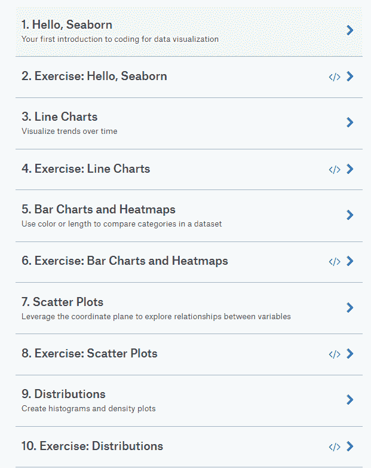
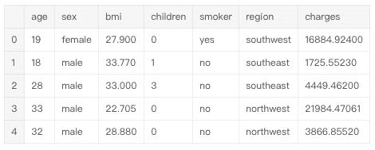
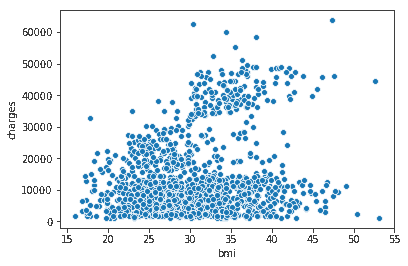
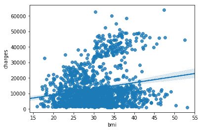
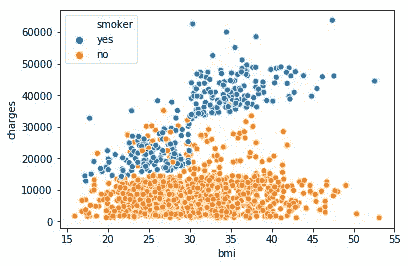
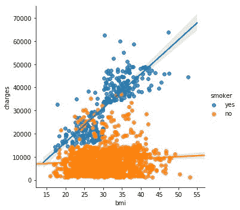
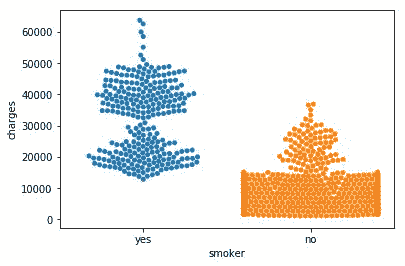

# 想快速学会数据可视化？这里有一门 4 小时的 Kaggle 微课程

> 原文：[`mp.weixin.qq.com/s?__biz=MzA3MzI4MjgzMw==&mid=2650761167&idx=2&sn=5cc95157e03069476a672feb413a32a3&chksm=871aa3b1b06d2aa7cc1cc34973b07d180e410d9bbcb27112b05e287f84242e2139e11bab6603&scene=21#wechat_redirect`](http://mp.weixin.qq.com/s?__biz=MzA3MzI4MjgzMw==&mid=2650761167&idx=2&sn=5cc95157e03069476a672feb413a32a3&chksm=871aa3b1b06d2aa7cc1cc34973b07d180e410d9bbcb27112b05e287f84242e2139e11bab6603&scene=21#wechat_redirect)

机器之心整理

**参与：****王淑婷、路**

> 想要制作漂亮的可视化图表吗？Kaggle 平台上有一个数据可视化的微课程，总时长才 4 小时。快来学习吧！

课程地址：https://www.kaggle.com/learn/data-visualization-from-non-coder-to-coder


**课程简介**

该课程为免费课程，共包含 15 节课，时长 4 小时。主讲人 Alexis Cook 曾就读于杜克大学、密歇根大学和布朗大学，在多个在线学习平台（如 Udacity 和 DataCamp）教授数据科学。

这门课程使用的数据可视化工具是 Seaborn，所以学员需要稍微了解如何写 Python 代码。不过没有任何编程经验的人也可以通过该课程学会数据可视化，正如课程名称那样：Data Visualization: from Non-Coder to Coder，透过数据可视化见证编程的魅力。

该课程包含 15 节课，分为课程讲解和练习两类，每一堂讲解课后都有一节练习课，让学员及时巩固和应用所学知识。

课程涉及对数据可视化工具 Seaborn 的介绍，如何绘制折线图、柱状图、热图、散点图、分布图，如何选择图表类型和自定义样式，课程期末项目，以及如何举一反三为自己的项目创建 notebook。课程目录如下所示：



下面，我们将选取其中一节课——散点图（Scatter Plots）进行简单介绍。

**如何创建高级散点图**

点进去你会在左侧看到这节课的大致内容，如下图所示，「散点图」共包含五个部分：

*btw，眼尖的读者会发现，下面还有一个 comments 版块。所以，该课程还是交互式的呢，你可以边学习边评论。*

通过这节课，你将学习如何创建高级的散点图。

**设置 notebook**

首先，我们要设置编码环境。

输入：

```py
import pandas as pdimport matplotlib.pyplot as plt%matplotlib inlineimport seaborn as snsprint("Setup Complete")
```

输出：

```py
Setup Complete
```

**加载和检查数据**

我们将使用一个保险费用（合成）数据集，目的是了解为什么有些客户需要比其他人支付得更多。数据集地址：https://www.kaggle.com/mirichoi0218/insurance/home


输入：

```py
insurance_filepath = "../input/insurance.csv"insurance_datainsurance_data = pd.read_csv(insurance_filepath)
```

打印前五行，以检查数据集是否正确加载。

输入：

```py
insurance_data.head()
```

输出：

**散点图**

为了创建简单的散点图，我们使用 sns.scatterplot 命令并指定以下值：

水平 x 轴（x=insurance_data['bmi']）

垂直 y 轴（y=insurance_data['charges']）

输入：

```py
sns.scatterplot(x=insurance_data['bmi'], y=insurance_data['charges'])
```

输出：

```py
<matplotlib.axes._subplots.AxesSubplot at 0x7f4d146c3dd8>
```



上面的散点图表明身体质量指数（BMI）和保险费用是正相关的，BMI 指数更高的客户通常需要支付更多的保险费用。（这也不难理解，高 BMI 指数通常意味着更高的慢性病风险。）

如果要再次检查这种关系的强度，你可能需要添加一条回归线，或者最拟合数据的线。我们通过将该命令更改为 sns.regplot 来实现这一点。

输入：

```py
sns.regplot(x=insurance_data['bmi'], y=insurance_data['charges'])
```

输出：

```py
/opt/conda/lib/python3.6/site-packages/scipy/stats/stats.py:1713: FutureWarning: Using a non-tuple sequence for multidimensional indexing is deprecated; use `arr[tuple(seq)]` instead of `arr[seq]`. In the future this will be interpreted as an array index, `arr[np.array(seq)]`, which will result either in an error or a different result. return np.add.reduce(sorted[indexer] * weights, axis=axis) / sumval<matplotlib.axes._subplots.AxesSubplot at 0x7f4d10de8748>
```



**着色散点图**

我们可以使用散点图展示三个变量之间的关系，实现方式就是给数据点着色。

例如，为了了解吸烟对 BMI 和保险费用之间关系的影响，我们可以给数据点 'smoker' 进行着色编码，然后将'bmi'、'charges'作为坐标轴。

输入：

```py
sns.scatterplot(x=insurance_data['bmi'], y=insurance_data['charges'], hue=insurance_data['smoker'])
```

输出：

```py
<matplotlib.axes._subplots.AxesSubplot at 0x7f4d10d0c6a0>
```



以上散点图展示了不抽烟的人随着 BMI 指数的增加保险费用会稍有增加，而抽烟的人的保险费用要增加得多得多。

要想进一步明确这一事实，我们可以使用 sns.lmplot 命令添加两个回归线，分别对应抽烟者和不抽烟者。（你会看到抽烟者的回归线更加陡峭。）

输入：

```py
sns.lmplot(x="bmi", y="charges", hue="smoker", data=insurance_data)
```

输出：

```py
/opt/conda/lib/python3.6/site-packages/scipy/stats/stats.py:1713: FutureWarning: Using a non-tuple sequence for multidimensional indexing is deprecated; use `arr[tuple(seq)]` instead of `arr[seq]`. In the future this will be interpreted as an array index, `arr[np.array(seq)]`, which will result either in an error or a different result. return np.add.reduce(sorted[indexer] * weights, axis=axis) / sumval<seaborn.axisgrid.FacetGrid at 0x7f4d10c73240>
```



sns.lmplot 命令与其他命令有一些不同：

*   这里没有用 x=insurance_data['bmi'] 来选择 insurance_data 中的'bmi'列，而是设置 x="bmi"来指定列的名称。

*   类似地，y="charges" 和 hue="smoker"也包含列的名称。

*   我们使用 data=insurance_data 来指定数据集。

最后，还有一个图要学。我们通常使用散点图显示两个连续变量（如"bmi"和 "charges"）之间的关系。但是，我们可以调整散点图的设计，来侧重某一个类别变量（如"smoker"）。我们将这种图表类型称作类别散点图（categorical scatter plot），可使用 sns.swarmplot 命令构建。

输入：

```py
sns.swarmplot(x=insurance_data['smoker'], y=insurance_data['charges'])
```

输出：

```py
<matplotlib.axes._subplots.AxesSubplot at 0x7f4d10c50c88>
```



除此之外，这个图向我们展示了：

*   不抽烟的人比抽烟的人平均支付的保险费用更少；

*   支付最多保险费用的客户是抽烟的人，而支付最少的客户是不抽烟的人。****

****本文为机器之心整理，**转载请联系本公众号获得授权****。**

✄------------------------------------------------

**加入机器之心（全职记者 / 实习生）：hr@jiqizhixin.com**

**投稿或寻求报道：**content**@jiqizhixin.com**

**广告 & 商务合作：bd@jiqizhixin.com**