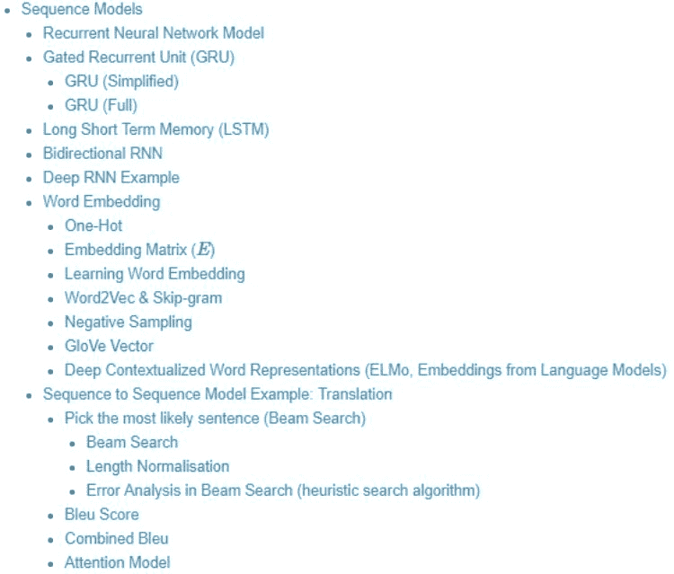

# 八十、页笔记看遍机器学习基本概念、算法、模型，帮新手少走弯路

> 原文：[`mp.weixin.qq.com/s?__biz=MzA3MzI4MjgzMw==&mid=2650770249&idx=2&sn=f7042c0c07074046e1ec3436c2bba0c0&chksm=871a4f37b06dc6211e31bb31c3191f1804a68851ccb5d8c9f8ab56eacef5d1f23aa35e3ec514&scene=21#wechat_redirect`](http://mp.weixin.qq.com/s?__biz=MzA3MzI4MjgzMw==&mid=2650770249&idx=2&sn=f7042c0c07074046e1ec3436c2bba0c0&chksm=871a4f37b06dc6211e31bb31c3191f1804a68851ccb5d8c9f8ab56eacef5d1f23aa35e3ec514&scene=21#wechat_redirect)

机器之心整理

**机器之心编辑部**

> 目前有关机器学习的资料可谓层出不穷，其中既有书籍、课程视频资料，也有很多算法模型的开源项目。不过对于初学者来说，或许阅读学习笔记是一种最容易快速上手的方法。

本文要介绍的是一份长约 80 页的学习笔记，旨在总结机器学习的一系列基本概念（如梯度下降、反向传播等），不同的机器学习算法和流行模型，以及一些作者在实践中学到的技巧和经验。如果你是一个刚刚入门机器学习领域的人，这份学习笔记或许可以帮你少走很多弯路；如果你不是学生，这些笔记还可以在你忘记某些模型或算法时供你快速查阅。必要时，你可以使用 Ctrl+F 搜索自己想知道的概念。

*   笔记链接：

    https://createmomo.github.io/2018/01/23/Super-Machine-Learning-Revision-Notes/#tableofcontents

笔记共分为以下六大部分：

1.  激活函数

2.  梯度下降

3.  参数

4.  正则化

5.  模型

6.  实用窍门

在第一部分「激活函数」中，作者提供了 Sigmoid、tanh、Relu、Leaky Relu 四种常用的机器学习激活函数。第二部分「梯度下降」又分为计算图、反向传播、L2 正则化梯度、梯度消失和梯度爆炸等 12 个小节：为了帮助读者理解，作者举了一些例子，并对很多内容进行了可视化的展示：

*梯度下降*此外，作者还对代码中用到的一些符号进行了详细解释，对于新手来说非常友好：笔记的第三部分是机器学习中的参数，又分为可学习参数和超参数、参数初始化、超参数调优等几个小节。为了防止新手走弯路，作者在「参数初始化」部分的开头就提醒道：其实，TensorFlow 等机器学习框架已经提供了鲁棒的参数初始化功能。类似的提醒在笔记中还有很多。笔记的第四部分是正则化，包含 L2 正则化、L1 正则化、Dropout、早停四个小节。第五部分是整份笔记的重中之重，详细描述了逻辑回归、多类分类（Softmax 回归）、迁移学习、多任务学习、卷积神经网络（CNN）、序列模型、Transformer 和 BERT 等八大类机器学习模型。并且，八大类模型下面又分为各个小类进行详解，具体如下所示：

*解释相对简单的前四类机器学习模型。*

*解释最为详尽的卷积神经网络（CNN），包括 Filter/Kernel、LeNet-5、AlexNet、ResNet、目标检测、人脸验证以及神经风格迁移等。*

*序列模型，包括常见的循环神经网络模型（RNN）、Gated Recurrent Unit（GRU）、LSTM、双向 RNN、深度 RNN 示例、词嵌入、序列到序列翻译模型示例等。*

*Transformer 和 BERT 模型。*笔记最后一部分给出了一些「实用窍门」，包括训练/开发/测试数据集、不匹配的数据分布、输入归一化以及误差分析等 6 方面内容。其中有些窍门来自 Deep Learning AI 等在线课程，还有一部分是作者自己总结得到的。**作者的其他笔记**除了这份机器学习笔记之外，作者之前还整理过概率图模型、BiLSTM 上面的 CRF 层等相关笔记。详细目录如下：

*作者整理的概率图模型复习笔记。*

*作者整理的 BiLSTM 上的 CRF 层相关笔记。*

9 月 26 日，DataFun Live 第 9 期邀请到美图高级算法专家陈文强，分享主题为「深度学习在美图个性化推荐的应用实践」。识别二维码或点击阅读原文，立即报名观看直播。

