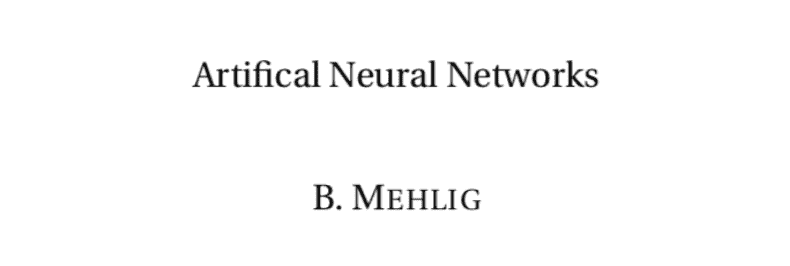
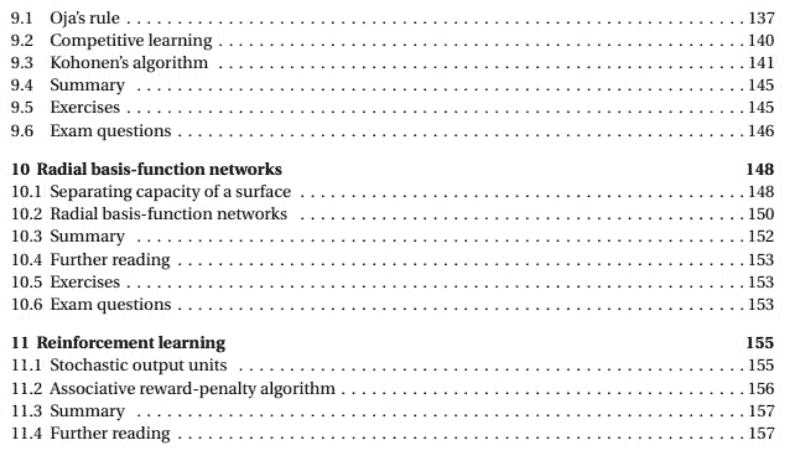

# 百页课程笔记，统计物理视角下的深度学习

> 原文：[`mp.weixin.qq.com/s?__biz=MzA3MzI4MjgzMw==&mid=2650755974&idx=2&sn=d2d16e77ad14f72cf811a5175cb59c5f&chksm=871a97f8b06d1eee73576b334d449b688f905c3f97a9af73db836ef9183359a590cf8bcf9c0c&scene=21#wechat_redirect`](http://mp.weixin.qq.com/s?__biz=MzA3MzI4MjgzMw==&mid=2650755974&idx=2&sn=d2d16e77ad14f72cf811a5175cb59c5f&chksm=871a97f8b06d1eee73576b334d449b688f905c3f97a9af73db836ef9183359a590cf8bcf9c0c&scene=21#wechat_redirect)

机器之心报道

**参与：****贾伟、思源**

> 墙内开花墙外香，深度神经网络不仅给计算机学科带来了巨大的变革，也同时在其他学科中引起巨大的反响，数学、物理、生物、天文等领域的师生纷纷开启了自学机器学习之路，有先见知名的院校则已经开始为他们的师生开设相关课程，机器学习在不久的将来甚至有可能会被列入各高校理工专业的必修学科之列。

近日，哥德堡大学物理系 Bernhard Mehlig 教授在 arXiv 上发布了他的一本「新书」《Artifical Neural Networks》。这本书正是他根据在哥德堡大学物理系 2018 秋季学期教学（FFR315）过程中的笔记整理而成。在这门课程中，他结合物理学（特别是统计物理学）的知识详细讲述了机器学习中神经网络在物理学中的各种应用，包括深度学习、卷积网络、强化学习，以及其他各种有监督和无监督机器学习算法。

*   下载地址：https://arxiv.org/pdf/1901.05639.pdf

*   FFR315 课程：http://physics.gu.se/~frtbm/joomla/index.php?option=com_content&view=article&id=124&Itemid=509

书很薄，只有 157 页，但相比目前市面上机器学习相关的书却极具特色。第一，他讲了许多当前流行书籍中很少涉及的内容，例如 Hopfield 网络；其次，书的内容主要是面向物理（特别是统计物理）的，可以说这是一本为物理学领域的师生所写的一本机器学习参考书。

**从 Hopfield 网络说起**

总体而言，这本 157 页的书从 Hopfield 网络 Hopfield 网络、监督学习和无监督学习三个主题介绍人工神经网络。其中监督学习介绍了我们熟悉的深度学习，无监督学习介绍了径向基函数网络和强化学习。而第一部分的 Hopfield 网络重点介绍了我们并不熟悉的确定性和随机性 Hopfield 网络，以及「贼复杂」的随机优化，可能对物理学来说这些恰好是简单的东西吧～

每一部分包含多个章节，且每一个章节都带有练习题和自测题，它们是检验章节掌握度的最好方法。此外从内容上而言，Hopfield 网络是比较有特点的部分，因为像花书《Deep Learning》等流行的教材并不会单独介绍这一内容。可能我们对它的理解还是根据 Hinton 2012 的神课而获得，即 Neural Networks for Machine Learning。所以如果想要了解早期人工神经网络的研究与发展，那么看这一部分就对了。

Hopfield 网络是一种可以识别或重构图像的人工神经网络，它通过某种方法（Hebb 规则）分配权重，并将图像储存在人工神经网络中。这是一种非常经典的想法，它构成了玻尔兹曼机和深度信念网络等方法的基础，但目前深度神经网络能代替它完成模式识别任务。

作者表示课程将 Hopfield 网络作为第一部分主要有三个原因，首先很多后续的深度神经网络都基于相同的构建块，以及与 Hebb 规则相近的学习方法。其次 Hopfield 网络可以很好地解决最优化问题，且最终算法与马尔可夫链蒙特卡洛方法密切相关，这在物理及统计学上非常重要。最后，Hopfield 网络与物理的随机系统密切相关，可能这也是最重要的吧。

后面两部分就是我们比较熟悉的有监督与无监督学习了，它们从感知机开始逐步向全连接网络、卷积网络和循环网络过渡，这也是大多数课程与书籍的学习路径。

**非物理，慎入**

正如前面提到，这是一本物理学（统计物理）与机器学习的结合。虽然书的重点是机器学习，但落脚点仍然是物理。一方面，在其行文落笔之间充斥着不少物理学中的语言，例如这样：

这些对学过量子力学的读者来说没有任何障碍，但对于非物理专业的读者却可能是不小的门槛。

如下展示了整本书的目录：

****本文为机器之心报道，**转载请联系本公众号获得授权****。**

✄------------------------------------------------

**加入机器之心（全职记者 / 实习生）：hr@jiqizhixin.com**

**投稿或寻求报道：**content**@jiqizhixin.com**

**广告 & 商务合作：bd@jiqizhixin.com**