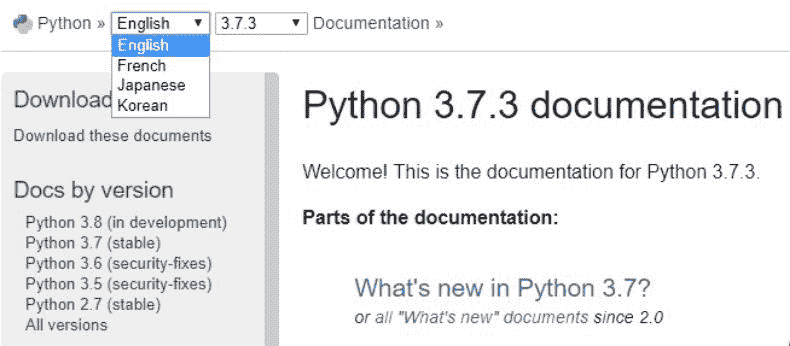
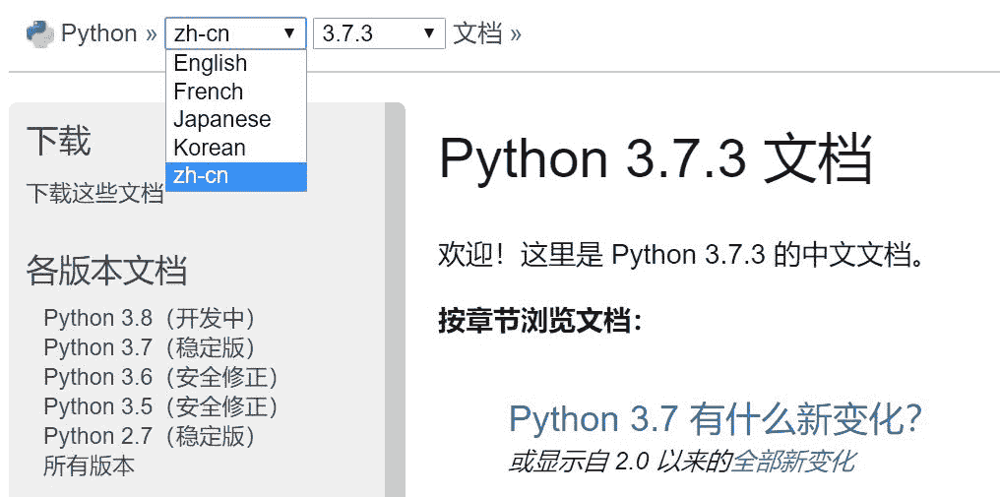
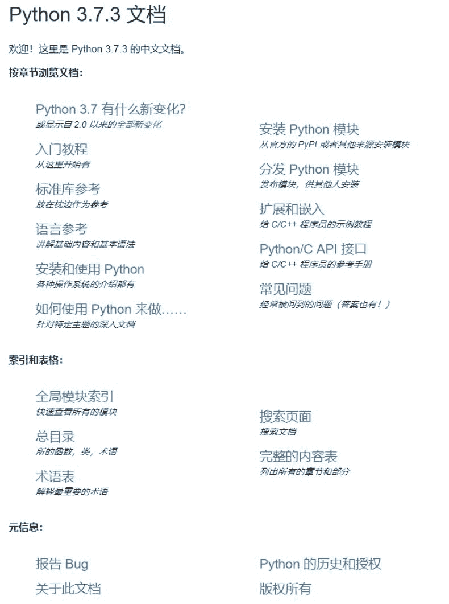
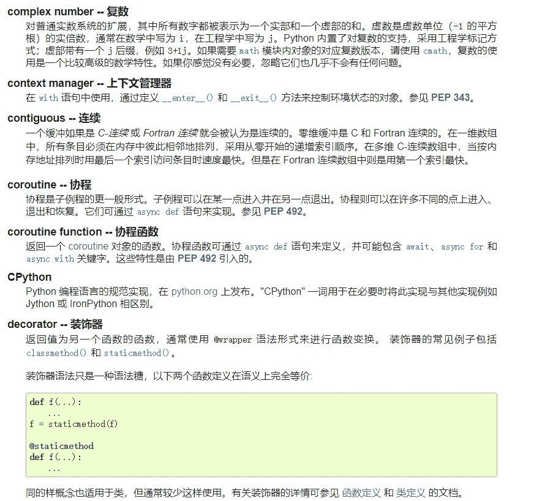
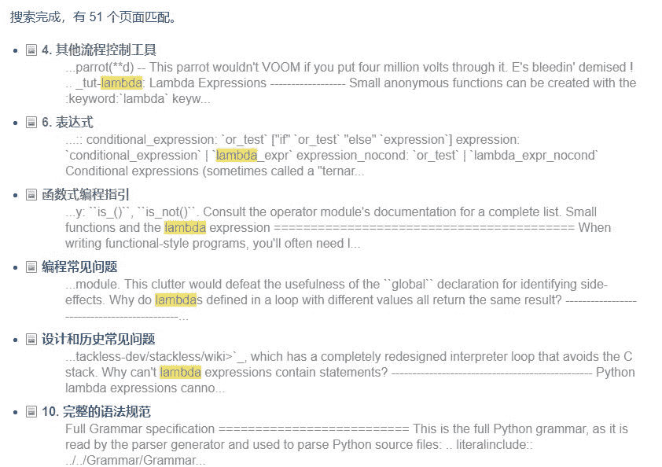
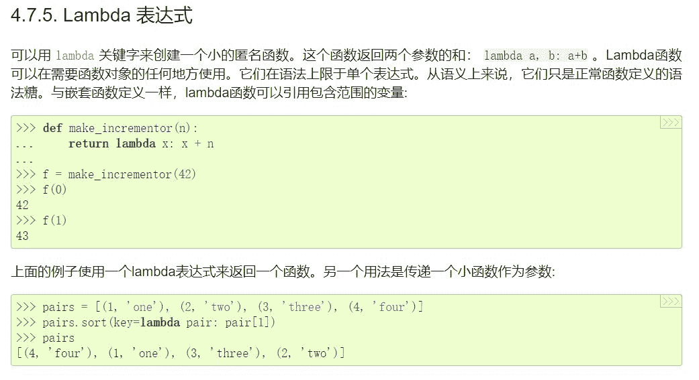

# Python 用不好？看官方中文文档啦

> 原文：[`mp.weixin.qq.com/s?__biz=MzA3MzI4MjgzMw==&mid=2650759349&idx=2&sn=60efa6549cfc320a1805ccaa64151551&chksm=871aa4cbb06d2ddd205e5b029e0fbf8082335aed3b395e68bf47f2a380db366dbe8187bb34aa&scene=21#wechat_redirect`](http://mp.weixin.qq.com/s?__biz=MzA3MzI4MjgzMw==&mid=2650759349&idx=2&sn=60efa6549cfc320a1805ccaa64151551&chksm=871aa4cbb06d2ddd205e5b029e0fbf8082335aed3b395e68bf47f2a380db366dbe8187bb34aa&scene=21#wechat_redirect)

机器之心报道

**参与：思源**

> Python 作为世界上最好用的语言，官方支持的文档一直没有中文。小伙伴们已经习惯了原汁原味的英文文档，但如果有官方中文文档，那么查阅或理解速度都会大大提升。本文将介绍隐藏在 Python 官网的中文文档～

*   官方中文文档地址：https://docs.python.org/zh-cn

以前也是有一些第三方维护的 Python 中文文档，不过可能因为人力等限制，并做不到同步更新与维护。目前也有很多高质量的 Python 中文资源，但大部分都是大牛写的书或教程，官方文档的翻译并得不到保证。

最近很多开发者发现 Python 现在已经有官方中文文档了，但直接从 Python 文档界面并看不到。如下在 Python 文档中，只有英语、法语、日语和韩语可选，我们并看不到中文选项。

但是如果我们在地址栏中手动键入 zh-cn，即：https://docs.python.org/zh-cn，那么我们就能看到官方的中文文档了。如下，我们现在从下拉项也可以直接看到中文选项。因为 Python/C API 接口等高阶内容还是英文，所以很可能目前中文文档还在完善中，并没有完全开放。

**官方中文文档有什么**

目前，官方中文文档已经有 3.8.0a2、3.7.3、3.6.8、2.7.16 几个主流版本的资料，相比英文文档只缺少 3.5.7。对于每一个 Python 版本，文档都包含很多内容，其中入门教程与语言参考已经完成汉化，其它基础内容也都有中文译文，例如各版本的新变化、安装和分发 Python 模块、常见问题等等。

但是还有一些高阶主题基本都保留了英文，例如 Python/C API 接口、标准库参考、扩展和嵌入等。这些内容有的比较难懂，也许它们对译者的要求更高，完成的进度也慢一些。

对于初学者而言，入门教程和 Python 语言参考可能是大家最需要的。其中入门教程非正式地介绍了 Python 语言的基本概念和功能。读者最好在阅读时准备一个 Python 解释器进行练习，不过所有的例子都是相互独立的，所以这个教程也可以离线阅读。

Python 语言参考相比入门教程提供了更正式的语法和「核心语义」，这一份参考非常简洁，它希望保证知识点的准确和完整。除了前面这两份基本学习资料，英文版 Python 文档还为 C/C++提供了两个额外的手册，不过这些高阶内容暂时还没有中文。

最后，Python 中文文档还有个小彩蛋，它把 Python 中的术语都翻了一遍。很多时候，这些术语都有不同的译文与表达方式，例如 decorator 既可以保留原文，也可以翻成装饰器或修饰器。也许以后，这一份官方词汇表可以帮助我们找到更合适的表达方式。

**中文文档怎么搜**

可能对大多数开发者而言，检索 Python 的函数或用法是文档的常用方法。例如如果我们希望找到函数式编程的使用方法，那么可以在中文文档中搜索 Lambda：

其中流程控制工具有匿名函数 Lambda 的使用简介，而重要的函数式编程指引暂时只有一小部分完成翻译。如下展示的是检索到的 Lambda 使用指南。

****本文为机器之心报道，**转载请联系本公众号获得授权****。**

✄------------------------------------------------

**加入机器之心（全职记者 / 实习生）：hr@jiqizhixin.com**

**投稿或寻求报道：**content**@jiqizhixin.com**

**广告 & 商务合作：bd@jiqizhixin.com**