# 七、个 Python 特殊技巧，助力你的数据分析工作之路

> 原文：[`mp.weixin.qq.com/s?__biz=MzA3MzI4MjgzMw==&mid=2650772701&idx=1&sn=4a270c1f4f625ea69d3701072355f050&chksm=871a50a3b06dd9b53a63559dfa303d6b617147ecaa23d4e013fa6438049a930c05d96844cfdf&scene=21#wechat_redirect`](http://mp.weixin.qq.com/s?__biz=MzA3MzI4MjgzMw==&mid=2650772701&idx=1&sn=4a270c1f4f625ea69d3701072355f050&chksm=871a50a3b06dd9b53a63559dfa303d6b617147ecaa23d4e013fa6438049a930c05d96844cfdf&scene=21#wechat_redirect)

选自 TowardsDataScience

**作者：Perter Nistrup****机器之心编译****参与：魔王**

> 如何提升数据分析能力？Peter Nistrup 根据自身经验列出了 7 个有用工具。

本文列举了一些提升或加速日常数据分析工作的技巧，包括：
1\. Pandas Profiling2\. 使用 Cufflinks 和 Plotly 绘制 Pandas 数据 3\. IPython 魔术命令 4\. Jupyter 中的格式编排 5\. Jupyter 快捷键 6\. 在 Jupyter（或 IPython）中使一个单元同时有多个输出 7\. 为 Jupyter Notebook 即时创建幻灯片**1\. Pandas Profiling**该工具效果明显。下图展示了调用 df.profile_report() 这一简单方法的结果：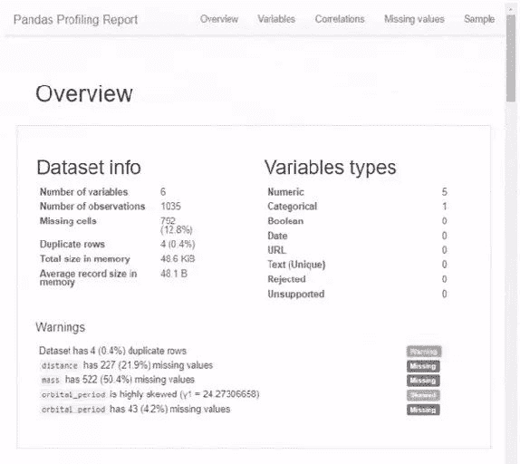使用该工具只需安装和导入 Pandas Profiling 包。本文不再详述这一工具，如欲了解更多，请阅读：https://towardsdatascience.com/exploring-your-data-with-just-1-line-of-python-4b35ce21a82d**2\. 使用 Cufflinks 和 Plotly 绘制 Pandas 数据**「经验丰富的」数据科学家或数据分析师大多对 matplotlib 和 pandas 很熟悉。也就是说，你只需调用 .plot() 方法，即可快速绘制简单的 pd.DataFrame 或 pd.Series：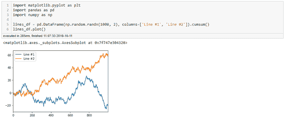

*有点无聊？*

这已经很好了，不过是否可以绘制一个交互式、可缩放、可扩展的全景图呢？是时候让 Cufflinks* *出马了！（Cufflinks 基于 Plotly 做了进一步的包装。）在环境中安装 Cufflinks，只需在终端中运行! pip install cufflinks --upgrade 即可。查看下图：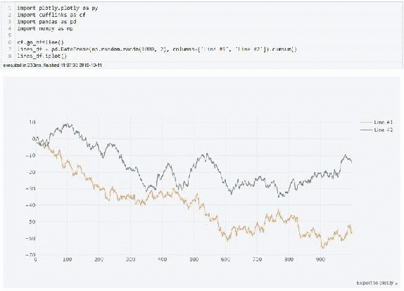*效果好多了！*注意，上图唯一改变的是 Cufflinks cf.go_offline() 的导入和设置，它将 .plot() 方法变为 .iplot()。其他方法如 .scatter_matrix() 也可以提供非常棒的可视化结果：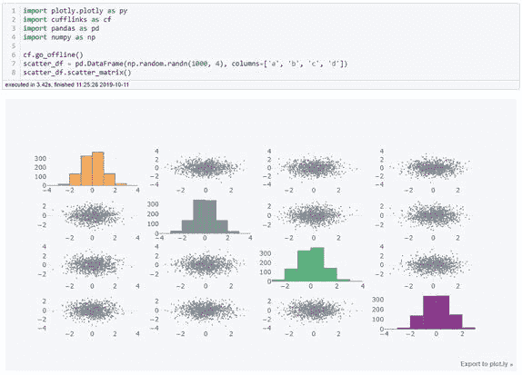需要做大量数据可视化工作的朋友，可以阅读 Cufflinks 和 Plotly 的文档，发现更多方法。

*   Cufflinks 文档：https://plot.ly/ipython-notebooks/cufflinks/

*   Plotly 文档：https://plot.ly/

**3\. IPython 魔术命令**IPython 的「魔术」是 IPython 基于 Python 标准语法的一系列提升。魔术命令包括两种方法：行魔术命令（line magics）：以 % 为前缀，在单个输入行上运行；单元格魔术命令（cell magics）：以 %% 为前缀，在多个输入行上运行。下面列举了 IPython 魔术命令提供的一些有用功能：**%lsmagic：****找出全部命令**如果你只记得一个魔术命令，那必须得是这一个。执行 %lsmagic 命令将提供所有可用魔术命令的列表：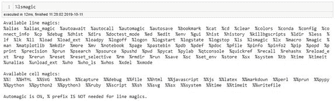**%debug：****交互式 debug**这可能是我最常使用的魔术命令了。大部分数据科学家都遇到过这种情况：执行的代码块一直 break，你绝望地写了 20 个 print() 语句，想输出每个变量的内容。然后，当你最终修复问题后，你还得返回并再次删除所有 print() 语句。不过以后再也不用这样了。遇到问题后只需执行 %debug 命令，即可执行想要运行的任意代码部分：

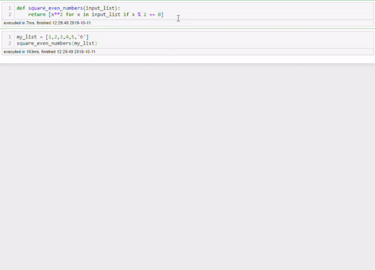

上图中发生了什么？

1.  我们有一个函数，它以列表为输入，并对所有的偶数取平方值。

2.  我们运行函数，但是出了些问题。但是我们并不知道怎么回事！

3.  对该函数使用%debug 命令。

4.  让调试器告诉我们 x 和 type(x) 的值。

5.  问题显而易见：我们把'6'作为字符串输入到函数中了！

这对于更复杂的函数非常有用。**%store：****在 notebook 之间传递变量**这个命令也很酷。假设你花了一些时间清洗 notebook 中的数据，现在你想在另一个 notebook 中测试一些功能，那么你是在同一个 notebook 中实现该功能，还是保存数据并在另一个 notebook 中加载数据呢？使用%store 命令后，这些操作都不需要！该命令将存储变量，你可以在其他任意 notebook 中检索该变量：

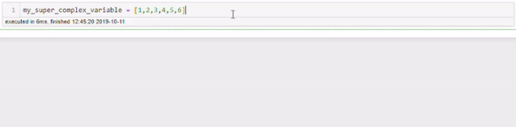

*   %store [variable] 存储变量。

    *   %store -r [variable] 读取/检索存储变量。

    **%who：****列出所有全局变量。**你是否遇到过，为变量赋值后却忘记变量名的情况？或者不小心删掉了负责为变量赋值的单元格？使用%who 命令，你可以得到所有全局变量的列表：

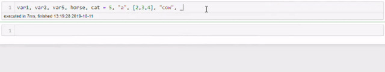

**%%time：****计时魔法命令**使用该命令可以获取所有计时信息。只需对任意可执行代码应用%%time 命令，你就可以得到如下输出：

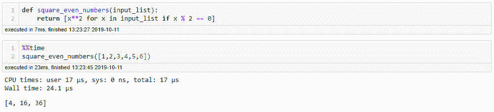**%%writefile：****向文件写入单元格内容**

在 notebook 中写复杂函数或类，且想将其保存到专属文件中时，该魔法命令非常有用。只需为函数或类的单元格添加 %%writefile 前缀和想要保存到的文件名即可：

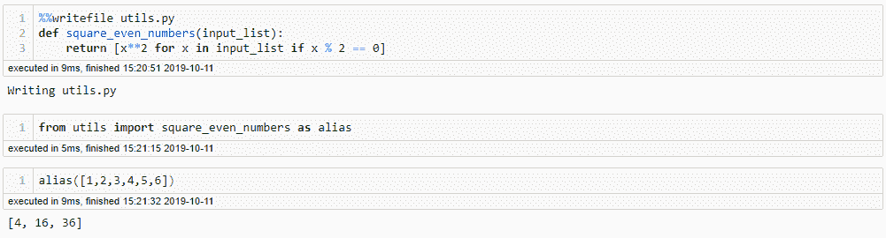如上所示，我们可以将创建的函数保存到 utils.py 文件中，然后就可以随意导入了。在其他 notebook 中也可以这样，只要与 utils.py 文件属于同一个目录即可。

**4\. Jupyter 中的格式编排**这个工具很酷！Jupyter 考虑到 markdown 中存在 HTML / CSS 格式。以下是我最经常使用的功能：蓝色、时尚：

```py
<div class="alert alert-block alert-info">   This is <b>fancy</b>!</div>
```

红色、轻微慌张：

```py
<div class="alert alert-block alert-danger">   This is <b>baaaaad</b>!</div>
```

绿色、平静：

```py
<div class="alert alert-block alert-success"> This is <b>gooood</b>!</div>
```

下图展示了它们的运行过程：

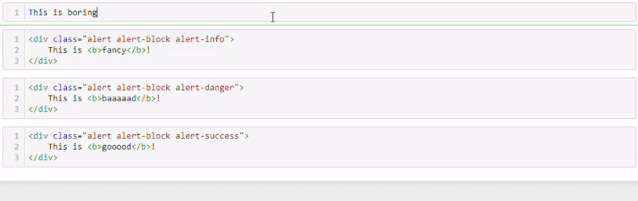

当你想以 Notebook 格式呈现一些发现时，这非常有用！**5\. Jupyter 快捷键**想了解和学习键盘快捷键，你可以使用命令面板：Ctrl + Shift + P，获取 notebook 所有功能的列表。下面选取了几个最基础的命令：

*   Esc：进入命令模式。在命令模式内，你可以使用方向键在 notebook 内进行导航。

在命令模式内：

*   A 和 B：在当前单元格上方（Above）或下方（Below）插入新的单元格。

*   M：当前单元格转入 Markdown 状态。

*   Y：当前单元格转入 code 状态。

*   D,D：删除当前单元格。

*   Enter：当前单元格回到编辑模式。

在编辑模式内：

*   Shift + Tab：为你在当前单元格中键入的对象提供文档字符串（文档），持续使用该快捷键，可循环使用文档模式。

*   Ctrl + Shift + -：在光标所在处分割当前单元格。

*   Esc + F：查找并替换代码（不包括输出）。

*   Esc + O：切换单元格输出。

选择多个单元格：

*   Shift + Down 和 Shift + Up：选中下方或上方的单元格。

*   Shift + M：合并选中单元格。

注意，选中多个单元格后，你可以批量执行删除/复制/剪切/粘贴/运行操作。

**6\. 在 Jupyter（或 IPython）中使一个单元同时有多个输出** 

想展示 pandas DataFrame 的 .head() 和 .tail()，但由于创建运行 .tail() 方法的额外代码单元过于麻烦而不得不中途放弃，你是否有过这样的经历？现在不用怕了，你可以使用以下代码行展示你想展示的输出：

```py
from IPython.core.interactiveshell import InteractiveShellInteractiveShell.ast_node_interactivity = "all"
```

下图展现了多个输出的结果：

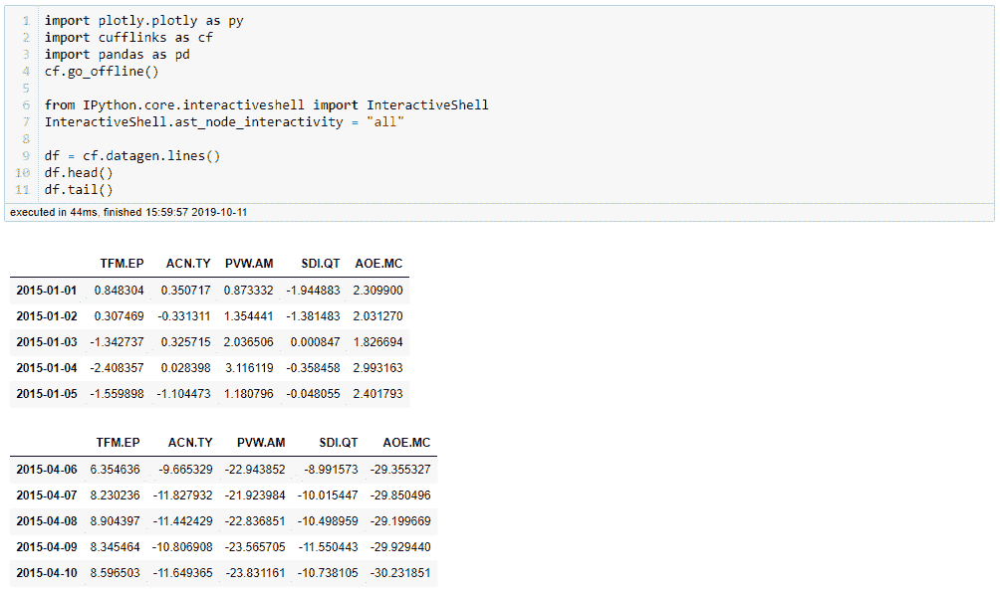

**7\. 为 Jupyter Notebook 即时创建幻灯片**使用 RISE，你可以仅通过一次按键将 Jupyter Notebook 即时转变为幻灯片。而且 notebook 仍然处于活跃状态，你可以在展示幻灯片的同时执行实时编码！要想使用该工具，你只需通过 conda 或 pip 安装 RISE 即可。

```py
conda install -c conda-forge rise
```

或者

```py
pip install RISE
```

现在，你可以点击新按钮，为 notebook 创建不错的幻灯片了：

世界 AI 看中国，中国 AI 看北京！

百位顶级专家，60+前沿报告，10+圆桌论坛与尖峰对话，为你带来内行的 AI 盛会。荟萃全球顶级学者：JohnHopcroft（图灵奖），MichaelJordan（机器学习权威学者），ChrisManning（NLP 权威学者），朱松纯（计算机视觉权威学者），张钹、高文、戴琼海和张平文院士等 100 多位专家。扫码查看大会详细日程，注册参会时输入优惠码**「****BAAICSDN****」**专享**7****折**优惠，**学生票仅****69****元**（数量有限，先到先得）。

