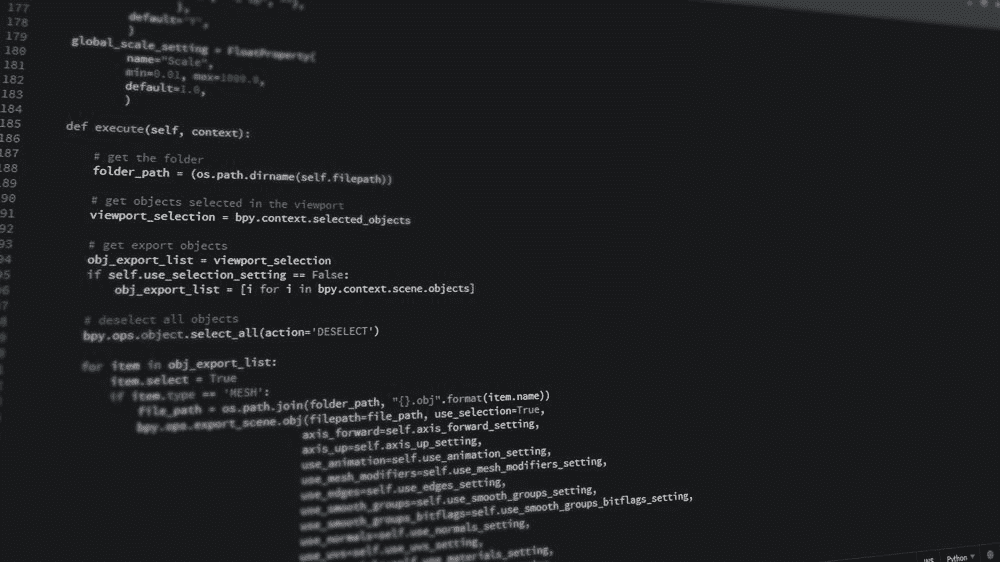

# Python 的高级特征你知多少？来对比看看

> 原文：[`mp.weixin.qq.com/s?__biz=MzA3MzI4MjgzMw==&mid=2650760891&idx=2&sn=a508b209224455f6cdb6b0308a86a47a&chksm=871aa2c5b06d2bd32bf1d9ce7fd48f879a7fa61033361d0cf47764340fccf98b0b31b9d30447&scene=21#wechat_redirect`](http://mp.weixin.qq.com/s?__biz=MzA3MzI4MjgzMw==&mid=2650760891&idx=2&sn=a508b209224455f6cdb6b0308a86a47a&chksm=871aa2c5b06d2bd32bf1d9ce7fd48f879a7fa61033361d0cf47764340fccf98b0b31b9d30447&scene=21#wechat_redirect)

选自 towardsdatascience

**作者：******George Seif****

****机器之心编译**** 

**机器之心编辑部**

> Python 多好用不用多说，大家看看自己用的语言就知道了。但是 Python 隐藏的高级功能你都 get 了吗？本文中，作者列举了 Python 中五种略高级的特征以及它们的使用方法，快来一探究竟吧！



Python 是一种美丽的语言，它简单易用却非常强大。但你真的会用 Python 的所有功能吗？

任何编程语言的高级特征通常都是通过大量的使用经验才发现的。比如你在编写一个复杂的项目，并在 stackoverflow 上寻找某个问题的答案。然后你突然发现了一个非常优雅的解决方案，它使用了你从不知道的 Python 功能！

这种学习方式太有趣了：通过探索，偶然发现什么。

下面是 Python 的 5 种高级特征，以及它们的用法。

**Lambda 函数**

Lambda 函数是一种比较小的匿名函数——匿名是指它实际上没有函数名。

Python 函数通常使用 def a_function_name() 样式来定义，但对于 lambda 函数，我们根本没为它命名。这是因为 lambda 函数的功能是执行某种简单的表达式或运算，而无需完全定义函数。

lambda 函数可以使用任意数量的参数，但表达式只能有一个。

```py
x = lambda a, b : a * b
print(x(5, 6)) # prints '30'

x = lambda a : a*3 + 3
print(x(3)) # prints '12'
```

看它多么简单！我们执行了一些简单的数学运算，而无需定义整个函数。这是 Python 的众多特征之一，这些特征使它成为一种干净、简单的编程语言。

**Map 函数**

Map() 是一种内置的 Python 函数，它可以将函数应用于各种数据结构中的元素，如列表或字典。对于这种运算来说，这是一种非常干净而且可读的执行方式。

```py
def square_it_func(a):
    return a * a

x = map(square_it_func, [1, 4, 7])
print(x) # prints '[1, 16, 47]'

def multiplier_func(a, b):
    return a * b

x = map(multiplier_func, [1, 4, 7], [2, 5, 8])
print(x) # prints '[2, 20, 56]'看看上面的示例！我们可以将函数应用于单个或多个列表。实际上，你可以使用任何 Python 函数作为 map 函数的输入，只要它与你正在操作的序列元素是兼容的。
```

**Filter 函数**

filter 内置函数与 map 函数非常相似，它也将函数应用于序列结构（列表、元组、字典）。二者的关键区别在于 filter() 将只返回应用函数返回 True 的元素。

详情请看如下示例：

```py
# Our numbers
numbers = [1, 2, 3, 4, 5, 6, 7, 8, 9, 10, 11, 12, 13, 14, 15]

# Function that filters out all numbers which are odd
def filter_odd_numbers(num):

    if num % 2 == 0:
        return True
    else:
        return False

filtered_numbers = filter(filter_odd_numbers, numbers)

print(filtered_numbers)
# filtered_numbers = [2, 4, 6, 8, 10, 12, 14]
```

我们不仅评估了每个列表元素的 True 或 False，filter() 函数还确保只返回匹配为 True 的元素。非常便于处理检查表达式和构建返回列表这两步。

**Itertools 模块**

Python 的 Itertools 模块是处理迭代器的工具集合。迭代器是一种可以在 for 循环语句（包括列表、元组和字典）中使用的数据类型。

使用 Itertools 模块中的函数让你可以执行很多迭代器操作，这些操作通常需要多行函数和复杂的列表理解。关于 Itertools 的神奇之处，请看以下示例：

```py
from itertools import *

# Easy joining of two lists into a list of tuples
for i in izip([1, 2, 3], ['a', 'b', 'c']):
    print i
# ('a', 1)
# ('b', 2)
# ('c', 3)

# The count() function returns an interator that 
# produces consecutive integers, forever. This 
# one is great for adding indices next to your list 
# elements for readability and convenience
for i in izip(count(1), ['Bob', 'Emily', 'Joe']):
    print i
# (1, 'Bob')
# (2, 'Emily')
# (3, 'Joe')    

# The dropwhile() function returns an iterator that returns 
# all the elements of the input which come after a certain 
# condition becomes false for the first time. 
def check_for_drop(x):
    print 'Checking: ', x
    return (x > 5)

for i in dropwhile(should_drop, [2, 4, 6, 8, 10, 12]):
    print 'Result: ', i

# Checking: 2
# Checking: 4
# Result: 6
# Result: 8
# Result: 10
# Result: 12

# The groupby() function is great for retrieving bunches
# of iterator elements which are the same or have similar 
# properties

a = sorted([1, 2, 1, 3, 2, 1, 2, 3, 4, 5])
for key, value in groupby(a):
    print(key, value), end=' ')

# (1, [1, 1, 1])
# (2, [2, 2, 2]) 
# (3, [3, 3]) 
# (4, [4]) 
# (5, [5]) 
```

**Generator 函数**

Generator 函数是一个类似迭代器的函数，即它也可以用在 for 循环语句中。这大大简化了你的代码，而且相比简单的 for 循环，它节省了很多内存。

比如，我们想把 1 到 1000 的所有数字相加，以下代码块的第一部分向你展示了如何使用 for 循环来进行这一计算。

如果列表很小，比如 1000 行，计算所需的内存还行。但如果列表巨长，比如十亿浮点数，这样做就会出现问题了。使用这种 for 循环，内存中将出现大量列表，但不是每个人都有无限的 RAM 来存储这么多东西的。Python 中的 range() 函数也是这么干的，它在内存中构建列表。

代码中第二部分展示了使用 Python generator 函数对数字列表求和。generator 函数创建元素，并只在必要时将其存储在内存中，即一次一个。这意味着，如果你要创建十亿浮点数，你只能一次一个地把它们存储在内存中！Python 2.x 中的 xrange() 函数就是使用 generator 来构建列表。

上述例子说明：如果你想为一个很大的范围生成列表，那么就需要使用 generator 函数。如果你的内存有限，比如使用移动设备或边缘计算，使用这一方法尤其重要。

也就是说，如果你想对列表进行多次迭代，并且它足够小，可以放进内存，那最好使用 for 循环或 Python 2.x 中的 range 函数。因为 generator 函数和 xrange 函数将会在你每次访问它们时生成新的列表值，而 Python 2.x range 函数是静态的列表，而且整数已经置于内存中，以便快速访问。****

```py
# (1) Using a for loopv
numbers = list()

for i in range(1000):
    numbers.append(i+1)

total = sum(numbers)

# (2) Using a generator
 def generate_numbers(n):
     num, numbers = 1, []
     while num < n:
           numbers.append(num)
     num += 1
     return numbers
 total = sum(generate_numbers(1000))

 # (3) range() vs xrange()
 total = sum(range(1000 + 1))
 total = sum(xrange(1000 + 1)) 
```

*原文链接：**https://towardsdatascience.com/5-advanced-features-of-python-and-how-to-use-them-73bffa373c84*

****本文为机器之心编译，**转载请联系本公众号获得授权****。**

✄------------------------------------------------

**加入机器之心（全职记者 / 实习生）：hr@jiqizhixin.com**

**投稿或寻求报道：**content**@jiqizhixin.com**

**广告 & 商务合作：bd@jiqizhixin.com**