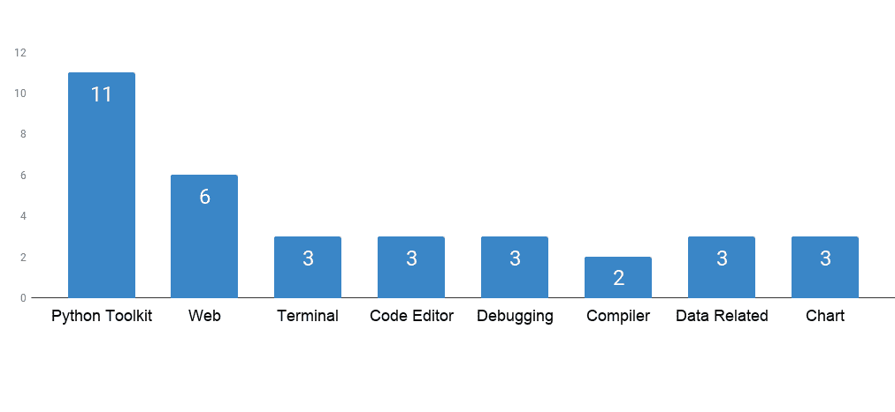
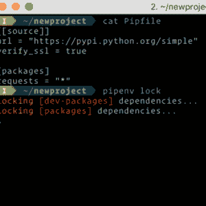
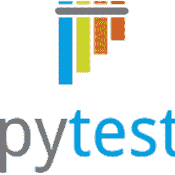
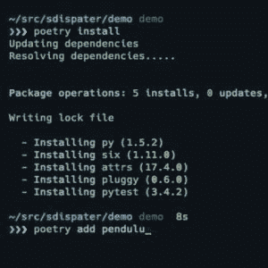
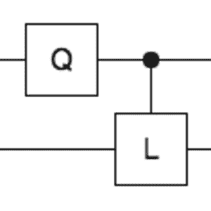
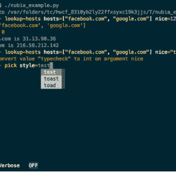
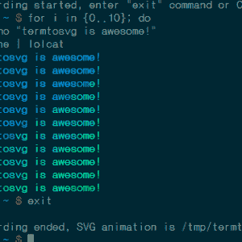
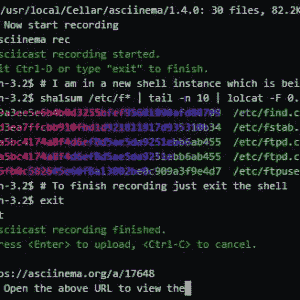
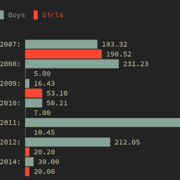

# 平均 3293 颗星的 34 个年度开源 Python 库

> 原文：[`mp.weixin.qq.com/s?__biz=MzA3MzI4MjgzMw==&mid=2650758099&idx=4&sn=36821863791f8b7ee09dabaa9313ca7d&chksm=871a9fadb06d16bb3ecc380ede182b0219262c01c0bf5a67898b273ffab38f18856f7b637324&scene=21#wechat_redirect`](http://mp.weixin.qq.com/s?__biz=MzA3MzI4MjgzMw==&mid=2650758099&idx=4&sn=36821863791f8b7ee09dabaa9313ca7d&chksm=871a9fadb06d16bb3ecc380ede182b0219262c01c0bf5a67898b273ffab38f18856f7b637324&scene=21#wechat_redirect)

选自 medium

**作者：Mybridge**

**机器之心编译** 

**参与：Nurhachu Null、张倩**

> 在过去的一年里，本文作者比较了近一万个开源 Python 库，并从中选出了 34 个最有用的工具。它们在 GitHub 上的平均⭐️数量是 3293，包括 Python 工具、Web、终端、代码编辑器、编译器等。

这些开源 Python 库被分为 8 个类别，如下图所示。

*   测试版本的内容目录参见 GitHub（https://github.com/Mybridge/amazing-python-2019） (https://github.com/Mybridge/amazing-python-2019%EF%BC%89)

    *   过去一年令人惊喜的机器学习项目（v.2019），参见这里（https://medium.mybridge.co/amazing-machine-learning-open-source-tools-projects-of-the-year-v-2019-95d772e4e985）

    *   过去一年 30 个优秀的 Python 项目（v.2018），参见这里（https://medium.mybridge.co/30-amazing-python-projects-for-the-past-year-v-2018-9c310b04cdb3）

开源库可以加快你开发软件的速度。抽出足够的时间来玩转一下过去一年优秀的开源 Python 库吧。

**推荐学习**

*   A）初学者：The Python Bible™ |Everything You Need to Program in Python [57140 推荐，评分 4.6/5]。（http://bit.ly/2Dci974）

*   B）深度学习：Python TensorFlow 深度学习完全指南 [53664 推荐，评分 4.5/5] （http://bit.ly/2EatVy7）

**<Python 工具>**

**No.1**

Pipenv: 为人类提供的 Python 开发流程[Github 15710 星]（https://github.com/pypa/pipenv?utm_source=mybridge&utm_medium=blog&utm_campaign=read_more）

**No 2**

Pyxel: Python 复古游戏开发环境[GitHub4884 星]（https://github.com/kitao/pyxel?utm_source=mybridge&utm_medium=blog&utm_campaign=read_more）

**No 3**

PyTest v3.5: 可以轻松编写小测试的 Python 框架，不过还需要扩展以支持复杂功能的测试。[GitHub 3631 星]（https://github.com/pytest-dev/pytest?utm_source=mybridge&utm_medium=blog&utm_campaign=read_more）

 

**No 4**

Poetry： Python 依赖关系管理，并且让封装更加容易。[GitHub3228 星]（https://github.com/sdispater/poetry?utm_source=mybridge&utm_medium=blog&utm_campaign=read_more）

**No 5**

Loguru： 让 Python 日志变得简单（傻瓜式）。[GitHub 3048 星]（https://github.com/Delgan/loguru?utm_source=mybridge&utm_medium=blog&utm_campaign=read_more）

 

**No 6**

Faust：用 Python 构建流式应用的库。[GitHub 2733 星]（https://github.com/robinhood/faust?utm_source=mybridge&utm_medium=blog&utm_campaign=read_more）

 

**No 7**

Pampy： 你梦寐以求的用于 Python 的模式匹配。[GitHub 2399 星]（https://github.com/santinic/pampy?utm_source=mybridge&utm_medium=blog&utm_campaign=read_more）

**No 8**

Pyre-check：高效的 Python 拼写检查。[GitHub 2242 星]（https://github.com/facebook/pyre-check?utm_source=mybridge&utm_medium=blog&utm_campaign=read_more）

 

**No 9**

Delorean, Time Travel Made Easy： 用来清理在处理日期时间时出现的不便事实的 Python 库。[GitHub1502 星]（https://github.com/myusuf3/delorean?utm_source=mybridge&utm_medium=blog&utm_campaign=read_more）

 

**No 10**

Cirq：用于创建、编辑和激活嘈杂中型量子（NISQ）电路的 Python 框架。[GitHub 1394 星]（https://github.com/quantumlib/Cirq?utm_source=mybridge&utm_medium=blog&utm_campaign=read_more）

**No 11**

Python-nubia: 一个命令行交互式 shell 框架。[GitHub 1032 星]（https://github.com/facebookincubator/python-nubia?utm_source=mybridge&utm_medium=blog&utm_campaign=read_more）

**<Web>**

**No 12**

Requests-HTML: 适合人类的 HTML 解析（使用 Python 3）[GitHub 8995 星]（https://github.com/kennethreitz/requests-html?utm_source=mybridge&utm_medium=blog&utm_campaign=read_more）

 

**No 13**

Bokeh：一个交互式的 Python 可视化库，它能够在现代 web 浏览器中实现漂亮且有意义的数据视觉展现。[GitHub 8943 星]（https://github.com/bokeh/bokeh?utm_source=mybridge&utm_medium=blog&utm_campaign=read_more）

 

**No 14**

Vibora: 快速、异步并且迷人的 Pythonweb 框架。[GitHub 4665 星]（https://github.com/vibora-io/vibora?utm_source=mybridge&utm_medium=blog&utm_campaign=read_more）

**No 15**

Pywebview v2.0: 围绕 webview 组件的轻量级跨平台本机 wrapper，它允许在自己专用的窗口显示 HTML 内容。[GitHub 1208 星](https://github.com/r0x0r/pywebview?utm_source=mybridge&utm_medium=blog&utm_campaign=read_more)

 

**No 16**

WhatWaf: 检测并绕过 web 应用防火墙和防护系统。[GitHub 995 颗星]（https://github.com/Ekultek/WhatWaf?utm_source=mybridge&utm_medium=blog&utm_campaign=read_more）

 

**No 17**

Molten：用 Python 3.6 以及更高版本 Python 构建 HTTP API 的最小、可扩展、快速、高效框架。[GitHub 796 颗星]（https://github.com/Bogdanp/molten?utm_source=mybridge&utm_medium=blog&utm_campaign=read_more）

**<终端>**

**No 18**

Termtosvg： 将终端会话录制成用 Python 写的 SVG 动画。[GitHub 7522 颗星]（https://github.com/nbedos/termtosvg?utm_source=mybridge&utm_medium=blog&utm_campaign=read_more）

 

**No 19**

Asciinema v2.0: 使用 Python 开发的终端会话记录器。[GitHub 6668 颗星]（https://github.com/asciinema/asciinema?utm_source=mybridge&utm_medium=blog&utm_campaign=read_more）

 

**No 20**

Termgraph：能够在终端绘制基本图形的 Python 命令行工具。[GitHub 2005 颗星]（https://github.com/mkaz/termgraph?utm_source=mybridge&utm_medium=blog&utm_campaign=read_more） 

**<代码编辑器>**

**No 21**

Black：不妥协的 Python 代码格式化程序。[GitHub 7629 颗星]（https://github.com/ambv/black?utm_source=mybridge&utm_medium=blog&utm_campaign=read_more）

**No 22**

Algojammer：用于在 Python 中写算法的实验性概念验证代码编辑器。[GitHub 2750 颗星]（https://github.com/ChrisKnott/Algojammer?utm_source=mybridge&utm_medium=blog&utm_campaign=read_more）

**No 23**

Bowler：用于在语法树级别操作 Python 的重构工具。它可以实现安全、大规模的代码修改，同时保证结果代码的编译和运行。[GitHub 879 颗星]（https://github.com/facebookincubator/bowler?utm_source=mybridge&utm_medium=blog&utm_campaign=read_more）

**<调试>**

**No 24**

Py-spy: Python 程序采样分析器。它可以让你在不用重启或者修改程序的情况下就能够将 Python 程序的时间都花在哪进行可视化。[GitHub 3479 颗星] （https://github.com/benfred/py-spy?utm_source=mybridge&utm_medium=blog&utm_campaign=read_more）

**No 25**

Birdseye： 使用 AST 的快速、便捷且以表达为中心的图形化 Python 调试器。[GitHub 1068 颗星]（https://github.com/alexmojaki/birdseye?utm_source=mybridge&utm_medium=blog&utm_campaign=read_more）

**No 26**

Icecream：甜美顺滑的打印调试器。[GitHub728 颗星]（https://github.com/gruns/icecream?utm_source=mybridge&utm_medium=blog&utm_campaign=read_more）

**<编译器>**

**No 27**

Transcrypt: Python 3.7 到 JavaScript 的编译器——精湛、快速、开放！[GitHub 1561 颗星]（https://github.com/qquick/Transcrypt?utm_source=mybridge&utm_medium=blog&utm_campaign=read_more）

**No 28**

Pyodide：编译成 WebAssembly 的 Python 科学栈。[GitHub 1041 颗星]（https://github.com/iodide-project/pyodide?utm_source=mybridge&utm_medium=blog&utm_campaign=read_more）

**<数据相关>**

**No 29**

Voluptuous：尽管起了 Voluptuous（丰满的）这个名字，但这是一个 Python 数据验证库。[GitHub 1368 颗星]（https://github.com/alecthomas/voluptuous?utm_source=mybridge&utm_medium=blog&utm_campaign=read_more）

**No 30**

Botflow：用于数据流程工作（如网络爬虫、机器学习、量化交易等等）的 Python 快速数据驱动编程框架。[GitHub 933 颗星]（https://github.com/kkyon/botflow?utm_source=mybridge&utm_medium=blog&utm_campaign=read_more）

**No 31**

Fast-Pandas： pandas 中针对不同大小数据帧的不同运算基准。[GitHub 798 颗星]（https://github.com/mm-mansour/Fast-Pandas?utm_source=mybridge&utm_medium=blog&utm_campaign=read_more）

**<图表>**

**No 32**

A Tour in the Wonderland of Math with Python（基于 Python 的数学仙境之旅）： 一组用于绘制漂亮的图像和模拟有趣的数学算法的 Python 脚本。[GitHub 3172 颗星]（https://github.com/neozhaoliang/pywonderland?utm_source=mybridge&utm_medium=blog&utm_campaign=read_more）

**No 33**

Chartify： 让数据科学家画图变得更轻松的 Python 库。[GitHub 1817 颗星]（https://github.com/spotify/chartify?utm_source=mybridge&utm_medium=blog&utm_campaign=read_more）

**No 34**

Hypertools v0.5：用于获取高维数据中的几何思想的 Python 工具箱。[GitHub 1353 颗星]（https://github.com/ContextLab/hypertools?utm_source=mybridge&utm_medium=blog&utm_campaign=read_more）

*原文链接：https://medium.mybridge.co/34-amazing-python-open-source-libraries-for-the-past-year-v-2019-93d6ee11aceb*

****本文为机器之心编译，**转载请联系本公众号获得授权****。**

✄------------------------------------------------

**加入机器之心（全职记者 / 实习生）：hr@jiqizhixin.com**

**投稿或寻求报道：**content**@jiqizhixin.com**

**广告 & 商务合作：bd@jiqizhixin.com**