# 人生苦短，我用 PyCharm

> 原文：[`mp.weixin.qq.com/s?__biz=MzA3MzI4MjgzMw==&mid=2650769640&idx=1&sn=78082aaa6288496763050ca447edd25f&chksm=871a4c96b06dc58011dcb6b49318ff5b53f8b3ddcbc7b02b04f8552686b7ac98ae0c59e49303&scene=21#wechat_redirect`](http://mp.weixin.qq.com/s?__biz=MzA3MzI4MjgzMw==&mid=2650769640&idx=1&sn=78082aaa6288496763050ca447edd25f&chksm=871a4c96b06dc58011dcb6b49318ff5b53f8b3ddcbc7b02b04f8552686b7ac98ae0c59e49303&scene=21#wechat_redirect)

选自 RealPython

**作者：****Jahongir Rahmonov**

**机器之心编译**

**参与：魔王**

> PyCharm 是一种 Python IDE，可以帮助程序员节约时间，提高生产效率。那么具体如何使用呢？本文从 PyCharm 安装到插件、外部工具、专业版功能等进行了一一介绍，希望能够帮助到大家。

机器之心之前也没系统地介绍过 PyCharm，怎样配置环境、怎样 DeBug、怎样同步 GitHub 等等可能都是通过经验或者摸索学会的。在本文中，我们并不会提供非常完善的指南，但是会介绍 PyCharm 最主要的一些能力，了解这些后，后面就需要我们在实践中再具体学习了。机器之心的读者应该非常了解 JetBrains 开发的 PyCharm 了，它差不多是 Python 最常用的 IDE。PyCharm 可以为我们节省大量时间，它能够管理代码，并完成大量其他任务，如 debug 和可视化等。本文将介绍：

*   PyCharm 安装

*   在 PyCharm 中写代码

*   在 PyCharm 中运行代码

*   在 PyCharm 中进行代码 debug 和测试

*   在 PyCharm 中编辑已有项目

*   在 PyCharm 中搜索和导航

*   在 PyCharm 中使用版本控制

*   在 PyCharm 中使用插件和外部工具

*   使用 PyCharm Professional 功能，如 Django 支持和科学模式

本文假设读者熟悉 Python 开发，且计算机中已安装某个版本的 Python。该教程将使用 Python 3.6 版本，屏幕截图和 demo 均来自 macOS 系统。由于 PyCharm 可在所有主流平台上运行，读者在其他系统中会看到略微不同的 UI 元素，可能需要调整某些命令。**PyCharm 安装**本文将使用 PyCharm Community Edition 2019.1 版本，该版本免费且可在所有主流平台上使用。只有最后一部分「PyCharm Professional 功能」使用的是 PyCharm Professional Edition 2019.1 版本。推荐使用 JetBrains Toolbox App 安装 PyCharm。使用该 App，你可以安装不同的 JetBrains 产品或者同一产品的不同版本，并在必要的情况下更新、回滚和轻松删除任意工具。你还可以在恰当的 IDE 及版本中快速打开任意项目。Toolbox App 安装指南，参见 JetBrains 官方文档：https://www.jetbrains.com/help/pycharm/installation-guide.html#toolbox。该 App 会根据你的操作系统提供合适的安装说明。如果它无法无法准确识别系统，你可以在右上角的下拉列表中找到合适的系统。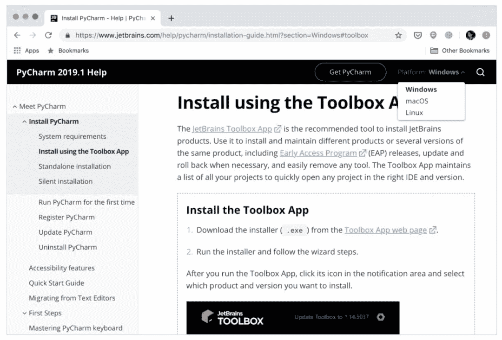安装成功后，启动该 app 并接受用户协议。在 Tools 选项下，你可以看到一个可用产品列表。从中找到 PyCharm Community，并点击 Install。好啦，现在你的机器上已经安装 PyCharm 了。如果不想使用 Toolbox app，你可以单独安装 PyCharm。启动 PyCharm，你将看到导入设置弹窗。PyCharm 会自动检测出这是首次安装，并为你选择「Do not import settings」选项。点击 OK，之后 PyCharm 会让你选择键盘映射（keymap scheme）。保留默认设置，点击右下角的「Next: UI Themes」：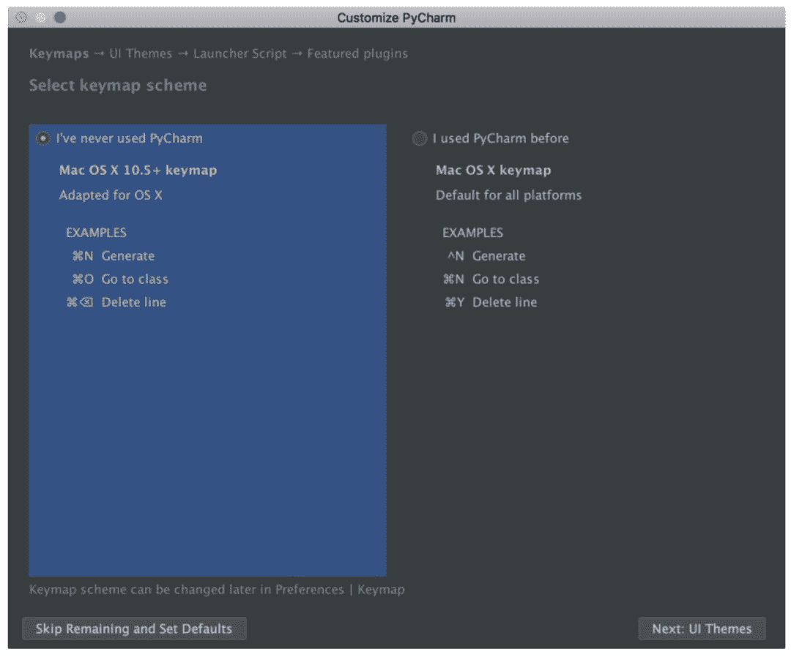PyCharm 将询问选择深色模式 Darcula 还是浅色模式。你可以选择自己喜欢的模式，并点击「Next: Launcher Script」：

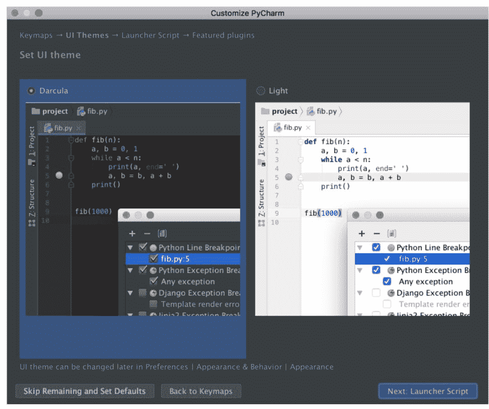

本教程将使用深色模式 Darcula。在下一个页面上，直接保留默认设置，并点击「Next: Featured plugins」，这时 PyCharm 将展示可用插件列表。点击「Start using PyCharm」，现在你可以写代码了！**在 PyCharm 中写代码**在 PyCharm 中，你可以在「项目」中执行任意操作。因此，首先你需要创建一个项目。安装和打开 PyCharm 后，你会看到欢迎页面。点击「Create New Project」，出现「New Project」弹窗：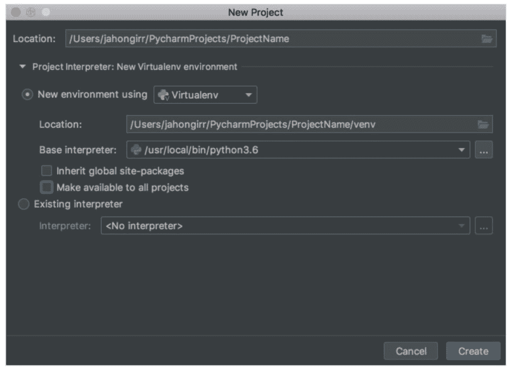指定项目位置，打开 Project Interpreter 列表，选择创建新的项目解释器或者使用已有的解释器。选择「New environment using」，打开其右方的下拉列表，选择 Virtualenv、Pipenv 或 Conda。这些工具可以为不同项目单独创建 Python 环境，从而分别保存不同项目所需的依赖项。你可以选择其中任意一个，本教程使用的是 Virtualenv。选择后，指定环境位置，从 Python 解释器列表中选择要安装在系统中的 base interpreter。通常，保持默认设置即可。下面有两个可选框：在新环境中继承全局包环境、令当前环境可以用其它所有项目，两个都不要选。点击右下角的「Create」，创建新项目：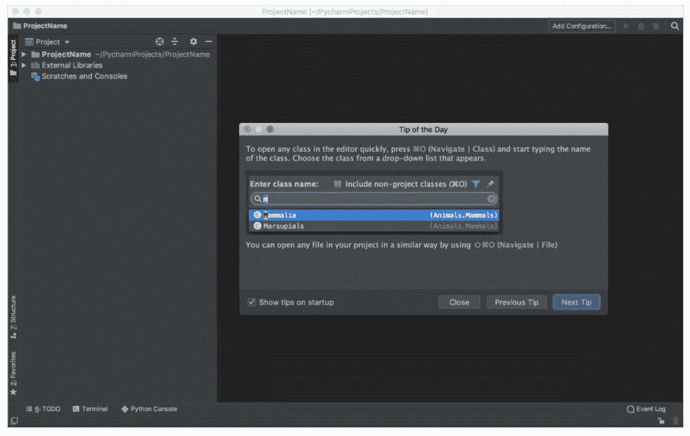屏幕上出现「Tip of the Day」弹窗，在每次启动时 PyCharm 通过该弹窗提供 trick。关掉该弹窗。现在我们可以开始新的 Python 程序了。如果你使用的是 Mac 系统，使用 Cmd+N 键；如果你使用的是 Windows 或 Linux 系统，使用 Alt+Ins 键。然后选择 Python File。你也可以在菜单中选择 File → New。将新文件命名为 guess_game.py 并点击 OK。你将看到如下 PyCharm 窗口：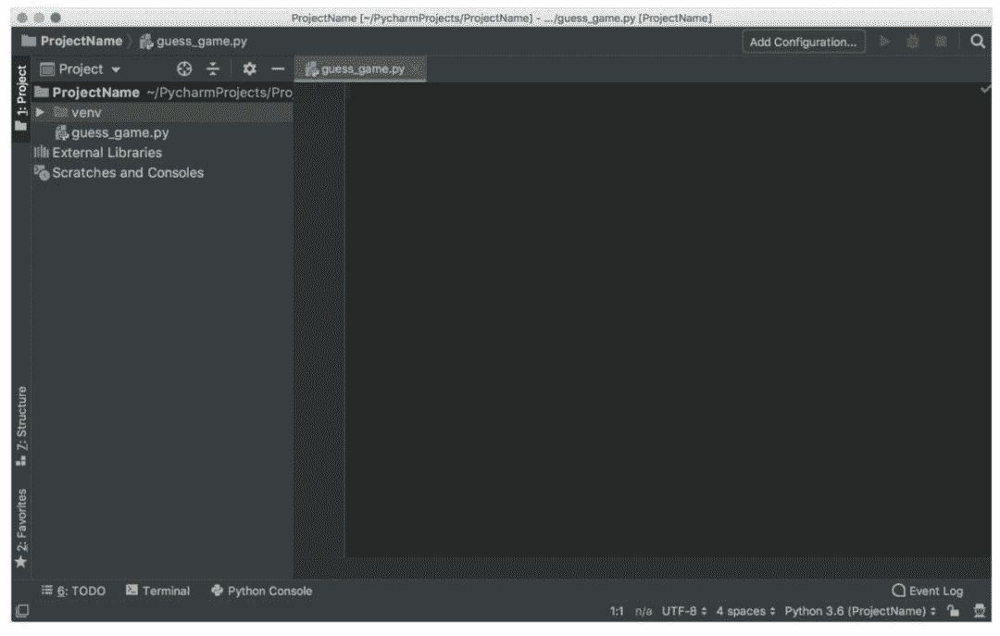至于测试代码，我们来快速写一个简单的猜谜游戏，即程序选择一个数字让用户来猜，在每一次猜测时，程序将告诉用户他猜的数字比神秘数字大还是小，用户猜中数字时游戏结束。以下是该游戏的代码：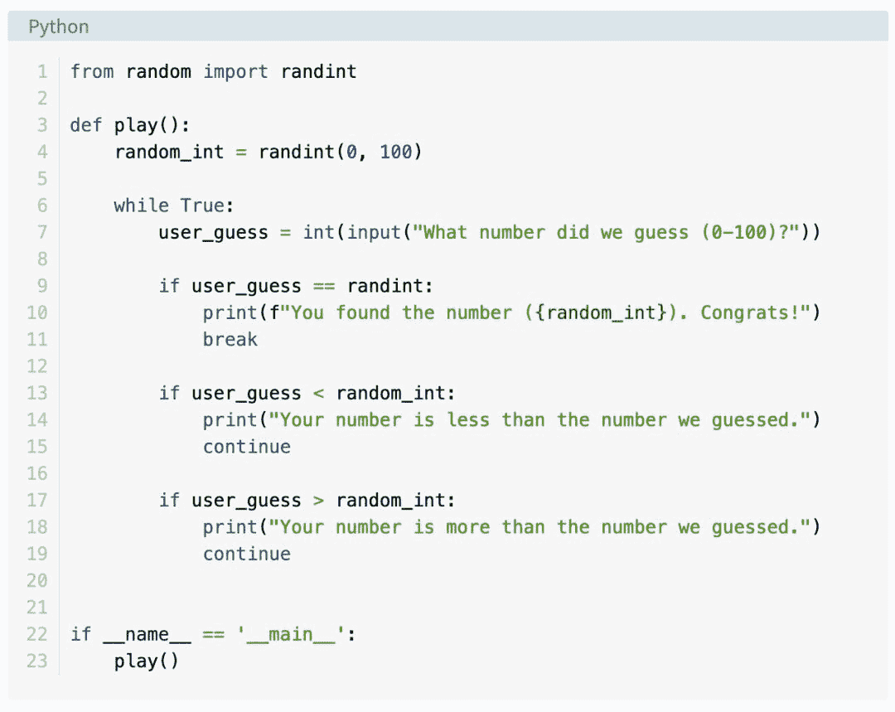直接键入上述代码，而不是复制粘贴。你会看到如下画面：

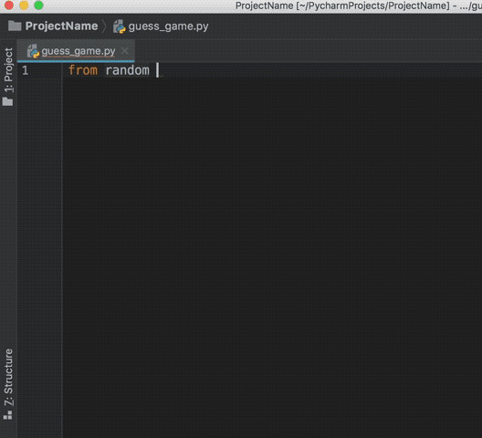

如上图所示，PyCharm 提供 Intelligent Coding Assistance 功能，可以执行代码补全、代码检查、错误高亮显示和快速修复建议。比如键入 main 并点击 tab 键，PyCharm 会自动补全整个 main 从句。此外，如果你在条件句前忘记键入 if，在该句子最后增添.if 并点击 Tab 键，PyCharm 将修复该 if 条件句。该用法同样适用于 True.while。这即是 PyCharm 的 Postfix Completion 功能，它可以帮助用户减少退格键使用次数。**在 PyCharm 中运行代码**现在你已经编码完成该游戏，可以运行了。该游戏程序有三种运行方式：

1.  在 Mac 系统中使用快捷键 Ctrl+Shift+R，在 Windows 或 Linux 系统中，使用快捷键 Ctrl+Shift+F10。

2.  右键单击背景，从菜单中选择「Run 『guess_game』」。

3.  由于该程序具备 __main__ 从句，你可以点击 __main__ 从句左侧的绿色小箭头，选择「Run 『guess_game』」。

使用以上任一方式运行该程序，窗口底部会出现终端面板（Terminal pane），显示你的代码输出结果：

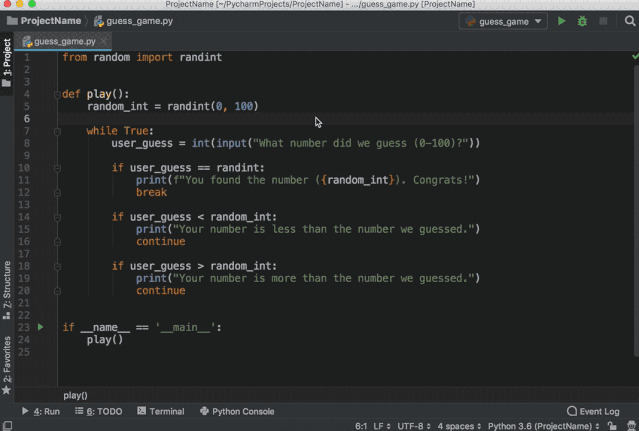

你可以玩一下这个游戏，看看自己能否猜中数字。（专业建议：从 50 开始猜。）**在 PyCharm 中进行代码 debug**找到神秘数字了吗？如果找到了，你可能会看到一些奇怪的东西：程序没有打印出祝贺信息和显示退出按钮，而是重新开始了。这就是 bug 所在。要想发现程序重新开始的原因，你需要 debug。首先，点击第 8 行代码左侧的空白区域，设置断点：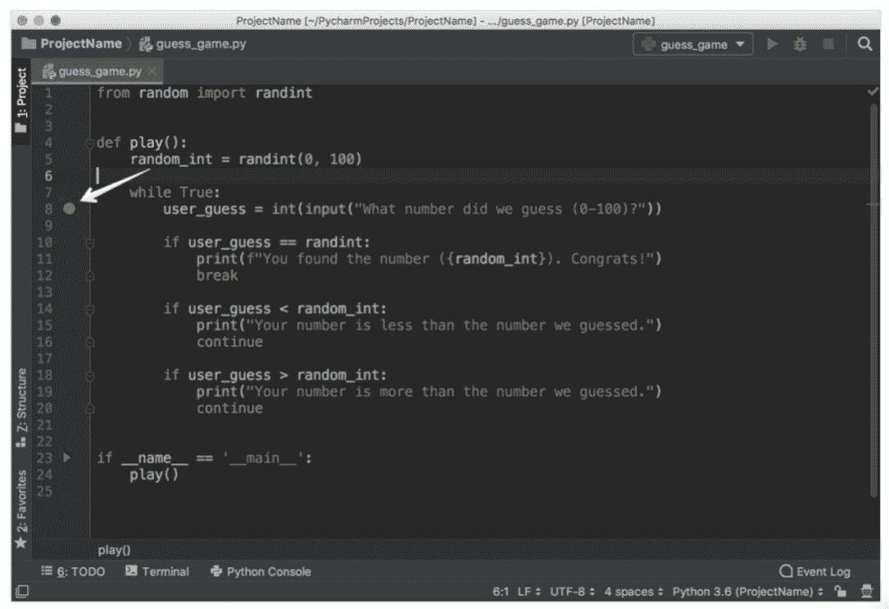断点即程序运行到这一行时会自动停止，你可以探索断点处之后的代码有什么错误。接下来，从以下三种方式中选择一种开始 debug：

1.  在 Mac 系统中使用 Ctrl+Shift+D 键，在 Windows 或 Linux 系统中使用 Shift+Alt+F9 键。

2.  右键单击背景，选择「Debug 『guess_game』」。

3.  点击 __main__ 从句左侧的绿色小箭头，选择「Debug 『guess_game』」。

之后，你将看到底部出现 Debug 窗口：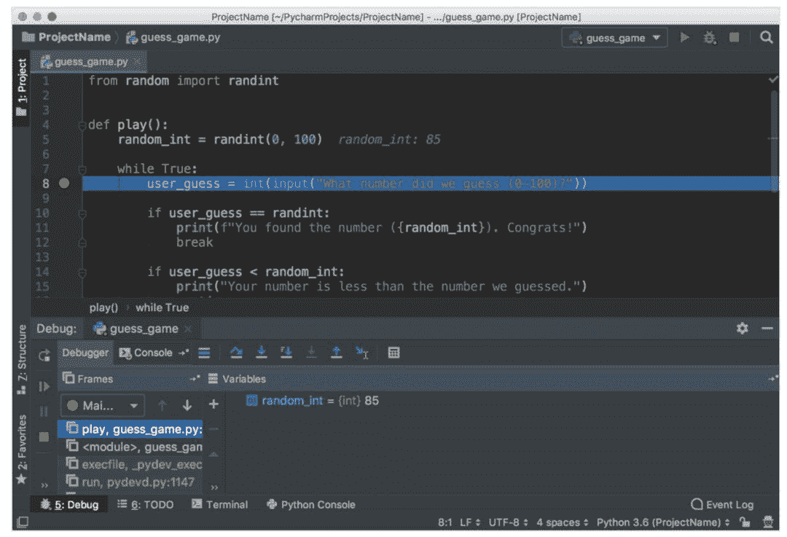
按照下列步骤执行程序 debug：

1.  注意当前行被蓝色高亮显示。

2.  Debug 窗口显示 random_int 及其值。记录该数字。（上图中该数字为 85。）

3.  点击 F8 执行当前代码行，并执行到下一行代码。如有必要，你也可以使用 F7 跳转到当前行内的函数。随着你继续执行语句，变量的变化将自动呈现在 Debugger 窗口。

4.  注意 Debugger 标签右侧有一个 Console 标签。Console 标签和 Debugger 标签相互独立。你可以在 Console 中与程序进行交互，在 Debugger 中执行 debug 动作。

5.  转向 Console 标签，进入猜测过程。

6.  键入左侧 Debugger 标签中显示的数字，点击 Enter 键。

7.  转回 Debugger 标签。

8.  再次点击 F8，计算 if 语句。注意现在你在第 14 行。为什么不是第 11 行呢？因为第 10 行的 if 语句被计算为 False。那么为什么当你键入数字后它算出来为 False 了呢？

9.  仔细看第 10 行，注意我们在对比 user_guess 和一个错误的项。我们应该对比用户猜测的数字和 random_int，但此处我们对比的是 randint（从 random 包导入的函数）。

10.  将 randint 更改为 random_int，按照同样的步骤重新开始 debug。你会发现，这一次到达的是第 11 行，第 10 行算出来为 True：

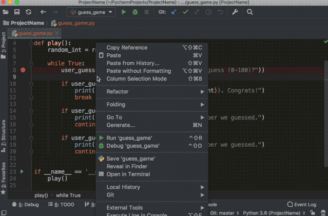

恭喜你，bug 被修复了！**在 PyCharm 中进行代码测试**不经单元测试的应用都不可靠。PyCharm 可以帮助你快速舒适地写单元测试并运行。默认情况下，unittest 被用作测试运行器，而 PyCharm 还支持其他测试框架，如 pytest、nose、doctest、tox 和 trial。例如，你可以按照以下步骤为项目选择 pytest 测试运行器：

1.  打开 Settings/Preferences → Tools → Python Integrated Tools 设置对话框。

2.  在默认测试运行器字段中选择 pytest。

3.  点击 OK 保存该设置。

本教程的示例将使用默认测试运行器 unittest。在同一个项目中，创建文件 calculator.py，并将以下 Calculator 类放入该文件：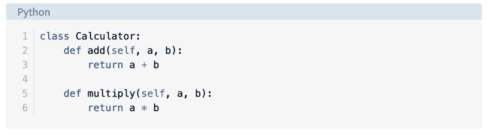PyCharm 使得为已有代码创建测试变得轻而易举。打开 calculator.py 文件，执行以下步骤中的任意一个：

*   在 Mac 系统中使用 Shift+Cmd+T 键，在 Windows 或 Linux 系统中使用 Ctrl+Shift+T。

*   右键单击该类的背景，选择「Go To and Test」。

*   在主菜单中吗，选择 Navigate → Test。

选择「Create New Test…」，得到以下窗口：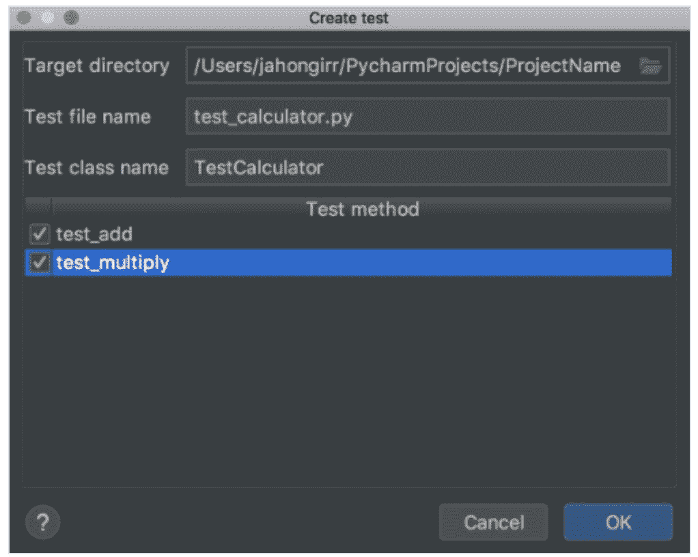Target directory、Test file name 和 Test class name 这三项均保留默认设置。选中上图中两种需要测试的方法并点击 OK。好了！PyCharm 自动创建文件 test_calculator.py，并在其中创建了以下 stub test：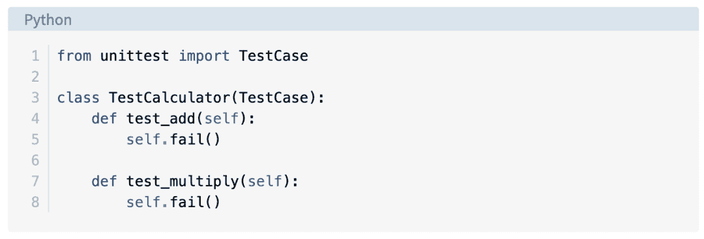使用以下方法中的任意一个运行测试：

*   在 Mac 系统中使用 Ctrl+R 键，在 Windows 或 Linux 系统中使用 Shift+F10 键。

*   右键单击背景，选择「Run 『Unittests for test_calculator.py』」。

*   点击测试类名称左侧的绿色小箭头，选择「Run 『Unittests for test_calculator.py』」。

你将看到底部出现测试窗口，所有测试均失败：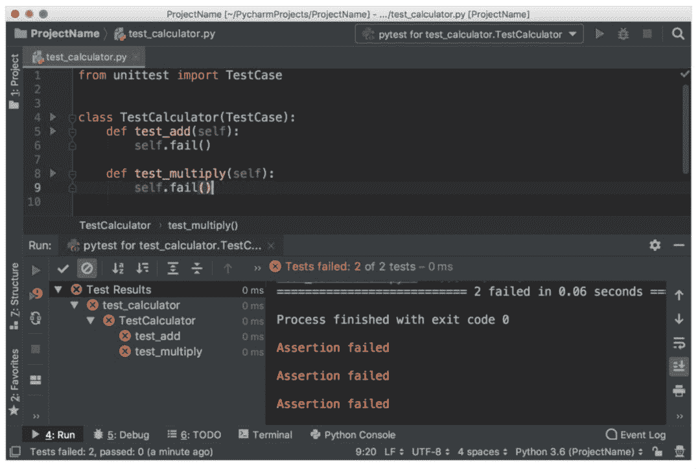注意，左侧是测试结果的层次结构，右侧是终端的输出。现在，将代码更改成以下代码，实现 test_add：重新运行测试，你会看到一个测试通过了，另一个则失败。按照如下操作探索不同选项，来展示已通过测试和被忽略测试，按照字母顺序对测试进行排序，以及按照时长对测试进行排序：

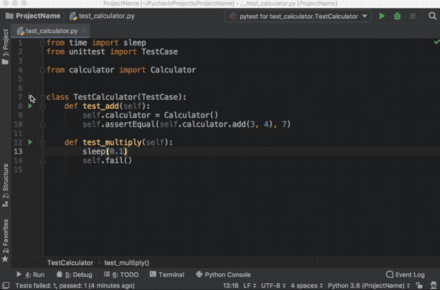

注意，上图中的 sleep(0.1) 方法的作用是使其中一个测试变慢，以便按时长对测试进行排序。**在 PyCharm 中编辑已有项目**单文件项目非常适合作为示例，但你通常需要处理较大的项目。这部分将介绍如何使用 PyCharm 处理较大项目。为了探索 PyCharm 以项目为中心的特征，你将使用 Alcazar web 框架（该框架用于学习目的）。在本地复制该 repo（地址：https://realpython.com/optins/view/alcazar-web-framework/）。当你在本地已有项目时，使用以下方法中的任意一个在 PyCharm 中打开项目：

*   在主菜单中点击 File → Open。

*   在欢迎页面点击 Open。

之后，在计算机中找到包含该项目的文件夹，并打开。如果该项目包含虚拟环境，PyCharm 将自动使用该虚拟环境，并将它作为项目解释器。如果你需要配置不同的虚拟环境 virtualenv，在 Mac 上打开 Preferences，或在 Windows 或 Linux 系统中使用 Ctrl+Alt+S 打开 Settings，找到 Project: ProjectName。打开下拉列表，选择 Project Interpreter：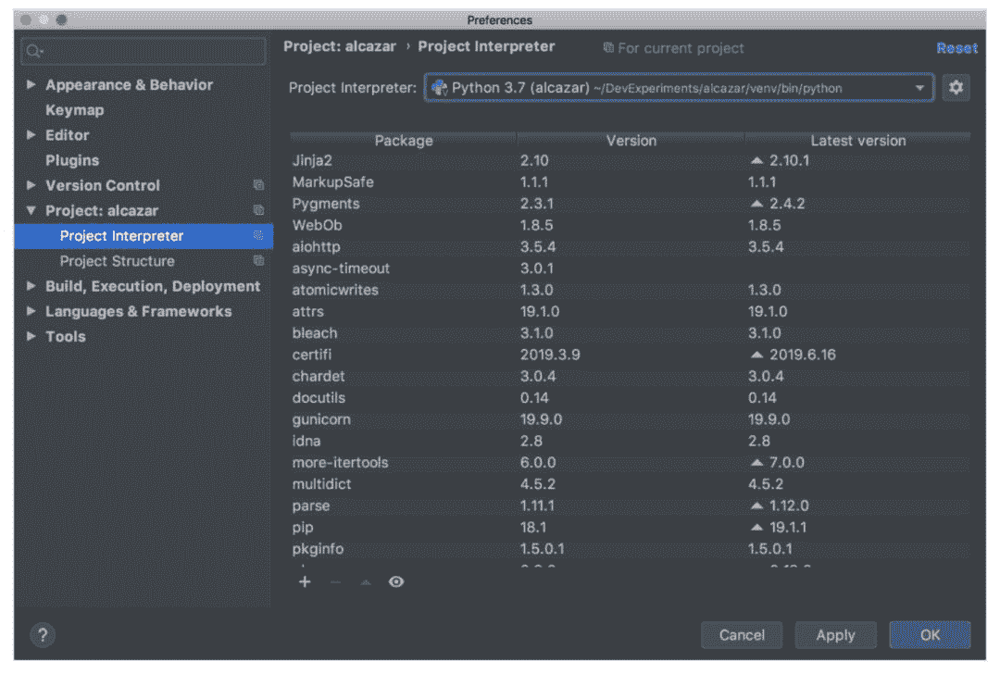从下拉列表中选择 virtualenv。如果没有要选择的项，则点击下拉列表右方的设置按钮选择 Add…。其余步骤和创建新项目的步骤相同。**在 PyCharm 中搜索和导航**在大项目中，我们很难记住每个事物的位置，因此快速导航和搜索非常重要。PyCharm 可以提供这些功能。接下来，我们使用上一节中打开的项目，实践以下快捷键：

*   在当前文件中搜索代码段：在 Mac 系统中使用 Cmd+F 键，在 Windows 或 Linux 系统中使用 Ctrl+F 键。

*   在整个项目中搜索代码段：在 Mac 系统中使用 Cmd+Shift+F 键，在 Windows 或 Linux 系统中使用 Ctrl+Shift+F 键。

*   搜索类：在 Mac 系统中使用 Cmd+O 键，在 Windows 或 Linux 系统中使用 Ctrl+N 键。

*   搜索文件：在 Mac 系统中使用 Cmd+Shift+O 键，在 Windows 或 Linux 系统中使用 Ctrl+Shift+N 键。

*   如果你不知道要搜索的是文件、类还是代码段，则搜索全部：按两次 Shift 键。

导航可使用以下快捷键：

*   前往变量的声明：在 Mac 系统中使用 Cmd 键，在 Windows 或 Linux 系统中使用 Ctrl 键，然后单击变量。

*   寻找类、方法或文件的用法：使用 Alt+F7 键。

*   查看近期更改：使用 Shift+Alt+C 键，或者在主菜单中点击 View → Recent Changes。

*   查看近期文件：在 Mac 系统中使用 Cmd+E 键，在 Windows 或 Linux 系统中使用 Ctrl+E 键，或者在主菜单中点击 View → Recent Files。

*   多次跳转后在导航历史中前进和后退：在 Mac 系统中使用 Cmd+[ / Cmd+] 键，在 Windows 或 Linux 系统中使用 Ctrl+Alt+Left / Ctrl+Alt+Right 键。

更多细节，参见官方文档：https://www.jetbrains.com/help/pycharm/tutorial-exploring-navigation-and-search.html。**PyCharm 中的版本控制**版本控制系统（如 Git 和 Mercurial）是现代软件开发世界中最重要的工具之一。因此，IDE 必须支持版本控制。PyCharm 在这方面做得很好，它集成了大量流行的版本控制系统，如 Git（和 Github (https://github.com/)）、Mercurial、Perforce 和 Subversion。注：以下示例中使用的版本控制系统为 Git。**配置版本控制系统（VCS）**要想实现 VCS 集成，你需要在顶部菜单点击 VCS → VCS Operations Popup…，或者在 Mac 系统中使用 Ctrl+V 键，在 Windows 或 Linux 系统中使用 Alt+` 键。选择 Enable Version Control Integration…，你将看到以下窗口：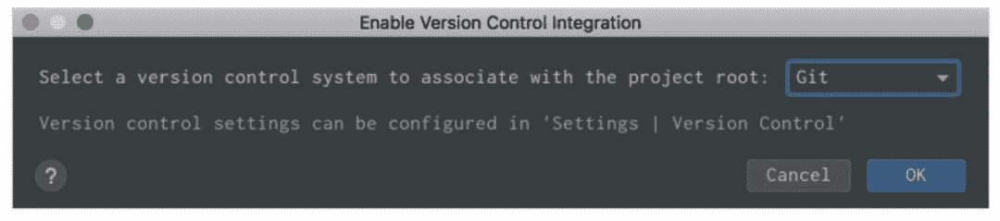从下拉列表中选择 Git，点击 OK，这样你就为项目设置好了 VCS。（注意，如果你打开的已有项目已经具备版本控制系统，PyCharm 将会发现并自动使用该版本控制系统。）这时如果你前往 VCS Operations Popup…，你会发现一个不同的弹窗，它具备选项 git add、git stash、git branch、git commit、git push 等等：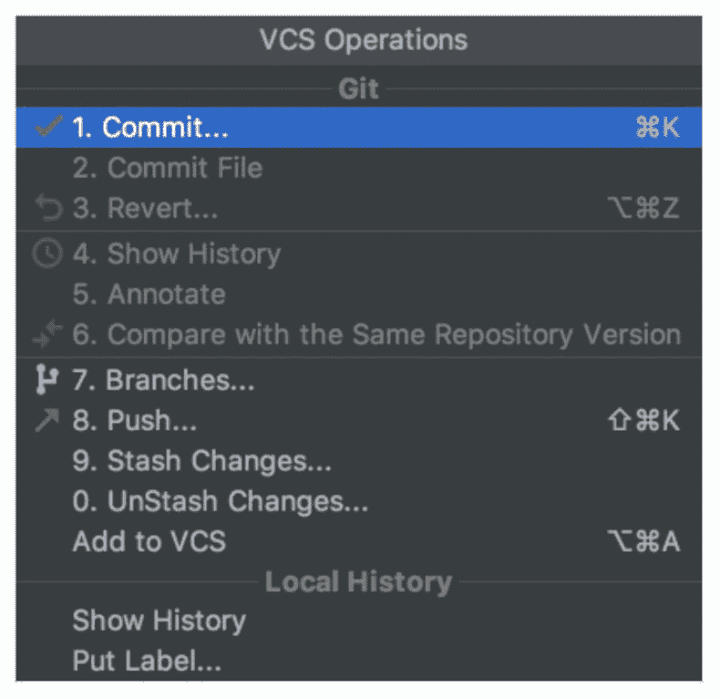如果你找不到所需要的选项，你可以在顶部菜单中点击 VCS，选择 Git，在这里你可以创建和查看 pull request。**提交和冲突处理**这是 PyCharm 中 VCS 集成的两大特征，我个人经常使用并且非常喜欢。假如你完成了工作，打算提交，前往 VCS → VCS Operations Popup… → Commit…，或者在 Mac 系统中使用 Cmd+K 键，在 Windows 或 Linux 系统中使用 Ctrl+K 键。你将看到如下窗口：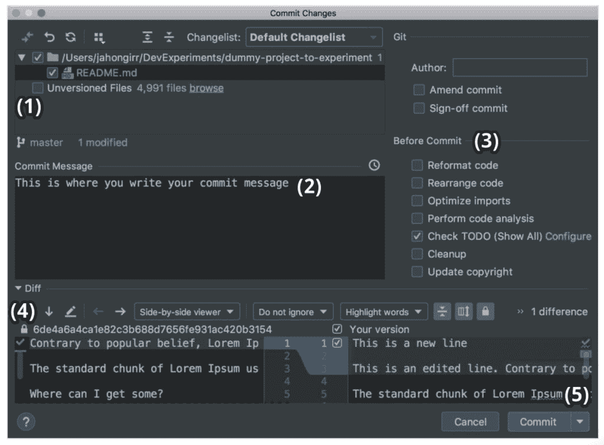在该窗口中，你可以：

*   选择要提交的文件

*   写下提交信息

*   在提交前执行各项检查

*   查看更改

*   点击右下角 Commit 按钮旁边的箭头，选择 Commit and Push…，从而一次性完成提交和 push。

是不是感觉很神奇很迅速？特别是如果你以前经常通过命令行手动执行这些任务时。团队合作中会出现合并冲突（merge conflict）。当一个人对你正在处理的文件提交更改时，你们二人更改了同一行导致更改重叠，这时 VCS 无法决定选择你的更改还是队友的更改。那么你可以使用以下箭头和符号来解决这个问题：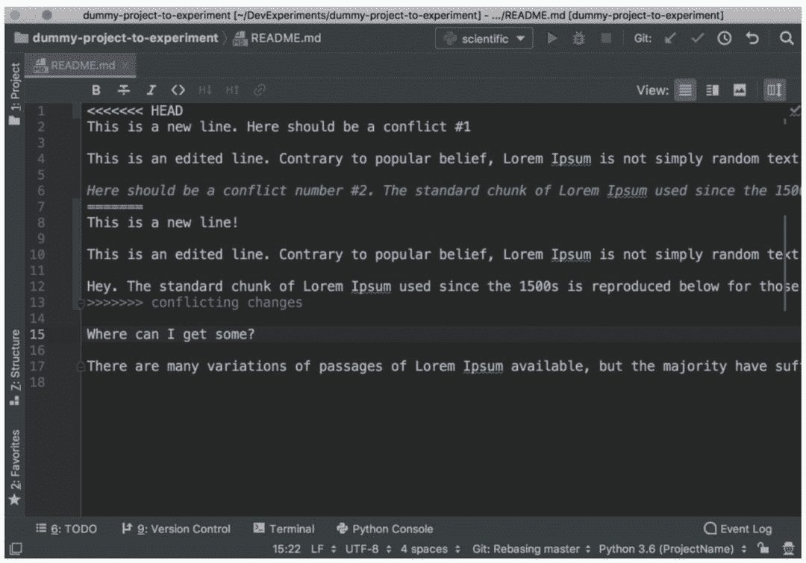看起来很奇怪，我们很难分辨应该删除哪些更改、保留哪些更改。不要怕，PyCharm 来了！它可以用更好、更简洁的方法解决冲突。在顶部菜单中前往 VCS，选择 Git，然后选择 Resolve conflicts…。选择存在冲突的文件，点击 Merge，出现以下窗口：在左侧列中，你可以查看自己做的更改。在右侧列中，可以查看队友做的更改。而中间列则显示结果。存在冲突的代码行被高亮显示，你可以在它们旁边看到 X 和 >>/<<。点击箭头表示接受更改，点击 X 则表示拒绝更改。解决所有冲突后，点击 Apply 按钮：

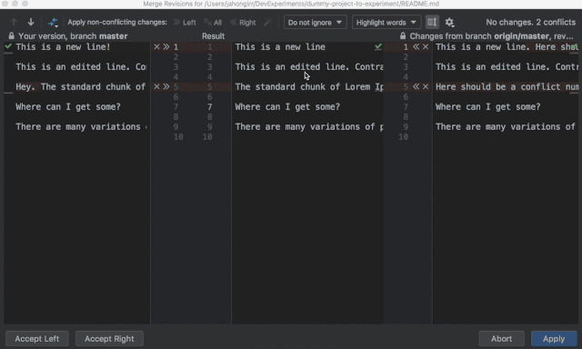

在上图中，对于第一个冲突行，作者选择拒绝自己的更改，接受队友的更改。而在第二个冲突行中，作者接受了自己的更改，拒绝了队友的更改。使用 PyCharm 中的 VCS 集成还可以执行很多操作。详情参见 https://www.jetbrains.com/help/pycharm/version-control-integration.html。**在 PyCharm 中使用插件和外部工具**在 PyCharm 中你可以找到开发所需的几乎所有功能。如果没找到，那么很可能存在一个插件，向 PyCharm 提供你需要的功能。例如，它们可以：

*   添加多语言和多框架支持

*   使用快捷键提示（shortcut hint）、文件监视器（file watcher）等提升你的生产效率

*   利用代码练习，帮助你学习新的编程语言

例如，IdeaVim 插件向 PyCharm 添加 Vim 模拟。如果你喜欢 Vim，这个插件可以实现不错的结合。Material Theme UI 插件可将 PyCharm 的外观改变为 Material Design 的外观：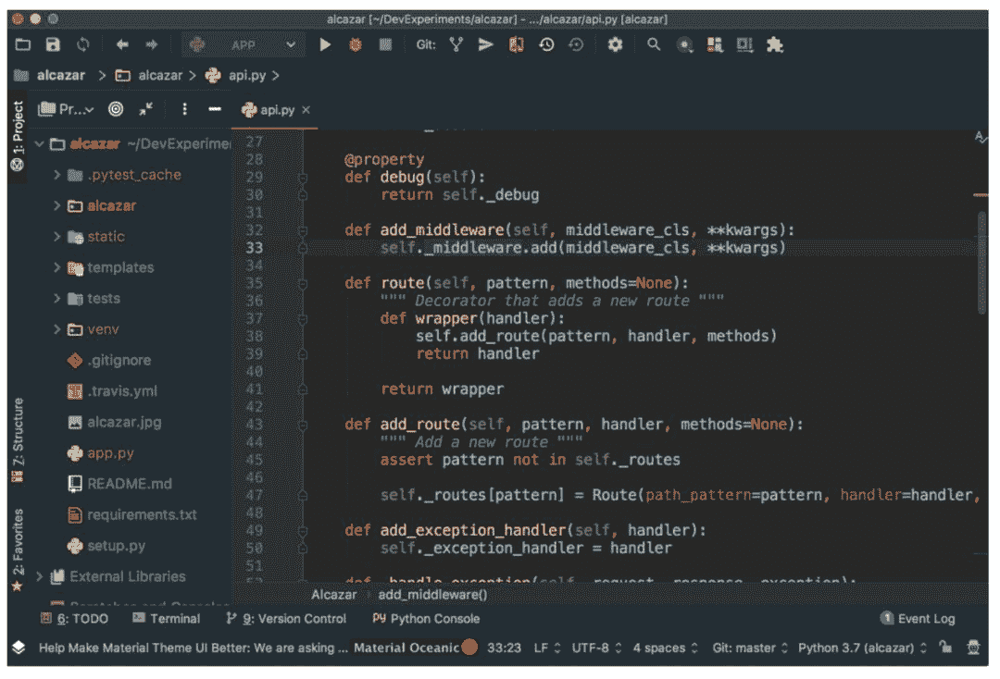Vue.js 插件使 PyCharm 支持 Vue.js 项目。Markdown 插件使得在 IDE 内可以编辑 Markdown 文件，并实时预览渲染后的 HTML。在 Mac 系统上点击 Preferences → Plugins，在 Windows 或 Linux 系统中点击 Settings → Plugins，你可以在 Marketplace 标签下找到和安装所有可用插件：如果仍然没找到所需插件，你甚至可以自己开发一个。如果你找不到合适的插件，又不想自己开发，因为 PyPI 上有可用的包，你可以将这个包作为外部工具添加到 PyCharm。以代码分析器 Flake8 为例。首先，在所选 Terminal app 中键入 pip install flake8，从而在虚拟环境中安装 Flake8。或者也可以使用 PyCharm 集成的 Terminal：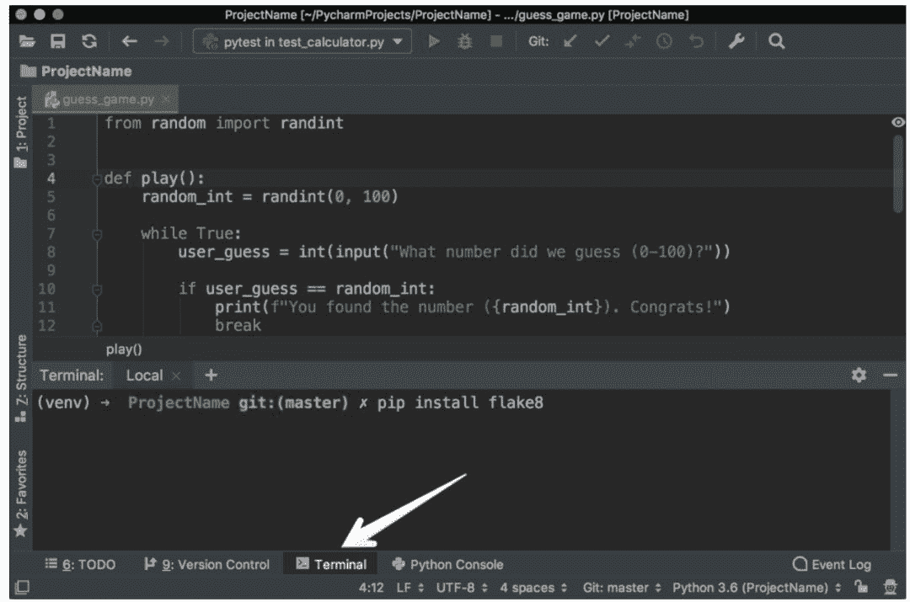在 Mac 系统上点击 Preferences → Tools，在 Windows 或 Linux 系统中点击 Settings → Tools，选择 External Tools。然后点击底部 (1) 处的 + 按钮。在弹出的窗口中，输入细节并在两个窗口中点击 OK，如下图所示：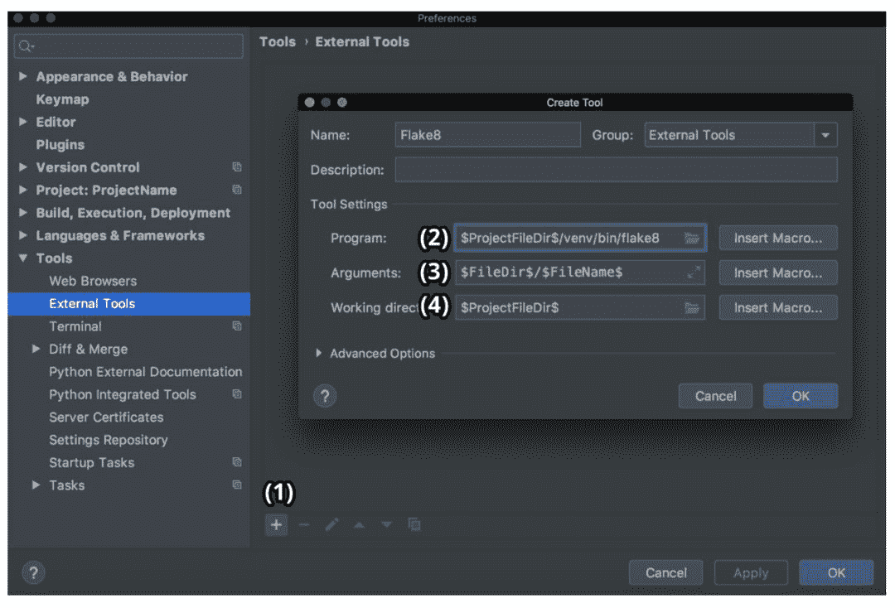上图中，Program (2) 指 Flake8，你可以在虚拟环境文件夹（bin）中找到它。Arguments (3) 表示你想用 Flake8 分析的文件。Working directory 表示项目目录。你可以把这里所有项的绝对路径写死，但这就意味着你无法在其他项目中使用该外部工具，只能在一个项目中针对一个文件使用该工具。因此你需要使用 Macros。它是$name$格式的变量，根据语境而变化。例如，当你编辑 first.py 时，$FileName$ 为 first.py，当你编辑 second.py 时，$FileName$ 为 second.py。你可以查看它们的列表，点击 Insert Macro… 按钮将其中一个插入。此处你使用了 macros，它们的值会根据你目前处理的项目而改变，Flake8 将继续准确执行其工作。要想使用它，你需要创建文件 example.py，并在其中写入以下代码：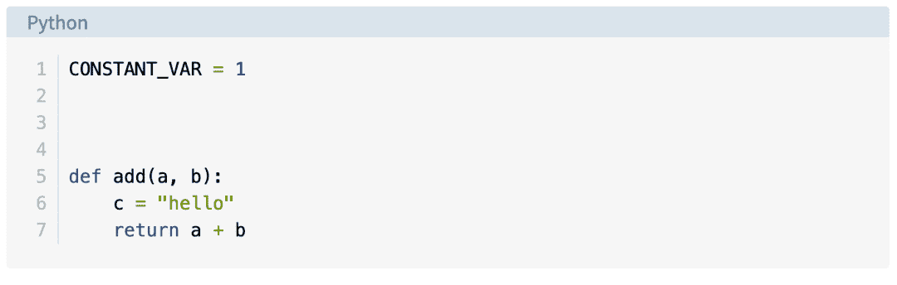上述代码故意破坏了 Flake8 的一些规则。右键单击文件背景，选择 External Tools → Flake8。Flake8 分析结果将出现在窗口底部：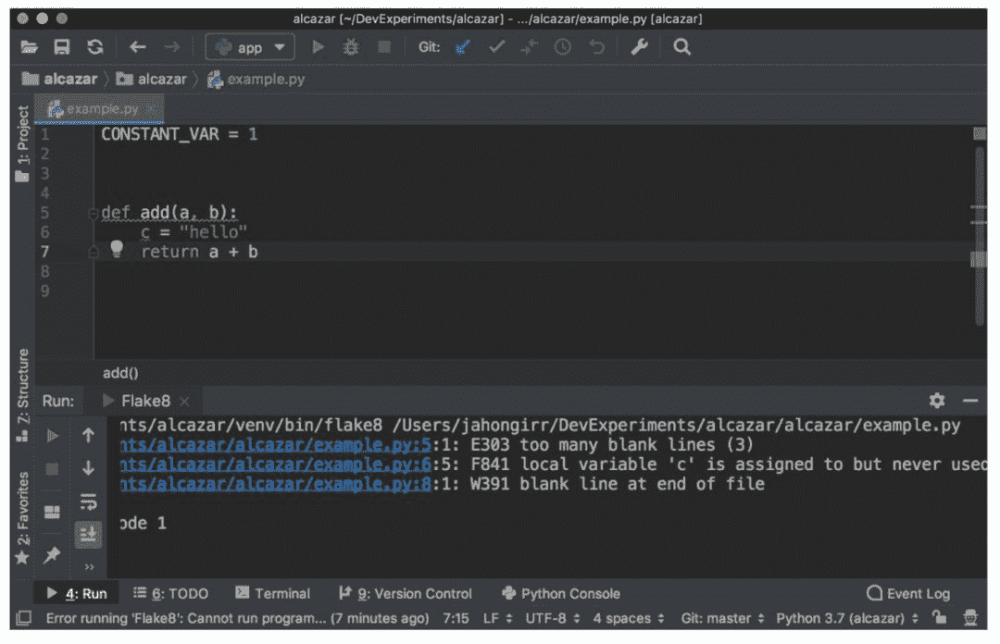为了使效果更好，你可以为其添加快捷键。在 Mac 系统中选择 Preferences，在 Windows 或 Linux 系统中选择 Settings。然后，点击 Keymap → External Tools → External Tools。双击 Flake8，选择 Add Keyboard Shortcut，出现以下窗口：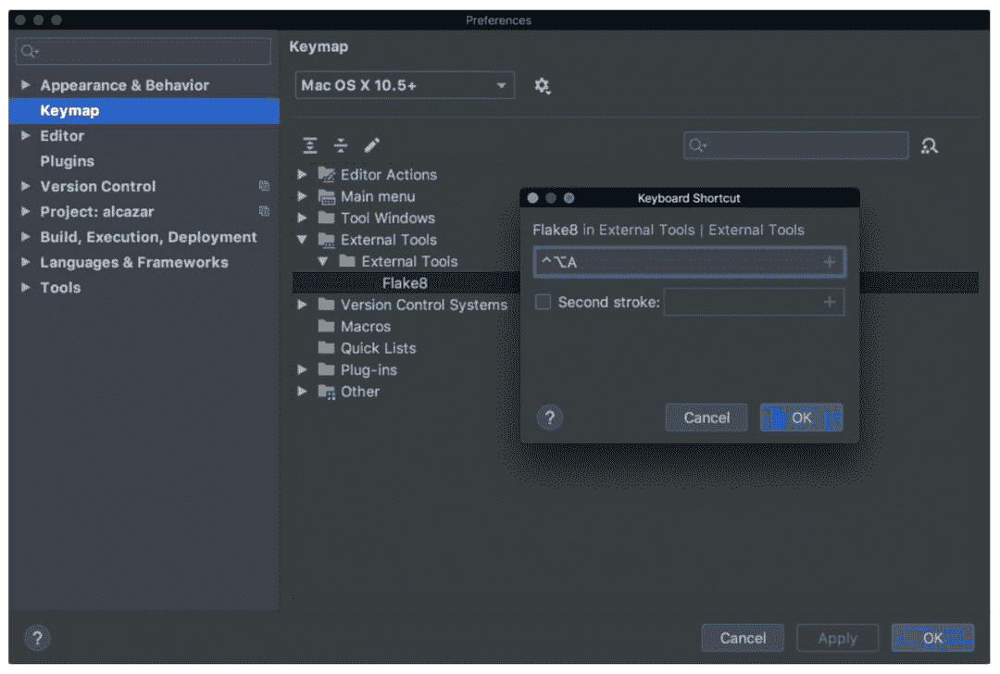上图中，快捷键是 Ctrl+Alt+A（本教程使用该快捷键）。你可以在文本框中添加喜欢的快捷键，然后在两个窗口中点击 OK。然后，你就可以用该快捷键，在 Flake8 的帮助下分析目前在处理的文件了。**PyCharm Professional 功能**PyCharm Professional 是 PyCharm 的付费版本，具备更多开箱即用的功能和集成。这部分将概览其主要功能，以及官方文档链接（其中详细介绍了每一项功能）。记住，以下功能在 PyCharm Community 版本中均不可用。**Django 支持**Django 是最流行和最受喜爱的 Python web 框架，PyCharm 对 Django 提供广泛的支持。要确保对 Django 的支持，需要执行以下步骤：

1.  在 Mac 系统中打开 Preferences，在 Windows 或 Linux 系统中打开 Settings。

2.  选择 Languages and Frameworks。

3.  选择 Django。

4.  检查复选框 Enable Django support。

5.  应用更改。

现在确保了对 Django 的支持，你在 PyCharm 中的 Django 开发之旅将轻松很多。具体而言在创建项目时，你会得到一个专用的 Django 项目类型。这表示，当你选择该类型时，你将拥有所有必要文件和设置。这等同于使用 django-admin startproject mysite。你也可以在 PyCharm 内直接运行 manage.py 命令。目前支持的 Django 模板，包括以下一些：

*   语法和错误高亮显示

*   代码补全

*   导航

*   block 名称补全

*   自定义标签和过滤器补全

*   标签和过滤器的快速文档

*   模板 debug 能力

除此之外，我们还可以在其他 Django 部分（如视图、URL 和模型）中执行代码补全、对 Django ORM 提供代码追踪支持（code insight support）、对 Django 模型提供模型依赖项关系图。更多细节，参见官方文档：https://www.jetbrains.com/help/pycharm/django-support7.html。**数据库支持**现代数据库开发是一个复杂的任务，需要多个支持系统和工作流。这也是 JetBrains 开发独立 IDE DataGrip 的原因。DataGrip 是独立于 PyCharm 的产品，二者的应用场景和授权都不相同。但幸运的是，通过 Database tools and SQL 插件（该插件默认开启），PyCharm 可以支持 DataGrip 中的所有特性。在该插件的帮助下，你可以查询、创建和管理数据库，不管数据库在本地、服务器，还是在云端。该插件支持 MySQL、PostgreSQL、Microsoft SQL Server、SQLite、MariaDB、Oracle、Apache Cassandra 等。关于该插件的更多用途，请查看文档：https://www.jetbrains.com/help/pycharm/relational-databases.html。**线程并发可视化（Thread Concurrency Visualization）**Django Channels、asyncio 和近期框架（如 Starlette (https://www.starlette.io/)）表明异步 Python 编程正逐渐成为趋势。异步编程具备很多好处，但很难写，也很难 debug。在此类案例中，Thread Concurrency Visualization 就是医生，帮助你全面管理多线程应用并进行优化。更多细节，参见文档：https://www.jetbrains.com/help/pycharm/thread-concurrency-visualization.html。**Profiler**说到优化，profiling 是另一种代码优化方法。profiling 可以帮助你查看代码的哪一部分占用了最多的执行时间。profiler 运行的优先级如下：1\. vmprof2\. yappi3\. cProfile 如果你没有安装 vmprof 或 yappi，则运行标准 cProfile。更多细节，参见：https://www.jetbrains.com/help/pycharm/profiler.html。**科学模式**Python 不仅是通用和 web 编程语言，由于 NumPy、SciPy、scikit-learn、Matplotlib、Jupyter 等库和工具的加持，Python 成为数据科学和机器学习领域的最优工具。有了这些强大工具，你还需要一个强大的 IDE 来支持这些库所具备的绘图、分析等所有功能。关于科学模式的更多详情，参见 https://www.jetbrains.com/help/pycharm/matplotlib-support.html。**远程开发**很多应用出现 bug 的一个常见原因是，开发环境和生产环境不同。尽管在大多数情况下，开发时完美复制生产环境并不现实，但力求实现完美复刻是值得追寻的目标。在 PyCharm 的帮助下，你可以使用另一台计算机（如 Linux VM）上的解释器对应用进行 debug。这样，你就可以拥有与生产环境一样的解释器了，从而避免很多因开发环境和生产环境差异导致的 bug。详情参见：https://www.jetbrains.com/help/pycharm/remote-debugging-with-product.html。**结论**
PyCharm 是最好的 Python 开发 IDE 之一。它提供大量优势，帮助执行例行任务，从而节约大量时间。学完本教程，现在你知道如何利用 PyCharm 提高生产效率了吗？

*原文地址：https://realpython.com/pycharm-guide/*

********本****文为机器之心编译，**转载请联系本公众号获得授权****。**
✄------------------------------------------------**加入机器之心（全职记者 / 实习生）：hr@jiqizhixin.com****投稿或寻求报道：**content**@jiqizhixin.com****广告 & 商务合作：bd@jiqizhixin.com**