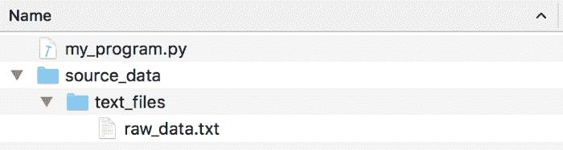

# Windows 文件名非用反斜杠？Python 小技巧帮你解决这个麻烦

> 原文：[`mp.weixin.qq.com/s?__biz=MzA3MzI4MjgzMw==&mid=2650766265&idx=2&sn=b8fbfe46fb276ed9125e8564c4501510&chksm=871abfc7b06d36d1e099cd96cd4c7216fbc816305705c4ca2c5777b0c161b34dd1ccd531db9e&scene=21#wechat_redirect`](http://mp.weixin.qq.com/s?__biz=MzA3MzI4MjgzMw==&mid=2650766265&idx=2&sn=b8fbfe46fb276ed9125e8564c4501510&chksm=871abfc7b06d36d1e099cd96cd4c7216fbc816305705c4ca2c5777b0c161b34dd1ccd531db9e&scene=21#wechat_redirect)

选自 medium

**作者：****Adam Geitgey**

**机器之心编译**

**参与：****Geek AI、张倩**

> 要想让你的 Python 代码同时在 Windows 和 Mac/Linux 上工作，你需要处理不同系统文件名用不同斜杠的问题。而 Python 3 有一个名为「pathlib」的新模块，可以帮你解决这个麻烦。

在编程过程中，我们往往会遇到一个小麻烦——微软 Windows 系统在文件夹名之间使用反斜杠字符，而几乎所有其它的计算机（操作系统）都使用正斜杠：

```py
Windows filenames:
C:\some_folder\some_file.txt

Most other operating systems:
/some_folder/some_file.txt 
```

这是由于上世纪 80 年代早期计算机历史上的一个小意外。「MS-DOS」的第一版使用了正斜杠字符来指定命令行选项。当微软在「MS-DOS 2.0」中加入了对文件夹的支持时，正斜杠字符已经被使用了，所以他们采用了反斜杠作为替代。35 年后，我们仍然被受困于这种不一致性。

如果你想让你的 Python 代码同时在 Windows 和 Mac/Linux 上工作，你就需要处理这种与平台相关的问题。幸运的是，Python 3 有一个名为「pathlib」的新模块，使得用户处理文件几乎没有任何困难。

「pathlib」模块链接：https://docs.python.org/3/library/pathlib.html

让我们快速浏览一下处理文件名路径的不同方法，看看「pathlib」如何能让你的生活变得更美好！

**错误的解决方案：****手动构建文件路径**

假设你有一个数据文件夹，该文件夹包含你想要在你的 Python 程序中打开的文件：



在 Python 中对其进行编码是「错误」的方式：

```py
data_folder = "source_data/text_files/"

file_to_open = data_folder + "raw_data.txt"

f = open(file_to_open)

print(f.read()) 
```

请注意，由于我使用的是 Mac 系统，所以我使用了「Unix」风格的正斜杠对路径进行了硬编码。这也会让 Windows 的用户感到愤怒。

从技术上讲，这段代码在 Windows 上仍然有效，因为 Python 有一个「黑客」（hack）技术：当你在 Windows 上调用「open()」函数时，它会识别这两种斜线。但即便如此，你也不应该依赖它。如果你在错误的操作系统上使用了错误类型的斜杠（尤其是在它们与外部程序或代码库交互时），并不是所有的 Python 库都会正常工作。

Python 对混合斜杠类型的支持是一种只针对 Windows 的「黑客」技术，它反过来并不起作用。在 Mac 系统环境下，在代码中使用反斜杠会导致彻底失败：

```py
data_folder = "source_data\\text_files\\"

file_to_open = data_folder + "raw_data.txt"

f = open(file_to_open)

print(f.read())

# On a Mac, this code will throw an exception:
# FileNotFoundError: [Errno 2] No such file or directory: 'source_data\\text_files\\raw_data.txt' 
```

由于所有这些原因以及其他原因，使用硬编码的路径字符串编写代码，是一种会让其他程序员十分「嫌弃」的做法。一般来说，你应该尽量避免这么做。

**以前的解决方案：****Python 的「os.path」模块**

Python 的「os.path」模块有很多工具来处理这类针对特定操作系统的文件系统问题。

你可以使用「os.path.join()」为当前的操作系统构建一个使用正确类型斜杠的路径字符串：

```py
import os.path

data_folder = os.path.join("source_data", "text_files")

file_to_open = os.path.join(data_folder, "raw_data.txt")

f = open(file_to_open)

print(f.read()) 
```

这段代码可以同时在「Windows」或「Mac」系统上完美运行。问题是它使用起来很麻烦。写出「os.path.join()」并将路径的每个部分作为独立的字符串传给该函数非常冗长，而且很不直观。

由于「os.path」模块中的大多数函数使用起来很烦人，开发者们通常会「忘记」使用它们，即使他们知道这样做更好。这导致出现了很多跨平台的 Bug，也引起了用户的愤怒。

**更好的解决方案：****Python 3 的「pathlib」！**

为了处理文件和路径，Python 3.4 引入了一个名为「pathlib」的新标准库，而且非常好用！

要使用该库，你只需使用正斜杠将一个路径或文件名传给一个新的「Path()」对象，然后它将处理余下的操作：

```py
from pathlib import Path

data_folder = Path("source_data/text_files/")

file_to_open = data_folder / "raw_data.txt"

f = open(file_to_open)

print(f.read()) 
```

在这里，有两点需要注意：

*   你应该在使用「pathlib」函数的情况下使用正斜杠。「Path()」函数将会把正斜杠转化为适应当前操作系统环境的正确斜杠。赞！

*   如果你想要在路径上进行添加，你可以直接在你的代码中使用「/」操作符。你再也不用一遍又一遍地输入「os.path.join(a, b)」了。

如果「pathlib」所做的就这么多，它也已经是对于 Python 的一个很好的补充了。但是，它还能做更多！

例如，我们可以在无需打开和关闭文件的情况下，读取文本文件的内容：

```py
from pathlib import Path

data_folder = Path("source_data/text_files/")

file_to_open = data_folder / "raw_data.txt"

print(file_to_open.read_text()) 
```

专业提示：之前的示例是有 Bug 的，因为打开的文件从来没有被关闭过。而这里的这种语法则彻底避免了这个 Bug。

事实上，「pathlib」使大多数标准的文件操作变得快速而简单：

```py
from pathlib import Path

filename = Path("source_data/text_files/raw_data.txt")

print(filename.name)
# prints "raw_data.txt"

print(filename.suffix)
# prints "txt"

print(filename.stem)
# prints "raw_data"

if not filename.exists():
    print("Oops, file doesn't exist!")
else:
    print("Yay, the file exists!") 
```

你甚至可以使用「pathlib」显式地将一个「Unix」路径转化为一个「Windows」格式的路径：

```py
from pathlib import Path, PureWindowsPath

filename = Path("source_data/text_files/raw_data.txt")

# Convert path to Windows format
path_on_windows = PureWindowsPath(filename)

print(path_on_windows)
# prints "source_data\text_files\raw_data.txt" 
```

如果你真的想安全地在你的代码中使用反斜杠，你可以按照「Windows」格式声明你的路径，而「pathlib」可以对其进行转化，使其能在当前的操作系统中工作：

```py
from pathlib import Path, PureWindowsPath

# I've explicitly declared my path as being in Windows format, so I can use forward slashes in it.
filename = PureWindowsPath("source_data\\text_files\\raw_data.txt")

# Convert path to the right format for the current operating system
correct_path = Path(filename)

print(correct_path)
# prints "source_data/text_files/raw_data.txt" on Mac and Linux
# prints "source_data\text_files\raw_data.txt" on Windows 
```

如果你想把代码写得更「高级」一些，你甚至可以使用「pathlib」来做诸如解析相对路径、解析网络共享路径并生成「file:// urls」之类的事。在下面的例子中，我们将仅仅使用两行代码，在你的 web 浏览器中打开一个本地文件夹：

```py
from pathlib import Path
import webbrowser

filename = Path("source_data/text_files/raw_data.txt")

webbrowser.open(filename.absolute().as_uri()) 
```

这只是「pathlib」的好处之一。它很好地替代了过去分散在不同 Python 模块中与文件相关的许多不同功能。

*原文链接：**https://medium.com/@ageitgey/python-3-quick-tip-the-easy-way-to-deal-with-file-paths-on-windows-mac-and-linux-11a072b58d5f*

********本****文为机器之心编译，**转载请联系本公众号获得授权****。**

✄------------------------------------------------

**加入机器之心（全职记者 / 实习生）：hr@jiqizhixin.com**

**投稿或寻求报道：**content**@jiqizhixin.com**

**广告 & 商务合作：bd@jiqizhixin.com**