# 四十行 Python 代码，实现卷积特征可视化

> 原文：[`mp.weixin.qq.com/s?__biz=MzA3MzI4MjgzMw==&mid=2650756410&idx=4&sn=4d3553de950ba26b78d489d94f9ade19&chksm=871a9144b06d18521888f5acad0c910a622d7c7933ecb57b4f6a07766a3ff1d3a755405f0391&scene=21#wechat_redirect`](http://mp.weixin.qq.com/s?__biz=MzA3MzI4MjgzMw==&mid=2650756410&idx=4&sn=4d3553de950ba26b78d489d94f9ade19&chksm=871a9144b06d18521888f5acad0c910a622d7c7933ecb57b4f6a07766a3ff1d3a755405f0391&scene=21#wechat_redirect)

选自 towardsdatascience

**作者：Fabio M. Graetz **

**机器之心编译**

**机器之心编辑部**

> 卷积神经网络（CNN）变革了计算机视觉，并将彻底改变整个世界。因此，开发解释 CNN 的技术也同样是一个重要的研究领域。本文将向你解释如何仅使用 40 行 Python 代码将卷积特征可视化。

最近在阅读 Jeremy Rifkin 的书《The End of Work》时，我读到一个有趣的关于 AI 的定义。Rifkin 写到：「今天，当科学家们谈论人工智能时，他们通常是指『一门创造机器的艺术，该机器所执行的功能在人类执行时需要智能』（Kurzweil, Raymond, The Age of Intelligent Machines (Cambridge, MA: MIT Press, 1990), p. 14.）」。我很喜欢这个定义，因为它避免了类似」在人类智力意义上 AI 是否真正达到智能」的讨论。

作为一名科学家，揭开大脑功能的基本原理并创造一个真正的智能机器的想法确实让我很兴奋，但是我认为认识到深度学习模型并不是大脑模型这一点非常重要。深度学习研究的目的是从数据中学习到目前为止还没有自动化的流程的规则并实现自动化。虽然这听起来并不是那么让人兴奋，但它确实是一件好事。举个例子：深度卷积神经网络的出现彻底改变了计算机视觉和模式识别，这让我们在医疗诊断中可以大量地引入自动化；人们可以加速为贫穷国家的人提供顶级医疗诊断，而不需要在本地培训大量的医生和专家。

尽管深度学习给人们带来了许多振奋的消息，但它如何看待和解释世界仍然是一个黑匣子。更好地理解它们如何识别特定的模式和对象，以及为什么它们能够表现地如此良好，可以让我们：1）进一步改进它们；2）解决法律问题——因为在许多情况下机器所做出的决定必须能够被人类所理解。

有两种方法可以尝试理解神经网络如何识别某种模式。如果你想知道哪种模式可以显著地激活某个特征图，你可以：1）尝试在数据集中查找导致此特征图高于平均激活的图像；2）尝试通过优化随机图像中的像素值来生成这种模式。后者的想法是由 Erhan 等人提出的。

在本文中我将向你解释如何仅用 40 行 Python 代码来实现随机图像的像素值优化（如下图），从而生成卷积神经网络的特征可视化。

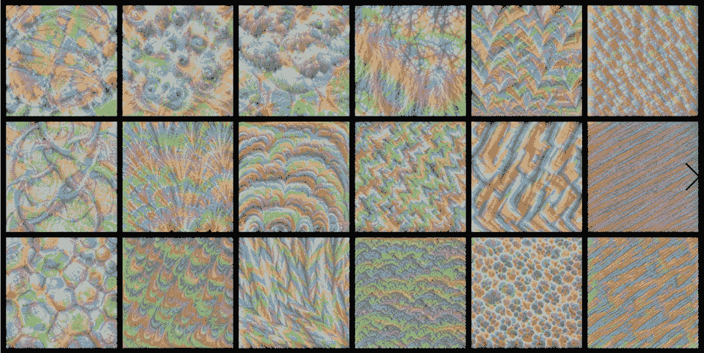

本文的结构如下：首先，我将展示 VGG-16 网络的几个层次中的卷积特征的可视化；然后，尝试理解其中一些可视化，我将展示如何快速测试一个假设，即特定的滤波器会检测到哪种模式；最后，我将解释创建本文中提供的模式所需的代码。

**特征可视化**

神经网络学习将输入数据（如图像）转换为越来越有意义但表征越来越复杂的连续层。

你可以将深度网络看做一个多阶段信息蒸馏操作，其中信息通过连续的滤波器并不断被「提纯」。（François Chollet, Deep Learning with Python (Shelter Island, NY: Manning Publications, 2018), p. 9）

阅读完他的文章后，你将了解如何生成模式，以最大化这些层次表征的某个层中所选特征图的平均激活，如何解释其中一些可视化，以及最终如何测试所选滤波器可能响应的模式或纹理的假设。你可以在下面找到 VGG-16 网络多个层中滤波器的特征可视化。在查看它们时，希望你能观察到生成模式的复杂性如何随着进入网络的深度而增加。

**Layer 7: Conv2d(64, 128)**

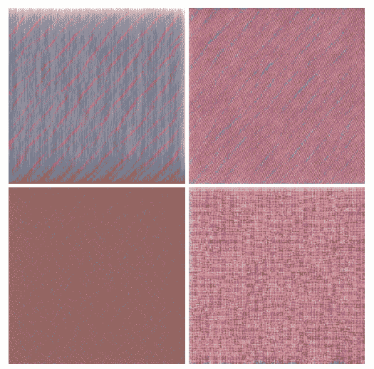*滤波器 12, 16, 86, 110（左上到右下，逐行）*

**Layer 14: Conv2d(128, 256)**

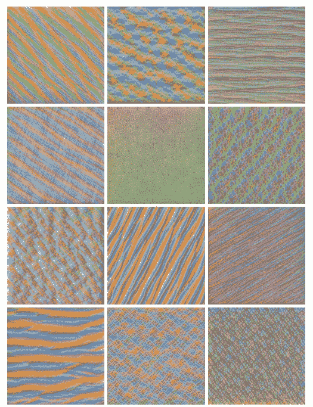*滤波器 1, 6, 31, 32, 54, 77, 83, 97, 125, 158, 162, 190（左上到右下，逐行）*

**Layer 20: Conv2d(256, 256)**

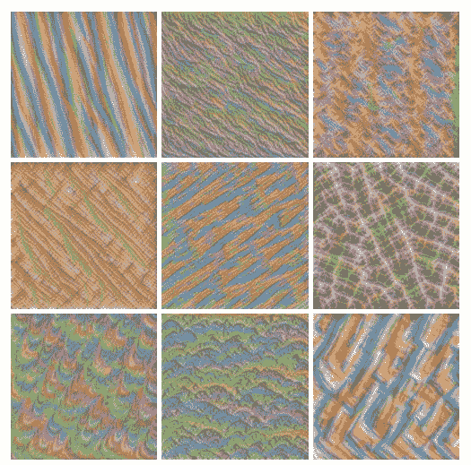*滤波器 3, 34, 39, 55, 62, 105, 115, 181, 231（左上到右下，逐行）*

**Layer 30: Conv2d(512, 512)**

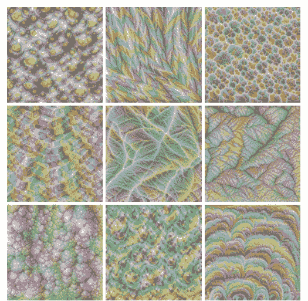*滤波器 54, 62, 67, 92, 123, 141, 150, 172, 180, 213, 233, 266, 277, 293, 331, 350, 421, 427（左上到右下，逐行）*

**Layer 40: Conv2d(512, 512)—top of the network**

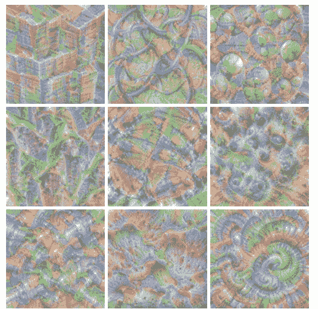*滤波器 4, 9, 34, 35, 75, 123, 150, 158, 203, 234, 246, 253, 256, 261, 265, 277, 286, 462（左上到右下，逐行）*

这些模式让我觉得非常震撼！部分原因是，它们太漂亮了，我都想立马将它们裱起来挂在墙上；但主要的原因是，它们仅仅是通过最大化由数千张图像训练出的数学方程中的某个值得到的。在浏览通过最大化最后一层卷积层特征图的平均激活得到的 512 个模式时，我经常发出感慨「哇，这是一只鸡」，或「这不是一根羽毛嘛」。

**识别模式**

我们来尝试解释几个可视化的特征。从这个开始，有没有让你想起些什么？

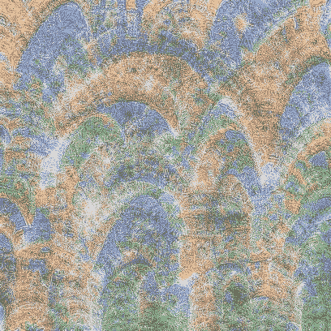*第 40 层第 286 个滤波器* 

这张照片立刻让我想起了教堂拱形天花板的圆拱。

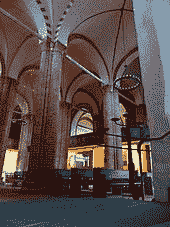

来，让我们检验一下。人造的那张图片是通过最大化第 40 层第 286 个特征图的平均激活创造出来的。我们来看看当把拱门的照片输入网络后，第 40 层特征图的平均激活会是怎样：

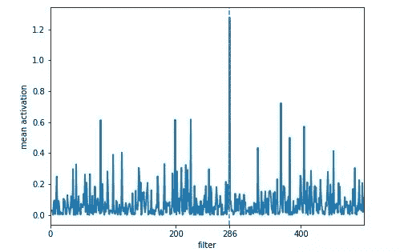

看到了什么？正如期望的那样，特征图上的 286 处有一个极强的尖峰。所以，这是否意味着第 40 层第 286 个滤波器是负责检测拱形天花板的呢？这里我们要小心一点，滤波器 286 显然会响应图像中的拱形结构，但请记住，这样的拱形结构可能会在几个不同的类别中起到重要作用。

注意：虽然我使用第 40 层（卷积层）来生成我们当前正在查看的图像，但我使用了第 42 层来生成显示每个特征图的平均激活的图。第 41 和 42 层是 batch-norm 和 ReLU。ReLU 激活函数删除所有负值，选择第 42 层而不是 40 的唯一原因是，后者将显示大量负噪声，这使得我们很难看到我们感兴趣的正峰值。

再来一例。

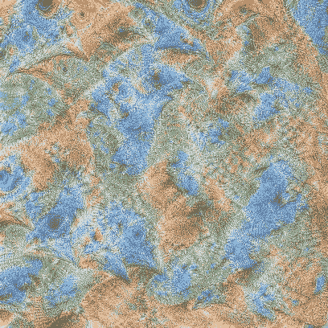*第 40 层第 256 个滤波器* 

我敢保证，这些是鸡头（或者至少是鸟头）！从图中我们可以看到尖尖的喙和黑色的眼睛。我们可以用下面的这个图片来检验：

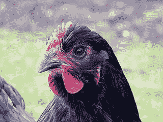

类似地，特征图上的 256 处会出现强烈的尖峰：

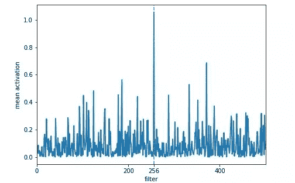

再来：

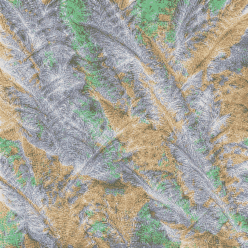*第 40 层第 462 个滤波器* 

滤波器 462 会不会对羽毛作出反应呢？来，输入一张羽毛图片：

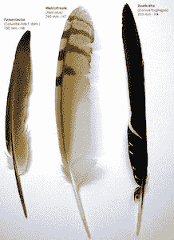

Yes！滤波器 462 果然反应强烈：

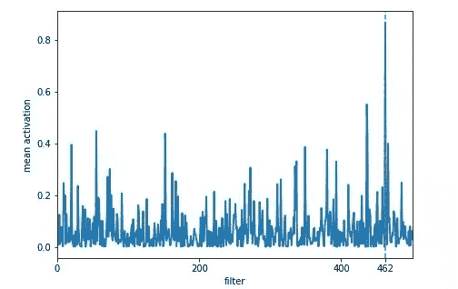

猜一猜滤波器 265 会对什么产生响应？

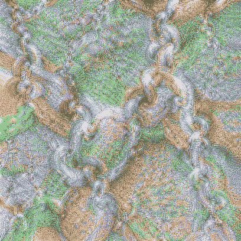*第 40 层第 265 个滤波器*

或许是链条吧？来，我们输入一张试试：


Yes，看起来猜对了！

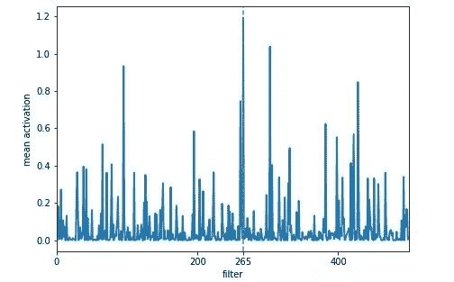

不过从上图可以看到，除了最大的尖峰外，还有几个较大的次尖峰。我们看看对应的第 95 和第 303 个特征可视化图是什么：

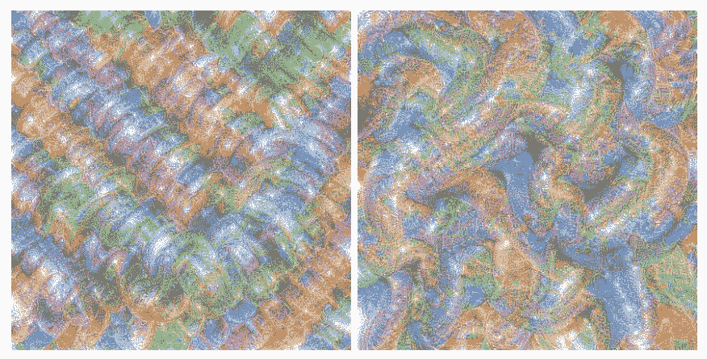*第 40 层第 95 和第 303 个滤波器*

再来看张比较酷的：

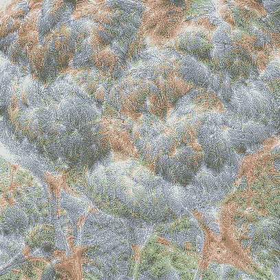*第 40 层第 64 个滤波器* 

有许多看起来像羽毛一样的结构，似乎还有鸟腿，左下方有个类似鸟头的东西。腿和喙显然比鸡的长，所以可能是一只鸟。我们将下面这幅图输入网络：

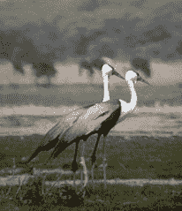

得到这样的特征图：

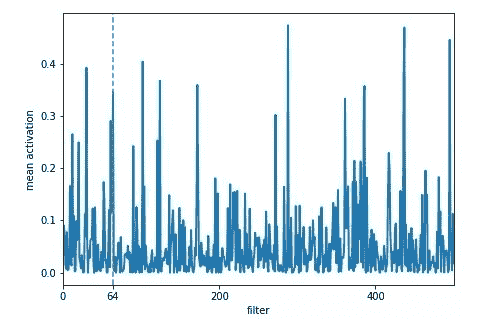

好吧，😂，在 64 处确实有个尖峰，但好像有许多比它更高的。让我们再来看看其中四个特征尖峰对应的滤波器生成的模式：

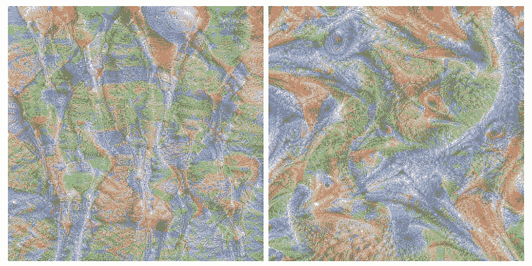*第 40 层第 172 和第 288 个滤波器* 

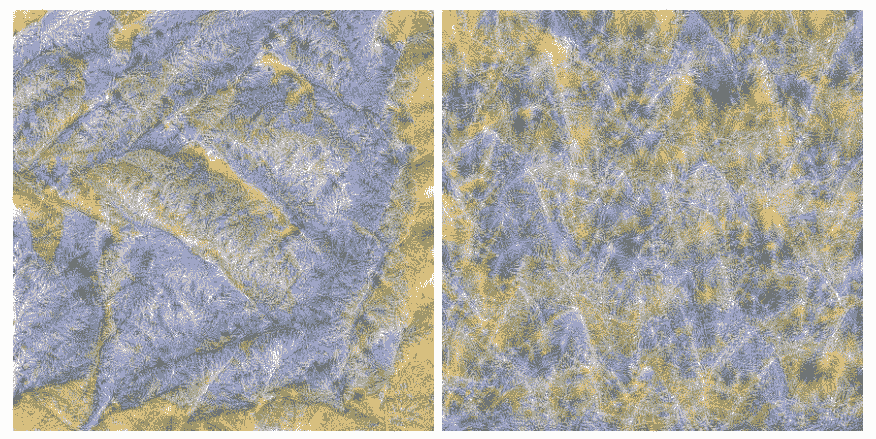*第 40 层第 437 和第 495 个滤波器* 

上面两幅（172、288）图看起来似乎有更多腿和眼睛/喙；不过下面两幅（437、495）我实在看不出它表示了什么。也许这些模式与图像的背景相关，或者只是代表网络检测到了一些我所不能理解的鸟类的信息。我想现在这个地方仍然是黑匣子的一部分。

再来最后一张，比较可爱，之后我们就直接进入代码部分。你能猜到这个是什么吗？

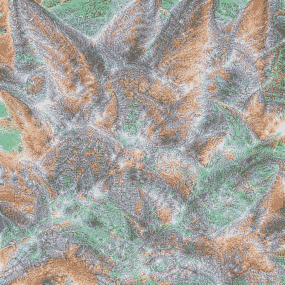*第 40 层第 277 个滤波器*

我撸猫多年，所以我立马看到了毛茸茸的猫耳。左上角那个较大的最为明显。好，让我们输入一张猫图：

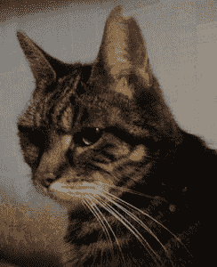

Yes，特征图上 277 处确实有一个强烈的尖峰，但是旁边更强烈的尖峰是怎么回事？

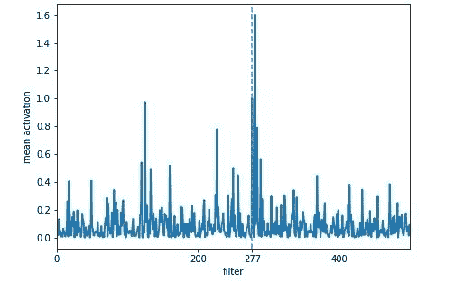

我们快速看下特征图 281 对应的模式图：

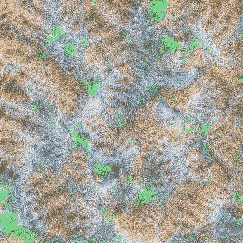*第 40 层第 281 个滤波器*

也许是条纹猫的皮毛？

对于从网络中发现上述这样的秘密，我简直乐此不疲。但事实上，即使在最终的卷积层，大多数滤波器生成的模式对我来说还是非常抽象的。更为严格的方法应该是将网络应用于整个包含许多不同种类图像的数据集，并跟踪在某一层中激发特定滤波器的图像。

**代码详解**

思路大致如下：我们从包含随机像素的图片开始，将它输入到评估模式的网络中，计算特定层中某个特征图的平均激活，然后计算输入图像像素值的梯度；知道像素值的梯度后，我们继续以最大化所选特征图的平均激活的方式更新像素值。

貌似这样说不好理解，那我们换种方式：网络权重是固定的，网络也不会被训练，我们试图找到一个图像，通过在像素值上执行梯度下降优化来最大化特定特征图的平均激活。

这个技术也叫做神经风格迁移。

为了实现这一点，我们需要：

1.  从随机图像开始；

2.  评估模式下的预训练网络；

3.  一种访问我们感兴趣的任何隐藏层激活函数的方式；

4.  用于计算渐梯度的损失函数和用于更新像素值的优化器。

我们先来生成一张带噪图作为输入。我们可以如下这样做：

```py
img = np.uint8(np.random.uniform(150, 180, (sz, sz, 3)))/255 
```

其中 sz 是图像的长、宽，3 是颜色通道数，我们除以 255 是因为 uint8 类型的变量最大值是 255。如果你想得到更多或更少的噪声，可以修改 150 和 180。

然后我们用

```py
 img_var = V(img[None], requires_grad=True) 
```

将之转化为一个需要梯度的 PyTorch 变量。像素值需要梯度，因为我们要使用反向传播来优化它们。

接着，我们需要一个评估模式下（意味着其权重是不变的）的预训练网络。这可以用如下代码：

```py
model = vgg16(pre=True).eval()
set_trainable(model, False).
```

再然后，我们需要一种方式来获取隐藏层的特征。我们可以采用在我们感兴趣的某个隐藏层后进行截断的方式获取，这样该隐藏层就成了输出层。不过在 PyTorch 中有一种更好的方法来解决这个问题，称为」hook」，可以在 PyTorch 的 Module 或 Tensor 中说明。要理解这点，你需要知道：

1.  PyTorch Module 是所有神经网络模块的基本类；

2.  我们的神经网络的每个层都是一个 Module ；

3.  每个 Module 都有一个称为 forward 的方法，当给 Module 一个输入时它会计算输出。

当我们将噪声图输入到我们的网络中时，forward 方法就会计算出第一层的输出结果；第二层的输入是前一层 forward 方法的输出结果；以此类推。当我们在某个层「register forward hook」时，在该层的 forward 方法被调用后将执行「hook」。

例如，当我们对层 i 的特征映射感兴趣时，我们在 i 层 register 一个「forword hook」；当层 i 的 forward 方法被调用后，层 i 的特征就会保存在一个变量里。

保存变量的类如下：

```py
class SaveFeatures():
    def __init__(self, module):
        self.hook = module.register_forward_hook(self.hook_fn)
    def hook_fn(self, module, input, output):
        self.features = torch.tensor(output,requires_grad=True).cuda()
    def close(self):
        self.hook.remove()
```

当执行 hook 时，调用方法 hook_fn。hook_fn 方法会将层输出保存在 self.features。注意这个张量是需要梯度的，因为我们要在像素值上执行反向传播。

怎么用 SaveFeatures 对象呢？

对层 i 的 hook 为：

```py
activations = SaveFeatures(list(self.model.children())[i])
```

当你用 model(img_var) 将模型应用到图像上后，你可以通过 hook 保存在 activations.features 来访问特征。注意别忘了一点，在访问完毕后使用 close 释放内存。

好了，现在我们已经能够访问层 i 的特征图了。特征图的形式为 [ 1, 512, 7, 7 ]，其中 1 表示批维度，512 表示滤波器/特征图的个数，7 表示特征图的长和宽。我们的目标就是最大化选择的某一特征图 j 的平均激活值。因此我们定义如下损失函数：

```py
loss = -activations.features[0, j].mean()
```

以及优化器：

```py
optimizer = torch.optim.Adam([img_var], lr=lr, weight_decay=1e-6)
```

默认情况下，优化器可以最大限度地减少损失，因此我们只需将平均激活乘以 -1 即可告知优化器最大化损失。使用 optimizer.zero_grad() 重置梯度，使用 loss.backward() 计算像素值的梯度，并使用 optimizer.step() 更改像素值。

我们现在已经有了所有需要的东西：从随机图像开始，在评估模式下定义预先训练的网络，执行前向传播以获取第 i 层的特征，并定义了允许我们更改像素值以最大化层 i 中特征映射 j 的平均激活的优化器和损失函数。

好，让我们看一个例子：

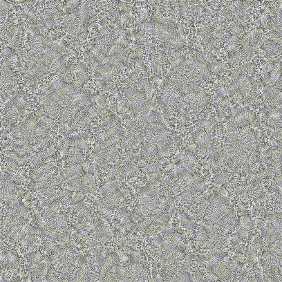*第 40 层，第 265 个滤波器* 

等等，这不正是我们想要的吗？和前面的链条模式很相似；如果你眯着眼睛看，就可以看到链条。但可以肯定的是，我们获得的特征图的局部性必定非常差，因此我们必须找到一种方法来指导我们的优化器以获得最小化模式或者或「更好看」的模式。与我前面展示的模式相反，这张图由高频模式占主导，类似于对抗样本。那么我们该怎么解决这个问题呢？我尝试了不同的优化器、学习速率以及正则化，但似乎没有任何东西可以减少高频模式。

接下来，我变化了一下输入噪声图像的尺寸：

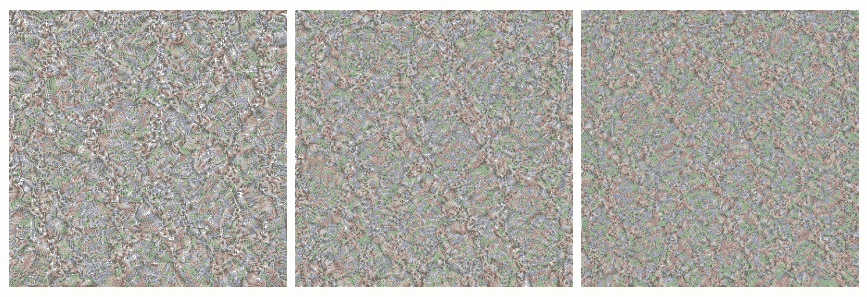*图像大小分别为 200x200、300x300、400x400。* 

在这三幅图中，有没有发现「链状图案」的频率随着图像尺寸的增加而增加？由于卷积滤波器具有固定的尺寸，因此当图像分辨率增大时，滤波器的相对尺寸就会变小。换句话说：假设创建的模式都是以像素为单位，当我们增加图像尺寸，则生成图案的相对尺寸将减小，而图案的频率将增加。

如果我的假设是正确的，那么我们想要的是低分辨率样本（甚至比上面显示的还低）但高分辨的低频模式。这有意义吗？以及怎么做？

我的解决方案是：首先从非常低分辨率的图像开始，即 56×56 像素，优化像素值几步，然后将图像尺寸增加一定的系数；在对图像放大后，再将像素值优化几步；然后再次对图像进行放大...

这样获得的结果出奇的好，一个低频、高分辨率、且没有太多噪音的模式图：

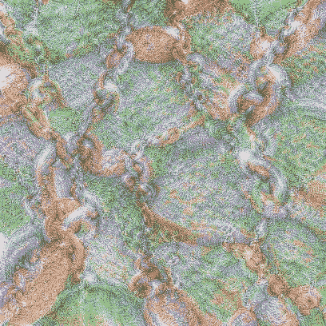*第 40 层，第 265 个滤波器。* 

我们现在有了一个分辨率好得多的低频模式，并且没有太多的噪音。为什么这样做会有用呢？我的想法是：当我们从低分辨率开始时，我们会得到低频模式。放大后，放大后的模式图相比直接用大尺度图像优化生成的模式图有较低的频率。因此，在下一次迭代中优化像素值时，我们处于一个更好的起点，看起来避免了局部最小值。这有意义吗？为了进一步减少高频模式，我在放大后稍微模糊了图像。

我发现以 1.2 的倍数放大 12 次之后得到的结果不错。

看看下面的代码。你会发现我们已经将重点信息都讲清了，例如创建随机图像、register hook、定义优化器和损失函数，以及优化像素值。唯一重要的新内容是：1）将代码封装到一个类中；2）我们在优化像素值后将图像放大了几次。

```py
class FilterVisualizer():
    def __init__(self, size=56, upscaling_steps=12, upscaling_factor=1.2):
        self.size, self.upscaling_steps, self.upscaling_factor = size, upscaling_steps, upscaling_factor
        self.model = vgg16(pre=True).cuda().eval()
        set_trainable(self.model, False)

    def visualize(self, layer, filter, lr=0.1, opt_steps=20, blur=None):
        sz = self.size
        img = np.uint8(np.random.uniform(150, 180, (sz, sz, 3)))/255  # generate random image
        activations = SaveFeatures(list(self.model.children())[layer])  # register hook

        for _ in range(self.upscaling_steps):  # scale the image up upscaling_steps times
            train_tfms, val_tfms = tfms_from_model(vgg16, sz)
            img_var = V(val_tfms(img)[None], requires_grad=True)  # convert image to Variable that requires grad
            optimizer = torch.optim.Adam([img_var], lr=lr, weight_decay=1e-6)
            for n in range(opt_steps):  # optimize pixel values for opt_steps times
                optimizer.zero_grad()
                self.model(img_var)
                loss = -activations.features[0, filter].mean()
                loss.backward()
                optimizer.step()
            img = val_tfms.denorm(img_var.data.cpu().numpy()[0].transpose(1,2,0))
            self.output = img
            sz = int(self.upscaling_factor * sz)  # calculate new image size
            img = cv2.resize(img, (sz, sz), interpolation = cv2.INTER_CUBIC)  # scale image up
            if blur is not None: img = cv2.blur(img,(blur,blur))  # blur image to reduce high frequency patterns
        self.save(layer, filter)
        activations.close()

    def save(self, layer, filter):
        plt.imsave("layer_"+str(layer)+"_filter_"+str(filter)+".jpg", np.clip(self.output, 0, 1))
```

使用 FilterVisualizer ：

```py
layer = 40
filter = 265
FV = FilterVisualizer(size=56, upscaling_steps=12, upscaling_factor=1.2)
FV.visualize(layer, filter, blur=5)
```

代码默认使用英伟达的 GPU，如果没有，可以在 google colab 上测试。********

*原文链接：https://towardsdatascience.com/how-to-visualize-convolutional-features-in-40-lines-of-code-70b7d87b0030*

****本文为机器之心编译，**转载请联系本公众号获得授权****。**

✄------------------------------------------------

**加入机器之心（全职记者 / 实习生）：hr@jiqizhixin.com**

**投稿或寻求报道：**content**@jiqizhixin.com**

**广告 & 商务合作：bd@jiqizhixin.com**