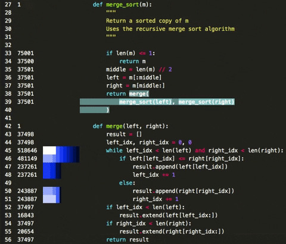
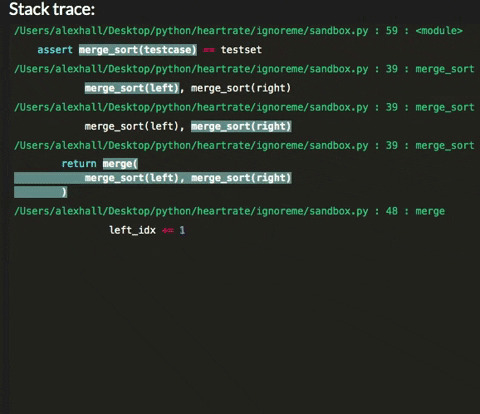
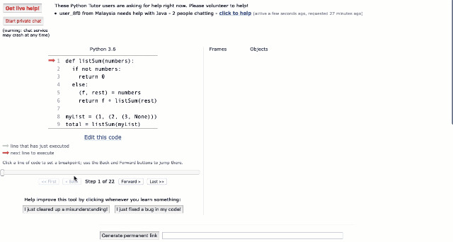

# Heartrate：如追综心跳般实时动态可视化监测 Python 程序运行

> 原文：[`mp.weixin.qq.com/s?__biz=MzA3MzI4MjgzMw==&mid=2650767895&idx=4&sn=752bb4b06987439fe498608f9fcbfd2d&chksm=871a4669b06dcf7f03f294e38903acde75e4478d4f9555614b46c8085512ecfa32ccb62fbfe8&scene=21#wechat_redirect`](http://mp.weixin.qq.com/s?__biz=MzA3MzI4MjgzMw==&mid=2650767895&idx=4&sn=752bb4b06987439fe498608f9fcbfd2d&chksm=871a4669b06dcf7f03f294e38903acde75e4478d4f9555614b46c8085512ecfa32ccb62fbfe8&scene=21#wechat_redirect)

机器之心报道

****参与：一鸣、杜伟****

> Python 是一门非常受欢迎的编程语言，其灵活易用的特性使其在 web 应用、数据分析等方面有广泛的应用。但是 Python 有一个受到诟病的特点——运行速度低下。因此，Python 开发者需要经常对程序进行监控和调试，使代码运行变得高效。近日，一位开发者开源了一个 Python 工具，用户可以实时动态地监控 Python 程序的运行情况，逐行追踪代码的运行时间，而且整个过程是可视化的。

项目地址：https://github.com/alexmojaki/heartrate**Heartate——如监测心率般追踪程序运行**Heartrate 是一个 Python 的工具库，可以实时可视化 Python 程序的执行过程。监控运行中的 Python 程序如图：



如图所示，左侧数字表示每行代码被触发的次数。长方框表示最近被触发的代码行——方框越长表示触发次数越多，颜色越浅表示最近被触发次数越多。

> 虽然追踪每行代码的触发次数是一个方法，但是要是能计算每次触发代码的执行时间就好了。这样能够更好地说明哪行代码是效率瓶颈。by 思

得益于 executing (https://github.com/alexmojaki/executing) 库，当前被执行的调用以高亮显示。实时堆栈追踪（stacktrace）如下所示：



**功能**该工具可以：

*   启动程序追踪

*   在线程中启动服务器

*   打开显示 trace() 被调用的文件可视化图的浏览器窗口

在文件视图中，堆栈追踪位于底部。而在堆栈追踪中，用户可以点击正在追踪文件的堆栈条目，从而在该代码行打开文件的可视化图。trace 只追踪调用它的线程。若要追踪多线程，用户必须在每个线程都予以调用，并且每次的端口也不同。**如何设置需要监测的程序**files 确定了除调用的 trace 之外其他需要追踪的文件。files 必须是可调用的，并接受一个参数：文件路径，同时如果应该追踪该文件，则需要返回 True。为方便起见，这位开发者提供了以下函数：

*   files.all：追踪所有文件；

*   files.path_contains(substrings)：追踪路径中包含任何给定子字符串的所有文件；

*   files.contains_regex(pattern)：追踪自身包含给定正则表达式（regex）的所有文件，所以用户可以在源代码中标记所追踪的文件，如添加注释。

默认情况下追踪包含注释 # heartrate 的文件（空格可选）。如果用户要追踪多个文件，则可通过以下两种方式得到它们的可视化页面：

*   在堆栈追踪中，用户点击正在追踪的堆栈条目，则可以打开页面并跳转至堆栈条目；

*   跳转至 http://127.0.0.1:9999/ 网站的索引页，从而查看追踪文件列表。

host：服务器的 HTTP host。若要运行可从任何地方访问的远程服务器，使用'127.0.0.1'。默认为'127.0.0.1'。port：服务器的 HTTP 端口。默认为 9999。browser：若为 True，则自动打开显示文件（trace 被调用）可视化图的浏览器标签。默认为 False。**安装**

```py
pip install --user heartrate
```

支持 Python 3.5 以上版本。**其他代码可视化工具**机器之心还发现了一个可以可视化代码执行过程的网站，名为 Pythontutor。和本文的 Heartrate 不同，该网站更多的是可视化数据在程序中的变化过程。可视化的过程如下：



用户还可以在网站上编辑修改代码，观察运行过程中数据的变化。同时该网站还有 Java 等其他语言的版本。网站地址：http://www.pythontutor.com (http://www.pythontutor.com/)*参考链接：https://github.com/alexmojaki/heartrate*********本****文为机器之心报道，**转载请联系本公众号获得授权****。**
✄------------------------------------------------**加入机器之心（全职记者 / 实习生）：hr@jiqizhixin.com****投稿或寻求报道：**content**@jiqizhixin.com****广告 & 商务合作：bd@jiqizhixin.com**