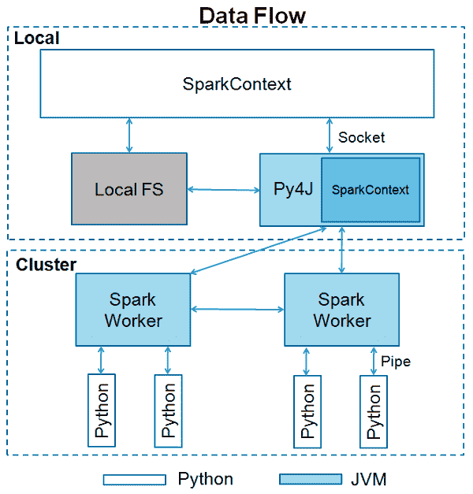

# PySpark 源码解析，教你用 Python 调用高效 Scala 接口，搞定大规模数据分析

> 原文：[`mp.weixin.qq.com/s?__biz=MzA3MzI4MjgzMw==&mid=2650777228&idx=4&sn=aae9fecc4f62edb76503a36d678e44d9&chksm=871a62f2b06debe4a6c1652eacc4c16def8daab5ba014a68392b321e5c274be738f1de6212cc&scene=21#wechat_redirect`](http://mp.weixin.qq.com/s?__biz=MzA3MzI4MjgzMw==&mid=2650777228&idx=4&sn=aae9fecc4f62edb76503a36d678e44d9&chksm=871a62f2b06debe4a6c1652eacc4c16def8daab5ba014a68392b321e5c274be738f1de6212cc&scene=21#wechat_redirect)

机器之心专栏

**作者：汇量科技-陈绪**

> 相较于 Scala 语言而言，Python 具有其独有的优势及广泛应用性，因此 Spark 也推出了 PySpark，在框架上提供了利用 Python 语言的接口，为数据科学家使用该框架提供了便利。


众所周知，Spark 框架主要是由 Scala 语言实现，同时也包含少量 Java 代码。Spark 面向用户的编程接口，也是 Scala。然而，在数据科学领域，Python 一直占据比较重要的地位，仍然有大量的数据工程师在使用各类 Python 数据处理和科学计算的库，例如 numpy、Pandas、scikit-learn 等。同时，Python 语言的入门门槛也显著低于 Scala。为此，Spark 推出了 PySpark，在 Spark 框架上提供一套 Python 的接口，方便广大数据科学家使用。本文主要从源码实现层面解析 PySpark 的实现原理，包括以下几个方面：

*   PySpark 的多进程架构；

*   Python 端调用 Java、Scala 接口；

*   Python Driver 端 RDD、SQL 接口；

*   Executor 端进程间通信和序列化；

*   Pandas UDF；

*   总结。

PySpark 项目地址：https://github.com/apache/spark/tree/master/python

**1、PySpark 的多进程架构**PySpark 采用了 Python、JVM 进程分离的多进程架构，在 Driver、Executor 端均会同时有 Python、JVM 两个进程。当通过 spark-submit 提交一个 PySpark 的 Python 脚本时，Driver 端会直接运行这个 Python 脚本，并从 Python 中启动 JVM；而在 Python 中调用的 RDD 或者 DataFrame 的操作，会通过 Py4j 调用到 Java 的接口。在 Executor 端恰好是反过来，首先由 Driver 启动了 JVM 的 Executor 进程，然后在 JVM 中去启动 Python 的子进程，用以执行 Python 的 UDF，这其中是使用了 socket 来做进程间通信。总体的架构图如下所示：



**2、Python Driver 如何调用 Java 的接口**上面提到，通过 spark-submit 提交 PySpark 作业后，Driver 端首先是运行用户提交的 Python 脚本，然而 Spark 提供的大多数 API 都是 Scala 或者 Java 的，那么就需要能够在 Python 中去调用 Java 接口。这里 PySpark 使用了 Py4j 这个开源库。当创建 Python 端的 SparkContext 对象时，实际会启动 JVM，并创建一个 Scala 端的 SparkContext 对象。代码实现在 python/pyspark/context.py：

```py
def _ensure_initialized(cls, instance=None, gateway=None, conf=None):
    """
    Checks whether a SparkContext is initialized or not.
    Throws error if a SparkContext is already running.
    """
    with SparkContext._lock:
        if not SparkContext._gateway:
            SparkContext._gateway = gateway or launch_gateway(conf)
            SparkContext._jvm = SparkContext._gateway.jvm
```

在 launch_gateway (python/pyspark/java_gateway.py) 中，首先启动 JVM 进程：

```py
SPARK_HOME = _find_spark_home()
# Launch the Py4j gateway using Spark's run command so that we pick up the
# proper classpath and settings from spark-env.sh
on_windows = platform.system() == "Windows"
script = "./bin/spark-submit.cmd" if on_windows else "./bin/spark-submit"
command = [os.path.join(SPARK_HOME, script)]
```

然后创建 JavaGateway 并 import 一些关键的 class：

```py
gateway = JavaGateway(
        gateway_parameters=GatewayParameters(port=gateway_port, auth_token=gateway_secret,
                                             auto_convert=True))
# Import the classes used by PySpark
java_import(gateway.jvm, "org.apache.spark.SparkConf")
java_import(gateway.jvm, "org.apache.spark.api.java.*")
java_import(gateway.jvm, "org.apache.spark.api.python.*")
java_import(gateway.jvm, "org.apache.spark.ml.python.*")
java_import(gateway.jvm, "org.apache.spark.mllib.api.python.*")
# TODO(davies): move into sql
java_import(gateway.jvm, "org.apache.spark.sql.*")
java_import(gateway.jvm, "org.apache.spark.sql.api.python.*")
java_import(gateway.jvm, "org.apache.spark.sql.hive.*")
java_import(gateway.jvm, "scala.Tuple2")
```

拿到 JavaGateway 对象，即可以通过它的 jvm 属性，去调用 Java 的类了，例如：gateway = JavaGateway()

```py
gateway = JavaGateway()
jvm = gateway.jvm
l = jvm.java.util.ArrayList()
```

然后会继续创建 JVM 中的 SparkContext 对象：

```py
def _initialize_context(self, jconf):
    """
    Initialize SparkContext in function to allow subclass specific initialization
    """
    return self._jvm.JavaSparkContext(jconf)

# Create the Java SparkContext through Py4J
self._jsc = jsc or self._initialize_context(self._conf._jconf)
```

**3、Python Driver 端的 RDD、SQL 接口**在 PySpark 中，继续初始化一些 Python 和 JVM 的环境后，Python 端的 SparkContext 对象就创建好了，它实际是对 JVM 端接口的一层封装。和 Scala API 类似，SparkContext 对象也提供了各类创建 RDD 的接口，和 Scala API 基本一一对应，我们来看一些例子。

```py
def newAPIHadoopFile(self, path, inputFormatClass, keyClass, valueClass, keyConverter=None,
                     valueConverter=None, conf=None, batchSize=0):
    jconf = self._dictToJavaMap(conf)
    jrdd = self._jvm.PythonRDD.newAPIHadoopFile(self._jsc, path, inputFormatClass, keyClass,
                                                valueClass, keyConverter, valueConverter,
                                                jconf, batchSize)
    return RDD(jrdd, self)
```

可以看到，这里 Python 端基本就是直接调用了 Java/Scala 接口。而 PythonRDD (core/src/main/scala/org/apache/spark/api/python/PythonRDD.scala)，则是一个 Scala 中封装的伴生对象，提供了常用的 RDD IO 相关的接口。另外一些接口会通过 self._jsc 对象去创建 RDD。其中 self._jsc 就是 JVM 中的 SparkContext 对象。拿到 RDD 对象之后，可以像 Scala、Java API 一样，对 RDD 进行各类操作，这些大部分都封装在 python/pyspark/rdd.py 中。这里的代码中出现了 jrdd 这样一个对象，这实际上是 Scala 为提供 Java 互操作的 RDD 的一个封装，用来提供 Java 的 RDD 接口，具体实现在 core/src/main/scala/org/apache/spark/api/java/JavaRDD.scala 中。可以看到每个 Python 的 RDD 对象需要用一个 JavaRDD 对象去创建。对于 DataFrame 接口，Python 层也同样提供了 SparkSession、DataFrame 对象，它们也都是对 Java 层接口的封装，这里不一一赘述。**4、Executor 端进程间通信和序列化**对于 Spark 内置的算子，在 Python 中调用 RDD、DataFrame 的接口后，从上文可以看出会通过 JVM 去调用到 Scala 的接口，最后执行和直接使用 Scala 并无区别。而对于需要使用 UDF 的情形，在 Executor 端就需要启动一个 Python worker 子进程，然后执行 UDF 的逻辑。那么 Spark 是怎样判断需要启动子进程的呢？在 Spark 编译用户的 DAG 的时候，Catalyst Optimizer 会创建 BatchEvalPython 或者 ArrowEvalPython 这样的 Logical Operator，随后会被转换成 PythonEvals 这个 Physical Operator。在 PythonEvals（sql/core/src/main/scala/org/apache/spark/sql/execution/SparkStrategies.scala）中：

```py
object PythonEvals extends Strategy {
  override def apply(plan: LogicalPlan): Seq[SparkPlan] = plan match {
    case ArrowEvalPython(udfs, output, child, evalType) =>
      ArrowEvalPythonExec(udfs, output, planLater(child), evalType) :: Nil
    case BatchEvalPython(udfs, output, child) =>
      BatchEvalPythonExec(udfs, output, planLater(child)) :: Nil
    case _ =>
      Nil
  }
}
```

创建了 ArrowEvalPythonExec 或者 BatchEvalPythonExec，而这二者内部会创建 ArrowPythonRunner、PythonUDFRunner 等类的对象实例，并调用了它们的 compute 方法。由于它们都继承了 BasePythonRunner，基类的 compute 方法中会去启动 Python 子进程：

```py
def compute(
      inputIterator: Iterator[IN],
      partitionIndex: Int,
      context: TaskContext): Iterator[OUT] = {
  // ......

  val worker: Socket = env.createPythonWorker(pythonExec, envVars.asScala.toMap)
  // Start a thread to feed the process input from our parent's iterator
  val writerThread = newWriterThread(env, worker, inputIterator, partitionIndex, context)
  writerThread.start()
  val stream = new DataInputStream(new BufferedInputStream(worker.getInputStream, bufferSize))

  val stdoutIterator = newReaderIterator(
    stream, writerThread, startTime, env, worker, releasedOrClosed, context)
  new InterruptibleIterator(context, stdoutIterator)
```

这里 env.createPythonWorker 会通过 PythonWorkerFactory（core/src/main/scala/org/apache/spark/api/python/PythonWorkerFactory.scala）去启动 Python 进程。Executor 端启动 Python 子进程后，会创建一个 socket 与 Python 建立连接。所有 RDD 的数据都要序列化后，通过 socket 发送，而结果数据需要同样的方式序列化传回 JVM。对于直接使用 RDD 的计算，或者没有开启 spark.sql.execution.arrow.enabled 的 DataFrame，是将输入数据按行发送给 Python，可想而知，这样效率极低。在 Spark 2.2 后提供了基于 Arrow 的序列化、反序列化的机制（从 3.0 起是默认开启），从 JVM 发送数据到 Python 进程的代码在 sql/core/src/main/scala/org/apache/spark/sql/execution/python/ArrowPythonRunner.scala。这个类主要是重写了 newWriterThread 这个方法，使用了 ArrowWriter 向 socket 发送数据：

```py
val arrowWriter = ArrowWriter.create(root)
val writer = new ArrowStreamWriter(root, null, dataOut)
writer.start()

while (inputIterator.hasNext) {
val nextBatch = inputIterator.next()

while (nextBatch.hasNext) {
    arrowWriter.write(nextBatch.next())
}

arrowWriter.finish()
writer.writeBatch()
arrowWriter.reset()
```

可以看到，每次取出一个 batch，填充给 ArrowWriter，实际数据会保存在 root 对象中，然后由 ArrowStreamWriter 将 root 对象中的整个 batch 的数据写入到 socket 的 DataOutputStream 中去。ArrowStreamWriter 会调用 writeBatch 方法去序列化消息并写数据，代码参考 ArrowWriter.java#L131。

```py
protected ArrowBlock writeRecordBatch(ArrowRecordBatch batch) throws IOException {
  ArrowBlock block = MessageSerializer.serialize(out, batch, option);
  LOGGER.debug("RecordBatch at {}, metadata: {}, body: {}",
      block.getOffset(), block.getMetadataLength(), block.getBodyLength());
  return block;
}
```

在 MessageSerializer 中，使用了 flatbuffer 来序列化数据。flatbuffer 是一种比较高效的序列化协议，它的主要优点是反序列化的时候，不需要解码，可以直接通过裸 buffer 来读取字段，可以认为反序列化的开销为零。我们来看看 Python 进程收到消息后是如何反序列化的。Python 子进程实际上是执行了 worker.py 的 main 函数 (python/pyspark/worker.py)：

```py
if __name__ == '__main__':
    # Read information about how to connect back to the JVM from the environment.
    java_port = int(os.environ["PYTHON_WORKER_FACTORY_PORT"])
    auth_secret = os.environ["PYTHON_WORKER_FACTORY_SECRET"]
    (sock_file, _) = local_connect_and_auth(java_port, auth_secret)
    main(sock_file, sock_file)
```

这里会去向 JVM 建立连接，并从 socket 中读取指令和数据。对于如何进行序列化、反序列化，是通过 UDF 的类型来区分：

```py
eval_type = read_int(infile)
if eval_type == PythonEvalType.NON_UDF:
    func, profiler, deserializer, serializer = read_command(pickleSer, infile)
else:
    func, profiler, deserializer, serializer = read_udfs(pickleSer, infile, eval_type)
```

在 read_udfs 中，如果是 PANDAS 类的 UDF，会创建 ArrowStreamPandasUDFSerializer，其余的 UDF 类型创建 BatchedSerializer。我们来看看 ArrowStreamPandasUDFSerializer(python/pyspark/serializers.py)：

```py
def dump_stream(self, iterator, stream):
    import pyarrow as pa
    writer = None
    try:
        for batch in iterator:
            if writer is None:
                writer = pa.RecordBatchStreamWriter(stream, batch.schema)
            writer.write_batch(batch)
    finally:
        if writer is not None:
            writer.close()

def load_stream(self, stream):
    import pyarrow as pa
    reader = pa.ipc.open_stream(stream)
    for batch in reader:
        yield batch
```

可以看到，这里双向的序列化、反序列化，都是调用了 PyArrow 的 ipc 的方法，和前面看到的 Scala 端是正好对应的，也是按 batch 来读写数据。对于 Pandas 的 UDF，读到一个 batch 后，会将 Arrow 的 batch 转换成 Pandas Series。

```py
def arrow_to_pandas(self, arrow_column):
    from pyspark.sql.types import _check_series_localize_timestamps

    # If the given column is a date type column, creates a series of datetime.date directly
    # instead of creating datetime64[ns] as intermediate data to avoid overflow caused by
    # datetime64[ns] type handling.
    s = arrow_column.to_pandas(date_as_object=True)

    s = _check_series_localize_timestamps(s, self._timezone)
    return s

def load_stream(self, stream):
    """
    Deserialize ArrowRecordBatches to an Arrow table and return as a list of pandas.Series.
    """
    batches = super(ArrowStreamPandasSerializer, self).load_stream(stream)
    import pyarrow as pa
    for batch in batches:
        yield [self.arrow_to_pandas(c) for c in pa.Table.from_batches([batch]).itercolumns()]
```

**5、Pandas UDF**前面我们已经看到，PySpark 提供了基于 Arrow 的进程间通信来提高效率，那么对于用户在 Python 层的 UDF，是不是也能直接使用到这种高效的内存格式呢？答案是肯定的，这就是 PySpark 推出的 Pandas UDF。区别于以往以行为单位的 UDF，Pandas UDF 是以一个 Pandas Series 为单位，batch 的大小可以由 spark.sql.execution.arrow.maxRecordsPerBatch 这个参数来控制。这是一个来自官方文档的示例：

```py
def multiply_func(a, b):
    return a * b

multiply = pandas_udf(multiply_func, returnType=LongType())

df.select(multiply(col("x"), col("x"))).show()
```

上文已经解析过，PySpark 会将 DataFrame 以 Arrow 的方式传递给 Python 进程，Python 中会转换为 Pandas Series，传递给用户的 UDF。在 Pandas UDF 中，可以使用 Pandas 的 API 来完成计算，在易用性和性能上都得到了很大的提升。**6、总结**PySpark 为用户提供了 Python 层对 RDD、DataFrame 的操作接口，同时也支持了 UDF，通过 Arrow、Pandas 向量化的执行，对提升大规模数据处理的吞吐是非常重要的，一方面可以让数据以向量的形式进行计算，提升 cache 命中率，降低函数调用的开销，另一方面对于一些 IO 的操作，也可以降低网络延迟对性能的影响。然而 PySpark 仍然存在着一些不足，主要有：

*   进程间通信消耗额外的 CPU 资源；

*   编程接口仍然需要理解 Spark 的分布式计算原理；

*   Pandas UDF 对返回值有一定的限制，返回多列数据不太方便。

Databricks 提出了新的 Koalas 接口来使得用户可以以接近单机版 Pandas 的形式来编写分布式的 Spark 计算作业，对数据科学家会更加友好。而 Vectorized Execution 的推进，有望在 Spark 内部一切数据都是用 Arrow 的格式来存放，对跨语言支持将会更加友好。同时也能看到，在这里仍然有很大的性能、易用性的优化空间，这也是我们平台近期的主要发力方向之一。**陈绪，汇量科技（Mobvista）高级算法科学家，负责汇量科技大规模数据智能计算引擎和平台的研发工作。在此之前陈绪是阿里巴巴高级技术专家，负责阿里集团大规模机器学习平台的研发。**********本****文为机器之心专栏，**转载请联系本公众号获得授权****。**
✄------------------------------------------------**加入机器之心（全职记者 / 实习生）：****hr@jiqizhixin.com****投稿或寻求报道：content****@jiqizhixin.com****广告 & 商务合作：****bd@jiqizhixin.com**