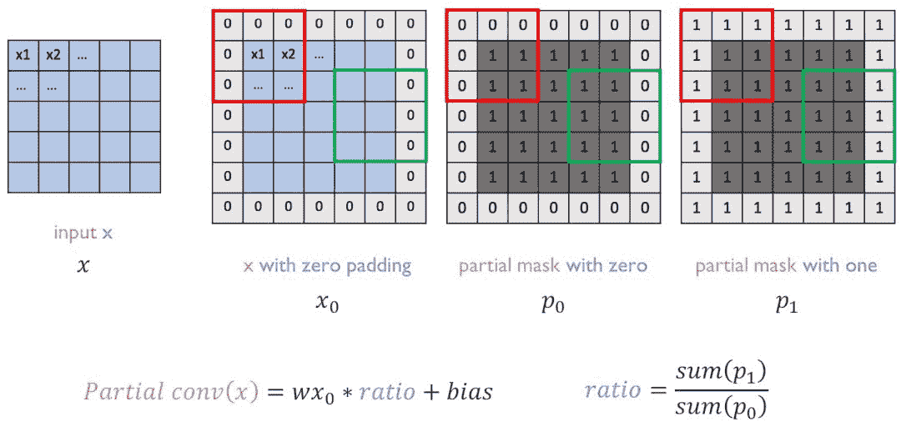

# 请快点粘贴复制，这是一份好用的 TensorFlow 代码集

> 原文：[`mp.weixin.qq.com/s?__biz=MzA3MzI4MjgzMw==&mid=2650757267&idx=4&sn=31cfed7163a6c049001b0a7a69a30eb2&chksm=871a9cedb06d15fbda2858747a4de2fee0cc8767beb019bc035ed71bd7a32fe1a43700a6bdf3&scene=21#wechat_redirect`](http://mp.weixin.qq.com/s?__biz=MzA3MzI4MjgzMw==&mid=2650757267&idx=4&sn=31cfed7163a6c049001b0a7a69a30eb2&chksm=871a9cedb06d15fbda2858747a4de2fee0cc8767beb019bc035ed71bd7a32fe1a43700a6bdf3&scene=21#wechat_redirect)

机器之心编辑

**参与：思源**

> TensorFlow 虽然是目前最为流行的神经网络框架，却以「难于上手」著称（Jeff Dean：怪我咯）。有些时候，我们需要简明扼要的代码来指点迷津。最近，来自 NCsoft AI 研究部门的 Junho Kim 就放出了一份这样的 TensorFlow 代码集。它类似于一个迷你版的 Keras，只不过因为其简单性，源码要好读得多。

项目链接：https://github.com/taki0112/Tensorflow-Cookbook

在这个项目中，作者重点突出这是一份易于使用的 TensorFlow 代码集，它包括常见的正则化、卷积运算和架构模块等代码。实际上，在我们搭建自己的模型或系统时，复制并粘贴这些代码就行了。它们以规范的形式定义不同的功能模块，因此只要修改少量参数与代码，它们就能完美地融入到我们项目中。

目前该项目包含一般深度学习架构所需要的代码，例如初始化和正则化、各种卷积运算、基本网络架构与模块、损失函数和其它数据预处理过程。此外，作者还特别增加了对 GAN 的支持，这主要体现在损失函数上，其中生成器损失和判别器损失可以使用推土机距离、最小二乘距离和 KL 散度等。

**使用方法**

使用方法其实有两种，首先我们可以复制粘贴代码，这样对于模块的定制化非常有利。其次我们可以直接像使用 API 那样调用操作与模块，这种方法会使模型显得非常简洁，而且导入的源码也通俗易懂。首先对于第二种直接导入的方法，我们可以从 ops.py 和 utils.py 文件分别导入模型运算部分与图像预处理过程。

*   from ops import *

*   from utils import *

```py
from ops import conv

x = conv(x, channels=64, kernel=3, stride=2, pad=1, pad_type='reflect', use_bias=True, sn=True, scope='conv') 
```

而对于第一种复制粘贴，我们可能会根据实际修改一些参数与结构，但这要比从头写简单多了。如下所示，对于一般的神经网络，它会采用如下结构模板：

```py
def network(x, is_training=True, reuse=False, scope="network"):
    with tf.variable_scope(scope, reuse=reuse):
        x = conv(...)

        ...return logit 
```

其实深度神经网络就像一块块积木，我们按照上面的模板把 ops.py 中不同的模块堆叠起来，最终就能得到完整的前向传播过程。

**代码集目录**

项目页面：https://www.notion.so/Simple-Tensorflow-Cookbook-6f4563d0cd7343cb9d1e60cd1698b54d

目前整个项目包含 20 种代码块，它们可用于快速搭建深度学习模型：


**代码示例**

如下主要介绍几段代码示例，包括最常见的卷积操作和残差模块等。每一项代码示例都能采用 API 式的调用或复制粘贴，所以它们不只能快速使用，学习各种操作的实现方法也是很好的资源。

**卷积**

卷积的原理相信大家都很熟悉，那就直接看调用代码吧：

```py
x = conv(x, channels=64, kernel=3, stride=2, pad=1, pad_type='reflect', use_bias=True, sn=True, scope='conv') 
```


如下所示为实现以上 API 的代码，相比于直接使用 padding='SAME'，了解如何手给图像 padding 零也是很好的。此外，这一段代码嵌入了谱归一化（spectral_normalization/sn），甚至我们可以截取这一小部分嵌入到自己的代码中。

```py
# padding='SAME' ======> pad = ceil[ (kernel - stride) / 2 ]
def conv(x, channels, kernel=4, stride=2, pad=0, pad_type='zero', use_bias=True, sn=False, scope='conv_0'):
    with tf.variable_scope(scope):
        if pad > 0:
            h = x.get_shape().as_list()[1]
            if h % stride == 0:
                pad = pad * 2
            else:
                pad = max(kernel - (h % stride), 0)

            pad_top = pad // 2
            pad_bottom = pad - pad_top
            pad_left = pad // 2
            pad_right = pad - pad_left

            if pad_type == 'zero':
                x = tf.pad(x, [[0, 0], [pad_top, pad_bottom], [pad_left, pad_right], [0, 0]])
            if pad_type == 'reflect':
                x = tf.pad(x, [[0, 0], [pad_top, pad_bottom], [pad_left, pad_right], [0, 0]], mode='REFLECT')

        if sn:
            w = tf.get_variable("kernel", shape=[kernel, kernel, x.get_shape()[-1], channels], initializer=weight_init,
                                regularizer=weight_regularizer)
            x = tf.nn.conv2d(input=x, filter=spectral_norm(w),
                             strides=[1, stride, stride, 1], padding='VALID')
            if use_bias:
                bias = tf.get_variable("bias", [channels], initializer=tf.constant_initializer(0.0))
                x = tf.nn.bias_add(x, bias)

        else:
            x = tf.layers.conv2d(inputs=x, filters=channels,
                                 kernel_size=kernel, kernel_initializer=weight_init,
                                 kernel_regularizer=weight_regularizer,
                                 strides=stride, use_bias=use_bias)

        return x 
```

**部分卷积（Partial Convolution）**

部分卷积是英伟达为图像修复引入的卷积运算，它使模型能够修复任意非中心、不规则的区域。在论文 Image Inpainting for Irregular Holes Using Partial Convolutions 中，实现部分卷积是非常关键的，如下展示了简单的调用过程：

```py
x = partial_conv(x, channels=64, kernel=3, stride=2, use_bias=True, padding='SAME', sn=True, scope='partial_conv') 
```



读者可根据以下定义 PConv 的代码了解具体实现信息：

```py
def partial_conv(x, channels, kernel=3, stride=2, use_bias=True, padding='SAME', sn=False, scope='conv_0'):
    with tf.variable_scope(scope):
        if padding.lower() == 'SAME'.lower():
            with tf.variable_scope('mask'):
                _, h, w, _ = x.get_shape().as_list()

                slide_window = kernel * kernel
                mask = tf.ones(shape=[1, h, w, 1])

                update_mask = tf.layers.conv2d(mask, filters=1,
                                               kernel_size=kernel, kernel_initializer=tf.constant_initializer(1.0),
                                               strides=stride, padding=padding, use_bias=False, trainable=False)

                mask_ratio = slide_window / (update_mask + 1e-8)
                update_mask = tf.clip_by_value(update_mask, 0.0, 1.0)
                mask_ratio = mask_ratio * update_mask

            with tf.variable_scope('x'):
                if sn:
                    w = tf.get_variable("kernel", shape=[kernel, kernel, x.get_shape()[-1], channels],
                                        initializer=weight_init, regularizer=weight_regularizer)
                    x = tf.nn.conv2d(input=x, filter=spectral_norm(w), strides=[1, stride, stride, 1], padding=padding)
                else:
                    x = tf.layers.conv2d(x, filters=channels,
                                         kernel_size=kernel, kernel_initializer=weight_init,
                                         kernel_regularizer=weight_regularizer,
                                         strides=stride, padding=padding, use_bias=False)
                x = x * mask_ratio

                if use_bias:
                    bias = tf.get_variable("bias", [channels], initializer=tf.constant_initializer(0.0))

                    x = tf.nn.bias_add(x, bias)
                    x = x * update_mask
else:
            if sn:
                w = tf.get_variable("kernel", shape=[kernel, kernel, x.get_shape()[-1], channels],
                                    initializer=weight_init, regularizer=weight_regularizer)
                x = tf.nn.conv2d(input=x, filter=spectral_norm(w), strides=[1, stride, stride, 1], padding=padding)
                if use_bias:
                    bias = tf.get_variable("bias", [channels], initializer=tf.constant_initializer(0.0))

                    x = tf.nn.bias_add(x, bias)
            else:
                x = tf.layers.conv2d(x, filters=channels,
                                     kernel_size=kernel, kernel_initializer=weight_init,
                                     kernel_regularizer=weight_regularizer,
                                     strides=stride, padding=padding, use_bias=use_bias)

        return x 
```

**残差模块**

ResNet 最大的特点即解决了反向传播过程中的梯度消失问题，因此它可以训练非常深的网络而不用像 GoogLeNet 那样在中间添加分类网络以提供额外的梯度。而 ResNet 是由残差模块堆叠起来的，一般根据需要可以定义几种不同的残差模块：

```py
x = resblock(x, channels=64, is_training=is_training, use_bias=True, sn=True, scope='residual_block')
x = resblock_down(x, channels=64, is_training=is_training, use_bias=True, sn=True, scope='residual_block_down')
x = resblock_up(x, channels=64, is_training=is_training, use_bias=True, sn=True, scope='residual_block_up') 
```

如上展示了三种残差模块，其中 down 表示降采样，输入特征图的长宽都会减半；而 up 表示升采样，输入特征图的长宽都会加倍。在每一个残差模块上，残差连接会将该模块的输入与输出直接相加。因此在反向传播中，根据残差连接传递的梯度就可以不经过残差模块内部的多个卷积层，因而能为前一层保留足够的梯度信息。


如下简单定义了一般的 resblock 和采用升采样的 resblock_up，因为它们调用的 conv()、deconv() 和 batch_norm() 等函数都是前面定义的不同计算模块，因此整体上代码看起来非常简洁。

```py
def resblock(x_init, channels, use_bias=True, is_training=True, sn=False, scope='resblock'):
    with tf.variable_scope(scope):
        with tf.variable_scope('res1'):
            x = conv(x_init, channels, kernel=3, stride=1, pad=1, use_bias=use_bias, sn=sn)
            x = batch_norm(x, is_training)
            x = relu(x)

        with tf.variable_scope('res2'):
            x = conv(x, channels, kernel=3, stride=1, pad=1, use_bias=use_bias, sn=sn)
            x = batch_norm(x, is_training)

        return x + x_init

def resblock_up(x_init, channels, use_bias=True, is_training=True, sn=False, scope='resblock_up'):
    with tf.variable_scope(scope):
        with tf.variable_scope('res1'):
            x = deconv(x_init, channels, kernel=3, stride=2, use_bias=use_bias, sn=sn)
            x = batch_norm(x, is_training)
            x = relu(x)

        with tf.variable_scope('res2') :
            x = deconv(x, channels, kernel=3, stride=1, use_bias=use_bias, sn=sn)
            x = batch_norm(x, is_training)

        with tf.variable_scope('skip') :
            x_init = deconv(x_init, channels, kernel=3, stride=2, use_bias=use_bias, sn=sn) 
```

这里只展示了三种功能块的代码实现，可能我们会感觉该项目类似于一个迷你的 Keras。但因为这个项目实现的操作都比较简单常见，因此源码读起来会比 Keras 之类的大型库简单地多，这对于嵌入使用还是学习都更有优势。

****本文为机器之心编辑，**转载请联系本公众号获得授权****。**

✄------------------------------------------------

**加入机器之心（全职记者 / 实习生）：hr@jiqizhixin.com**

**投稿或寻求报道：**content**@jiqizhixin.com**

**广告 & 商务合作：bd@jiqizhixin.com**