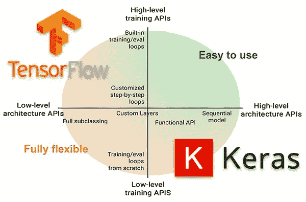
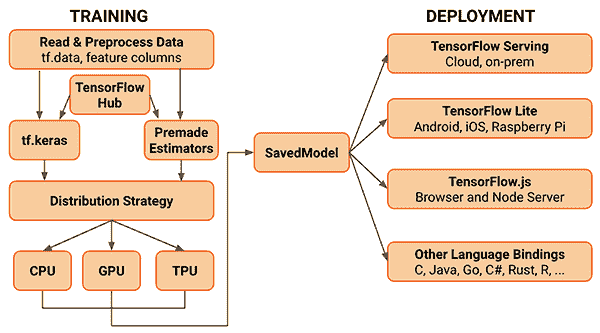

# TensorFlow 2.0 中的 tf.keras 和 Keras 有何区别？为什么以后一定要用 tf.keras？

> 原文：[`mp.weixin.qq.com/s?__biz=MzA3MzI4MjgzMw==&mid=2650775817&idx=4&sn=58476287a3a3550248ce0845a07590cd&chksm=871a6577b06dec61d398bab028d6290251a0155b141e4fbfbdb72f9aa64b4722249e6b44b414&scene=21#wechat_redirect`](http://mp.weixin.qq.com/s?__biz=MzA3MzI4MjgzMw==&mid=2650775817&idx=4&sn=58476287a3a3550248ce0845a07590cd&chksm=871a6577b06dec61d398bab028d6290251a0155b141e4fbfbdb72f9aa64b4722249e6b44b414&scene=21#wechat_redirect)

选自 pyimagesearch

**作者：****Adrian Rosebrock**

**参与：王子嘉、张倩**

> 随着 TensorFlow 2.0 的发布，不少开发者产生了一些疑惑：作为 Keras 用户，TensorFlow 2.0 的发布跟我有关系吗？TensorFlow 中的 tf.keras 和 Keras 有什么区别？我该用哪一个训练神经网络？在本文中，作者给出的答案是：你应该在以后所有的深度学习项目和实验中都使用 tf.keras。

通过本教程，你可以了解 Keras 和 tf.keras 之间的区别，以及 TensorFlow 2.0 的新特性。本教程的灵感来自于上周二我在 PyImageSearch 阅读器上收到的一封邮件。
一位名叫 Jeremiah 的读者问道：

> 你好，Adrian，我看到 TensorFlow 2.0 在几天前发布了。而且 TensorFlow 开发人员似乎正在推广 Keras，或者应该叫 tf.keras，希望将它作为 TensorFlow 2.0 中的推荐高级 API。但是我觉得 Keras 包应该是自己独立的呀？我在训练自己的网络时，会纠结于该使用哪个「Keras」。其次，有必要升级到 TensorFlow 2.0 吗？我在深度学习博客中看到了一些有关 TensorFlow 2.0 的教程，但是对于刚刚提到的那些困惑，我不知道该从何处着手去解决。你能给我一些启示吗？

其实，TensorFlow 2.0 发布之后，许多像 Jeremiah 这样的深度学习从业人员都在挠头：

*   作为 Keras 用户，TensorFlow 2.0 对我来说意味着什么？

*   我应该使用 keras 软件包来训练自己的神经网络，还是在 TensorFlow 2.0 中使用 tf.keras 子模块？

*   作为一个 Keras 用户，TensorFlow 2.0 有哪些值得关注的特性？

从 TensorFlow 1.x 到 TensorFlow 2.0 的过渡或多或少都会有点困难，至少在开始阶段是这样。但是如果你对它有足够多的了解，你的过渡期将会极其轻松。在本教程剩余的内容里，我将讨论 Keras 与 tf.keras 的相似之处，以及 TensorFlow 2.0 中值得注意的功能。**Keras vs tf.keras：****在 TensorFlow 2.0 中它们的区别是什么？**在本教程的第一部分，我们会讨论 Keras 和 TensorFlow 之间错综复杂的历史，包括它们是如何相互促进、共同成长、彼此滋养，从而达到今天这么受欢迎的程度。然后，我将说明为什么你应该在以后所有的深度学习项目和实验中都使用 tf.keras。再后面，我会讲述「计算后端」的概念以及 TensorFlow 的流行度如何使其成为 Keras 最流行的后端，从而为 Keras 集成到 TensorFlow 的 tf.keras 子模块中铺平了道路。最后，我会介绍一些 Keras 用户应该关心的、流行的 TensorFlow 2.0 特性，包括:

*   Sessions 和 eager execution

*   自动求导

*   模型和层的子类化

*   更好的多 GPU /分布式训练支持

TensorFlow 2.0 包含了一个完整的生态系统，包括 TensorFlow Lite（用于移动和嵌入式设备）和用于开发生产机器学习流水线的 TensorFlow Extended（用于部署生产模型）。**Keras 与 TensorFlow 错综复杂的关系***图 1：Keras 与 TensorFlow 有一段极其复杂的历史，读完这章，你就可以了解到由 Cliff 笔记记录的它们的爱情故事。你还会知道，在 TensorFlow 2.0 中，你应该使用 tf.keras，而不是单独的 keras 包。*Keras 和 TensorFlow 之间复杂纠缠的关系就像一对高中情侣的爱情故事，他们约会、分手，但最终找到了一个共处的方式。这个故事很长，有很多细节，有时甚至会有一些矛盾。与其回忆完整的爱情故事，不如来回顾一下 Cliffs 的笔记：

*   Keras 最初是由 Google AI 开发人员/研究人员 Francois Chollet 创建并开发的。

*   Francois 于 2015 年 3 月 27 日将 Keras 的第一个版本 commit 并 release 到他的 GitHub。

*   一开始，Francois 开发 Keras 是为了方便他自己的研究和实验。

*   但是，随着深度学习的普及，许多开发人员、程序员和机器学习从业人员都因其易于使用的 API 而涌向 Keras。

当时没有太多的深度学习库可用——那时候比较流行的库是 Torch、Theano 和 Caffe。这些库的问题是，用这些库就像在实验的时候用汇编或者 C++编程一样——乏味、耗时、效率低下。另一方面，Keras 非常容易使用，这可以让研究人员和开发人员的实验迭代更快。为了训练你自己的自定义神经网络，Keras 需要一个后端。后端是一个计算引擎——它可以构建网络的图和拓扑结构，运行优化器，并执行具体的数字运算。要理解后端的概念，可以试想你需要从头开始构建一个网站。你可以使用 PHP 编程语言和 SQL 数据库。这个 SQL 数据库就是是后端。你可以使用 MySQL，PostgreSQL 或者 SQL Server 作为你的数据库；但是，用于与数据库交互的 PHP 代码是不会变的（当然，前提是使用某种可以封装数据库层的 MVC 范例）。从本质上讲，PHP 并不关心正在使用哪个数据库，只要它符合 PHP 的规则即可。 Keras 也是如此。你可以把后台看作是你的数据库，Keras 是你用来访问数据库的编程语言。你可以把后端替换成任何你喜欢的后端，只要它遵守某些规则，你的代码就不需要更改。因此，你可以把 Keras 看作是一组用来简化深度学习操作的封装（abstraction）。（注：虽然 Keras 总是启用快速原型，但它对研究人员来说不够灵活。这种情况在 TensorFlow 2.0 中有所改变，本文后面将对此进行详细介绍)一开始，在 v1.1.0 之前，Keras 的默认后端都是 Theano。与此同时，Google 发布了 TensorFlow，这是一个用于机器学习和神经网络训练的符号数学库。Keras 开始支持 TensorFlow 作为后端。渐渐地，TensorFlow 成为最受欢迎的后端，这也就使得 TensorFlow 从 Keras v1.1.0 发行版开始成为 Keras 的默认后端。一般来说，一旦 TensorFlow 成为了 Keras 的默认后端，TensorFlow 和 Keras 的使用量会一起增长——没有 TensorFlow 的情况下就无法使用 Keras，所以如果你在系统上安装了 Keras，那么你也得安装 TensorFlow。同样的，TensorFlow 用户也越来越被高级 Keras API 的简单易用所吸引。tf.keras 是在 TensorFlow v1.10.0 中引入的，这是将 keras 直接集成到 TensorFlow 包中的第一步。tf.keras 软件包与你通过 pip 安装的 keras 软件包（即 pip install keras）是分开的，过去是这样，现在也是。为了确保兼容性，原始的 keras 包没有被包含在 tensorflow 中，因此它们的开发都很有序。然而，这种情况正在改变——当谷歌在 2019 年 6 月发布 TensorFlow 2.0 时，他们宣布 Keras 现在是 TensorFlow 的官方高级 API，用于快速简单的模型设计和训练。随着 Keras 2.3.0 的发布，Francois 声明：

*   这是 Keras 首个与 tf.keras 同步的版本；

*   这也是 Keras 支持多个后端（即 Theano，CNTK 等）的最终版本。

*   最重要的是，所有深度学习从业人员都应将其代码转换成 TensorFlow 2.0 和 tf.keras 软件包。

*   原始的 keras 软件包仍会接收 bug 并修复，但请向前看，你应该开始使用 tf.keras 了。

如你所见，Keras 与 TensorFlow 之间的有着悠久又错综复杂的历史。但是，对于 Keras 用户来说，读完这一部分需要了解到，你应该在未来的项目中开始使用 TensorFlow 2.0 和 tf.keras 了。**在未来的项目中开始使用 tf.keras***图 2：**TensorFlow 2.0 中，Keras 和 tf.keras 有什么区别呢*2019 年 9 月 17 日，Keras v2.3.0 正式发布，在这个版本中 Francois Chollet（Keras 的创建者和首席维护者）声明：

> Keras v2.3.0 是 Keras 第一个与 tf.keras 同步的版本，也将是最后一个支持除 TensorFlow 以外的后端（即 Theano，CNTK 等）的主要版本。最重要的是，深度学习从业人员应该开始使用 TensorFlow 2.0 和 tf.keras 软件包了。

对于大多数项目来说，你只需要改变一下你的 import 部分：在 import 部分加上 tensorflow 作为前缀:如果你使用的是自定义的训练 loop 或 Sessions，则必须要改动一下代码才能使用新的 GradientTape 功能，但是总的来说，这个改动相当容易。为了帮助你（自动地）将代码从 keras 更新为 tf.keras，Google 发布了一个名为 tf_upgrade_v2 的脚本。顾名思义，这个脚本可以分析你的代码并报告需要改动的行，该脚本甚至可以替你完成升级过程。TensorFlow 2.0 中更多自动更新代码的信息，请参考此链接：https://www.tensorflow.org/guide/upgrade。**Keras 的计算后端***图 3：**Keras 支持哪些计算后端？**直接在 TensorFlow 中使用 Keras 对 Keras 来说意味着什么？*正如我在本文前面提到的，Keras 依赖于计算后端这一概念。在构建模型图、数值计算等过程里，计算后端承担了所有的「重活」。而 Keras 作为一个基于这个计算引擎之上的封装，帮助深度学习的开发人员与实践者更简单地实现并训练他们的模型。一开始，Keras 将 Theano 作为它首选的计算后端——然后它又支持了其他的一些后端，包括 CNTK 和 mxnet 等等。然而，目前最流行的后端是 TensorFlow，而且它也最终成为了 Keras 的默认计算后端随着越来越多的 TensorFlow 用户开始使用 Keras 的简易高级 API，越来越多的 TensorFlow 开发人员开始考虑将 Keras 项目纳入 TensorFlow 中作为一个单独模块，并将其命名为 tf.keras。TensorFlow v1.10 是 TensorFlow 第一个在 tf.keras 中包含一个 keras 分支的版本。现在 TensorFlow 2.0 已发布，keras 和 tf.keras 已经处于同步状态，这意味着尽管 keras 和 tf.keras 仍是独立的两个项目，但是开发人员应该开始使用 tf.keras，因为 keras 软件包仅支持错误修复。正如 Keras 的创建者和维护者 Francois Chollet 所说：

> 这也是 Keras 支持多个后端的最后一个主要版本。长期来看，我们建议用户考虑开始将 TensorFlow 2.0 中的 Keras 代码切换为 tf.keras。它实现了与 Keras 2.3.0 相同的 API（因此这个改变应该像更改 Keras 导入语句一样容易），但是对 TensorFlow 用户来说，它具有许多优势，例如对 eager execution、distribution、TPU 训练的支持，以及通常来说对底层的 TensorFlow 与顶层概念（如「层」和「模型」）之间更好的集成度。它也会得到更好的维护。

如果你同时是 Keras 和 TensorFlow 用户，那就该开始考虑将代码切换到 TensorFlow 2.0 和 tf.keras 了。**TensorFlow 2.0 中的 Sessions 与 Eager Execution***图 4：Eager excution 是一种更具 Python 风格的动态计算图处理方式。TensorFlow 2.0 开始支持 eager execution（与 Pytorch 一样）。你可以在 TensorFlow 2.0 与 tf.keras 中使用 eager execution 与 sessions。*在 tf.keras 使用 Keras API 的 TensorFlow 1.10+用户应该对在训练模型时创建一个 Session 很熟悉：创建一个 Session 对象，并要求提前构建整个模型图确实有点麻烦，所以 TensorFlow 2.0 引入了 eager execution 的概念，这样一来代码被简化为：

eager execution 的好处是不需要提前构建整个模型图了。相反，运算会被立刻执行（即 eager execution），这也使得模型的构建以及调试变得更容易。有关 eager execution 的更多细节，以及在 TensorFlow 2.0 中的使用方法，见此链接：https://medium.com/coding-blocks/eager-execution-in-tensorflow-a-more-pythonic-way-of-building-models-e461810618c8 如果你知道 eager execution 与 sessions 的对比，以及它对模型训练速度的影响，见此链接：https://github.com/sayakpaul/tf - 2.0 - hacks/tree/master/speed%20comparison%20between%20tf%201.x%20and%20tf%202.0。**TensorFlow 2.0 中的自动求导与 GradientTape***图 5：TensorFlow 2.0 是如何更好地处理自定义层和损失函数的？答案就是自动求导和 GradientTape。(图源：https://twitter.com/fchollet/status/1158907168721997824)*如果你是个需要自定义网络层和损失函数的研究人员，那么你可能不喜欢 TensorFlow 1.x（理应如此）。至少可以说，TensorFlow 1.x 的自定义实现是很笨拙的——要改进的地方还有很多。随着 TensorFlow 2.0 的发布，情况开始发生变化——现在实现你自己的自定义损失函数要容易得多。其中一种使其变得简单的方法是使用自动求导和 GradientTape。要利用 GradientTape，我们需要做的就是创建我们的模型架构：定义我们的损失函数以及优化器：创建负责执行单个批更新的函数：然后就可以训练模型了：****
GradientTape 魔法为我们在后台进行导数的计算，使处理自定义损失和层变得容易得多。说到自定义层和模型的实现，请务必阅读下一节。**TensorFlow 2.0 中的模型和层子类化**TensorFlow 2.0 和 tf.keras 为我们提供了三种独立的方法来实现我们自己的自定义模型：

1.  序列化

2.  函数化

3.  子类化

序列化和函数化的示例都已经在 Keras 中存在很长时间了，但是许多深度学习从业者依然不了解子类化功能。下周我将针对这三种方法撰写专门的教程，但目前来说，先让我们看一下如何使用 TensorFlow 2.0、tf.keras 与模型子类化功能实现一个基于 LeNet 架构的简单 CNN。

注意 LeNet 类是如何成为 Model 的子类的。LeNet 的构造函数（即 init）定义了模型内部的每个单独层。然后，call 方法实现了前向传递，这使得你能够根据需要自定义前向传递的过程。使用模型子类化的好处是你的模型：

*   变得更加灵活。

*   使你能够实现并使用自定义损失函数。

而且，由于你的网络架构继承了 Model 类，因此你仍然可以调用.fit（）、. compile（）和.evaluate（）之类的方法，从而保证了大家熟悉的简易 Keras API 的使用。如果你想了解有关 LeNet 的更多信息，可以参考：https://www.pyimagesearch.com/2016/08/01/lenet-convolutional-neural-network-in-python/ **TensorFlow 2.0 开始支持更优的多 GPU 与分布式训练***图 6：**TensorFlow 2.0 在多 GPU 训练上是否更好了呢？是的，你只需要一个 MirroredStrategy。（图源：https://jhui.github.io/2017/03/07 tensorflow - gpu/）*TensorFlow 2.0 和 tf.keras 利用 MirroredStrategy 来提供更好的多 GPU 和分布式训练。如 TensorFlow 2.0 文档中所说，「MirroredStrategy 支持在一台机器的多个 GPU 上进行同步、分布式训练」。如果要使用多台机器（每台机器可能有多个 GPU），则应使用 MultiWorkerMirroredStrategy。或者，如果你使用 Google 的云进行训练，可以试试 TPUStrategy。不过现在，假设你正在使用一台具有多个 GPU 的机器，并且想在训练时同时使用所有 GPU，你可以先创建你的 MirroredStrategy：

然后你需要声明你的模型架构，并在 strategy 的 scope 内进行编译:然后你就可以在那里调用.fit 来训练模型了。基于你有多个 GPU，TensorFlow 会为你考虑如何使用多 GPU 进行训练的。**TF2.0 是一个生态系统，它包含了 TF 2.0、TF LITE、TFX、量化和部署**

*图 7：**TensorFlow 2.0 生态系统中有什么新特性吗？我应该用 Keras 还是 tf.keras?*TensorFlow 2.0 不仅仅是一个计算引擎和用于训练神经网络的深度学习库，它还有很多其他功能。我们可以使用 TensorFlow Lite (TF Lite) 来训练、优化和量化那些专门为资源受限的设备（如智能手机和 Raspberry Pi, Google Coral 等其他嵌入式设备）设计的模型。或者，如果你需要将模型部署到生产环境中，可以使用 TensorFlow Extended (TFX)，这是一个用于模型部署的端到端平台。一旦你的研究和实验完成，你就可以利用 TFX 为生产准备模型，并使用谷歌的生态系统扩展你的模型。有了 TensorFlow 2.0，我们在研究、实验、模型准备、量化和生产部署之间架起了高效的桥梁。我真的对 TensorFlow 2.0 的发布及其对深度学习圈的影响感到非常兴奋。**总结**学习完本教程，你应该学到了关于 Keras、tf.keras 和 TensorFlow 2.0 的知识。第一个要点是，使用 keras 软件包的深度学习从业人员应该开始在 TensorFlow 2.0 中使用 tf.keras。你不仅体验到了 TensorFlow 2.0 带来的加速和优化，而且还知道了 keras 包的最新版本（v2.3.0）将成为支持多个后端和特性的最后一个版本。未来，keras 软件包将只进行 bug 修复。以后的项目中，你应该认真考虑使用 tf.keras 和 TensorFlow 2.0。第二个收获应该是 TensorFlow 2.0 不仅是 GPU 加速的深度学习库。你不仅能够使用 TensorFlow 2.0 和 tf.keras 来训练自己的模型，还可以:

*   使用 TensorFlow Lite (TF Lite) 将这些模型部署到移动/嵌入式环境中；

*   使用 TensorFlow Extended (TF Extended) 将模型部署到生产环境中。

就我自己来说，我已经开始将原始的 keras 代码更新成 tf.keras 的版本了。我建议你也这么做。*原文链接：https://www.pyimagesearch.com/2019/10/21/keras-vs-tf-keras-whats-the-difference-in-tensorflow-2-0/***[机器之心「SOTA 模型」](http://mp.weixin.qq.com/s?__biz=MzA3MzI4MjgzMw==&mid=2650770891&idx=1&sn=25bde35991047a997337c8dd25350089&chksm=871a49b5b06dc0a36fc3407e3643550ef97f72b007e67c4f4be250bfd60c9fdc5389624569c0&scene=21#wechat_redirect)****：****22****大领域、127 个任务，机器学习 SOTA 研究一网打尽。******

点击阅读原文，立即访问。