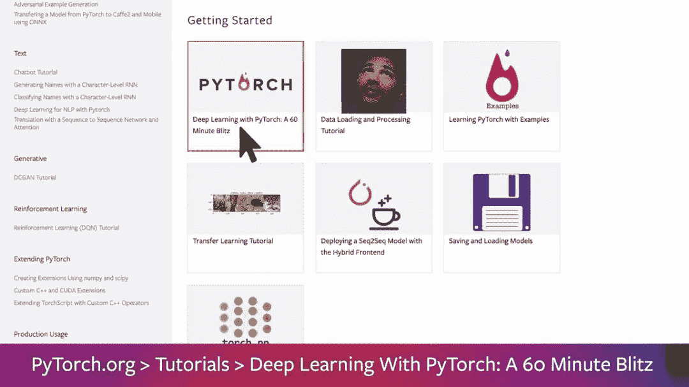
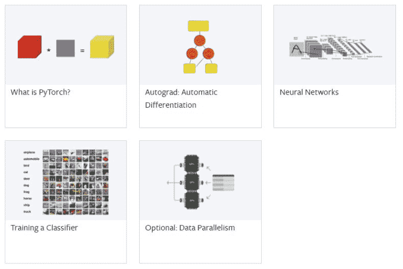
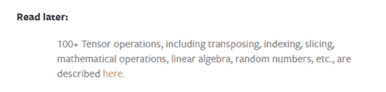
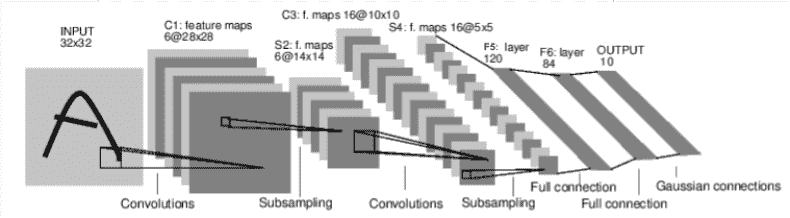
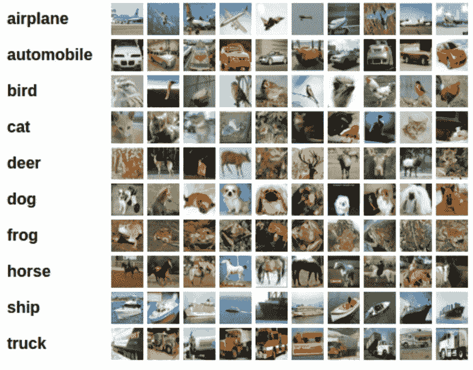
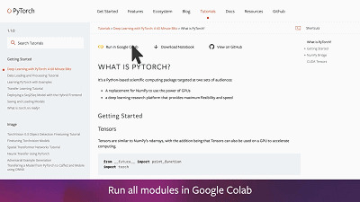

# 六十、分钟入门 PyTorch，官方教程手把手教你训练第一个深度学习模型

> 原文：[`mp.weixin.qq.com/s?__biz=MzA3MzI4MjgzMw==&mid=2650771841&idx=4&sn=26d1bfb8980ec6e32b5ef3ecf316ce89&chksm=871a55ffb06ddce9c6c862c76d4327cdfa74a9ad4d608edc1c9b74e2654d7f008ff396456253&scene=21#wechat_redirect`](http://mp.weixin.qq.com/s?__biz=MzA3MzI4MjgzMw==&mid=2650771841&idx=4&sn=26d1bfb8980ec6e32b5ef3ecf316ce89&chksm=871a55ffb06ddce9c6c862c76d4327cdfa74a9ad4d608edc1c9b74e2654d7f008ff396456253&scene=21#wechat_redirect)

机器之心报道

**参与：张倩**

> 近期的一份[调查报告](http://mp.weixin.qq.com/s?__biz=MzA3MzI4MjgzMw==&mid=2650771624&idx=3&sn=d6ec422d15c0e12b0790d3dd83d4729f&chksm=871a54d6b06dddc06349f9908bf49855baa60c448f4e060c7d209be709369e90b91a598b568c&scene=21#wechat_redirect)显示：PyTorch 已经力压 TensorFlow 成为各大顶会的主流深度学习框架。想发论文，不学 PyTorch 怎么行？那么，入门 PyTorch 深度学习需要多久？PyTorch 的一份官方教程表示：只需要 60 分钟。

教程链接：https://pytorch.org/tutorials/beginner/deep_learning_60min_blitz.html

这是一份非常简洁的学习材料，目标是让学习者了解 PyTorch 的 Tensor 库和神经网络，以及如何训练一个可以进行图像分类的神经网络。

虽然是入门课程，但也有一定门槛：课程参与者要具备 Numpy 基础知识。该教程共分为五节：

1.  PyTorch 简介

2.  Autograde：自动微分

3.  神经网络

4.  训练一个分类器

5.  数据并行

*本教程的五大板块。*第 1 节「PyTorch 简介」介绍了 PyTorch 的基本技术细节，如 Tensor、基本操作句法，还包括 Torch Tensor 与 Numpy 数组之间的转换、CUDA Tensor 等基础知识。如果想进一步了解 PyTorch 的 Tensor 操作信息，还可以按文中给出的链接找到相应教程，包括数学运算、线性代数、随机数等。第 2 节介绍了 PyTorch 中用于微分的包——Autograd。它是 PyTorch 神经网络的核心，为张量的所有操作提供了自动微分。为了更加直观地理解与之相关的术语，教程还给出了一些例子。第 3 节介绍了训练一个神经网络的常见步骤，包括定义具有一些可学习参数的神经网络、遍历输入数据集、通过神经网络处理输入、计算损失、将梯度传播回网络参数、更新网络权重等。

在学会定义网络、计算损失、更新权重之后，第 4 节开始讲解如何训练一个分类器。教程使用了 CIFAR10 数据集，将训练步骤分为 5 步：1\. 载入 CIFAR10 并将其标准化；2\. 定义一个卷积神经网络；3\. 定义损失函数和优化器；4\. 训练网络；5\. 在测试集上测试网络

*CIFAR10 数据集。*此外，这一节还讲解了如何在 GPU 上训练神经网络。如果想进一步加速训练过程，还可以选修第 5 节——数据并行，学习如何在多个 GPU 上训练网络。在这一教程中，每个小节都有 GoogleColab 链接，可以让学习者实时运行代码，获取实战经验。

如果想在本地运行文件，还可以下载 Notebook。

*参考链接：*

*   *https://pytorch.org/tutorials/beginner/deep_learning_60min_blitz.html*

*   *https://news.ycombinator.com/item?id=21240057*

*   *https://www.youtube.com/watch?v=u7x8RXwLKcA*

**[机器之心「SOTA 模型」](http://mp.weixin.qq.com/s?__biz=MzA3MzI4MjgzMw==&mid=2650770891&idx=1&sn=25bde35991047a997337c8dd25350089&chksm=871a49b5b06dc0a36fc3407e3643550ef97f72b007e67c4f4be250bfd60c9fdc5389624569c0&scene=21#wechat_redirect)****：****22****大领域、127 个任务，机器学习 SOTA 研究一网打尽。******

www.jiqizhixin.com/sota

PC 访问，体验更佳