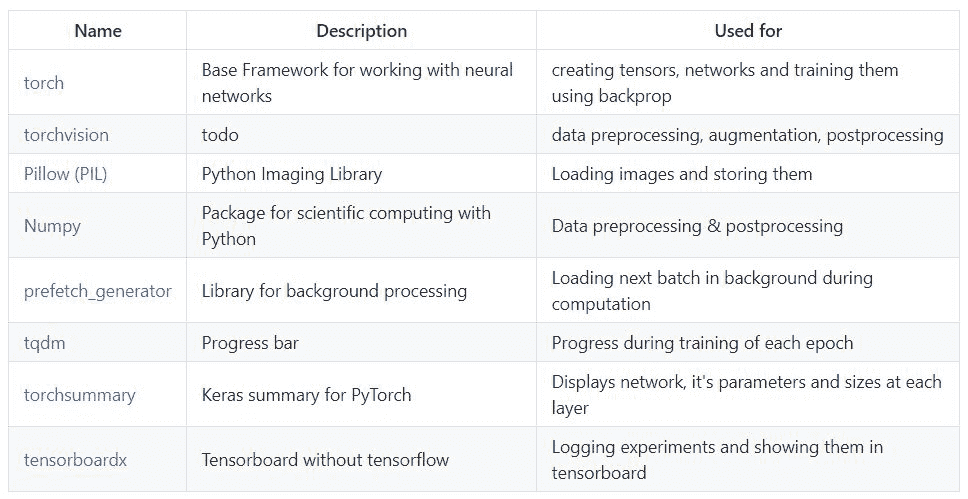

# PyTorch 最佳实践，怎样才能写出一手风格优美的代码

> 原文：[`mp.weixin.qq.com/s?__biz=MzA3MzI4MjgzMw==&mid=2650761302&idx=2&sn=700cb8c17433acd66ef02b88999c56ec&chksm=871aac28b06d253e99e89f4cadd4a9eec9d4787d799819a81ec1e51114717bf5e608e1fa7999&scene=21#wechat_redirect`](http://mp.weixin.qq.com/s?__biz=MzA3MzI4MjgzMw==&mid=2650761302&idx=2&sn=700cb8c17433acd66ef02b88999c56ec&chksm=871aac28b06d253e99e89f4cadd4a9eec9d4787d799819a81ec1e51114717bf5e608e1fa7999&scene=21#wechat_redirect)

选自 github

**机器之心编译**

**参与：Geek.ai、思源**

> PyTorch 是最优秀的深度学习框架之一，它简单优雅，非常适合入门。本文将介绍 PyTorch 的最佳实践和代码风格都是怎样的。

虽然这是一个非官方的 PyTorch 指南，但本文总结了一年多使用 PyTorch 框架的经验，尤其是用它开发深度学习相关工作的最优解决方案。请注意，我们分享的经验大多是从研究和实践角度出发的。

这是一个开发的项目，欢迎其它读者改进该文档：https://github.com/IgorSusmelj/pytorch-styleguide。

本文档主要由三个部分构成：首先，本文会简要清点 Python 中的最好装备。接着，本文会介绍一些使用 PyTorch 的技巧和建议。最后，我们分享了一些使用其它框架的见解和经验，这些框架通常帮助我们改进工作流。

**清点 Python 装备**

**建议使用 Python 3.6 以上版本**

根据我们的经验，我们推荐使用 Python 3.6 以上的版本，因为它们具有以下特性，这些特性可以使我们很容易写出简洁的代码：

*   自 Python 3.6 以后支持「typing」模块

*   自 Python 3.6 以后支持格式化字符串（f string）

**Python 风格指南**

我们试图遵循 Google 的 Python 编程风格。请参阅 Google 提供的优秀的 python 编码风格指南：

地址：https://github.com/google/styleguide/blob/gh-pages/pyguide.md。

在这里，我们会给出一个最常用命名规范小结：


**集成开发环境**

一般来说，我们建议使用 visual studio 或 PyCharm 这样的集成开发环境。而 VS Code 在相对轻量级的编辑器中提供语法高亮和自动补全功能，PyCharm 则拥有许多用于处理远程集群任务的高级特性。

**Jupyter Notebooks VS Python 脚本**

一般来说，我们建议使用 Jupyter Notebook 进行初步的探索，或尝试新的模型和代码。如果你想在更大的数据集上训练该模型，就应该使用 Python 脚本，因为在更大的数据集上，复现性更加重要。

我们推荐你采取下面的工作流程：

*   在开始的阶段，使用 Jupyter Notebook

*   对数据和模型进行探索

*   在 notebook 的单元中构建你的类/方法

*   将代码移植到 Python 脚本中

*   在服务器上训练/部署


**开发常备库**

常用的程序库有：



**文件组织**

不要将所有的层和模型放在同一个文件中。最好的做法是将最终的网络分离到独立的文件（networks.py）中，并将层、损失函数以及各种操作保存在各自的文件中（layers.py，losses.py，ops.py）。最终得到的模型（由一个或多个网络组成）应该用该模型的名称命名（例如，yolov3.py，DCGAN.py），且引用各个模块。

主程序、单独的训练和测试脚本应该只需要导入带有模型名字的 Python 文件。

**PyTorch 开发风格与技巧**

我们建议将网络分解为更小的可复用的片段。一个 nn.Module 网络包含各种操作或其它构建模块。损失函数也是包含在 nn.Module 内，因此它们可以被直接整合到网络中。

继承 nn.Module 的类必须拥有一个「forward」方法，它实现了各个层或操作的前向传导。

一个 nn.module 可以通过「self.net(input)」处理输入数据。在这里直接使用了对象的「call()」方法将输入数据传递给模块。

```py
output = self.net(input)
```

**PyTorch 环境下的一个简单网络**

使用下面的模式可以实现具有单个输入和输出的简单网络：

```py
class ConvBlock(nn.Module):
    def __init__(self):
        super(ConvBlock, self).__init__()
        block = [nn.Conv2d(...)]
        block += [nn.ReLU()]
        block += [nn.BatchNorm2d(...)]
        self.block = nn.Sequential(*block)

    def forward(self, x):
        return self.block(x)

class SimpleNetwork(nn.Module):
    def __init__(self, num_resnet_blocks=6):
        super(SimpleNetwork, self).__init__()
        # here we add the individual layers
        layers = [ConvBlock(...)]
        for i in range(num_resnet_blocks):
            layers += [ResBlock(...)]
        self.net = nn.Sequential(*layers)

    def forward(self, x):
        return self.net(x)
```

请注意以下几点：

*   我们复用了简单的循环构建模块（如卷积块 ConvBlocks），它们由相同的循环模式（卷积、激活函数、归一化）组成，并装入独立的 nn.Module 中。

*   我们构建了一个所需要层的列表，并最终使用「nn.Sequential()」将所有层级组合到了一个模型中。我们在 list 对象前使用「*」操作来展开它。

*   在前向传导过程中，我们直接使用输入数据运行模型。

**PyTorch 环境下的简单残差网络**

```py
class ResnetBlock(nn.Module):
    def __init__(self, dim, padding_type, norm_layer, use_dropout, use_bias):
        super(ResnetBlock, self).__init__()
        self.conv_block = self.build_conv_block(...)

    def build_conv_block(self, ...):
        conv_block = []

        conv_block += [nn.Conv2d(...),
                       norm_layer(...),
                       nn.ReLU()]
        if use_dropout:
            conv_block += [nn.Dropout(...)]

        conv_block += [nn.Conv2d(...),
                       norm_layer(...)]

        return nn.Sequential(*conv_block)

    def forward(self, x):
        out = x + self.conv_block(x)
        return ou
```

在这里，ResNet 模块的跳跃连接直接在前向传导过程中实现了，PyTorch 允许在前向传导过程中进行动态操作。

**PyTorch 环境下的带多个输出的网络**

对于有多个输出的网络（例如使用一个预训练好的 VGG 网络构建感知损失），我们使用以下模式:

```py
class Vgg19(torch.nn.Module):
  def __init__(self, requires_grad=False):
    super(Vgg19, self).__init__()
    vgg_pretrained_features = models.vgg19(pretrained=True).features
    self.slice1 = torch.nn.Sequential()
    self.slice2 = torch.nn.Sequential()
    self.slice3 = torch.nn.Sequential()

    for x in range(7):
        self.slice1.add_module(str(x), vgg_pretrained_features[x])
    for x in range(7, 21):
        self.slice2.add_module(str(x), vgg_pretrained_features[x])
    for x in range(21, 30):
        self.slice3.add_module(str(x), vgg_pretrained_features[x])
    if not requires_grad:
        for param in self.parameters():
            param.requires_grad = False

  def forward(self, x):
    h_relu1 = self.slice1(x)
    h_relu2 = self.slice2(h_relu1)        
    h_relu3 = self.slice3(h_relu2)        
    out = [h_relu1, h_relu2, h_relu3]
    return out
```

请注意以下几点：

*   我们使用由「torchvision」包提供的预训练模型

*   我们将一个网络切分成三个模块，每个模块由预训练模型中的层组成

*   我们通过设置「requires_grad = False」来固定网络权重

*   我们返回一个带有三个模块输出的 list

**自定义损失函数**

即使 PyTorch 已经具有了大量标准损失函数，你有时也可能需要创建自己的损失函数。为了做到这一点，你需要创建一个独立的「losses.py」文件，并且通过扩展「nn.Module」创建你的自定义损失函数：

```py
class CustomLoss(torch.nn.Module):

    def __init__(self):
        super(CustomLoss,self).__init__()

    def forward(self,x,y):
        loss = torch.mean((x - y)**2)
        return loss
```

**训练模型的最佳代码结构**

对于训练的最佳代码结构，我们需要使用以下两种模式：

*   使用 prefetch_generator 中的 BackgroundGenerator 来加载下一个批量数据

*   使用 tqdm 监控训练过程，并展示计算效率，这能帮助我们找到数据加载流程中的瓶颈

```py
# import statements
import torch
import torch.nn as nn
from torch.utils import data
...

# set flags / seeds
torch.backends.cudnn.benchmark = True
np.random.seed(1)
torch.manual_seed(1)
torch.cuda.manual_seed(1)
...

# Start with main code
if __name__ == '__main__':
    # argparse for additional flags for experiment
    parser = argparse.ArgumentParser(description="Train a network for ...")
    ...
    opt = parser.parse_args() 

    # add code for datasets (we always use train and validation/ test set)
    data_transforms = transforms.Compose([
        transforms.Resize((opt.img_size, opt.img_size)),
        transforms.RandomHorizontalFlip(),
        transforms.ToTensor(),
        transforms.Normalize((0.5, 0.5, 0.5), (0.5, 0.5, 0.5))
    ])

    train_dataset = datasets.ImageFolder(
        root=os.path.join(opt.path_to_data, "train"),
        transform=data_transforms)
    train_data_loader = data.DataLoader(train_dataset, ...)

    test_dataset = datasets.ImageFolder(
        root=os.path.join(opt.path_to_data, "test"),
        transform=data_transforms)
    test_data_loader = data.DataLoader(test_dataset ...)
    ...

    # instantiate network (which has been imported from *networks.py*)
    net = MyNetwork(...)
    ...

    # create losses (criterion in pytorch)
    criterion_L1 = torch.nn.L1Loss()
    ...

    # if running on GPU and we want to use cuda move model there
    use_cuda = torch.cuda.is_available()
    if use_cuda:
        net = net.cuda()
        ...

    # create optimizers
    optim = torch.optim.Adam(net.parameters(), lr=opt.lr)
    ...

    # load checkpoint if needed/ wanted
    start_n_iter = 0
    start_epoch = 0
    if opt.resume:
        ckpt = load_checkpoint(opt.path_to_checkpoint) # custom method for loading last checkpoint
        net.load_state_dict(ckpt['net'])
        start_epoch = ckpt['epoch']
        start_n_iter = ckpt['n_iter']
        optim.load_state_dict(ckpt['optim'])
        print("last checkpoint restored")
        ...

    # if we want to run experiment on multiple GPUs we move the models there
    net = torch.nn.DataParallel(net)
    ...

    # typically we use tensorboardX to keep track of experiments
    writer = SummaryWriter(...)

    # now we start the main loop
    n_iter = start_n_iter
    for epoch in range(start_epoch, opt.epochs):
        # set models to train mode
        net.train()
        ...

        # use prefetch_generator and tqdm for iterating through data
        pbar = tqdm(enumerate(BackgroundGenerator(train_data_loader, ...)),
                    total=len(train_data_loader))
        start_time = time.time()

        # for loop going through dataset
        for i, data in pbar:
            # data preparation
            img, label = data
            if use_cuda:
                img = img.cuda()
                label = label.cuda()
            ...

            # It's very good practice to keep track of preparation time and computation time using tqdm to find any issues in your dataloader
            prepare_time = start_time-time.time()

            # forward and backward pass
            optim.zero_grad()
            ...
            loss.backward()
            optim.step()
            ...

            # udpate tensorboardX
            writer.add_scalar(..., n_iter)
            ...

            # compute computation time and *compute_efficiency*
            process_time = start_time-time.time()-prepare_time
            pbar.set_description("Compute efficiency: {:.2f}, epoch: {}/{}:".format(
                process_time/(process_time+prepare_time), epoch, opt.epochs))
            start_time = time.time()

        # maybe do a test pass every x epochs
        if epoch % x == x-1:
            # bring models to evaluation mode
            net.eval()
            ...
            #do some tests
            pbar = tqdm(enumerate(BackgroundGenerator(test_data_loader, ...)),
                    total=len(test_data_loader)) 
            for i, data in pbar:
                ...

            # save checkpoint if needed
            ...
```

PyTorch 的多 GPU 训练

PyTorch 中有两种使用多 GPU 进行训练的模式。

根据我们的经验，这两种模式都是有效的。然而，第一种方法得到的结果更好、需要的代码更少。由于第二种方法中的 GPU 间的通信更少，似乎具有轻微的性能优势。

**对每个网络输入的 batch 进行切分**

最常见的一种做法是直接将所有网络的输入切分为不同的批量数据，并分配给各个 GPU。

这样一来，在 1 个 GPU 上运行批量大小为 64 的模型，在 2 个 GPU 上运行时，每个 batch 的大小就变成了 32。这个过程可以使用「nn.DataParallel(model)」包装器自动完成。

**将所有网络打包到一个超级网络中，并对输入 batch 进行切分**

这种模式不太常用。下面的代码仓库向大家展示了 Nvidia 实现的 pix2pixHD，它有这种方法的实现。

地址：https://github.com/NVIDIA/pix2pixHD

**PyTorch 中该做和不该做的**

**在「nn.Module」的「forward」方法中避免使用 Numpy 代码**

Numpy 是在 CPU 上运行的，它比 torch 的代码运行得要慢一些。由于 torch 的开发思路与 numpy 相似，所以大多数 Numpy 中的函数已经在 PyTorch 中得到了支持。

**将「DataLoader」从主程序的代码中分离**

载入数据的工作流程应该独立于你的主训练程序代码。PyTorch 使用「background」进程更加高效地载入数据，而不会干扰到主训练进程。

**不要在每一步中都记录结果**

通常而言，我们要训练我们的模型好几千步。因此，为了减小计算开销，每隔 n 步对损失和其它的计算结果进行记录就足够了。尤其是，在训练过程中将中间结果保存成图像，这种开销是非常大的。

**使用命令行参数**

使用命令行参数设置代码执行时使用的参数（batch 的大小、学习率等）非常方便。一个简单的实验参数跟踪方法，即直接把从「parse_args」接收到的字典（dict 数据）打印出来：

```py
# saves arguments to config.txt file
opt = parser.parse_args()with open("config.txt", "w") as f:
    f.write(opt.__str__())
```

**如果可能的话，请使用「Use .detach()」从计算图中释放张量**

为了实现自动微分，PyTorch 会跟踪所有涉及张量的操作。请使用「.detach()」来防止记录不必要的操作。

**使用「.item()」打印出标量张量**

你可以直接打印变量。然而，我们建议你使用「variable.detach()」或「variable.item()」。在早期版本的 PyTorch（< 0.4）中，你必须使用「.data」访问变量中的张量值。

**使用「call」方法代替「nn.Module」中的「forward」方法**

这两种方式并不完全相同，正如下面的 GitHub 问题单所指出的：https://github.com/IgorSusmelj/pytorch-styleguide/issues/3 ********

```py
output = self.net.forward(input)
# they are not equal!
output = self.net(input)
```

*原文链接：**https://github.com/IgorSusmelj/pytorch-styleguide*

****本文由机器之心编译，**转载请联系本公众号获得授权****。**

✄------------------------------------------------

**加入机器之心（全职记者 / 实习生）：hr@jiqizhixin.com**

**投稿或寻求报道：**content**@jiqizhixin.com**

**广告 & 商务合作：bd@jiqizhixin.com**