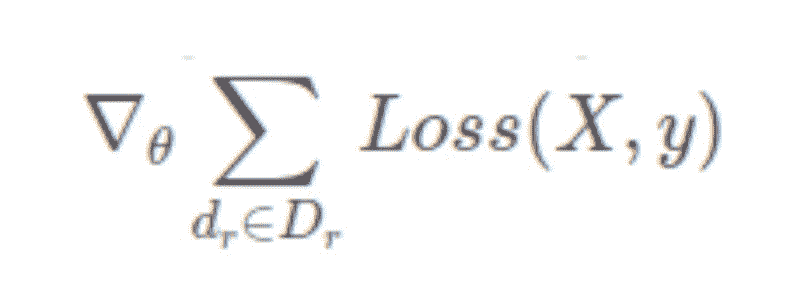
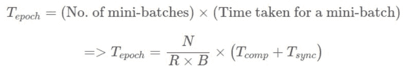

# 分布式入门，怎样用 PyTorch 实现多 GPU 分布式训练

> 原文：[`mp.weixin.qq.com/s?__biz=MzA3MzI4MjgzMw==&mid=2650761440&idx=2&sn=440e9ad832ba6c8cb20d36c5ff3724f1&chksm=871aac9eb06d258833f93894d9224b1afff223a5e09998d1c890f453ba7f92419c56ae31b806&scene=21#wechat_redirect`](http://mp.weixin.qq.com/s?__biz=MzA3MzI4MjgzMw==&mid=2650761440&idx=2&sn=440e9ad832ba6c8cb20d36c5ff3724f1&chksm=871aac9eb06d258833f93894d9224b1afff223a5e09998d1c890f453ba7f92419c56ae31b806&scene=21#wechat_redirect)

选自 Medium

**作者：Ayan Das**

**机器之心编译**

**参与：Nurhachu Null、路**

> 这篇文章旨在阐述训练大规模深度学习模型时的分布式计算思想。

具体来讲，本文首先介绍了分布式计算的基本概念，以及分布式计算如何用于深度学习。然后，列举了配置处理分布式应用的环境的标准需求（硬件和软件）。最后，为了提供亲身实践的经验，本文从理论角度和实现的角度演示了一个用于训练深度学习模型的分布式算法（同步随机梯度下降，synchronous SGD）。

**何为分布式计算**

分布式计算指的是一种编写程序的方式，它利用网络中多个连接的不同组件。通常，大规模计算通过以这种方式布置计算机来实现，这些计算机能够并行地处理高密度的数值运算。在分布式计算的术语中，这些计算机通常被称为节点（node），这些节点的集合就是集群。这些节点一般是通过以太网连接的，但是其他的高带宽网络也可以利用分布式架构的优势。

**深度学习如何从分布式计算中受益？**

作为深度学习的主力，神经网络出现在文献中已经有一段时间了，但是直到最近，才有人完全利用它的潜力。神经网络异军突起的主要原因之一就是巨大的算力，这正是我们在本文中要写的内容。深度学习需要基于大量数据训练深度神经网络，它包含大量的参数。分布式计算是能够充分利用现代硬件的完美工具。下面是它的核心思想：

精心设计的分布式算法可以做到：

1.  为了连贯处理，在多个节点上「分配」计算（深度学习模型中的前向传播和反向传播）和数据。

2.  为了实现一致性，它能够在多个节点上建立一种有效的「同步」。

**MPI：分布式计算标准**

你还必须习惯另一个术语——消息传递接口（MPI）。MPI 几乎是所有分布式计算的主力。MPI 是一个开放标准，它定义了一系列关于节点互相通信的规则，MPI 也是一个编程模型/API。MPI 不是一款软件或者工具，它是一种规范。

1991 年夏天，一批来自学术界和产业界的组织和个人聚在一起，最终创建了 MPI 论坛（MPI Forum）。该论坛达成了一个共识，为一个库起草了语法和语义规范，为不同硬件提供商提出可移植/灵活/优化的实现提供指导。多家硬件提供商都有自己的 MPI 实现——OpenMPI、MPICH、MVAPICH、Intel MPI 等。

在这份教程中，我们将会使用 Intel MPI，因为它十分高效，而且也针对 Intel 平台做了优化。原始的 Intel MPI 是一个 C 语言库，并且级别非常低。

**配置**

对分布式系统而言，合适的配置是非常重要的。如果没有合适的硬件和网络布置，即使你对它的编程模型有着概念上的理解，也是没多大用的。下面是需要做的关键布置：

1.  通常需要由一系列通过通用网络互联形成集群的节点。推荐使用高端服务器作为节点，以及高带宽的网络，例如 InfiniBand。

2.  集群中的所有节点都需要具有完全相同用户名的 Linux 系统。

3.  节点之间必须拥有无密码 SSH 连接，这对无缝连接至关重要。

4.  必须安装一种 MPI 实现。本文只聚焦于 Intel MPI。

5.  需要一个共同的文件系统，它对所有的节点都是可见的，而且分布式应用必须驻留在上面。网络文件系统（NFS，Network Filesystem）是实现此目的一种方式。

**并行策略的类型**

并行深度学习模型有两种流行的方式：

1.  模型并行

2.  数据并行

**模型并行**

模型并行指的是一个模型从逻辑上被分成了几个部分（例如，一些层在一部分，其他层在另一部分），然后把它们部署在不同的硬件/设备上。

尽管从执行时间上来看，将模型的不同部分部署在不同设备上确实有好处，但是它通常是出于避免内存限制才使用。具有特别多参数的模型会受益于这种并行策略，因为这类模型需要很高的内存占用，很难适应到单个系统。

**数据并行**

另一方面，数据并行指的是，通过位于不同硬件/设备上的同一个网络的多个副本来处理数据的不同批（batch）。不同于模型并行，每个副本可能是整个网络，而不仅仅是一部分。

正如你可能猜到的，这种策略随着数据的增长可以很好地扩展。但是，由于整个网络必须部署在一个设备上，因此可能无法帮助到具有高内存占用的模型。下图应该可以说清楚这个问题。


*模型并行 VS 数据并行*

实际上，在大组织里，为了执行生产质量的深度学习训练算法，数据并行更加流行也更加常用。所以，本教程主要介绍数据并行。

**torch.distributed API**

PyTorch 提供了一个非常优雅并且易于使用的 API，作为用 C 语言写的底层 MPI 库的接口。PyTorch 需要从源码编译，并且必须与安装在系统中的 Intel MPI 进行链接。我们现在就看一下 torch.distributed 的基本用法，以及如何执行它。

```py
# filename 'ptdist.py'
import torch
import torch.distributed as dist

def main(rank, world):
    if rank == 0:
        x = torch.tensor([1., -1.]) # Tensor of interest
        dist.send(x, dst=1)
        print('Rank-0 has sent the following tensor to Rank-1')
        print(x)
    else:
        z = torch.tensor([0., 0.]) # A holder for recieving the tensor
        dist.recv(z, src=0)
        print('Rank-1 has recieved the following tensor from Rank-0')
        print(z)

if __name__ == '__main__':
    dist.init_process_group(backend='mpi')
    main(dist.get_rank(), dist.get_world_size()) 
```

*点对点通信*

用 mpiexec 执行上面的代码，能够得到一个分布式进程调度器，基于任何标准 MPI 实现都可以，结果如下：

```py
cluster@miriad2a:~/nfs$ mpiexec -n 2 -ppn 1 -hosts miriad2a,miriad2b python ptdist.py
Rank-0 has sent the following tensor to Rank-1
tensor([ 1., -1.])
Rank-1 has recieved the following tensor from Rank-0
tensor([ 1., -1.]) 
```

1.  第一行要被执行的是 dist.init_process_group(backend)，它基本上设置了参与节点之间的内部通信通道。它使用了一个参数来指定使用哪个后端（backend）。因为我们完全使用 MPI，所以在我们的例子中 backend='mpi'。也有其他的后端（例如 TCP、Gloo、NCCL）。

2.  需要检索的两个参数——world size 和 rank。World 指的是在特定 mpiexec 调用环境中所有节点的集合（参见 mpiexec 中的 -hosts flag）。rank 是由 MPI 运行时为每一个进程分配的唯一整数。它从 0 开始。它们在 -hosts 中被指定的顺序用于分配数值。所以，在这个例子中，节点「miriad2a」上的进程会被赋值 Rank 0，节点「miriad2b」上的进程会被赋值为 Rank 1.

3.  x 是 Rank 0 打算发送到 Rank 1 的张量，通过 dist.send(x, dst=1) 完成。

4.  z 是 Rank 1 在接收到张量之前就创建的东西。我们需要一个早就创建好的同维度的张量作为接收传送来的张量的占位符。z 的值最终会被 x 替代。

5.  与 dist.send(..) 类似，负责接收的对应函数是 dist.recv(z, src=0)，它将张量接收到 z。

**通信集体**

我们在上一部分看到的是一个「点对点」通信的例子，在给定的环境中，rank(s) 将数据发送到特定的 rank(s)。尽管这种通信是有用的，因为它对通信提供了细粒度的控制，但是还有其他被经常使用的标准通信模式，叫作集体（collectives）。下面介绍了 Synchronous SGD 算法中我们感兴趣的一个集体——all-reduce 集体。

**ALL-REDUCE 集体**

All-reduce 是一种同步通信方式，所有的 ranks 都被执行了一个 reduction 运算，并且得到的结果对所有的 ranks 都是可见的。下图介绍了这个思想（将求和作为 reduction 运算）。


*all-reduce 集体*

```py
def main(rank, world):
    if rank == 0:
        x = torch.tensor([1.])
    elif rank == 1:
        x = torch.tensor([2.])
    elif rank == 2:
        x = torch.tensor([-3.])

    dist.all_reduce(x, op=dist.reduce_op.SUM)
    print('Rank {} has {}'.format(rank, x))

if __name__ == '__main__':
    dist.init_process_group(backend='mpi')
    main(dist.get_rank(), dist.get_world_size()) 
```

*PyTorch 中 all-reduce 集体的基本用法*

在 world of 3 环境中启动时，结果如下：

```py
cluster@miriad2a:~/nfs$ mpiexec -n 3 -ppn 1 -hosts miriad2a,miriad2b,miriad2c python ptdist.py
Rank 1 has tensor([0.])
Rank 0 has tensor([0.])
Rank 2 has tensor([0.]) 
```

1.  if rank == <some rank> … elif 是我们在分布式计算中多次遇到的模式。在这个例子中，它被用来在不同的 rank 上创建张量。

2.  它们一起执行了 all-reduce（可以看见，dist.all_reduce(..) 在 if … elif block 逻辑块的外部），求和 (dist.reduce_op.SUM) 作为 reduction 运算。

3.  将来自每个 rank 的 x 求和，再把得到的求和结果放置在每个 rank 的 x 内。

**转向深度学习**

假设读者熟知标准的随机梯度下降算法（SGD），该算法常用于训练深度学习模型。我们现在看到的是 SGD 的一个变体——同步 SGD（synchronous SGD），它利用 all-reduce collective 来进行扩展。我们先从标准 SGD 的数学公式开始吧。

其中 D 是一个样本集合（mini-batch），θ 是所有参数的集合，λ 是学习率，Loss(X, y) 是某个损失函数在 D 中所有样本上的均值。

同步 SGD 所依赖的核心技巧是将更新规则中的求和在更小的 (mini)batch 子集上进行分割。D 被分割成 R 个子集 D₁, D₂, . .（推荐每个子集具有相同数量的样本），所以  将标准的 SGD 更新公式中的求和进行分割，得到：


现在，因为梯度算子在求和算子上是分布式的，所以我们得到：


**我们从中得到了什么？**

看一下上面方程中单独的梯度项（方括号里面）。它们现在可以被独立地计算，然后加起来得到原始的梯度，而且没有任何损失/近似。这就是数据并行。下面是整个过程：

1.  将整个数据集分成 R 个等大的数据块（子集）。这里的字母 R 代表的是 replica（副本）。

2.  使用 MPI 启动 R 个进程/rank，将每个进程绑定到一个数据块上。

3.  让每个 rank 使用大小为 B 的 mini-batch（dᵣ）（dᵣ来自该 rank 分配到的数据块 D_r）计算梯度，即 rank r 计算  。

4.  将所有 rank 的梯度进行求和，然后将得到的梯度对每个 rank 可见，再进行进一步处理。

最后一点就是 all-reduce 算法。所以，每次在所有 rank 使用大小为 B 的 mini-batch（dᵣ）计算完梯度以后，都必须执行 all-reduce。需要注意的一点是，将全部 R 个 rank（使用大小为 B 的 mini-batch 计算出）的梯度相加之后会得到一个有效的批大小：

下面是实现的关键部分（没有展示样板代码）：

```py
model = LeNet()
# first synchronization of initial weights
sync_initial_weights(model, rank, world_size)

optimizer = optim.SGD(model.parameters(), lr=1e-3, momentum=0.85)

model.train()
for epoch in range(1, epochs + 1):
    for data, target in train_loader:
        optimizer.zero_grad()
        output = model(data)
        loss = F.nll_loss(output, target)
        loss.backward()

        # The all-reduce on gradients
        sync_gradients(model, rank, world_size)

        optimizer.step()

def sync_initial_weights(model, rank, world_size):
    for param in model.parameters():
        if rank == 0:
            # Rank 0 is sending it's own weight
            # to all it's siblings (1 to world_size)
            for sibling in range(1, world_size):
                dist.send(param.data, dst=sibling)
        else:
            # Siblings must recieve the parameters
            dist.recv(param.data, src=0)

def sync_gradients(model, rank, world_size):
    for param in model.parameters():
        dist.all_reduce(param.grad.data, op=dist.reduce_op.SUM) 
```

1.  全部 R 个 rank 都使用随机权重创建自己的模型副本。

2.  单个具有随机权重的副本可能导致在初始的时候不同步。推荐在所有的副本上同步初始权重，sync_initial_weights(..) 就是在做这件事。让任何一个 rank 将自己的权重发送到它的兄弟 rank，兄弟 rank 必须接收这些权重并用来初始化它们自身。

3.  从每个 rank 对应的数据部分取出一个 mini-batch（大小为 B），计算前向和反向传递（梯度）。作为配置的一部分，这里需要重点注意的一点是：所有的进程/rank 应该让自己那部分数据可见（通常是在自己的硬盘上或者在共享文件系统中）。

4.  把求和作为 reduction 运算，对每一个副本上的梯度执行 all-reduce 集体。sync_gradients(..) 会完成梯度同步。

5.  梯度同步之后，每个副本能够在自己的权重上独立地执行标准的 SGD 更新。optimizer.step() 正常运行。

现在问题来了：我们如何确保独立的更新保持同步？

我们看一下更新方程的首次更新：

上面的第 2 点和第 4 点保证每个初始权重和梯度都是同步的。显然，它们的线性组合也是同步的（λ 是常数）。以后的所有更新都是类似的逻辑，因此也是同步的。

**性能对比**

所有分布式算法的最大瓶颈就是同步。只有当同步时间显著小于计算时间的时候，分布式算法才是有益的。让我们在标准 SGD 和同步 SGD 之间做一个简单的对比，来看一下什么时候后者是比较好的。

定义：我们假设整个数据集的规模为 N。网络处理大小为 B 的 mini-batch 需要花费时间 Tcomp。在分布式情况下，all-reduce 同步花费的时间为 Tsync。

对于非分布式（标准）SGD，每个 epoch 花费的时间为：


对于同步 SGD，每个 epoch 花费的时间为：



因此，对于分布式环境，为了与非分布式环境相比有显著的优势，我们需要满足：


我们可以调整影响上述不等式的三个因子，从分布式算法中得到更多的好处。

1.  通过以高带宽的快速网络连接节点，来减小 Tsync。

2.  通过增加批大小 B，来增加 Tcomp。

3.  通过连接更多的节点和拥有更多的副本来增加 R。

本文清晰地介绍了深度学习环境中的分布式计算的核心思想。尽管同步 SGD 很流行，但是也有其他被频繁使用的分布式算法（如异步 SGD 及其变体）。然而，更重要的是能够以并行的方式来思考深度学习方法。请注意，不是所有的算法都可以开箱即用地并行化，有的需要做一些近似处理，这破坏了原算法给出的理论保证。能否高效处理这些近似，取决于算法的设计者和实现者。****

*原文地址：https://medium.com/intel-student-ambassadors/distributed-training-of-deep-learning-models-with-pytorch-1123fa538848*

****本文为机器之心编译，**转载请联系本公众号获得授权****。**

✄------------------------------------------------

**加入机器之心（全职记者 / 实习生）：hr@jiqizhixin.com**

**投稿或寻求报道：**content**@jiqizhixin.com**

**广告 & 商务合作：bd@jiqizhixin.com**