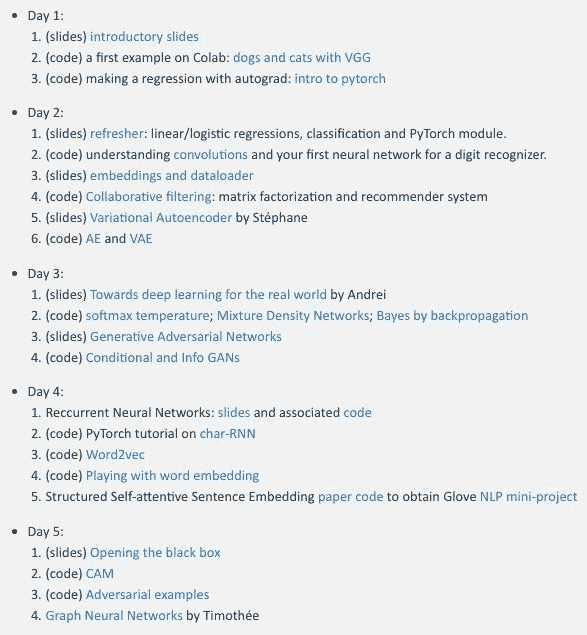

# 五天入门深度学习，这里有一份 PyTorch 实战课程

> 原文：[`mp.weixin.qq.com/s?__biz=MzA3MzI4MjgzMw==&mid=2650765277&idx=4&sn=de050d07eaef8c340ed47763a2ac9674&chksm=871ab3a3b06d3ab5ce0343233e098060461dd563c7adba6f5f366d5a9a7eda7cbc60a371d16f&scene=21#wechat_redirect`](http://mp.weixin.qq.com/s?__biz=MzA3MzI4MjgzMw==&mid=2650765277&idx=4&sn=de050d07eaef8c340ed47763a2ac9674&chksm=871ab3a3b06d3ab5ce0343233e098060461dd563c7adba6f5f366d5a9a7eda7cbc60a371d16f&scene=21#wechat_redirect)

机器之心整理

**参与：李亚洲、路**

> 这是一门五天入门深度学习的实战课程。

想入门深度学习的小伙伴有福了！dataflowr 最近推出了一门五天初步掌握深度学习的实战教程（实战使用 PyTorch 框架），有知识点有实例有代码，值得一看。该课程的创建和维护者是法国国立计算机及自动化研究院（INRIA）的研究员 Marc Lelarge。

*   课程地址：https://mlelarge.github.io/dataflowr-web/cea_edf_inria.html

*   代码地址：https://github.com/mlelarge/dataflowr

该课程的教学目标是学习者能够了解：

*   何时何地应该使用深度学习

*   深度学习的工作原理

*   深度学习前沿研究

此外，该课程还希望学习者能够自己动手做深度学习项目。

这门实战课程要求学习者积极参与，亲自动手实践，其使用的深度学习框架为 PyTorch。

**课程目录**

**第一天：**

*   （PPT）课程简介；

*   （代码）示例 1：在 Colab 上创建 VGG 模型参加 Kaggle 猫狗识别竞赛；

*   （代码）用 Autograd 做回归：PyTorch 简介。

**第二天：**

*   （PPT）线性/logistic 回归、分类和 Pytorch 模块；

*   （代码）理解卷积，创建首个数字识别神经网络；

*   （PPT）嵌入和数据加载器（DataLoader）；

*   （代码）协作过滤算法：矩阵因子分解和推荐系统；

*   （PPT）变分自编码器；

*   （代码）自编码器和变分自编码器。

**第三天：**

*   （PPT）用于真实世界场景的深度学习；

*   （代码）Softmax 温度、混合密度网络、通过反向传播的贝叶斯；

*   （PPT）生成对抗网络；

*   （代码）条件 GAN 和 InfoGAN。

**第四天：**

*   循环神经网络：PPT 及相关代码；

*   （代码）char-RNN 的 PyTorch 教程；

*   （代码）Word2vec；

*   （代码）试玩词嵌入；

*   了解结构化自注意句子嵌入的论文和代码，从而掌握 Glove NLP 小项目。

**第五天：**

*   （PPT）打开 AI 黑箱；

*   （代码）类激活图（CAM）；

*   （代码）对抗样本；

*   图神经网络。

希望对读者有所帮助。**********

********本****文为机器之心整理，**转载请联系本公众号获得授权****。**

✄------------------------------------------------

**加入机器之心（全职记者 / 实习生）：hr@jiqizhixin.com**

**投稿或寻求报道：**content**@jiqizhixin.com**

**广告 & 商务合作：bd@jiqizhixin.com**