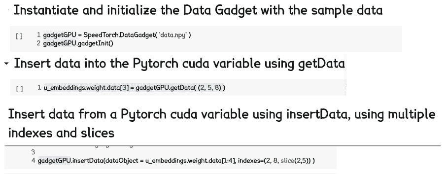
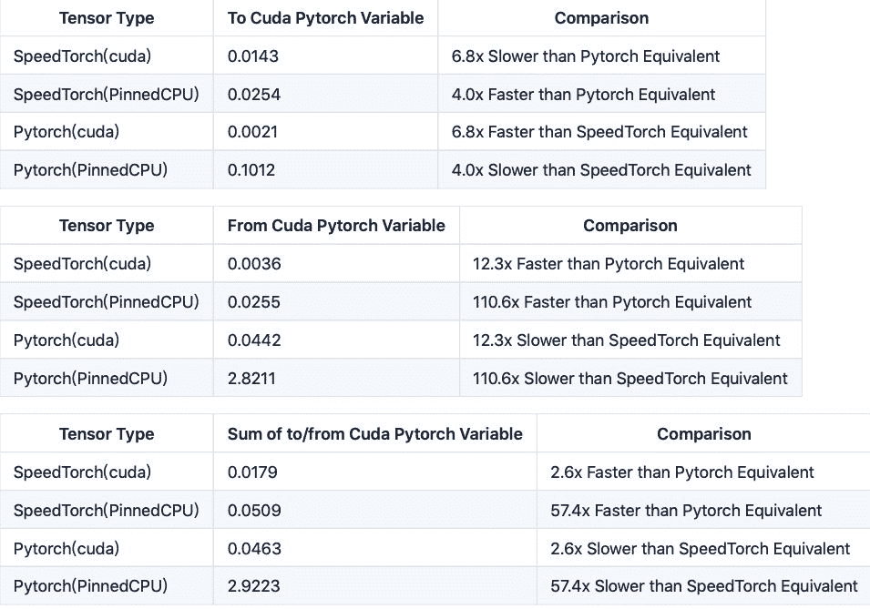

# 超原版速度 110 倍，针对 PyTorch 的 CPU 到 GPU 张量迁移工具开源

> 原文：[`mp.weixin.qq.com/s?__biz=MzA3MzI4MjgzMw==&mid=2650770141&idx=2&sn=66ff38ca4e8a153c769ce8069def395f&chksm=871a4ea3b06dc7b5b06c44e3aa2efced1a32a92b9157885924574fa15e6b66ddc7a1d52eeb4a&scene=21#wechat_redirect`](http://mp.weixin.qq.com/s?__biz=MzA3MzI4MjgzMw==&mid=2650770141&idx=2&sn=66ff38ca4e8a153c769ce8069def395f&chksm=871a4ea3b06dc7b5b06c44e3aa2efced1a32a92b9157885924574fa15e6b66ddc7a1d52eeb4a&scene=21#wechat_redirect)

选自 Github

**作者：Santosh Gupta**

**机器之心编译**

**参与：杜伟、一鸣、泽南**

> 机器学习中，有一个限制速度的环节，那就是从 CPU 到 GPU 之间的张量迁移。很多计算只能在 CPU 上进行，然后迁移到 GPU 进行后续的训练工作，因此迁移中如果速度太慢，则会拖累整个模型的训练效率。近日，有一位开发者开源了针对 PyTorch 的 CPU->GPU 迁移工具，相比原版加速了 110 倍之多。

神经网络的训练中往往需要进行很多环节的加速，这就是为什么我们逐渐使用 GPU 替代 CPU、使用各种各样的算法来加速机器学习过程。但是，在很多情况下，GPU 并不能完成 CPU 进行的很多操作。比如训练词嵌入时，计算是在 CPU 上进行的，然后需要将训练好的词嵌入转移到 GPU 上进行训练。

在这一过程中，张量迁移可能会变得非常缓慢，这成为了机器学习训练的一个瓶颈。

面对这样的问题，在很多优化方法中，就是将操作尽可能放在 GPU 上（如直接在 GPU 上进行数据预处理、词嵌入等的操作），并努力减少两者之间的数据交互，因为这些环节都很费时。机器之心就曾报道过这样的一个教程，将数据预处理放在了 GPU 上，减少了不少时间。

以上事例说明，如果能够做好 CPU 和 GPU 之间的迁移，则可以帮助开发者更好地优化机器学习模型，使 CPU、GPU 等硬件更好地完成自己的工作。

近日，有一位开发者就开源了一个名为 SpeedTorch 的工具。这一工具库可以实现高达 110 倍的 CPU 到 GPU 迁移加速。

项目地址：https://github.com/Santosh-Gupta/SpeedTorch

**项目背景**

作者表示，最初想要创建 SpeedTorch 库是为了帮助训练大量的嵌入向量，而 GPU 在 RAM 保存这些嵌入时可能有困难。为了解决这个问题，他发现在 CPU 上托管一些此类嵌入有助于在 GPU 上保存它们。嵌入系统采用稀疏训练，只有一部分参数参与前馈/更新操作，剩余参数处于闲置状态。所以作者想到，为什么不在训练的过程中关闭这些闲置参数呢？这就需要快速的 CPU→GPU 数据迁移能力。

随着 CPU→GPU 迁移速度的加快，除了加速了 CPU 到 GPU 的张量转移外，开发者还可以实现很多新的功能。

*   将 SpeedTorch 库嵌入数据管道中，实现 CPU 和 GPU 之间快速的双向数据交互；

*   通过 CPU 存储将模型的训练参数增加近两倍（闲置参数保存在 CPU 中，需要更新时再移动到 GPU 里，因此可以扩大模型整体的参数量）；

*   在训练稀疏嵌入向量中采用 Adadelta、Adamax、RMSprop、Rprop、ASGD、AdamW 和 Adam 优化器。之前只有 SpraseAdam、Adagrad 和 SGD 适合稀疏嵌入训练。

那么，能够实现如此惊人的加速的库是怎么实现的呢？

**SpeedTorch**

**背后的技术**

SpeedTorch 如此之快的技术是因为它是基于 Cupy 开发的。CuPy 是一个借助 CUDA GPU 库在英伟达 GPU 上实现 Numpy 数组的库。基于 Numpy 数组的实现，GPU 自身具有的多个 CUDA 核心可以促成更好的并行加速。


CuPy 接口是 Numpy 的一个镜像，并且在大多情况下，它可以直接替换 Numpy 使用。只要用兼容的 CuPy 代码替换 Numpy 代码，用户就可以实现 GPU 加速。

CuPy 支持 Numpy 的大多数数组运算，包括索引、广播、数组数学以及各种矩阵变换。

有了这样强大的底层支持，再加上一些优化方法，SpeedTorch 就能达到 110 倍的速度了。

**使用方法**

SpeedTorch 可以通过 pip 安装。你需要在导入 SpeedTorch 之前事先安装和导入 Cupy。

安装步骤如下：

```py
!pip install SpeedTorchimport cupyimport SpeedTorch
```

**利用 SpeedTorch 加快 CPU→GPU 数据迁移速度**

如下 colab notebook 所示，如何利用 Data Gadget 将数据载入 SpeedTorch，以及如何将数据移入/移出 Pytorch cuda 变量。



代码示例：https://colab.research.google.com/drive/185Z5Gi62AZxh-EeMfrTtjqxEifHOBXxF

**借助于 SpeedTorch 将非稀疏优化器（本例中为 Adamax）用于稀疏训练**

```py
SkipGram_ModelRegular = SkipGramModelRegular(numEmbeds=number_items, emb_dimension=128, sparseB=True)use_cuda = torch.cuda.is_available()if use_cuda: SkipGram_ModelRegular.cuda()optimizer = optim.SparseAdam( SkipGram_ModelRegular.parameters())runningLoss = 0runnngTime = 0 batch_size = 512negSamp = 64numPos = 4skip_window = int(numPos/2)targets = torch.ones( batch_size, numPos + negSamp , dtype = torch.float32 ).cuda()for i in range(500): batch, labels, negz = generate_batch(batch_size=batch_size, skip_window=skip_window, negRate= negSamp) batchTensor = torch.from_numpy(batch) LabelTensor = torch.from_numpy(labels) negTensor = torch.from_numpy(negz) pos_u = Variable(torch.LongTensor(LabelTensor.long())) pos_v = Variable(torch.LongTensor(batchTensor.long()))    neg_v = Variable(torch.LongTensor(negTensor.long())) if use_cuda: pos_u = pos_u.cuda() pos_v = pos_v.cuda() neg_v = neg_v.cuda() optimizer.zero_grad() loss = SkipGram_ModelRegular.forward(pos_u, pos_v, neg_v, targets)    runningLoss = runningLoss + loss.data.item() loss.backward()代码示例: https://colab.research.google.com/drive/1ApJR3onbgQWM3FBcBKMvwaGXIDXlDXOt

以上展示了如何以常规的方式训练 word2vec，随后展示了如何使用 SpeedTorch 在同样的数据上进行训练——在通常不支持稀疏训练的优化器上。因为嵌入变量包含的所有嵌入在每一部上都有更新，你可以在初始化期间将 sparse=False。

**效果**

这一部分记录了 Cupy/PyTorch 张量和 PyTorch 变量之间的数据迁移速度。其中，需要迁移 128 维的嵌入向量，共有 131,072 个 32 位浮点数。使用了如下的代码进行测试工作。所有测试都使用了特斯拉 K80 GPU。

测试代码链接：https://colab.research.google.com/drive/1b3QpfSETePo-J2TjyO6D2LgTCjVrT1lu

下表是结果摘要。在同样情况下，将数据从 PyTorch CUDA 张量传递到 CUDA PyTorch 嵌入变量上是要比 SpeedTorch 更快的，但对于所有其他的传输类型，SpeedTorch 更快。对于转移到 Cuda Pytorch 嵌入，或从 Cuda Pytorch 嵌入转移的两个步骤的总和上来说，SpeedTorch 比常规 GPU 和 CPU Pinned 张量的 Pytorch 速度同样快。



从表中可以看出，这是 SpeedTorch 确实比 PyTorch 自带的数据迁移方法要快很多。

********本****文为机器之心编译，**转载请联系本公众号获得授权****。**
✄------------------------------------------------**加入机器之心（全职记者 / 实习生）：hr@jiqizhixin.com****投稿或寻求报道：**content**@jiqizhixin.com****广告 & 商务合作：bd@jiqizhixin.com** 
```