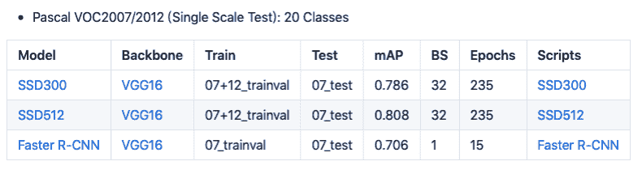

# 基于 PyTorch 的 CV 模型框架，北大学生出品 TorchCV

> 原文：[`mp.weixin.qq.com/s?__biz=MzA3MzI4MjgzMw==&mid=2650771841&idx=3&sn=2f5de2969772153b86c06197503cdaea&chksm=871a55ffb06ddce99326a4e55861c6d2192cc1bb4abd7d59d28b5691feeb1749b03a10d29e48&scene=21#wechat_redirect`](http://mp.weixin.qq.com/s?__biz=MzA3MzI4MjgzMw==&mid=2650771841&idx=3&sn=2f5de2969772153b86c06197503cdaea&chksm=871a55ffb06ddce99326a4e55861c6d2192cc1bb4abd7d59d28b5691feeb1749b03a10d29e48&scene=21#wechat_redirect)

机器之心整理

**参与：张倩、泽南**

> 在机器学习带来的所有颠覆性技术中，计算机视觉领域吸引了业内人士和学术界最大的关注。

刚刚推出 1.3 正式版的 PyTorch 风头正劲，人们已经围绕这一深度学习框架开发出了越来越多的工具。最近，一个名为 TorchCV 的计算机视觉模型框架站上了 GitHub 趋势榜。项目链接：https://github.com/donnyyou/torchcv 该库提供了基于深度学习的大部分 CV 问题研究的源代码，对于使用者来说，调用最常用、最为先进的计算机模型从此可以变得更加容易。TorchCV 的作者 Donny You 来自北京大学，是机器感知与智能教育部重点实验室的一名研三学生。**TorchCV 支持的模型**TorchCV 支持图像分类、语义分割、目标检测、姿态检测、实例分割、生成对抗网络等任务中的多个常见模型，列表如下：**图像分类**

*   VGG: Very Deep Convolutional Networks for Large-Scale Image Recognition

*   ResNet: Deep Residual Learning for Image Recognition

*   DenseNet: Densely Connected Convolutional Networks

*   ShuffleNet: An Extremely Efficient Convolutional Neural Network for Mobile Devices

*   ShuffleNet V2: Practical Guidelines for Ecient CNN Architecture Design

*   Partial Order Pruning: for Best Speed/Accuracy Trade-off in Neural Architecture Search

**语义分割**

*   DeepLabV3: Rethinking Atrous Convolution for Semantic Image Segmentation

*   PSPNet: Pyramid Scene Parsing Network

*   DenseASPP: DenseASPP for Semantic Segmentation in Street Scenes

*   Asymmetric Non-local Neural Networks for Semantic Segmentation

**目标检测**

*   SSD: Single Shot MultiBox Detector

*   Faster R-CNN: Towards Real-Time Object Detection with Region Proposal Networks

*   YOLOv3: An Incremental Improvement

*   FPN: Feature Pyramid Networks for Object Detection

**姿态检测**

*   CPM: Convolutional Pose Machines

*   OpenPose: Realtime Multi-Person 2D Pose Estimation using Part Affinity Fields

**实例分割**

*   Mask R-CNN

**生成对抗网络**

*   Pix2pix: Image-to-Image Translation with Conditional Adversarial Nets

*   CycleGAN: Unpaired Image-to-Image Translation using Cycle-Consistent 

**快速启动 TorchCV**TorchCV 目前仅支持 Python3.x 和 pytorch 1.0。

```py
pip3 install -r requirements.txtcd extensions
sh make.sh
```

**利用 TorchCV 得到的模型性能数据**以下所示的性能数据完全复现了论文的结果。**图像分类********语义分割******


**目标检测********姿态估计**

*   OpenPose: Realtime Multi-Person 2D Pose Estimation using Part Affinity Fields

**实例分割**

*   Mask R-CNN

**生成对抗网络**

*   Pix2pix

*   CycleGAN

**TorchCV 的数据集**TorchCV 定义了你能在数据集子目录中查到的所有任务的数据格式。下面是一个用于训练语义分割的数据集目录树示例。你可以使用 datasets/seg/preprocess 文件夹中的脚本对开源数据集进行预处理。文件夹地址：https://github.com/donnyyou/torchcv/tree/master/datasets/seg/preprocess**TorchCV 的命令**项目作者提供了命令行工具，供用户使用模型，代码如下：**训练**

```py
cd scripts/seg/cityscapes/
bash run_fs_pspnet_cityscapes_seg.sh train tag
```

**恢复训练**

```py
cd scripts/seg/cityscapes/
bash run_fs_pspnet_cityscapes_seg.sh train tag
```

**验证**

```py
cd scripts/seg/cityscapes/
bash run_fs_pspnet_cityscapes_seg.sh val tag
```

**测试**

```py
cd scripts/seg/cityscapes/
bash run_fs_pspnet_cityscapes_seg.sh test tag
```

2019 年，PyTorch 正在逐渐赶超 TensorFlow，在研究领域成为最为流行的深度学习框架。随着后者使用人数的增多，我们未来还会看到更多高效工具。

**10 月 16 日晚，NVIDIA GPU 计算专家团队高级工程师季光博士将带来线上主题分享：****利用 TensorRT 自由搭建高性能推理模型。****点击阅读原文立即免费报名。**

